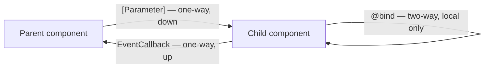

# Blazor Components and Data Binding

## Introduction

Before reading this lesson, you should already be comfortable with **[Blazor WebAssembly Fundamentals](../15-containers-blazor-maui/15-06-blazor-webassembly-fundamentals.md)**, which established *where* your C# runs. This lesson shifts to *how you build the UI itself*: reusable components, the data that flows into and out of them, and the lifecycle that governs when they load.

By the end of this lesson, you will be able to:

- Define a reusable component and expose data into it using `[Parameter]`
- Use `@bind` for two-way data binding between markup and a C# field
- Wire up user interactions with `@onclick` and other `@on*` event directives
- Use `OnInitializedAsync` to run asynchronous setup work before a component first renders
- Have a parent component pass data down to a child and receive notifications back up
- Build a reusable `ProductCard` component for the E-Commerce Order Processing domain

## Blazor Components and Data Binding — A Layman's Perspective

Picture a small print shop that makes personalized greeting cards. Rather than hand-design every card from scratch, the shop keeps one master template — a layout with a name field, a message field, and a decorative border already fixed in place. A customer walks up, fills in "To: Priya" and "Congratulations on the new job!", and the shop prints a finished card by dropping those two pieces of information into the fixed template. The template never changes; only the values slotted into it do. That's exactly what a Blazor component with `[Parameter]` properties is — a fixed layout with named blanks that a parent fills in every time it's used, the same way the print shop reuses one template for a hundred different names and messages without redesigning anything.

Now suppose that same card has a small tear-off reply slip attached to the bottom, with a checkbox: "I'll be attending." The customer can check that box on the card itself, but the shop also keeps a duplicate tracking sheet behind the counter with the same checkbox for their own records. Here's the important part: the two aren't independent copies that happen to look similar — they're wired together so that checking the box on the card also flips the matching box on the tracking sheet, immediately, and if the clerk instead updates the tracking sheet directly, the card's own box updates too. Neither one is "the real one" that the other merely mirrors; they stay in lockstep, in both directions, at all times. That two-way wiring is precisely what `@bind` gives you between a piece of markup, like a text box, and a C# field behind it — change either side, and the other side is never left stale.

The counter also has a small buzzer button that customers can press to summon the clerk. Nothing happens on its own when the button sits there unpressed; a specific, named action only fires the instant someone actually presses it. That's `@onclick` and its sibling event directives — inert until triggered, then invoking exactly the handler you wired to that specific interaction, and nothing else.

Finally, before the shop opens its counter to customers each morning, new clerks go through a short, mandatory onboarding routine — checking the till, confirming the card templates are stocked, verifying the reply-tracking sheet is ready — that must finish *before* the first customer is ever served. Nobody is allowed to jump straight to serving customers mid-setup. That fixed "finish this first, always, before anything else happens" ordering is exactly what a component's `OnInitializedAsync` method gives you: a guaranteed place to run setup work — often an asynchronous data fetch — that completes before the component's UI is considered ready to interact with.

Put together, a Blazor component is that reusable template, filled in with parameters from whoever is using it, wired for two-way updates where an input needs to stay in sync with a field, capable of firing a named action on a specific user event, and guaranteed to run its setup routine to completion before the audience it serves gets its hands on it.

## Blazor Components and Data Binding — A Programming Language Perspective

A Blazor component is a `.razor` file compiling to a C# class deriving from `ComponentBase`. A public property decorated with `[Parameter]` becomes settable by a parent component's markup, giving one-way, parent-to-child data flow; adding `[EditorRequired]` makes the compiler warn if a consumer omits it. `@bind="fieldName"` is compiler sugar that expands into a `value` assignment paired with an `@onchange` (or, with `@bind:event="oninput"`, an `@oninput`) handler, producing what behaves as two-way synchronization between an element and a C# field. `@onclick`, `@onsubmit`, and the other `@on*` directives attach a C# delegate directly to a DOM event, invoked by the framework's event dispatch rather than raw browser JavaScript. For a child to notify a parent of something, it exposes an `EventCallback<T>` parameter and calls `InvokeAsync` on it — the inverse direction of a plain `[Parameter]`. `OnInitializedAsync`, overridden from `ComponentBase`, runs once, asynchronously, before the component's first render — the correct place for an initial data load.

## How to Bind Data and Handle Events in a Component

A minimal component demonstrates all four pieces at once: a parameter set by its caller, a two-way bound text field, a click handler, and an async lifecycle method that gates when the component is considered ready.

```mermaid
flowchart TD
    A["Parent renders <Greeting Name=\"Alex\" />"] --> B["Component instantiated,\n[Parameter] Name set"]
    B --> C["OnInitializedAsync runs\n(async setup work)"]
    C --> D["First render — UI shown"]
    D --> E["User types in bound input\nor clicks a button"]
    E --> F["@bind field updates /\n@onclick handler runs"]
    F --> G["StateHasChanged —\ncomponent re-renders"]
```
*Figure 1: A component's parameter is set once by its parent, but its lifecycle and bound state continue reacting to user input long after.*

```razor
@* Greeting.razor *@
<h3>@(isReady ? $"Hello, {Name}!" : "Loading...")</h3>

<input @bind="note" placeholder="Leave a note" />
<p>Note: @note</p>
<button @onclick="Clear">Clear Note</button>

@code {
    [Parameter, EditorRequired]
    public string Name { get; set; } = "";

    private string note = "";
    private bool isReady;

    protected override async Task OnInitializedAsync()
    {
        await Task.Delay(100); // simulates an async setup call
        isReady = true;
    }

    private void Clear() => note = "";
}
```

```razor
@* Usage from a parent page *@
<Greeting Name="Alex" />
```

**Browser Behavior** *(in place of a Console Output block — this is UI state, not a terminal trace):*

```text
Immediately after render:
  Loading...

~100ms later, after OnInitializedAsync completes:
  Hello, Alex!

User types "Follow up Friday" into the note field:
  Note: Follow up Friday

User clicks "Clear Note":
  Note: (empty)
```

`Name` was set once, by the parent, and never changes again — a one-way parameter. `note`, by contrast, updates live as the user types, because `@bind` keeps the input element and the `note` field synchronized in both directions. The `Loading...` state proves `OnInitializedAsync` genuinely gates the first render rather than running silently in the background.

## Real-Time Example: A Reusable `ProductCard` in E-Commerce Order Processing

We extend the **E-Commerce Order Processing** domain with a `ProductCard` component: a self-contained catalog tile that a storefront page reuses once per product, each card independently loading its own stock status and reporting an "add to cart" action back up to the page that hosts it.

```csharp
public sealed record Product(string Sku, string Name, decimal Price, int StockCount);
```

```razor
@* ProductCard.razor — .NET 10 / C# 14 — Real-Time Example *@
<div class="product-card">
    <h3>@Product.Name</h3>
    <p>@Product.Price.ToString("C")</p>
    <p>@(isLoaded ? $"{Product.StockCount} in stock" : "Checking stock...")</p>

    <input type="number" min="1" max="@Product.StockCount" @bind="quantity" />
    <button @onclick="HandleAddToCart" disabled="@(!isLoaded || quantity < 1)">
        Add to Cart
    </button>
</div>

@code {
    [Parameter, EditorRequired]
    public Product Product { get; set; } = default!;

    [Parameter]
    public EventCallback<(Product Product, int Quantity)> OnAddToCart { get; set; }

    private int quantity = 1;
    private bool isLoaded;

    protected override async Task OnInitializedAsync()
    {
        // Simulates an async call to an inventory microservice per card.
        await Task.Delay(200);
        isLoaded = true;
    }

    private Task HandleAddToCart() => OnAddToCart.InvokeAsync((Product, quantity));
}
```

```razor
@* CatalogPage.razor *@
@page "/catalog"

<h1>Storefront Catalog</h1>

@foreach (var product in products)
{
    <ProductCard Product="product" OnAddToCart="HandleAddToCart" />
}

<h2>Cart</h2>
<ul>
    @foreach (var line in cart)
    {
        <li>@line.Quantity x @line.Product.Name — @((line.Quantity * line.Product.Price).ToString("C"))</li>
    }
</ul>

@code {
    private readonly List<Product> products =
    [
        new("SKU-100", "Wireless Mouse", 24.99m, 40),
        new("SKU-101", "Mechanical Keyboard", 89.99m, 15)
    ];

    private readonly List<(Product Product, int Quantity)> cart = [];

    private void HandleAddToCart((Product Product, int Quantity) item) => cart.Add(item);
}
```

**Browser Behavior:**

```text
Immediately after navigating to /catalog:
  Wireless Mouse — Checking stock...
  Mechanical Keyboard — Checking stock...

~200ms later, each card's own OnInitializedAsync completes independently:
  Wireless Mouse — 40 in stock
  Mechanical Keyboard — 15 in stock

User sets quantity to 2 on "Wireless Mouse" and clicks "Add to Cart":
Cart:
  2 x Wireless Mouse — $49.98

User sets quantity to 1 on "Mechanical Keyboard" and clicks "Add to Cart":
Cart:
  2 x Wireless Mouse — $49.98
  1 x Mechanical Keyboard — $89.99
```

Each `ProductCard` owns its own `isLoaded` flag and its own `quantity`, so two cards never interfere with each other's stock check or input state — that isolation is exactly what makes the component reusable across an arbitrarily long product list. The `EventCallback` is what lets each independent card still report back to one shared cart on the parent page, without the card needing to know anything about how that cart is stored or rendered.

## Data Flow Direction: Parameters vs Binding vs Event Callbacks

It's easy to lump "parameters," "binding," and "events" together as one blurry idea of "component communication," but they move data in three genuinely different directions, and mixing them up is a common source of bugs — most often, trying to have a child mutate a `[Parameter]` directly and being surprised when the parent's own copy never changes, because a parameter is a one-way handoff, not a live shared reference.

A `[Parameter]` moves data strictly downward, parent to child, set once per parent render — the child can read it but should treat it as the parent's, not its own, to mutate. `@bind` moves data in both directions, but strictly *within* the same component, keeping an element and a local field synchronized. An `EventCallback<T>` moves data strictly upward, child to parent, carrying a payload the parent decides what to do with — the child never learns or cares what the parent did with it afterward.


*Figure 2: Three distinct arrows, each carrying data in only one of the directions its name implies.*

| Aspect | `[Parameter]` | `@bind` | `EventCallback<T>` |
|---|---|---|---|
| Direction | Parent to child only | Both ways, between element and field | Child to parent only |
| Scope | Crosses a component boundary | Stays inside one component | Crosses a component boundary |
| Typical use | Handing data into a reusable component | Keeping an input synced with a C# field | Notifying a parent that something happened |
| Underlying mechanism | Attribute set in parent's markup | `value` + `@onchange`/`@oninput` sugar | Delegate invoked via `InvokeAsync` |

## Types of Component Data-Flow Features Worth Knowing

1. **[Blazor WebAssembly Fundamentals](../15-containers-blazor-maui/15-06-blazor-webassembly-fundamentals.md)** — the execution model this lesson's components ultimately run under.
2. **`[CascadingParameter]`** — passes data down through an entire component subtree without threading it manually through every intermediate `[Parameter]`.
3. **`@bind:format` and `@bind:event`** — variants of `@bind` that control formatting (e.g., dates) and which DOM event triggers the sync.
4. **`OnParametersSetAsync`** — a lifecycle method that runs whenever a parent re-supplies parameters to an already-initialized child, distinct from the once-only `OnInitializedAsync`.
5. **`RenderFragment<T>` and templated components** — components that accept a chunk of markup as a parameter, letting callers customize what's rendered inside.
6. **[Blazor Server vs Blazor WebAssembly — Comparison](../15-containers-blazor-maui/15-08-blazor-server-vs-wasm.md)** — next lesson, returning to the hosting-model question now that component-building is familiar.

## What You've Learned & What's Next

Components become reusable through `[Parameter]`, stay in sync with user input through `@bind`, react to interaction through `@onclick` and its siblings, and gate their own readiness through `OnInitializedAsync` — four distinct mechanisms that, together, let a single `ProductCard` definition serve an entire catalog page correctly and independently.

Continue your learning journey with **[Blazor Server vs Blazor WebAssembly — Comparison](../15-containers-blazor-maui/15-08-blazor-server-vs-wasm.md)**, where we return to the hosting-model question from Lesson 6 and weigh latency, scalability, and offline support directly against each other.

---
*Applies to: .NET 10 / C# 14. Last reviewed 2026-08-16.*
