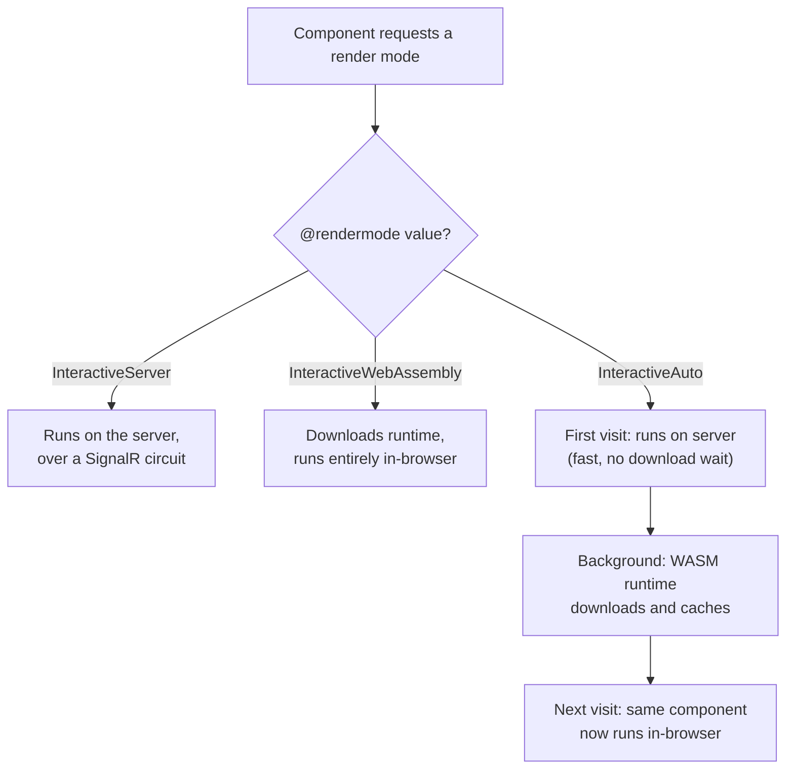
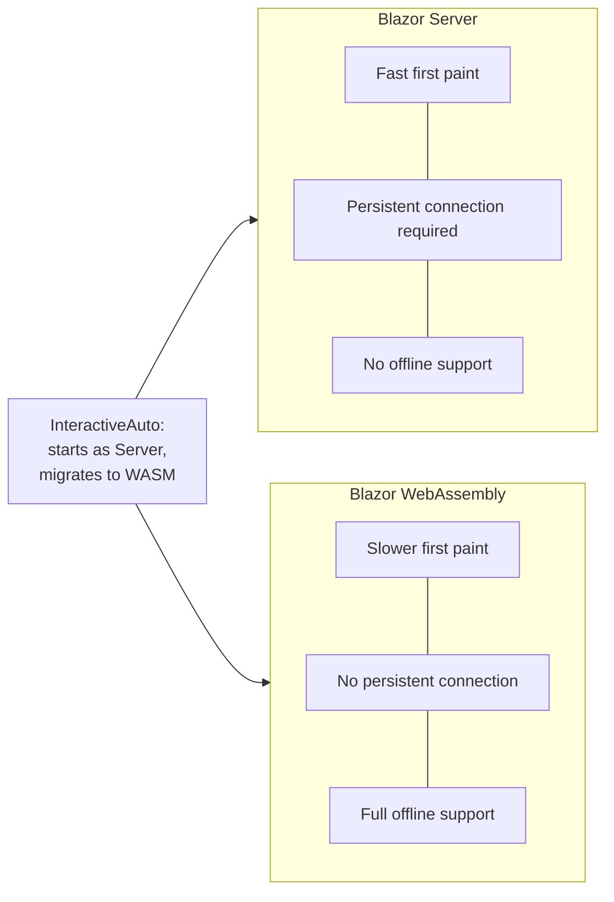

# Blazor Server vs Blazor WebAssembly — Comparison

## Introduction

Before reading this lesson, you should already be comfortable with **[Blazor Components and Data Binding](../15-containers-blazor-maui/15-07-blazor-components-and-data-binding.md)**, which assumed a hosting model without dwelling on which one you'd actually pick for a real application. This lesson answers that question directly, weighing Blazor Server against Blazor WebAssembly across the four factors that decide it in practice, and introducing the modern "choose per component" option that has made the decision less all-or-nothing since .NET 8.

By the end of this lesson, you will be able to:

- Explain why Blazor Server has lower per-interaction latency, and why Blazor WebAssembly has none at all once loaded
- Describe the scalability trade-off between holding open a SignalR circuit per client and offloading compute to the client entirely
- State precisely why only one of the two models supports genuine offline use
- Compare initial load time between the two models and explain the download that causes the difference
- Describe Blazor's Auto (United) render mode and why it exists
- Choose the correct hosting model — or Auto — for a given application's constraints

## Blazor Server vs Blazor WebAssembly — A Layman's Perspective

Picture two ways of getting your work done. The first is commuting to a downtown office every day. You carry almost nothing with you — no bulky equipment, no elaborate home setup — because everything you need is already sitting at your desk downtown, and any question you have gets answered instantly by a colleague sitting three feet away. The catch is absolute: if the road into downtown is ever closed, you are simply not working today. Your productivity was never something you carried with you; it lived downtown, and it stays there.

The second way is investing in a fully-equipped home office. Before you can get anything done, you have to actually buy the desk, the monitor, the specialized software — a real, one-time cost in money and setup time that dwarfs what commuting ever demanded up front. But once that home office exists, something changes completely: a transit strike, a snowed-in road, a citywide power flicker at the office downtown — none of it touches you, because the work itself happens entirely inside your own four walls. You paid once, up front, for total independence afterward.

Now picture a third option, one that didn't really exist as a clean choice until recently: an employer who lets you commute on the days that make sense — fast onboarding for a new hire's very first week, immediate access to teammates for something urgent — and works from your home office on the days that make more sense, without you having to pick one mode for your entire career and stick with it forever. Some tasks are better handled at the downtown office; others are better handled at home; the smart move is letting each individual task decide for itself, rather than forcing your whole working life into one bucket.

Blazor Server is the downtown commute — nearly nothing to set up, instant help nearby, but entirely dependent on the road staying open. Blazor WebAssembly is the home office — a real upfront cost, paid once, that buys total independence from the commute afterward. And Blazor's Auto render mode, introduced alongside .NET 8's unified project model, is that third option: letting each individual piece of your application choose the mode that fits it best, component by component, rather than committing your entire app to one extreme or the other. The rest of this lesson makes that trade-off precise, one factor at a time — because "which one is better" was never the right question; "which one fits this specific interaction, on this specific page" always was.

## Blazor Server vs Blazor WebAssembly — A Programming Language Perspective

Both hosting models compile the same Razor component model to the same rendering pipeline; they differ only in *where* that pipeline executes and *how* the browser is told to reach it. Since .NET 8's unified "Blazor Web App" template, the choice is no longer fixed per project — it's expressed per component via the `@rendermode` directive, with three interactive values: `InteractiveServer` (Blazor Server's SignalR-driven model), `InteractiveWebAssembly` (client-side execution, as covered in Lesson 6), and `InteractiveAuto`, which starts a component under `InteractiveServer` for its first visit — avoiding the WASM download entirely for a fast first paint — then downloads and caches the WebAssembly runtime in the background, transparently switching that same component to run client-side on every subsequent visit. A component with no `@rendermode` at all renders statically, with no interactivity — a distinction the render-mode system makes explicit rather than implicit.

## How to Assign Render Modes Per Component

A single Blazor Web App project can mix render modes freely, choosing the right one for each individual page rather than committing the entire application to one model.


*Figure 1: `InteractiveAuto` isn't a fourth execution model — it's a scheduling decision that starts on the server and migrates to the browser once the download is ready.*

```razor
@* Dashboard.razor — pinned to the server for lowest input latency *@
@page "/dashboard"
@rendermode InteractiveServer

<h3>Live Order Feed</h3>
<p>@message</p>

@code {
    private string message = "Waiting for next order...";
    protected override void OnInitialized() => message = "Connected — live via SignalR circuit.";
}
```

```razor
@* OfflineCart.razor — pinned to WebAssembly for offline resilience *@
@page "/offline-cart"
@rendermode InteractiveWebAssembly

<h3>Shopping Cart</h3>
<p>@message</p>

@code {
    private string message = "Ready — this page keeps working even offline.";
}
```

**Browser Behavior** *(in place of a Console Output block — these are two separately loaded pages, not a terminal trace):*

```text
Navigating to /dashboard:
  DevTools Network tab: WebSocket connection opened to the SignalR hub, held open.
  Page: "Connected — live via SignalR circuit."

Navigating to /offline-cart:
  DevTools Network tab: dotnet.wasm + app assemblies downloaded once, then silent.
  Page: "Ready — this page keeps working even offline."
```

`/dashboard` never sees a WebAssembly download at all — its cost is a persistent, open connection instead. `/offline-cart` never opens a persistent connection — its cost was the runtime download, paid once, up front. Same project, same component model, two entirely different execution shapes chosen per page.

## Real-Time Example: Auto Mode for the E-Commerce Shopping Cart

We extend the **E-Commerce Order Processing** domain's shopping cart with `InteractiveAuto`, so a first-time visitor gets the fastest possible first paint (server-rendered, no download wait), while a returning visitor's cart keeps working even if their connection drops mid-checkout — exactly the guarantee a real storefront needs at the moment a customer is about to pay.

```razor
@* ShoppingCart.razor — .NET 10 / C# 14 — Real-Time Example *@
@page "/cart"
@rendermode InteractiveAuto

<h3>Your Cart</h3>

@if (items.Count == 0)
{
    <p>Your cart is empty.</p>
}
else
{
    <ul>
        @foreach (var item in items)
        {
            <li>@item.Quantity x @item.Name — @((item.Quantity * item.Price).ToString("C"))</li>
        }
    </ul>
    <p><strong>Total: @Total.ToString("C")</strong></p>
}

<button @onclick="AddSampleItem">Add Wireless Mouse ($24.99)</button>

@code {
    private sealed record CartLine(string Name, decimal Price, int Quantity);

    private readonly List<CartLine> items = [];

    private decimal Total => items.Sum(i => i.Quantity * i.Price);

    private void AddSampleItem()
    {
        var existing = items.FirstOrDefault(i => i.Name == "Wireless Mouse");
        if (existing is not null)
        {
            items[items.IndexOf(existing)] = existing with { Quantity = existing.Quantity + 1 };
        }
        else
        {
            items.Add(new CartLine("Wireless Mouse", 24.99m, 1));
        }
    }
}
```

**Browser Behavior:**

```text
First-time visitor navigates to /cart (cold load):
  Rendered instantly via InteractiveServer — no WASM download wait.
  "Your cart is empty."

Visitor clicks "Add Wireless Mouse" twice:
  1 x Wireless Mouse — $24.99
  Total: $24.99
  --> then --
  2 x Wireless Mouse — $49.98
  Total: $49.98

[In the background: WASM runtime finishes downloading and caching]

Same visitor returns to /cart on a later visit, Wi-Fi briefly drops mid-session:
  Component now runs via InteractiveWebAssembly — cart still fully responsive,
  because it no longer depends on a live server connection at all.
```

The first visit never pays the WebAssembly download cost up front — the customer sees a working cart immediately. By the time they return, the background download is ready, and the exact same component definition is now running client-side, immune to the Wi-Fi drop that would have frozen a pure `InteractiveServer` page mid-checkout. Neither pure model gives you both of those guarantees at once; `InteractiveAuto` is what does.

## Blazor Server vs Blazor WebAssembly — The Full Comparison

**Latency and responsiveness.** Blazor Server sends every meaningful interaction — a click, a keystroke that matters — over the network to the server and waits for a UI diff to come back, so responsiveness is bounded by round-trip network latency no matter how fast the server itself is. Blazor WebAssembly, once loaded, has already eliminated that round trip entirely: a click is handled by C# already sitting in the browser, with nothing to wait on but the user's own device.

**Scalability.** Blazor Server's cost lives on the server, per connected client: every open browser tab is a live SignalR circuit the server must hold in memory for as long as that tab stays open, whether the user is actively clicking or simply idle. That means server capacity planning must account for concurrent *connections*, not just concurrent *requests*. Blazor WebAssembly inverts this entirely — the server's job ends the moment it has served the static files; from then on, every client is computing entirely on its own hardware, and a thousand simultaneous WASM users cost the server nothing beyond that one-time file transfer.

**Offline support.** This one isn't a matter of degree — only Blazor WebAssembly can genuinely work offline, because only it has ever had your C# actually running on the user's own machine. Blazor Server's UI is, by construction, a live reflection of server-side state streamed over a connection; sever that connection and there is no local fallback, because there was never a local copy of the logic to fall back to.

**Initial load time.** Here the two models trade places. Blazor Server's first paint is fast, because the browser only needs a thin client shell and an open connection — no runtime to download. Blazor WebAssembly's first paint is slower, sometimes noticeably so, because the browser must first receive the entire WASM-compiled .NET runtime plus your application's assemblies before anything can run at all.

**Auto mode as the modern middle ground.** `InteractiveAuto`, available since .NET 8's unified Blazor Web App template, doesn't eliminate this trade-off — it schedules around it, per component, taking Blazor Server's fast first paint on a first visit and quietly upgrading to Blazor WebAssembly's connection-free independence once the runtime has finished downloading in the background. It is not a universal answer — a component that always needs the lowest possible latency on every single visit is still better pinned to `InteractiveServer` outright, and one that must be genuinely usable offline from the very first visit still needs `InteractiveWebAssembly` outright — but for the common case of "fast now, resilient later," it is the closest thing to getting both.


*Figure 2: `InteractiveAuto` sits between the two, borrowing Server's opening move and WebAssembly's long-term independence.*

| Aspect | Blazor Server | Blazor WebAssembly | Blazor Auto |
|---|---|---|---|
| Per-interaction latency | Bound by network round trip | None, after initial load | Server-level at first, WASM-level later |
| Server cost per client | One held-open SignalR circuit | None beyond static files | Circuit only until the switch to WASM |
| Offline support | None | Full | Full, once migrated to WASM |
| Initial load time | Fast (thin shell) | Slower (runtime + assemblies) | Fast (defers the WASM download) |
| Chosen via | `@rendermode InteractiveServer` | `@rendermode InteractiveWebAssembly` | `@rendermode InteractiveAuto` |

## Types of Render-Mode Concepts Worth Knowing

1. **[Blazor Server Fundamentals](../15-containers-blazor-maui/15-05-blazor-server-fundamentals.md)** — the `InteractiveServer` model examined on its own.
2. **[Blazor WebAssembly Fundamentals](../15-containers-blazor-maui/15-06-blazor-webassembly-fundamentals.md)** — the `InteractiveWebAssembly` model examined on its own.
3. **[Blazor Components and Data Binding](../15-containers-blazor-maui/15-07-blazor-components-and-data-binding.md)** — the component model that every render mode in this lesson shares.
4. **Static server-side rendering (no `@rendermode`)** — a fourth, non-interactive option for content that never needs to respond to user input at all.
5. **[Introduction to .NET MAUI](../15-containers-blazor-maui/15-09-introduction-to-maui.md)** — next lesson, moving from web-hosted UI to native cross-platform apps.
6. **Blazor Hybrid (MAUI + Blazor components)** — a later variant in this module that reuses Razor components inside a native MAUI shell.

## What You've Learned & What's Next

Blazor Server and Blazor WebAssembly aren't competing for the same job — Server trades a persistent connection for instant startup and zero client compute, WebAssembly trades a larger upfront download for total independence from the network afterward, and `InteractiveAuto` lets a single component take Server's fast opening and WebAssembly's long-term resilience without you having to pick just one for the whole application.

Continue your learning journey with **[Introduction to .NET MAUI](../15-containers-blazor-maui/15-09-introduction-to-maui.md)**, where we leave the browser entirely and look at .NET's answer to native, installed, cross-platform apps.

---
*Applies to: .NET 10 / C# 14. Last reviewed 2026-08-16.*
