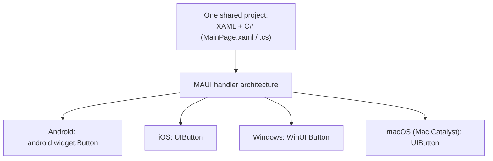
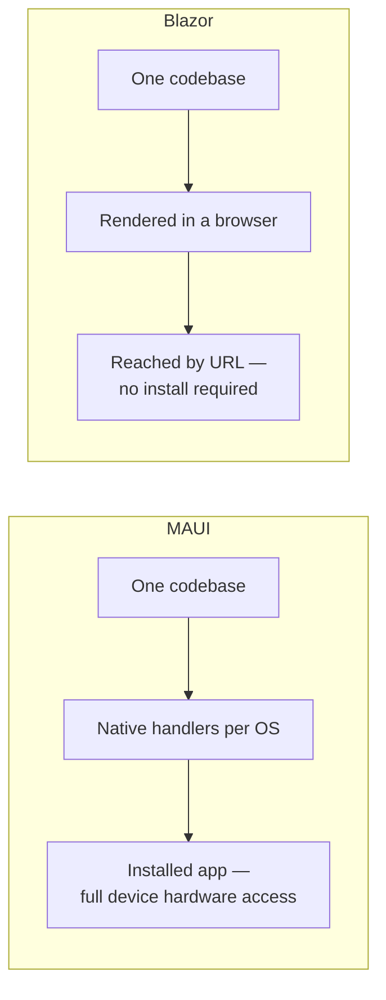

# Introduction to .NET MAUI

## Introduction

Before reading this lesson, you should already be comfortable with **[Blazor Server vs Blazor WebAssembly — Comparison](../15-containers-blazor-maui/15-08-blazor-server-vs-wasm.md)**, which covered two ways to build UI reached through a browser. This lesson leaves the browser behind entirely and introduces **.NET MAUI**, .NET's framework for building installed, native applications for mobile and desktop from a single codebase.

By the end of this lesson, you will be able to:

- Define what .NET MAUI is and what "multi-platform" means in this context
- Explain MAUI's relationship to Xamarin.Forms as its direct successor
- Name the platforms a single MAUI project can target from one codebase
- Describe, at a high level, how the same XAML renders as genuinely native controls per platform
- Create and run a minimal MAUI page
- Decide when MAUI is the right choice for a project instead of Blazor

## .NET MAUI — A Layman's Perspective

Picture a chef who has perfected one master recipe and wants it served in four very different kitchens around the world — a French kitchen, a Japanese kitchen, a Brazilian kitchen, and an American diner kitchen. The chef doesn't write four separate recipes from scratch for each one. Instead, there is exactly one recipe, one set of instructions, one list of ingredients and steps, written once. That single recipe gets handed to each kitchen, and each kitchen's own local staff — using their own local equipment, their own knives, their own ovens calibrated the way their own kitchen expects — prepares the dish so that it comes out looking and feeling entirely at home on that kitchen's own plates, using that kitchen's own conventions. A diner in Tokyo and a diner in São Paulo are eating structurally the same dish, built from the same one recipe, but each experiences it as something that unmistakably belongs in their own kitchen, not as some translated, slightly-foreign approximation.

That is exactly what .NET MAUI does with an app. You write one project — one set of C# and XAML files describing what the app looks like and how it behaves — and instead of that single description being interpreted by only one kind of device, it gets handed off to iOS, to Android, to Windows, to macOS, and each of those platforms renders it using its own real, native controls: a button becomes an honest-to-goodness native iOS button on an iPhone, and an honest-to-goodness native Android button on a Samsung phone, each looking and behaving exactly the way users on that platform already expect a button to look and behave. Nothing about the experience feels imported or foreign, even though every one of those apps was built from the exact same one recipe.

Now, contrast that against a completely different approach: instead of sending the recipe out to be cooked separately in four kitchens, you open one single restaurant, in one single location, and everybody who wants the dish simply visits that one restaurant. There's no separate kitchen to install in each diner's home — the dish is prepared centrally, the same way every time, and anyone with a way to get there (a car, a bus, in our world: a web browser) can walk in and be served. That one-restaurant model is exactly what Blazor's web-hosted approach is: one place, reached by URL, rather than something installed separately into each user's own device.

Neither approach is universally better. Sending the recipe out to be cooked natively in each kitchen (MAUI) is exactly right when the dish genuinely needs each kitchen's own specialized equipment — the diner's own camera, their own GPS, their own fingerprint sensor — the kind of native hardware access that only an installed app, built for that specific platform, can reach fully. Opening one central restaurant (Blazor) is exactly right when what matters most is that anyone, on any device, can walk up and be served instantly, with nothing to install first at all. .NET MAUI is this lesson's answer to the first of those two needs.

## .NET MAUI — A Programming Language Perspective

**.NET MAUI** (Multi-platform App UI) is a cross-platform framework for building native mobile and desktop applications from a single project, using C# and XAML, that targets Android, iOS, macOS (via Mac Catalyst), and Windows. It is the direct successor to **Xamarin.Forms**: where Xamarin required a separate Mono-based toolchain sitting alongside .NET, MAUI folded that entire cross-platform UI story directly into .NET itself starting with .NET 6, giving it one base class library, one project system, and one build toolchain shared with every other .NET workload. A single `.csproj` multi-targets several target framework monikers at once — `net10.0-android`, `net10.0-ios`, `net10.0-maccatalyst`, and `net10.0-windows10.0.19041.0` are typical — and MAUI's **handler** architecture is what makes the "one codebase, native everywhere" claim literally true: a shared `Button` element in your XAML is mapped, per platform, to that platform's own real native control (`android.widget.Button`, `UIButton`, a WinUI `Button`) rather than being custom-drawn by MAUI itself.

## How to Build a Minimal MAUI Page

A MAUI page pairs a XAML file describing layout with a C# code-behind file handling logic — the same separation of markup and code you've already seen in Blazor, applied here to a native page instead of a browser-rendered one.


*Figure 1: One shared description, translated per platform into that platform's own genuine native controls — not a custom-drawn approximation of one.*

```xml
<!-- MainPage.xaml -->
<ContentPage xmlns="http://schemas.microsoft.com/dotnet/2021/maui"
             xmlns:x="http://schemas.microsoft.com/winfx/2009/xaml"
             x:Class="InventoryScanner.MainPage">
    <VerticalStackLayout Padding="20" Spacing="10">
        <Label Text="Welcome to Inventory Scanner" FontSize="24" />
        <Button Text="Scan Item" Clicked="OnScanClicked" />
        <Label x:Name="ResultLabel" Text="No scan yet." />
    </VerticalStackLayout>
</ContentPage>
```

```csharp
// MainPage.xaml.cs — .NET 10 / C# 14
namespace InventoryScanner;

public partial class MainPage : ContentPage
{
    private int scanCount;

    public MainPage()
    {
        InitializeComponent();
    }

    private void OnScanClicked(object? sender, EventArgs e)
    {
        scanCount++;
        ResultLabel.Text = $"Scanned {scanCount} item(s) so far.";
    }
}
```

**App Behavior** *(in place of a Console Output block — this is a native, installed app, so "output" means what's rendered on-device, not a terminal trace):*

```text
App launches on Android:
  A native Android button labeled "Scan Item", Material-style ripple on tap.
  Label: "No scan yet."

App launches on iOS (same project, same XAML, no code changes):
  A native iOS button labeled "Scan Item", iOS-style tap highlight.
  Label: "No scan yet."

User taps "Scan Item" three times (either platform):
  "Scanned 1 item(s) so far."
  "Scanned 2 item(s) so far."
  "Scanned 3 item(s) so far."
```

The XAML and the C# code-behind never changed between platforms — only the rendered control's native look and feel did, exactly as MAUI's handler architecture promises. The tap-counting logic itself is entirely platform-agnostic C#, running identically everywhere it's deployed.

## Real-Time Example: A Librarian's Check-In App in Library/Inventory Management

We extend the **Library/Inventory Management** domain with a scenario a web app genuinely struggles with: a librarian roaming the stacks with a tablet, checking in returned books using the device's own camera as a barcode scanner, often in a back room with no reliable Wi-Fi at all — exactly the native-device-access and offline resilience that justify choosing MAUI here instead of a browser-based staff portal.

```xaml
<!-- CheckInPage.xaml -->
<ContentPage xmlns="http://schemas.microsoft.com/dotnet/2021/maui"
             xmlns:x="http://schemas.microsoft.com/winfx/2009/xaml"
             x:Class="LibraryInventory.CheckInPage">
    <VerticalStackLayout Padding="20" Spacing="12">
        <Label Text="Book Check-In" FontSize="22" />
        <Button Text="Scan Returned Book" Clicked="OnScanReturnedBook" />
        <CollectionView ItemsSource="{Binding CheckedInTitles}">
            <CollectionView.ItemTemplate>
                <DataTemplate>
                    <Label Text="{Binding .}" Padding="0,4" />
                </DataTemplate>
            </CollectionView.ItemTemplate>
        </CollectionView>
    </VerticalStackLayout>
</ContentPage>
```

```csharp
// CheckInPage.xaml.cs — .NET 10 / C# 14 — Real-Time Example
namespace LibraryInventory;

public partial class CheckInPage : ContentPage
{
    // Simulates titles a barcode scan would resolve via the device camera —
    // a real build would call a native barcode-scanning API here instead.
    private readonly Queue<string> incomingReturns = new(
    [
        "The Pragmatic Programmer",
        "Clean Code",
        "Design Patterns"
    ]);

    public List<string> CheckedInTitles { get; } = [];

    public CheckInPage()
    {
        InitializeComponent();
        BindingContext = this;
    }

    private void OnScanReturnedBook(object? sender, EventArgs e)
    {
        if (incomingReturns.Count == 0)
        {
            return;
        }

        string title = incomingReturns.Dequeue();
        CheckedInTitles.Add($"Checked in: {title}");
        OnPropertyChanged(nameof(CheckedInTitles));
    }
}
```

**App Behavior:**

```text
App launches on a librarian's Android tablet, Wi-Fi disabled in the back stacks:
  "Book Check-In" page shown, list empty.

Librarian taps "Scan Returned Book" three times:
  Checked in: The Pragmatic Programmer
  Checked in: Clean Code
  Checked in: Design Patterns

Entire flow above completes with zero network connectivity of any kind.
```

Every scan resolves entirely on-device — no request goes anywhere, and none needs to, because a native app was never depending on a server merely to record a book being checked in. A camera-driven barcode scan is also something a plain browser tab cannot reach nearly as reliably as an installed native app can, which is exactly the kind of native device access this lesson's comparison section formalizes next.

## .NET MAUI vs Blazor — Choosing the Right One

MAUI and Blazor solve genuinely different problems, and the choice between them should follow from what the application actually needs, not from familiarity with one or the other. MAUI produces a real, installed, native app — one that appears in the device's app list, survives a reboot, and can reach deep into platform hardware: the camera, GPS, biometric sensors, local file system, push notifications, all through first-class native APIs. That makes it the right choice whenever an app needs to feel and behave like every other native app on the device, needs reliable offline operation from day one, or needs hardware access a browser sandbox simply won't grant it.

Blazor, by contrast, produces something reached through a URL, with nothing to install at all — the right choice whenever the priority is being reachable instantly, from any device with a browser, updated centrally the moment the server redeploys, with no app-store review process standing between a fix and its users.


*Figure 2: Both start from one shared codebase — the divergence is entirely in what the codebase is ultimately delivered as.*

| Aspect | .NET MAUI | Blazor |
|---|---|---|
| Delivery | Installed native app (app store or sideload) | Reached via a browser URL |
| UI rendering | Genuine native controls per platform | HTML/CSS in a browser or web view |
| Device hardware access | Full — camera, GPS, sensors, biometrics | Limited to what the browser exposes |
| Offline behavior | Native and reliable by default | Only with Blazor WebAssembly (Lesson 6) |
| Update distribution | App store review, or enterprise/MSI deployment | Instant — redeploy server, refresh browser |

## Types of Cross-Platform Concepts Worth Knowing

1. **[Blazor Server vs Blazor WebAssembly — Comparison](../15-containers-blazor-maui/15-08-blazor-server-vs-wasm.md)** — the web-hosted alternative this lesson contrasted MAUI against.
2. **[MAUI Cross-Platform UI Basics](../15-containers-blazor-maui/15-10-maui-cross-platform-ui-basics.md)** — next lesson, going deeper into XAML layout controls.
3. **MAUI Data Binding and MVVM** — a later lesson in this module covering the Model-View-ViewModel pattern MAUI apps typically follow.
4. **MAUI vs Blazor Hybrid — Comparison** — a later lesson contrasting pure MAUI against MAUI apps that embed Blazor components.
5. **Blazor Hybrid** — a native MAUI shell that hosts Razor components in an embedded web view, blending both models this lesson introduced.
6. **Publishing a MAUI App** — a later lesson covering how a MAUI project actually reaches app stores and enterprise distribution.

## What You've Learned & What's Next

.NET MAUI takes one shared C#/XAML codebase and, through its handler architecture, delivers it as a genuinely native app on Android, iOS, Windows, and macOS alike — the direct, unified successor to Xamarin.Forms, and the right tool whenever an app needs native device access or reliable offline behavior that a browser-hosted Blazor app can't fully guarantee.

Continue your learning journey with **[MAUI Cross-Platform UI Basics](../15-containers-blazor-maui/15-10-maui-cross-platform-ui-basics.md)**, where we go deeper into XAML layout controls and build a small cross-platform screen end to end.

---
*Applies to: .NET 10 / C# 14. Last reviewed 2026-08-16.*
