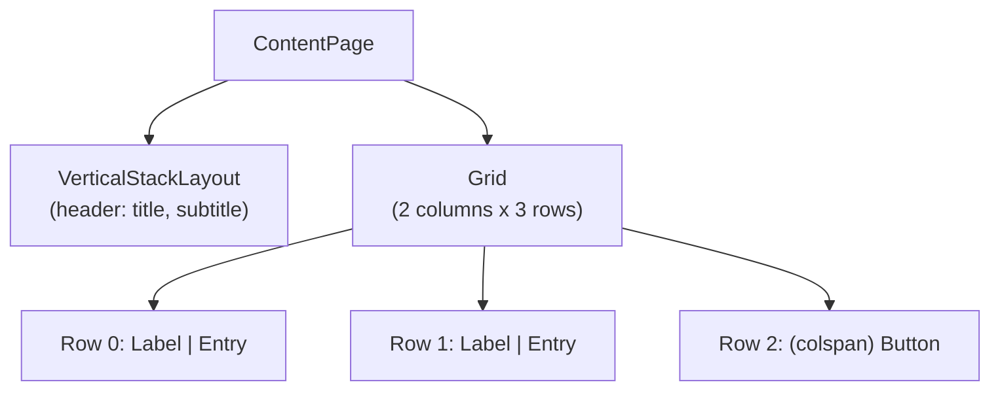
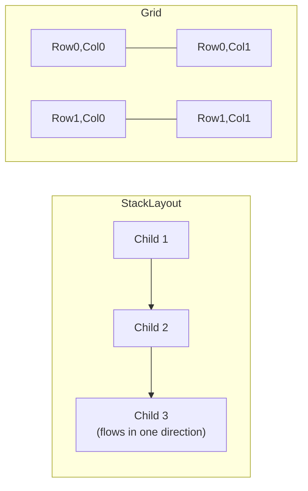

# MAUI Cross-Platform UI Basics

## Introduction

Before reading this lesson, you should already be comfortable with **[Introduction to .NET MAUI](../15-containers-blazor-maui/15-09-introduction-to-maui.md)**, which established what MAUI is and why one codebase can render as native controls on several platforms. This lesson gets hands-on with the markup itself — XAML — and the two layout controls you'll reach for constantly: `StackLayout` and `Grid`.

By the end of this lesson, you will be able to:

- Describe XAML's role as MAUI's declarative markup language for defining a page's UI
- Arrange content linearly using `VerticalStackLayout` and `HorizontalStackLayout`
- Arrange content by row and column using `Grid`, `RowDefinitions`, and `ColumnDefinitions`
- Explain how the same XAML layout is translated into each platform's own native rendering
- Build a minimal cross-platform page combining both layout controls
- Decide when to reach for a stack layout versus a grid layout

## MAUI Cross-Platform UI Basics — A Layman's Perspective

Picture two very different ways a librarian might organize physical items. The first is a single bookshelf: you place one book, then the next book right after it, then the next, all flowing in one direction, top to bottom or left to right. There's no need to plan ahead about exactly where the fifth book will sit — it simply goes wherever the fourth book left off. Adding a new book is trivial: it slides in at the end (or the start), and everything else shifts to make room automatically. This is a wonderfully simple system, right up until you need something more structured than "one after another" — like a card catalog.

That's the second way: an actual library card catalog cabinet, with a fixed grid of small drawers arranged in precise rows and columns. Every drawer has an exact, addressable position — third row, second column — and you don't discover that position by counting how many drawers came before it; you look it up directly by its row and column label. This structure costs you something the bookshelf never demanded: before you can use the cabinet at all, you have to decide how many rows and columns it has and what goes in each cell. But in exchange, you get something the simple bookshelf can't offer — the ability to lay out a genuinely two-dimensional arrangement, where an item's position is meaningful in two directions at once, not just "how far along the line."

A `StackLayout` in MAUI is exactly that bookshelf: children are placed one after another, flowing in a single direction, with no need to declare in advance how many there will be or exactly where each one lands — perfect for a simple vertical form, a row of buttons, or a title stacked above a subtitle. A `Grid` is exactly that card catalog cabinet: you declare, up front, how many rows and columns exist, and then you place each child into a specific cell by row and column — the right tool the instant you need something to align in two dimensions at once, like a label lined up against its input field, repeated consistently down a whole list of rows.

And here's the detail that makes this whole analogy carry over cleanly into the last lesson's platform-rendering story: whether a real-world library uses a wooden card catalog cabinet or a sleek modern metal one, the *idea* of "row three, column two" means exactly the same thing to every librarian who uses it, even though the physical cabinet itself might look completely different from branch to branch. That's precisely how a MAUI `Grid` behaves across platforms — the same row-and-column declaration you write once is honored identically everywhere, even though the actual native control MAUI renders into that cell looks and feels correct for whichever platform it landed on.

## MAUI Cross-Platform UI Basics — A Programming Language Perspective

XAML (Extensible Application Markup Language) is MAUI's declarative markup for describing a page's UI as a tree of objects — a `ContentPage` containing layout controls, which in turn contain view controls like `Label`, `Entry`, and `Button` — parsed at build time into the same object graph you could otherwise construct by hand in C#. `VerticalStackLayout` and `HorizontalStackLayout` arrange their children along a single axis, in declaration order, with a `Spacing` property controlling the gap between them — no upfront planning about total size required. `Grid` instead requires declaring `RowDefinitions` and `ColumnDefinitions` up front, after which each child is placed into a specific cell using the attached properties `Grid.Row` and `Grid.Column`, enabling genuinely two-dimensional alignment that a stack layout cannot express. Regardless of which layout control is used, MAUI's cross-platform layout engine computes the resulting size and position of every element identically on every platform; only the final rendering of each individual control is handed off to that platform's own native rendering system, which is why layout math stays consistent while visual chrome still looks native.

## How to Arrange Content with StackLayout and Grid

A typical page mixes both: a `VerticalStackLayout` for a simple header, and a `Grid` beneath it wherever content needs genuine row/column alignment.


*Figure 1: A stack layout for simple linear content, a grid wherever content needs two-dimensional alignment — both inside the same page.*

```xml
<!-- ContactForm.xaml -->
<ContentPage xmlns="http://schemas.microsoft.com/dotnet/2021/maui"
             xmlns:x="http://schemas.microsoft.com/winfx/2009/xaml"
             x:Class="LayoutDemo.ContactForm">
    <VerticalStackLayout Padding="20" Spacing="16">

        <VerticalStackLayout Spacing="4">
            <Label Text="Contact Us" FontSize="24" />
            <Label Text="We'll respond within one business day." FontSize="12" />
        </VerticalStackLayout>

        <Grid RowDefinitions="Auto,Auto,Auto" ColumnDefinitions="100,*" RowSpacing="10" ColumnSpacing="10">
            <Label Text="Name:" Grid.Row="0" Grid.Column="0" VerticalOptions="Center" />
            <Entry x:Name="NameEntry" Grid.Row="0" Grid.Column="1" />

            <Label Text="Email:" Grid.Row="1" Grid.Column="0" VerticalOptions="Center" />
            <Entry x:Name="EmailEntry" Grid.Row="1" Grid.Column="1" />

            <Button Text="Submit" Clicked="OnSubmit" Grid.Row="2" Grid.Column="0" Grid.ColumnSpan="2" />
        </Grid>

    </VerticalStackLayout>
</ContentPage>
```

```csharp
// ContactForm.xaml.cs — .NET 10 / C# 14
namespace LayoutDemo;

public partial class ContactForm : ContentPage
{
    public ContactForm()
    {
        InitializeComponent();
    }

    private async void OnSubmit(object? sender, EventArgs e)
    {
        await DisplayAlert("Submitted", $"Thanks, {NameEntry.Text}! We'll reach you at {EmailEntry.Text}.", "OK");
    }
}
```

**App Behavior** *(in place of a Console Output block — this is a rendered native page, not a terminal trace):*

```text
Page renders on Android and iOS alike:
  "Contact Us" title, subtitle beneath it — stacked vertically, no positions declared.
  Below: "Name:" label aligned left of its input field, "Email:" label aligned
  the same way directly beneath it — both lined up in a shared left column,
  because the Grid's first column width (100) applies to every row identically.

User fills in Name = "Jordan", Email = "jordan@example.com", taps "Submit":
  Native alert dialog: "Thanks, Jordan! We'll reach you at jordan@example.com."
```

Notice that "Name:" and "Email:" land in exactly the same horizontal position, because they share column 0 of the same `Grid` — a alignment guarantee the header's `VerticalStackLayout` never needed to make, since it only ever had one thing to worry about: what comes next in the flow.

## Real-Time Example: A Book-Search Screen in Library/Inventory Management

We extend the **Library/Inventory Management** domain with a patron-facing book-search screen: a `VerticalStackLayout` header holding the title and search box, and a `Grid`-based results table beneath it, with columns for title, author, and availability — a genuinely two-dimensional layout a stack alone couldn't express cleanly.

```xml
<!-- BookSearchPage.xaml — .NET 10 / C# 14 — Real-Time Example -->
<ContentPage xmlns="http://schemas.microsoft.com/dotnet/2021/maui"
             xmlns:x="http://schemas.microsoft.com/winfx/2009/xaml"
             x:Class="LibraryInventory.BookSearchPage">
    <VerticalStackLayout Padding="20" Spacing="14">

        <Label Text="Search the Catalog" FontSize="22" />
        <Entry x:Name="SearchBox" Placeholder="Search by title..." TextChanged="OnSearchTextChanged" />

        <Grid x:Name="ResultsGrid"
              ColumnDefinitions="*,*,Auto"
              RowSpacing="6" ColumnSpacing="10">
            <Label Text="Title" FontAttributes="Bold" Grid.Row="0" Grid.Column="0" />
            <Label Text="Author" FontAttributes="Bold" Grid.Row="0" Grid.Column="1" />
            <Label Text="Status" FontAttributes="Bold" Grid.Row="0" Grid.Column="2" />
        </Grid>

    </VerticalStackLayout>
</ContentPage>
```

```csharp
// BookSearchPage.xaml.cs — .NET 10 / C# 14 — Real-Time Example
namespace LibraryInventory;

public partial class BookSearchPage : ContentPage
{
    private sealed record Book(string Title, string Author, bool IsAvailable);

    private readonly List<Book> catalog =
    [
        new("The Pragmatic Programmer", "Hunt & Thomas", true),
        new("Clean Code", "Robert C. Martin", false),
        new("Design Patterns", "Gang of Four", true)
    ];

    public BookSearchPage()
    {
        InitializeComponent();
    }

    private void OnSearchTextChanged(object? sender, TextChangedEventArgs e)
    {
        // Clear existing result rows (row 0 header excluded).
        for (int i = ResultsGrid.Children.Count - 1; i >= 3; i--)
        {
            ResultsGrid.Children.RemoveAt(i);
        }
        ResultsGrid.RowDefinitions.Clear();
        ResultsGrid.RowDefinitions.Add(new RowDefinition(GridLength.Auto)); // header row

        var matches = catalog.Where(b =>
            b.Title.Contains(e.NewTextValue ?? "", StringComparison.OrdinalIgnoreCase));

        int row = 1;
        foreach (var book in matches)
        {
            ResultsGrid.RowDefinitions.Add(new RowDefinition(GridLength.Auto));

            var titleLabel = new Label { Text = book.Title };
            var authorLabel = new Label { Text = book.Author };
            var statusLabel = new Label { Text = book.IsAvailable ? "Available" : "Checked out" };

            Grid.SetRow(titleLabel, row); Grid.SetColumn(titleLabel, 0);
            Grid.SetRow(authorLabel, row); Grid.SetColumn(authorLabel, 1);
            Grid.SetRow(statusLabel, row); Grid.SetColumn(statusLabel, 2);

            ResultsGrid.Children.Add(titleLabel);
            ResultsGrid.Children.Add(authorLabel);
            ResultsGrid.Children.Add(statusLabel);
            row++;
        }
    }
}
```

**App Behavior:**

```text
Page loads:
  Title | Author | Status   (header row only)

Patron types "clean" into the search box:
  Title           | Author           | Status
  Clean Code      | Robert C. Martin | Checked out

Patron clears the search box and types "d":
  Title              | Author           | Status
  Design Patterns    | Gang of Four     | Available
```

Every result row lands in the same three-column grid, so "Title," "Author," and "Status" stay perfectly aligned down the entire results list no matter how many rows match — an alignment guarantee that would require manually padding text in a plain stack layout, but falls out for free from the `Grid`'s column definitions here.

## StackLayout vs Grid — Choosing the Right Layout

Both controls are genuinely simple once you know which question to ask first: does this content only ever need to flow in one direction, or does it need to align in two directions at once? A `StackLayout` answers the first case — a title above a subtitle, a column of buttons, a row of icons — and asks nothing of you up front beyond the order you declare children in. A `Grid` answers the second — a form where every label must line up with its own input, a table where every column must line up down every row — and in exchange for that alignment guarantee, it asks you to declare its shape (`RowDefinitions`, `ColumnDefinitions`) before any child can be placed into it.

A common mistake is reaching for `Grid` out of habit even for simple linear content, which adds row/column bookkeeping a stack layout would never have required; the opposite mistake — nesting stack layouts to fake a table — quickly loses true column alignment the moment content lengths vary, which is exactly the failure a `Grid` was built to prevent.


*Figure 2: A stack flows in one direction with no declared shape; a grid is addressed in two directions, but only after its shape is declared.*

| Aspect | `StackLayout` | `Grid` |
|---|---|---|
| Arrangement | Single direction (vertical or horizontal) | Two-dimensional (rows and columns) |
| Setup required | None — children flow in declaration order | `RowDefinitions` / `ColumnDefinitions` declared up front |
| Placement | Implicit, by order | Explicit, via `Grid.Row` / `Grid.Column` |
| Best for | Headers, simple forms, button rows | Aligned forms, tables, dashboards |

## Types of Layout Controls Worth Knowing

1. **[Introduction to .NET MAUI](../15-containers-blazor-maui/15-09-introduction-to-maui.md)** — the platform-rendering foundation this lesson's layouts render on top of.
2. **`FlexLayout`** — a variant that wraps children onto new lines automatically when space runs out, unlike a fixed-direction `StackLayout`.
3. **`AbsoluteLayout`** — a variant for precisely positioning children by explicit coordinates, bypassing automatic arrangement entirely.
4. **`CollectionView`** — the scrollable, virtualized control typically used instead of a manually built `Grid` for large or dynamic result sets.
5. **[MAUI Data Binding and MVVM](../15-containers-blazor-maui/15-11-maui-data-binding-and-mvvm.md)** — next lesson, replacing this lesson's manual code-behind row-building with declarative data binding.
6. **MAUI vs Blazor Hybrid — Comparison** — a later lesson in this module contrasting pure native MAUI layout against MAUI apps that embed Blazor components instead.

## What You've Learned & What's Next

`StackLayout` handles simple, single-direction arrangement with no upfront planning, while `Grid` handles genuinely two-dimensional alignment at the cost of declaring its shape first — and both render through the same cross-platform layout engine, ending up as honest native controls no matter which platform the page lands on.

Continue your learning journey with **[MAUI Data Binding and MVVM](../15-containers-blazor-maui/15-11-maui-data-binding-and-mvvm.md)**, where we replace this lesson's manual, code-behind-driven UI updates with declarative data binding and the MVVM pattern MAUI apps are typically built around.

---
*Applies to: .NET 10 / C# 14. Last reviewed 2026-08-16.*
