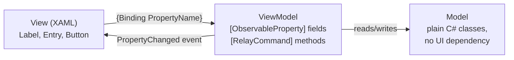
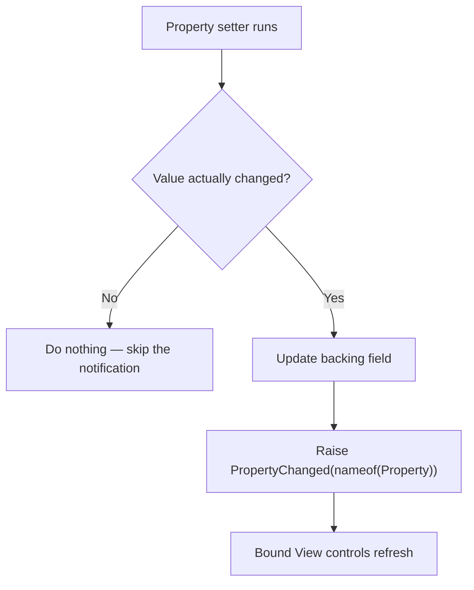

# MAUI Data Binding and MVVM

## Introduction

Before reading this lesson, you should already be comfortable with **[MAUI Cross-Platform UI Basics](../15-containers-blazor-maui/15-10-maui-cross-platform-ui-basics.md)** — laying out a page in XAML and wiring a button's `Clicked` event to a code-behind method. That code-behind approach works for a one-page demo, but it doesn't scale: every page's logic ends up wedged inside its own `.xaml.cs` file, tightly bound to specific `Label` and `Entry` controls, impossible to unit-test without spinning up an actual UI. This lesson introduces the pattern nearly every real MAUI app uses instead — **Model-View-ViewModel (MVVM)** — and the modern, source-generator-based way to write it with almost none of the boilerplate MVVM has historically demanded.

By the end of this lesson, you will be able to:

- Explain the three roles in MVVM — Model, View, ViewModel — and why the ViewModel never references UI controls directly
- Implement `INotifyPropertyChanged` by hand and explain what firing `PropertyChanged` actually causes the UI to do
- Use `CommunityToolkit.Mvvm`'s `[ObservableProperty]` and `[RelayCommand]` source-generator attributes to write the same ViewModel with a fraction of the code
- Bind a XAML view's controls to ViewModel properties and commands using `{Binding}`
- Build a testable ViewModel that has no dependency on any MAUI UI type at all

## MVVM — A Layman's Perspective

Picture a restaurant that separates its business cleanly into three roles, none of which do each other's job. The **kitchen** holds the actual ingredients and the recipes — the flour, the stock levels, the rule that a burger needs to rest for ninety seconds before plating. The kitchen doesn't know or care what the dining room looks like, what font the menu is printed in, or which table a given plate is headed to; its only concern is producing correct food from correct ingredients. The **dining room** is the opposite: tablecloths, lighting, the specific plate a customer sees in front of them. The dining room doesn't know how a burger is cooked and has no opinion about it — its only job is presenting whatever the kitchen sends out, attractively, to the person sitting at the table.

Between those two sits the **expediter** — the person at the pass who takes a completed dish from the kitchen, checks it against the ticket, and calls out exactly which table it goes to, in a form the waitstaff can act on without needing to understand any of the cooking that produced it. Critically, the expediter never touches a customer's fork or rearranges a table setting directly — that's dining-room work. And the expediter never seasons a dish or fires a burner — that's kitchen work. The expediter's entire job is translation: turning "the kitchen just finished something" into "table 12 needs to see it now," and turning a customer's spoken request ("check, please") into something the kitchen or the till can act on, again without ever laying a hand on either side directly.

This is exactly MVVM. The **Model** is the kitchen — the actual data and business rules, a `Book` or a `Loan` or a `Catalog`, with no idea any UI exists at all, exactly like the domain classes built across earlier modules. The **View** is the dining room — a XAML page: labels, entries, buttons, laid out for a specific screen, with no business logic of its own beyond how things look. The **ViewModel** is the expediter, standing between them: it holds the data the View needs to display, in a form the View can bind directly to, and it exposes the actions a user can trigger — search, save, delete — as commands the View can invoke without knowing anything about how those actions actually work underneath.

The one habit that makes this whole arrangement function, in the restaurant and in MVVM alike, is that the expediter announces things loudly and doesn't wait to be asked. The moment a dish is ready, the expediter calls it out — the dining room doesn't need to keep wandering back to the kitchen window asking "is it done yet, is it done yet." That announcement is exactly what `INotifyPropertyChanged` gives a ViewModel: the instant a property's value changes, it raises an event saying so, and every bound label or entry on the View updates itself automatically, without the ViewModel ever needing to know a `Label` exists, let alone reach into one and set its `Text` directly.

## MVVM — A Programming Language Perspective

**MVVM** is an architectural pattern separating a UI (the **View**) from its data and behavior (the **ViewModel**) and its underlying domain data (the **Model**), connected exclusively through data binding rather than direct references. A ViewModel implements `System.ComponentModel.INotifyPropertyChanged`, an interface with a single event, `PropertyChanged`, which the runtime's binding engine subscribes to automatically once a control's `BindingContext` is set; raising that event for a given property name causes every control bound to that property to re-read its value and refresh. Historically, every observable property required hand-written boilerplate: a backing field, a public getter/setter, and a manual `OnPropertyChanged(nameof(Property))` call inside the setter. `CommunityToolkit.Mvvm` — currently the standard, actively maintained MVVM toolkit for .NET MAUI — eliminates that boilerplate through two C# source-generator attributes: `[ObservableProperty]` on a `partial` field generates the full public property, backing field, and `PropertyChanged` notification at compile time, and `[RelayCommand]` on a method generates a matching `ICommand` property (`RelayCommand` or, for `async` methods, `AsyncRelayCommand`) that a View's `Button.Command` can bind to directly.

## How to Build a ViewModel with CommunityToolkit.Mvvm

A ViewModel class derives from `ObservableObject` (from `CommunityToolkit.Mvvm.ComponentModel`), which already implements `INotifyPropertyChanged`; every property that the View needs to react to becomes a `partial` field marked `[ObservableProperty]`, and every user-triggered action becomes a method marked `[RelayCommand]`. The generator runs at compile time, so `dotnet build` produces the full property and command code without a single line of it appearing in the file you actually write.


*Figure 1: The View binds to the ViewModel in both directions — reading properties, invoking commands — while the ViewModel depends on the Model but never on any UI type.*

```csharp
// Program.cs — .NET 10 / C# 14
using CommunityToolkit.Mvvm.ComponentModel;
using CommunityToolkit.Mvvm.Input;

var viewModel = new CounterViewModel();
viewModel.PropertyChanged += (_, e) =>
    Console.WriteLine($"PropertyChanged: {e.PropertyName} -> {viewModel.Count}");

viewModel.IncrementCommand.Execute(null);
viewModel.IncrementCommand.Execute(null);
viewModel.ResetCommand.Execute(null);

partial class CounterViewModel : ObservableObject
{
    [ObservableProperty]
    private int count;

    [RelayCommand]
    private void Increment() => Count++;

    [RelayCommand]
    private void Reset() => Count = 0;
}
```

**Console Output:**

```text
PropertyChanged: Count -> 1
PropertyChanged: Count -> 2
PropertyChanged: Count -> 0
```

Nothing in `CounterViewModel` writes an `OnPropertyChanged` call, defines a public `Count` property, or implements `ICommand` by hand — `[ObservableProperty]` on the private `count` field generated the public `Count` property and its change notification, and `[RelayCommand]` on `Increment` and `Reset` generated `IncrementCommand` and `ResetCommand` as ready-to-bind `ICommand` properties. In a real MAUI page, a `<Button Command="{Binding IncrementCommand}" />` and a `<Label Text="{Binding Count}" />` would produce the exact same three updates on screen, with zero code-behind involved.

## Real-Time Example: A Book Search ViewModel for the Library/Inventory Catalog

We extend the Library/Inventory Management domain's `Book` and `Catalog` types from Module 02's OOP capstone with a MAUI-facing search screen: a patron types part of a title, taps Search, and sees matching books — the same `Catalog.AllBooks` collection, now exposed through a ViewModel a XAML page can bind to directly.

```csharp
// Program.cs — .NET 10 / C# 14 — Real-Time Example (Library/Inventory Management)
using System.Collections.ObjectModel;
using CommunityToolkit.Mvvm.ComponentModel;
using CommunityToolkit.Mvvm.Input;

var catalog = new Catalog();
catalog.Add(new Book("Clean Code", "Robert C. Martin", "978-0132350884"));
catalog.Add(new Book("Refactoring", "Martin Fowler", "978-0134757599"));
catalog.Add(new Book("Clean Architecture", "Robert C. Martin", "978-0134494166"));

var viewModel = new BookSearchViewModel(catalog);
viewModel.PropertyChanged += (_, e) =>
{
    if (e.PropertyName == nameof(BookSearchViewModel.StatusMessage))
    {
        Console.WriteLine(viewModel.StatusMessage);
    }
};

viewModel.SearchText = "clean";
viewModel.SearchCommand.Execute(null);
foreach (Book match in viewModel.Results)
{
    Console.WriteLine($"  - {match.Title} by {match.Author}");
}

viewModel.SearchText = "nonexistent";
viewModel.SearchCommand.Execute(null);

// --- Model ---
record Book(string Title, string Author, string Isbn);

class Catalog
{
    private readonly List<Book> books = [];
    public IReadOnlyList<Book> AllBooks => books;
    public void Add(Book book) => books.Add(book);
}

// --- ViewModel ---
partial class BookSearchViewModel(Catalog catalog) : ObservableObject
{
    [ObservableProperty]
    private string searchText = string.Empty;

    [ObservableProperty]
    private string statusMessage = string.Empty;

    public ObservableCollection<Book> Results { get; } = [];

    [RelayCommand]
    private void Search()
    {
        Results.Clear();
        var matches = catalog.AllBooks
            .Where(b => b.Title.Contains(SearchText, StringComparison.OrdinalIgnoreCase))
            .ToList();

        foreach (Book match in matches)
        {
            Results.Add(match);
        }

        StatusMessage = matches.Count > 0
            ? $"Found {matches.Count} book(s) matching '{SearchText}'."
            : $"No books found matching '{SearchText}'.";
    }
}
```

**Console Output:**

```text
Found 2 book(s) matching 'clean'.
  - Clean Code by Robert C. Martin
  - Clean Architecture by Robert C. Martin
No books found matching 'nonexistent'.
```

`Results` is an `ObservableCollection<Book>` rather than a plain `List<Book>` for exactly the reason `Count` was an `[ObservableProperty]` int above — a `CollectionView` bound to `Results` in the actual XAML page needs to know the instant an item is added or removed, and `ObservableCollection<T>` raises that notification automatically on every `Add`/`Clear`/`Remove` call. Note that `BookSearchViewModel` never imports `Microsoft.Maui.Controls` at all — it can be unit-tested with a plain xUnit test asserting on `viewModel.Results` and `viewModel.StatusMessage`, with no simulated UI required, which is precisely the testability MVVM is designed to buy you.

## Manual INotifyPropertyChanged vs. CommunityToolkit.Mvvm

Both approaches produce identical runtime behavior — a `PropertyChanged` event firing whenever a bound property changes — but differ enormously in how much code that behavior costs to write and maintain.


*Figure 2: Both the hand-written and the source-generated version follow this exact same sequence — the generator only changes who writes the code for it.*

| Aspect | Manual `INotifyPropertyChanged` | `CommunityToolkit.Mvvm` |
|---|---|---|
| Lines per observable property | ~8–10 (field, property, equality check, event raise) | 1 (a single `[ObservableProperty] private` field) |
| Lines per command | A hand-written `ICommand` implementation, or a hand-rolled `RelayCommand` helper class | 1 (a single `[RelayCommand]`-attributed method) |
| Change-detection (skip if value is unchanged) | Must be written manually in every setter | Generated automatically by `[ObservableProperty]` |
| Risk of a typo'd `nameof(...)` breaking a binding silently | Real — a copy-pasted property is an easy source of this bug | Eliminated — the generator always references the correct property |
| When it runs | N/A — it's the code you ship | Compile time, via a Roslyn source generator — no runtime reflection cost |

## Types of MVVM Building Blocks in .NET MAUI

1. **`ObservableObject` and `[ObservableProperty]`** — the base class and attribute this lesson's ViewModels built on, from `CommunityToolkit.Mvvm.ComponentModel`.
2. **`[RelayCommand]` and `IAsyncRelayCommand`** — synchronous and `async`-aware commands a View's buttons and gestures bind to, from `CommunityToolkit.Mvvm.Input`.
3. **`ObservableCollection<T>`** — the collection type behind any `CollectionView` or `ListView` that needs to react to items being added or removed at runtime, as used for `Results` above.
4. **`[NotifyPropertyChangedFor]`** — an `[ObservableProperty]` modifier that also raises change notifications for a *derived*, read-only property (for example, an `IsResultsEmpty` computed from `Results.Count`) whenever the source property changes.
5. **`IMessenger` (`WeakReferenceMessenger`)** — `CommunityToolkit.Mvvm`'s decoupled messaging system for cases where two ViewModels need to communicate without holding a direct reference to each other.
6. **Value converters (`IValueConverter`)** — small adapter types used directly in XAML bindings when a bound property's type doesn't match the control's expected type one-for-one (for example, a `bool` driving a control's `Color`).

## What You've Learned & What's Next

MVVM keeps a MAUI app's data and logic (the ViewModel) entirely separate from how it's displayed (the View), connected only through data binding and `INotifyPropertyChanged` — and `CommunityToolkit.Mvvm`'s `[ObservableProperty]` and `[RelayCommand]` source generators turn what used to be pages of repetitive boilerplate into a handful of attributed fields and methods, without changing anything about how the pattern actually behaves at runtime.

Continue your learning journey with **[MAUI vs Blazor Hybrid — Comparison](../15-containers-blazor-maui/15-12-maui-vs-blazor-hybrid.md)**, where we compare this native XAML approach against hosting a Blazor web UI inside a MAUI app instead.

---
*Applies to: .NET 10 / C# 14. Last reviewed 2026-08-16.*
