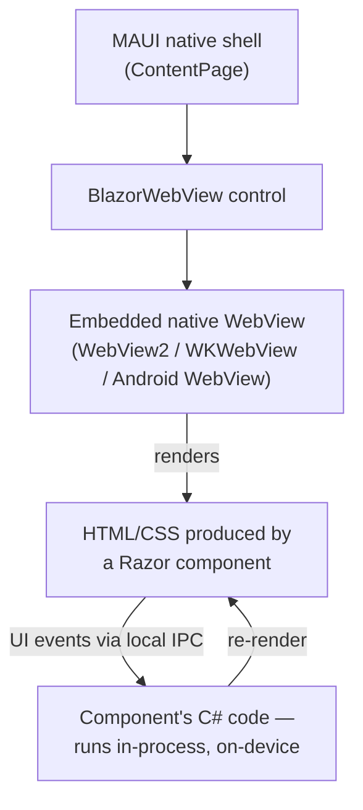
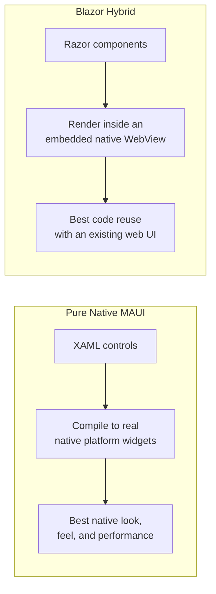

# MAUI vs Blazor Hybrid — Comparison

## Introduction

Before reading this lesson, you should already be comfortable with **[MAUI Data Binding and MVVM](../15-containers-blazor-maui/15-11-maui-data-binding-and-mvvm.md)** — building a native XAML screen whose state and behavior live in a ViewModel, bound automatically to the View. That's one entire way to build a MAUI app's UI. This lesson introduces the other: instead of native XAML controls, a MAUI app can host a **Blazor** UI — the same Razor components you'd write for a web app — inside its native shell, through a control called `BlazorWebView`. This is "Blazor Hybrid," and deciding between it and pure native MAUI is one of the first real architectural forks a cross-platform .NET team hits.

By the end of this lesson, you will be able to:

- Explain what `BlazorWebView` is and how it hosts Razor components inside a native MAUI shell
- Describe how Blazor Hybrid differs from Blazor Server and Blazor WebAssembly, even though all three render the same Razor components
- Contrast pure native MAUI XAML with Blazor Hybrid at the architectural level
- Identify when reusing a web team's existing Blazor components (Blazor Hybrid) is the right call, versus when fully native performance and platform look-and-feel (pure MAUI) is
- Wire a minimal `BlazorWebView` into a MAUI page hosting a shared Razor component

## MAUI vs Blazor Hybrid — A Layman's Perspective

Picture a retail brand expanding into a dozen new cities at once, and two entirely different ways it could open a store in each one. The first way: hire local architects and tradespeople in every single city, and have each of them build a store completely from scratch, tailored precisely to that city's building codes, materials, and architectural character — a store in a historic old-town district ends up with exposed brick and hand-fitted woodwork; a store in a modern shopping tower ends up with glass and steel that matches the tower around it. Every one of these stores looks and feels like it has always belonged exactly where it stands, because it was built, board by board, for that specific place. That's slower and more expensive per location, but the payoff is a store indistinguishable from the buildings around it.

The second way: design one single store interior once — the shelving, the checkout counters, the lighting, the layout customers walk through — build it as a self-contained, fully outfitted shipping-container unit, and then simply drop an identical copy of that same container into a plain, quickly-built host structure in each new city. The container's interior is exactly the same everywhere; only the host shell around it is built locally, just enough to give it a front door, a roof, and a way in. Customers get the same shopping experience walking into any of these locations, and the brand only had to design the actual store once — but no matter how nicely the host shell is finished, the building will never feel quite as native to its city as the fully bespoke one did, and if that container's design assumed features the local host shell doesn't happen to support, something inside won't quite work right in that city.

Neither approach is simply "better" — they're a genuine trade-off between two things a business actually wants and can rarely maximize both of at once: how quickly and cheaply it can replicate one design everywhere, against how perfectly each individual location fits into its own specific place.

That's exactly the choice between pure native MAUI and Blazor Hybrid. Pure MAUI is the bespoke store: every screen is built with native XAML controls that MAUI translates directly into each platform's own real, native UI widgets — a MAUI `Button` becomes an actual `UIButton` on iOS, an actual native `Button` on Android, an actual WinUI button on Windows — so the app looks, feels, and performs exactly like it was built specifically for that platform, because in a very real sense, it was. Blazor Hybrid is the shipping-container store: the entire UI is a set of Razor components — HTML and CSS, driven by C# — built once, and that identical UI is then dropped, unmodified, into a small native "host shell" on each platform via the `BlazorWebView` control, which renders that HTML inside a local, embedded web view. Build it once, and it looks the same everywhere; but it's rendering as a web page inside a native app, not as truly native platform controls, and it inherits whatever this lesson goes on to name as the tradeoffs of that approach.

## MAUI vs Blazor Hybrid — A Programming Language Perspective

Pure MAUI XAML compiles a page's controls into genuine native platform widgets, with C# ViewModels driving them through data binding, as the previous lesson built. **Blazor Hybrid** instead places a `BlazorWebView` control (from `Microsoft.AspNetCore.Components.WebView.Maui`) inside a normal MAUI `ContentPage`, and points its `RootComponent` at a Razor component — the exact same `.razor` component type used in a Blazor web app. Critically, Blazor Hybrid runs that component's C# code **in-process**, on the device, not compiled to WebAssembly and not round-tripping over a network via SignalR the way Blazor Server does — the embedded native web view (WebView2 on Windows, WKWebView on iOS/macOS, an Android `WebView`) is used purely as a local rendering surface for the HTML and CSS that component produces, with a lightweight local IPC channel carrying UI events back to the in-process .NET code and rendered markup back out. The result: the same Razor component source file compiles, unmodified, into a Blazor Server app, a Blazor WebAssembly app, or a Blazor Hybrid MAUI app — only the hosting model around it differs.

## How to Host a Blazor Component Inside a MAUI Shell

Hosting Blazor Hybrid content starts with registering Blazor's services in `MauiProgram.cs`, then dropping a `BlazorWebView` control onto a page and pointing it at a root Razor component — everything else about that component works exactly as it would in a web project.


*Figure 1: The `.razor` component's C# runs natively in-process on the device; only its rendered output is displayed through an embedded web view — no network round trip, unlike Blazor Server.*

```csharp
// MainPage.xaml.cs — .NET 10 / C# 14
public partial class MainPage : ContentPage
{
    public MainPage()
    {
        InitializeComponent();
    }
}
```

```xml
<!-- MainPage.xaml -->
<ContentPage xmlns="http://schemas.microsoft.com/dotnet/2021/maui"
             xmlns:x="http://schemas.microsoft.com/winfx/2009/xaml"
             xmlns:blazor="clr-namespace:Microsoft.AspNetCore.Components.WebView.Maui;assembly=Microsoft.AspNetCore.Components.WebView.Maui"
             x:Class="HybridStoreApp.MainPage">
    <blazor:BlazorWebView HostPage="wwwroot/index.html">
        <blazor:BlazorWebView.RootComponents>
            <blazor:RootComponent Selector="#app" ComponentType="{x:Type local:Counter}" />
        </blazor:BlazorWebView.RootComponents>
    </blazor:BlazorWebView>
</ContentPage>
```

```razor
@* Counter.razor — identical to a Blazor web app's component *@
<h3>Count: @count</h3>
<button @onclick="Increment">Click me</button>

@code {
    private int count;
    private void Increment() => count++;
}
```

**Output** *(this is a MAUI app — the meaningful "output" is what renders inside the embedded native web view, not a console trace):*

```text
App launches -> BlazorWebView loads wwwroot/index.html
-> Razor renderer mounts <Counter /> into <div id="app">
-> WebView displays: "Count: 0" and a "Click me" button
-> Tap "Click me" three times
-> WebView re-renders (in-process, no network call): "Count: 3"
```

Nothing about `Counter.razor` changed from how it would look in a Blazor web project — the `@onclick` handler and the `count` field work identically, because they're running the same Blazor rendering pipeline. Only the host — a MAUI `BlazorWebView` instead of a browser tab — differs.

## Real-Time Example: Reusing a Web Order-Status Component in E-Commerce Order Processing

We continue building on the E-Commerce Order Processing domain. Suppose the company's public storefront already has a Blazor web page showing a customer their order status, built and maintained by the web team. Rather than have the mobile team hand-build that same screen twice in native XAML, Blazor Hybrid lets the mobile app host the *exact same* `OrderStatusView.razor` component, unmodified, wired to the same `OrderApiClient` used elsewhere in this curriculum's Order Processing API.

```razor
@* OrderStatusView.razor — shared verbatim between the web storefront and the MAUI app *@
@inject OrderApiClient OrderApi

@if (order is null)
{
    <p>Loading order...</p>
}
else
{
    <h3>Order #@order.OrderId</h3>
    <p>Status: @order.Status</p>
    <p>Total: @order.Total.ToString("C")</p>
}

@code {
    [Parameter] public required string OrderId { get; set; }
    private OrderSummary? order;

    protected override async Task OnInitializedAsync()
        => order = await OrderApi.GetOrderStatusAsync(OrderId);
}
```

```csharp
// MauiProgram.cs — .NET 10 / C# 14 — Real-Time Example
public static class MauiProgram
{
    public static MauiApp CreateMauiApp()
    {
        MauiAppBuilder builder = MauiApp.CreateBuilder();
        builder.UseMauiApp<App>();

        builder.Services.AddMauiBlazorWebView();
        builder.Services.AddHttpClient<OrderApiClient>(client =>
            client.BaseAddress = new Uri("https://orders.example-shop.com/"));

        return builder.Build();
    }
}

public sealed record OrderSummary(string OrderId, string Status, decimal Total);

public sealed class OrderApiClient(HttpClient httpClient)
{
    public async Task<OrderSummary?> GetOrderStatusAsync(string orderId)
        => await httpClient.GetFromJsonAsync<OrderSummary>($"api/orders/{orderId}/status");
}
```

The web team owns `OrderStatusView.razor` and its order-status logic in exactly one place; the mobile team's job is only the thin native shell (`MainPage.xaml`'s `BlazorWebView`, plus `MauiProgram.cs` wiring `OrderApiClient` into the same DI container) around it. When the web team fixes a bug in how a cancelled order displays, that fix ships to the MAUI app too, the next time it's rebuilt — with zero duplicated UI logic to keep in sync across two codebases.

## Pure Native MAUI vs. Blazor Hybrid

The two aren't a strict better-or-worse ranking — they trade code reuse against how deeply "native" the result feels and performs, and different screens in the same app are allowed to make different choices.


*Figure 2: Both ultimately run entirely on-device, in-process — they differ in whether the visible UI is built from native widgets or rendered HTML.*

| Aspect | Pure Native MAUI | Blazor Hybrid |
|---|---|---|
| UI defined in | XAML + native controls | Razor components (`.razor`) |
| Rendered as | Real native platform widgets | HTML/CSS inside an embedded native WebView |
| Code reuse with a Blazor web app | None — UI rebuilt separately | Full — same component files, unmodified |
| Look and feel | Matches each platform's native controls exactly | Matches the web app's design, not the platform's native controls |
| State/behavior pattern | MVVM (previous lesson) | Razor's own component lifecycle (`OnInitializedAsync`, etc.) |
| Best fit | A team building mobile-first, wanting the most native feel and top performance | A team with an existing Blazor web UI wanting one shared codebase across web and native shells |

## Types of MAUI UI Hosting Models

1. **Pure native MAUI XAML** — the previous lesson's approach; every control is a real native platform widget, driven by MVVM.
2. **Blazor Hybrid via `BlazorWebView`** — this lesson's focus; Razor components rendered inside a native app's embedded web view, running in-process.
3. **Blazor Server** — the same Razor component model, but rendered server-side and streamed to a browser over a persistent SignalR connection; no native shell involved at all.
4. **Blazor WebAssembly** — the same Razor component model again, compiled to WebAssembly and run entirely client-side in a browser tab, also without a native shell.
5. **Mixed MAUI apps** — combining native XAML pages for some screens with a `BlazorWebView` page for others in the same app, letting each screen pick whichever model fits it best.
6. **[Containerizing the E-Commerce Order API — Real-Time Example](../15-containers-blazor-maui/15-13-containerizing-order-api-real-time.md)** — next lesson, shifting focus from the mobile client back to packaging the backend API both of these UI models call.

## What You've Learned & What's Next

Pure native MAUI and Blazor Hybrid both run entirely on-device — the difference is whether a screen is built from real native controls or from Razor components rendered inside an embedded web view. Pure MAUI wins when native look, feel, and performance matter most; Blazor Hybrid wins when reusing an existing Blazor web UI, unmodified, across native shells matters more than looking pixel-perfect native.

Continue your learning journey with **[Containerizing the E-Commerce Order API — Real-Time Example](../15-containers-blazor-maui/15-13-containerizing-order-api-real-time.md)**, where we shift from the client experience back to the Order Processing API both of these client models depend on, and package it into a Docker container end to end.

---
*Applies to: .NET 10 / C# 14. Last reviewed 2026-08-16.*
