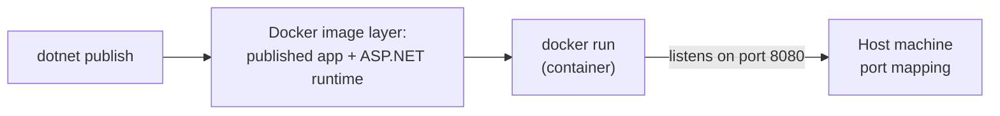
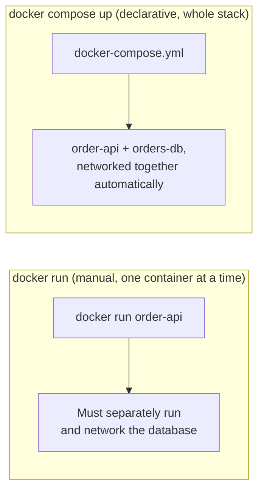

# Containerizing the E-Commerce Order API — Real-Time Example

## Introduction

Before reading this lesson, you should already be comfortable with **[MAUI vs Blazor Hybrid — Comparison](../15-containers-blazor-maui/15-12-maui-vs-blazor-hybrid.md)** and, further back, with Docker's basic mental model from this module's opening lessons — an image as a packaged filesystem-plus-runtime, and a container as a running instance of one. Every earlier lesson touching the E-Commerce Order Processing domain has run as a plain `dotnet run` process on your machine, talking to configuration values sitting quietly in `appsettings.json`. This lesson closes that gap: we take the Order Processing minimal API, fully containerize it, and run it as a complete stack — the API plus its own database — with a single command, using the exact configuration layering **[Configuration and the Options Pattern](../10-aspnetcore/10-19-configuration-and-options-pattern.md)** already introduced.

By the end of this lesson, you will be able to:

- Write a Dockerfile that builds and runs an ASP.NET Core minimal API
- Write a `docker-compose.yml` that runs the API alongside a database container as one coordinated stack
- Supply database connection details and other settings to a containerized app through environment variables, overriding `appsettings.json` with no code change
- Bring an entire multi-container application stack up and down with `docker compose up` / `docker compose down`
- Verify a containerized API is working correctly by calling it from the host machine

## Containerizing the Order API — A Layman's Perspective

Picture a food truck business finally opening its first proper restaurant location. Until now, everything ran out of one truck: the grill, the fridge, the register, all bolted together in a single vehicle that either worked as a complete unit or didn't run at all. Moving into a real restaurant means splitting that single vehicle into distinct, purpose-built spaces that cooperate instead of being welded together: a walk-in cooler for ingredients, a kitchen for cooking, a dining room for service — each one a separate, independently maintained space, but all of them opening for business together, at the same time, as one coordinated restaurant rather than three unrelated rooms that happen to share a building.

Crucially, the kitchen doesn't hardcode "the walk-in cooler is exactly four steps to my left" into its layout — it just knows there's a cooler reachable by a hallway, wherever that cooler happens to physically be plumbed in. That's the difference between a food truck's single bolted-together unit and a restaurant's cooperating rooms: the rooms are independent, replaceable, and connected by well-known passageways rather than fused together permanently.

This is exactly what containerizing the Order API means. Until now, the API and its database have effectively been "welded together" onto one development machine — run `dotnet run`, and everything just happens to be reachable because it's all sitting on the same laptop. Splitting it into containers means the API becomes one self-contained unit and the database becomes a separate one, each independently built and started, cooperating through a well-known network passageway rather than both being bolted onto the same machine by convention. And just as a real restaurant doesn't reprint its recipe cards depending on which building it's operating out of that week, the containerized API doesn't have its database address baked into its own code — that value is handed to it from the outside, at startup, so the exact same container image can run against a local test database today and a production database tomorrow without anyone touching a single line of source code.

## Containerizing the Order API — A Programming Language Perspective

A **Dockerfile** is a build recipe: a sequence of instructions (`FROM`, `WORKDIR`, `COPY`, `RUN`, `ENTRYPOINT`) that Docker executes in order to produce an **image** — an immutable, versioned filesystem snapshot containing the published application and everything it needs to run. **`docker compose`** orchestrates multiple related containers, defined declaratively in a `docker-compose.yml` file, as a single named stack: each service gets its own container, its own image (built from a Dockerfile or pulled from a registry), and a shared Docker network letting services address each other by service name rather than by IP address. Configuration values passed to a container via the `environment:` block in `docker-compose.yml` become ordinary OS environment variables inside that container, which ASP.NET Core's configuration system already reads as one of its provider layers — exactly the mechanism from **[Configuration and the Options Pattern](../10-aspnetcore/10-19-configuration-and-options-pattern.md)**, with the double-underscore key convention (`ConnectionStrings__OrdersDb`) substituting for the colon-delimited key a JSON file would use.

## How to Write a Dockerfile for the Order API

A working Dockerfile for an ASP.NET Core minimal API needs an SDK-based build stage and a runtime base image; this lesson keeps it single-stage for clarity — the next lesson revisits this exact Dockerfile to trim its final image size with a multi-stage build.


*Figure 1: A Dockerfile packages the published app onto a runtime base image; `docker run` starts a container from that image, exposing it to the host through a port mapping.*

```dockerfile
# Dockerfile
FROM mcr.microsoft.com/dotnet/sdk:10.0 AS build
WORKDIR /src
COPY OrderApi.csproj .
RUN dotnet restore
COPY . .
RUN dotnet publish -c Release -o /app/publish

FROM mcr.microsoft.com/dotnet/aspnet:10.0
WORKDIR /app
COPY --from=build /app/publish .
ENV ASPNETCORE_HTTP_PORTS=8080
ENTRYPOINT ["dotnet", "OrderApi.dll"]
```

**Console Output** *(building and running the image directly, before compose enters the picture):*

```text
$ docker build -t order-api .
[+] Building 14.2s (12/12) FINISHED
 => [build 1/5] FROM mcr.microsoft.com/dotnet/sdk:10.0
 => [build 4/5] RUN dotnet restore
 => [build 5/5] RUN dotnet publish -c Release -o /app/publish
 => exporting to image
 => naming to docker.io/library/order-api

$ docker run -p 8080:8080 order-api
info: Microsoft.Hosting.Lifetime[14]
      Now listening on: http://[::]:8080
info: Microsoft.Hosting.Lifetime[0]
      Application started. Press Ctrl+C to shut down.
```

`docker build` executes every instruction in order, caching each layer so a later rebuild that only changes application source code skips straight past the (unchanged) `dotnet restore` layer. The running container's console output is the same ASP.NET Core startup log you'd see from `dotnet run` on your own machine — a container doesn't change what the app logs, only where and how it's running.

## Real-Time Example: The Full Order API + Database Stack with docker-compose

We take the E-Commerce Order Processing domain's `Order`, `OrderItem`, `Customer`, and `Product` records — the same shapes used throughout Modules 04 and 10 — and containerize the complete stack: the minimal API itself, plus a PostgreSQL container it depends on, wired together entirely through `docker-compose.yml` and environment variables, with no connection string hardcoded anywhere in source.

```csharp
// Program.cs — .NET 10 / C# 14 — Real-Time Example (E-Commerce Order Processing)
var builder = WebApplication.CreateBuilder(args);

// Bound from ConnectionStrings__OrdersDb, supplied via docker-compose's environment block.
string connectionString = builder.Configuration.GetConnectionString("OrdersDb")
    ?? throw new InvalidOperationException("OrdersDb connection string is not configured.");

builder.Services.AddSingleton(new OrderStore(connectionString));

var app = builder.Build();

app.MapGet("/api/orders/{orderId}", (string orderId, OrderStore store) =>
{
    Order? order = store.Find(orderId);
    return order is not null ? Results.Ok(order) : Results.NotFound();
});

app.MapPost("/api/orders", (Order order, OrderStore store) =>
{
    store.Save(order);
    return Results.Created($"/api/orders/{order.OrderId}", order);
});

app.Run();

record Customer(string CustomerId, string Name, string Tier);
record OrderItem(string Sku, int Quantity, decimal UnitPrice);
record Order(string OrderId, string CustomerId, DateTime PlacedAt, List<OrderItem> Items);

class OrderStore(string connectionString)
{
    private readonly Dictionary<string, Order> orders = [];
    public Order? Find(string orderId) => orders.GetValueOrDefault(orderId);
    public void Save(Order order) => orders[order.OrderId] = order;
}
```

```yaml
# docker-compose.yml
services:
  orders-db:
    image: postgres:17
    environment:
      POSTGRES_DB: orders
      POSTGRES_USER: orders_app
      POSTGRES_PASSWORD: ${ORDERS_DB_PASSWORD}
    volumes:
      - orders-db-data:/var/lib/postgresql/data

  order-api:
    build: .
    ports:
      - "8080:8080"
    environment:
      ConnectionStrings__OrdersDb: "Host=orders-db;Database=orders;Username=orders_app;Password=${ORDERS_DB_PASSWORD}"
    depends_on:
      - orders-db

volumes:
  orders-db-data:
```

**Console Output** *(shell/container output — starting the stack and calling the running API):*

```text
$ ORDERS_DB_PASSWORD=dev-only-secret docker compose up --build -d
[+] Running 3/3
 ✔ Network orderapi_default        Created
 ✔ Container orderapi-orders-db-1  Started
 ✔ Container orderapi-order-api-1  Started

$ docker compose ps
NAME                     IMAGE          STATUS          PORTS
orderapi-orders-db-1     postgres:17    Up 4 seconds    5432/tcp
orderapi-order-api-1     orderapi-order-api   Up 3 seconds    0.0.0.0:8080->8080/tcp

$ curl -X POST http://localhost:8080/api/orders \
    -H "Content-Type: application/json" \
    -d '{"orderId":"ORD-2001","customerId":"CUST-501","placedAt":"2026-08-16T10:00:00Z","items":[{"sku":"SKU-100","quantity":2,"unitPrice":19.99}]}'
{"orderId":"ORD-2001","customerId":"CUST-501","placedAt":"2026-08-16T10:00:00Z","items":[{"sku":"SKU-100","quantity":2,"unitPrice":19.99}]}

$ curl http://localhost:8080/api/orders/ORD-2001
{"orderId":"ORD-2001","customerId":"CUST-501","placedAt":"2026-08-16T10:00:00Z","items":[{"sku":"SKU-100","quantity":2,"unitPrice":19.99}]}

$ docker compose down
[+] Running 3/3
 ✔ Container orderapi-order-api-1  Removed
 ✔ Container orderapi-orders-db-1  Removed
 ✔ Network orderapi_default        Removed
```

Notice `order-api` never references `orders-db` by an IP address anywhere — Docker Compose's built-in DNS resolves the service name `orders-db` to the right container automatically, on the shared network Compose creates for the stack, exactly like the restaurant's kitchen reaching a cooler through a well-known hallway rather than a hardcoded location. The `ConnectionStrings__OrdersDb` environment variable is the only place the database's location and credentials appear at all — the API image itself is generic and portable, and a production deployment would simply supply a different `ORDERS_DB_PASSWORD` and a real managed database host, with the exact same image, unmodified. `depends_on` only guarantees container *start order*, not that PostgreSQL has finished initializing — a production stack typically adds a retry policy or a wait-for-it style startup check on the API side to handle that gap safely, which later lessons on health checks address directly. Bringing the entire two-container stack down with one `docker compose down` — cleanly removing both containers and the network between them, while the named volume `orders-db-data` preserves the database's actual data across restarts — is the payoff for describing the stack declaratively instead of starting each container by hand with a long sequence of separate `docker run` commands.

## docker run vs. docker compose up

A single `docker run` command starts exactly one container from one image; `docker compose up` reads an entire declarative file and brings up every service it describes, together, as one coordinated unit.


*Figure 2: `docker run` operates one container at a time; `docker compose up` reads a single file describing the entire multi-container stack and brings it up as a unit.*

| Aspect | `docker run` | `docker compose up` |
|---|---|---|
| Scope | One container per invocation | An entire stack of services, defined in one file |
| Inter-service networking | Must be wired up manually (`docker network create`, `--network`) | Automatic — Compose creates a shared network and DNS by service name |
| Configuration | Passed as repeated `-e KEY=VALUE` flags on the command line | Declared once in `environment:`, versioned alongside the app |
| Tearing everything down | Must stop and remove each container individually | `docker compose down` removes every container and the network in one command |
| Best fit | A single, standalone container, or quick manual testing | Any application with more than one moving part — exactly this lesson's API + database stack |

## Types of Containerization Building Blocks Used in This Lesson

1. **Dockerfile instructions** (`FROM`, `WORKDIR`, `COPY`, `RUN`, `ENTRYPOINT`) — the build recipe producing the `order-api` image.
2. **`docker-compose.yml` services** — declarative definitions of each container in the stack, including image, ports, environment, and dependencies.
3. **Named volumes** — `orders-db-data`, ensuring the database's actual data survives a container being stopped, removed, and recreated.
4. **Environment-variable configuration** — the double-underscore convention connecting `docker-compose.yml`'s `environment:` block to ASP.NET Core's `IConfiguration`, as introduced in **[Configuration and the Options Pattern](../10-aspnetcore/10-19-configuration-and-options-pattern.md)**.
5. **Compose's built-in service DNS** — resolving `orders-db` to the correct container automatically, without any hardcoded IP address.
6. **[Multi-Stage Docker Builds for .NET](../15-containers-blazor-maui/15-14-multi-stage-docker-builds.md)** — next lesson, revisiting this exact Dockerfile to shrink its final image.

## What You've Learned & What's Next

A Dockerfile packages the Order API into a portable image, and `docker-compose.yml` describes the API and its database as one coordinated, networked stack — brought up and torn down together with a single command, with every environment-specific setting supplied from the outside through environment variables rather than baked into the image itself.

Continue your learning journey with **[Multi-Stage Docker Builds for .NET](../15-containers-blazor-maui/15-14-multi-stage-docker-builds.md)**, where we revisit this lesson's Dockerfile and trim the SDK, build artifacts, and source code out of the final image entirely.

---
*Applies to: .NET 10 / C# 14. Last reviewed 2026-08-16.*
