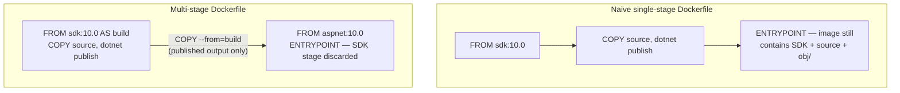
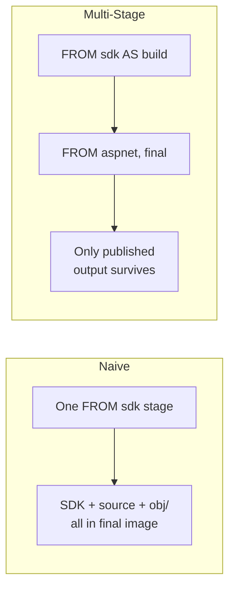

# Multi-Stage Docker Builds for .NET

## Introduction

Before reading this lesson, you should already be comfortable with **[Containerizing the E-Commerce Order API — Real-Time Example](../15-containers-blazor-maui/15-13-containerizing-order-api-real-time.md)**, whose Dockerfile quietly did something this lesson finally explains in depth: it built the Order API in one `FROM mcr.microsoft.com/dotnet/sdk:10.0` stage and shipped it from an entirely different, much smaller `FROM mcr.microsoft.com/dotnet/aspnet:10.0` stage. That split wasn't cosmetic. This lesson shows exactly what happens when you skip it — a genuinely bloated, slower-to-ship image — and why the two-stage pattern you've already been using is the fix.

By the end of this lesson, you will be able to:

- Explain why a naive, single-stage Dockerfile bakes the SDK, compiler, build artifacts, and full source tree into a production image
- Write a multi-stage Dockerfile with a `build` stage carrying the full SDK and a final stage carrying only the published output
- Compare a naive image's size against a multi-stage image's size and explain precisely where the difference comes from
- Use a `.dockerignore` file to keep unnecessary files out of the build context before a build even starts
- Apply the multi-stage pattern, with numbers, to the Order API Dockerfile from the previous lesson

## Multi-Stage Docker Builds — A Layman's Perspective

Picture a publishing house preparing a novel for the shelves. Getting a manuscript from a first draft to a finished, printed book takes an enormous, genuinely messy amount of infrastructure: an editor's desk buried in red-penned drafts, a style-guide binder three inches thick, a dozen discarded chapter revisions in a recycling bin, a whiteboard covered in plot-timeline notes, and a proofreader's marked-up galley pages with corrections scrawled in the margins. None of that is a secret or a mistake — it's simply what producing a finished book actually requires. But when a truck finally delivers boxes to a bookstore, it does not deliver any of that. It delivers exactly one thing: the finished, printed book, bound and ready to be read, with not a single red-penned draft page or whiteboard photo included anywhere in the box.

Now picture a much less disciplined publishing house that simply never bothered to separate "the editing room" from "what ships to stores." Every box sent to every bookstore also contains, stuffed in alongside the finished book: the discarded drafts, the style-guide binder, the marked-up galleys, a photo of the whiteboard, everything. The bookstore didn't ask for any of it, will never open any of it, and yet has to receive, store, and shelve space for all of it anyway, every single time a shipment arrives — dramatically heavier, dramatically bulkier, for a customer who only ever wanted the finished novel in the first place.

That second, undisciplined publishing house is exactly what a naive, single-stage Dockerfile does. Compiling a .NET application requires its own genuinely large "editing room" — the SDK, the C# compiler, MSBuild's task graph, a NuGet package cache, and, while the build is happening, both your original source files and the intermediate `obj/` build artifacts sitting alongside the final result. A disciplined Dockerfile treats all of that exactly the way the well-run publishing house treats its editing room: real, necessary, and entirely left behind once the finished product exists. A naive Dockerfile, by contrast, never draws that line — it builds the application and ships the entire messy editing room right along with it, baked permanently into every single container anyone ever runs from that image, whether they asked for the compiler and the source code or not.

The fix, in both cases, is the same idea: do the messy work in one place, and carry forward only the finished result into what actually gets shipped. A Dockerfile that does this explicitly, with more than one `FROM` instruction, is called a **multi-stage build** — and it's the difference between shipping a novel, and shipping a novel with the entire editing room taped to the back cover.

## Multi-Stage Docker Builds — A Programming Language Perspective

A Dockerfile with more than one `FROM` instruction defines multiple **build stages**, each optionally named with `AS <stage-name>`. Only the *final* stage's filesystem becomes the resulting image; earlier stages exist solely to produce artifacts that a later stage can pull forward with `COPY --from=<stage-name> <path> <destination>`. A **naive single-stage Dockerfile** for a .NET app starts `FROM mcr.microsoft.com/dotnet/sdk:...` and never leaves it — every instruction after that runs and lands in the one stage that becomes the shipped image, so the compiler, MSBuild, the NuGet cache, the `obj/` intermediate directory, and the full source tree are all still present in the final image, whether or not anything downstream will ever use them again. A **multi-stage Dockerfile** instead uses an early `build` stage `FROM` the full SDK image to run `dotnet restore` and `dotnet publish`, and a separate final stage `FROM` a much smaller runtime-only image (such as `mcr.microsoft.com/dotnet/aspnet:10.0`) that copies forward only the `dotnet publish` output via `COPY --from=build /app/publish .` — discarding everything else the build stage ever touched, since Docker never includes a non-final stage's filesystem in the resulting image at all.

## How to Write and Compare a Naive vs. Multi-Stage Dockerfile

Building the same minimal API two ways — first as a naive single-stage image, then as a proper multi-stage one — makes the size difference concrete rather than theoretical.


*Figure 1: The naive Dockerfile never leaves its one SDK-based stage; the multi-stage Dockerfile discards that entire stage and keeps only what `COPY --from=build` pulled forward.*

```dockerfile
# Dockerfile.naive — everything in one SDK-based stage
FROM mcr.microsoft.com/dotnet/sdk:10.0
WORKDIR /app
COPY . .
RUN dotnet publish -c Release -o /app/publish
ENTRYPOINT ["dotnet", "/app/publish/SizeDemoApi.dll"]
```

```dockerfile
# Dockerfile — multi-stage
FROM mcr.microsoft.com/dotnet/sdk:10.0 AS build
WORKDIR /src
COPY . .
RUN dotnet publish -c Release -o /app/publish

FROM mcr.microsoft.com/dotnet/aspnet:10.0
WORKDIR /app
COPY --from=build /app/publish .
ENTRYPOINT ["dotnet", "SizeDemoApi.dll"]
```

**Shell Output** *(building both images and comparing sizes with `docker images`):*

```text
$ docker build -f Dockerfile.naive -t sizedemo:naive .
$ docker build -f Dockerfile -t sizedemo:multistage .

$ docker images sizedemo
REPOSITORY   TAG          IMAGE ID       SIZE
sizedemo     naive        7a12e4f9b1c0   842MB
sizedemo     multistage   3d88a0c62e17   224MB
```

Both images run the identical published application and produce identical HTTP responses — the difference is entirely in what else came along for the ride. `sizedemo:naive` carries the full SDK, the compiler, the NuGet cache, and every source file forward into the image that actually gets deployed; `sizedemo:multistage` discards all of that the moment its `build` stage finishes, keeping only the DLLs and assets `dotnet publish` produced. Roughly 618MB of pure build tooling never needed to leave the build machine in the first place.

## Real-Time Example: Shrinking the Order API Image with .dockerignore

We return to the E-Commerce Order Processing `OrderApi` Dockerfile from the previous lesson and complete the picture with the one piece it was still missing: a `.dockerignore` file. Even a properly multi-staged build wastes time and can leak unwanted files into the `build` stage's own copy of the source if the **build context** — everything Docker reads off disk before a build even starts — includes a developer's local `bin/`, `obj/`, and `.git` folders.

```text
# .dockerignore
bin/
obj/
**/bin/
**/obj/
.git/
.vs/
*.user
appsettings.Development.json
```

```dockerfile
# Dockerfile — OrderApi, multi-stage (from the previous lesson, unchanged)
FROM mcr.microsoft.com/dotnet/sdk:10.0 AS build
WORKDIR /src
COPY OrderApi.csproj .
RUN dotnet restore
COPY . .
RUN dotnet publish -c Release -o /app/publish

FROM mcr.microsoft.com/dotnet/aspnet:10.0
WORKDIR /app
COPY --from=build /app/publish .
ENV ASPNETCORE_HTTP_PORTS=8080
ENTRYPOINT ["dotnet", "OrderApi.dll"]
```

**Shell Output** *(without and with `.dockerignore`, showing the build context size Docker has to read before the build even begins):*

```text
$ docker build -t order-api:no-dockerignore .
Sending build context to Docker daemon  187.4MB
[+] Building 21.6s (12/12) FINISHED

$ docker build -t order-api:with-dockerignore .
Sending build context to Docker daemon  2.1MB
[+] Building 9.8s (12/12) FINISHED

$ docker images order-api
REPOSITORY   TAG                    SIZE
order-api    no-dockerignore        231MB
order-api    with-dockerignore      226MB
```

Notice two separate effects here. `.dockerignore` shrinks the **build context** dramatically — from 187.4MB down to 2.1MB — because a developer's already-built local `bin/` and `obj/` folders, and the entire `.git` history, were being uploaded to the Docker daemon on every single build before `.dockerignore` existed, even though none of them were ever needed inside the container. That's why the build itself finished noticeably faster, too. The final *image* size barely moves, because the multi-stage split from the previous lesson had already kept those folders out of the shipped result — `.dockerignore` is fixing a build-speed and build-context-hygiene problem, not an image-bloat problem, and a genuinely production-shaped Dockerfile needs both.

## Naive Single-Stage vs. Multi-Stage Builds

The two approaches produce a runnable image either way — the naive one simply never stops carrying its own construction site along with the finished product.


*Figure 2: The naive Dockerfile's single stage IS the shipped image; the multi-stage Dockerfile's shipped image is only ever the last stage.*

| Aspect | Naive Single-Stage | Multi-Stage |
|---|---|---|
| Base image(s) used | SDK image only | SDK image (build) + slim runtime image (final) |
| Compiler/MSBuild/NuGet cache in final image | Yes | No — discarded with the `build` stage |
| Source code in final image | Yes, in full | No — only `dotnet publish` output |
| Typical final image size (illustrative) | ~800MB+ | ~200–230MB |
| Attack surface in production | Larger — a full dev toolchain shipped unnecessarily | Smaller — only the runtime needed to execute the app |
| Dockerfile complexity | One `FROM`, simpler to read | Two or more `FROM` stages, still simple in practice |

## Types of Multi-Stage Build Techniques in .NET

1. **Named build stages (`FROM ... AS build`)** — the core mechanic this lesson relies on, letting a later stage reference an earlier one by name.
2. **`COPY --from=<stage>`** — selectively pulling forward only specific files or directories from an earlier stage, as used for `/app/publish` throughout this lesson.
3. **`.dockerignore`** — shrinking the build context sent to the Docker daemon, independent of (and complementary to) the multi-stage split itself.
4. **Multi-stage builds with a separate `test` stage** — an optional intermediate stage running `dotnet test` during `docker build`, failing the build itself if tests don't pass, without that test tooling ever reaching the final image.
5. **BuildKit cache mounts (`--mount=type=cache`)** — an advanced technique caching the NuGet package cache *across* builds without baking it into any stage's image layers at all.
6. **[Container Health Checks and Readiness Probes](../15-containers-blazor-maui/15-15-container-health-checks.md)** — next lesson, now that the image itself is lean, moving on to telling an orchestrator whether a running container from it is actually healthy.

## What You've Learned & What's Next

A naive, single-stage Dockerfile ships the entire .NET build toolchain — compiler, MSBuild, NuGet cache, source, and intermediate artifacts — into every container anyone ever runs from it. A multi-stage Dockerfile fixes that by running the build in one disposable stage and copying forward only the published output into a slim, runtime-only final stage, typically cutting image size by well over half; `.dockerignore` separately keeps the build context itself lean and fast, regardless of how many stages the Dockerfile uses.

Continue your learning journey with **[Container Health Checks and Readiness Probes](../15-containers-blazor-maui/15-15-container-health-checks.md)**, where we look at how a now properly slimmed-down container tells the outside world — Docker itself, and later an orchestrator like Kubernetes — whether it's actually ready to do its job.

---
*Applies to: .NET 10 / C# 14. Last reviewed 2026-08-16.*
