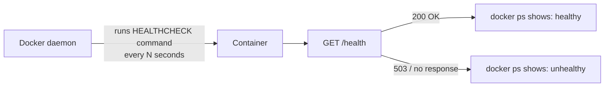
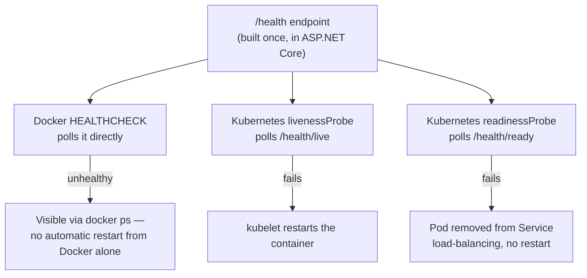

# Container Health Checks and Readiness Probes

## Introduction

Before reading this lesson, you should already be comfortable with **[Multi-Stage Docker Builds for .NET](../15-containers-blazor-maui/15-14-multi-stage-docker-builds.md)** and, further back, with **[Health Checks](../10-aspnetcore/10-13-health-checks.md)** from Module 10, which built an ASP.NET Core `/health` endpoint reporting whether an app and its dependencies are actually working. That lesson built the endpoint; it never asked who's actually polling it. This lesson answers that: at the container level, Docker has its own built-in `HEALTHCHECK` instruction, and once an app is running inside an orchestrator like Kubernetes, that orchestrator has its own, related-but-distinct liveness and readiness probes — and both of them, in a properly built .NET container, ultimately just call the very `/health` endpoint Module 10 already built.

By the end of this lesson, you will be able to:

- Add a `HEALTHCHECK` instruction to a Dockerfile and explain what Docker does with it
- Distinguish Docker's own `HEALTHCHECK` from Kubernetes' separate liveness and readiness probe concepts
- Explain why a container can be "running" from Docker's perspective while still being unhealthy from the application's perspective
- Wire a container-level health check to an existing ASP.NET Core `/health` endpoint rather than inventing new health logic
- Foreshadow how these same concepts reappear, formalized further, once Module 16 introduces Azure Kubernetes Service (AKS)

## Container Health Checks — A Layman's Perspective

Picture a delivery company's fleet dispatcher tracking every truck on the road through two entirely different signals. The first signal is simple: is the truck's engine still running and is it still transmitting a GPS position at all? If a truck's tracker suddenly goes silent — no signal whatsoever — the dispatcher assumes the worst: the truck itself has broken down or crashed, and the only sensible response is to send a replacement truck immediately, because whatever's wrong with this one, waiting for it to fix itself isn't a strategy. That's a coarse, binary signal: is this vehicle even still operating at all?

The second signal is much more specific, and it comes from the driver radioing in a status report rather than just the engine ticking over: "I'm running, but I'm stuck in a three-hour traffic jam and can't make any deliveries right now." Critically, the dispatcher's response to *this* signal is completely different from the first — the truck itself isn't broken, and sending a tow truck to replace a perfectly functional vehicle stuck in traffic would be pointless. The right response is simply to stop routing new delivery requests to that particular truck until the driver radios back in with "clear now, ready for deliveries" — no replacement needed, just a temporary pause in new work being assigned to it.

Those two signals map directly onto container health monitoring, at two different layers. Docker's own `HEALTHCHECK` is the first signal — a relatively blunt, single-container check: is whatever's running inside this specific container still responding at all? If a `HEALTHCHECK` starts failing repeatedly, Docker marks the container `unhealthy`, though critically — and this is a distinction the analogy exaggerates a little for clarity — plain Docker itself doesn't automatically restart or replace it; that corrective action is exactly what an orchestrator layered on top provides. Kubernetes' **liveness** and **readiness** probes are the second, more nuanced signal, and they map even more precisely onto the truck radio call: a liveness probe failing means "this instance is fundamentally broken, kill and restart it," while a readiness probe failing means "this instance is fine, it's just temporarily not able to serve traffic — stop sending it new requests, but don't restart it," exactly like a truck stuck in traffic rather than one that's actually broken down.

## Container Health Checks — A Programming Language Perspective

Docker's **`HEALTHCHECK`** instruction, declared in a Dockerfile, runs a specified command inside the running container at a configurable interval and interprets its exit code: `0` means healthy, `1` means unhealthy; `docker ps` then reports the container's status as `healthy`, `unhealthy`, or `starting` (during an initial grace period). Kubernetes formalizes this idea further with two independently configured HTTP probes on a Pod spec: a **liveness probe**, whose repeated failure causes the kubelet to kill and restart the container, and a **readiness probe**, whose failure removes the Pod from a Service's load-balanced endpoints without restarting anything — the same distinction **[Health Checks](../10-aspnetcore/10-13-health-checks.md)** already drew at the ASP.NET Core level between what that lesson called `/health/live` and `/health/ready`. In practice, both Docker's `HEALTHCHECK` and Kubernetes' probes are typically configured to call the exact same endpoint an ASP.NET Core app already exposes via `MapHealthChecks("/health")` — the container and orchestrator layers add polling, retry, and corrective-action policy on top of a health signal the application itself is already responsible for producing correctly.

## How to Add a HEALTHCHECK to a .NET Dockerfile

A `HEALTHCHECK` instruction needs a way to make an HTTP call from inside the container without a browser or `curl` necessarily being installed on a slim runtime image — the built-in ASP.NET Core runtime image includes just enough tooling for a lightweight check via the `dotnet` CLI or a minimal HTTP probe.


*Figure 1: Docker polls the `HEALTHCHECK` command on its own schedule, independent of any external orchestrator, and surfaces the result through `docker ps`.*

```dockerfile
# Dockerfile
FROM mcr.microsoft.com/dotnet/sdk:10.0 AS build
WORKDIR /src
COPY OrderApi.csproj .
RUN dotnet restore
COPY . .
RUN dotnet publish -c Release -o /app/publish

FROM mcr.microsoft.com/dotnet/aspnet:10.0 AS final
WORKDIR /app
COPY --from=build /app/publish .
ENV ASPNETCORE_HTTP_PORTS=8080

HEALTHCHECK --interval=15s --timeout=3s --retries=3 \
  CMD curl -f http://localhost:8080/health || exit 1

ENTRYPOINT ["dotnet", "OrderApi.dll"]
```

**Console Output** *(shell/container output — running the container and watching its reported health status):*

```text
$ docker run -d -p 8080:8080 --name order-api order-api
a1b2c3d4e5f6

$ docker ps --filter name=order-api --format "{{.Names}}\t{{.Status}}"
order-api    Up 5 seconds (health: starting)

$ docker ps --filter name=order-api --format "{{.Names}}\t{{.Status}}"
order-api    Up 45 seconds (healthy)
```

For the first few seconds, `docker ps` reports `health: starting` — Docker's grace period before the first check result counts — and then flips to `healthy` once `curl -f http://localhost:8080/health` starts consistently returning success. If the app's `/health` endpoint began returning `503`, three consecutive failures (per `--retries=3`) would flip this to `unhealthy`, visible to anyone running `docker ps`, though plain Docker alone won't restart it — that reaction is exactly the piece an orchestrator adds.

## Real-Time Example: Wiring the Banking/ATM Core Service's Container Health to Its /health Endpoint

We extend the Banking/ATM core banking service from **[Health Checks](../10-aspnetcore/10-13-health-checks.md)**, whose ASP.NET Core app already exposes `/health`, rolling up an accounts-database check and a payment-gateway check into one aggregate status. This lesson doesn't add new health logic at all — it wires the container itself to poll that already-correct endpoint, so container tooling and a Kubernetes deployment both see exactly the same verdict the application already computes.

```dockerfile
# Dockerfile — .NET 10 / C# 14 — Real-Time Example (Banking/ATM core service)
FROM mcr.microsoft.com/dotnet/sdk:10.0 AS build
WORKDIR /src
COPY CoreBankingApi.csproj .
RUN dotnet restore
COPY . .
RUN dotnet publish -c Release -o /app/publish

FROM mcr.microsoft.com/dotnet/aspnet:10.0 AS final
WORKDIR /app
COPY --from=build /app/publish .
ENV ASPNETCORE_HTTP_PORTS=8080

HEALTHCHECK --interval=10s --timeout=3s --start-period=20s --retries=3 \
  CMD curl -f http://localhost:8080/health/ready || exit 1

ENTRYPOINT ["dotnet", "CoreBankingApi.dll"]
```

```yaml
# k8s-deployment.yml — the Kubernetes-level equivalent, foreshadowing Module 16's AKS coverage
apiVersion: apps/v1
kind: Deployment
metadata:
  name: core-banking-api
spec:
  replicas: 3
  template:
    spec:
      containers:
        - name: core-banking-api
          image: registry.example-bank.internal/core-banking-api:1.4.0
          ports:
            - containerPort: 8080
          livenessProbe:
            httpGet:
              path: /health/live
              port: 8080
            initialDelaySeconds: 20
            periodSeconds: 15
          readinessProbe:
            httpGet:
              path: /health/ready
              port: 8080
            initialDelaySeconds: 5
            periodSeconds: 10
```

**Console Output** *(shell/container output — the payment gateway dependency going down, observed from both layers):*

```text
$ docker ps --filter name=core-banking-api --format "{{.Names}}\t{{.Status}}"
core-banking-api    Up 3 minutes (healthy)

(payment gateway dependency goes down; /health/ready now returns 503)

$ docker ps --filter name=core-banking-api --format "{{.Names}}\t{{.Status}}"
core-banking-api    Up 3 minutes (unhealthy)

$ kubectl get pods -l app=core-banking-api
NAME                                READY   STATUS    RESTARTS   AGE
core-banking-api-7d9f8c6b5d-k2n4p   0/1     Running   0          3m
core-banking-api-7d9f8c6b5d-m8x1q   1/1     Running   0          3m
core-banking-api-7d9f8c6b5d-p5t7r   1/1     Running   0          3m
```

Notice the affected Pod's `READY` column shows `0/1` while its `STATUS` still shows `Running` — Kubernetes correctly distinguishes "the process is alive" (liveness, still passing, so no restart happens) from "this instance shouldn't currently receive traffic" (readiness, now failing, so it's removed from load balancing) — exactly the gap Module 10's liveness-versus-readiness distinction described, now enforced by the orchestrator itself rather than just documented by the application. The moment the payment gateway recovers and `/health/ready` starts returning `200` again, Kubernetes automatically restores that Pod to `1/1` and resumes routing traffic to it — no restart, no manual intervention, no deployment — because the underlying issue was never that this specific container was broken.

## Docker HEALTHCHECK vs. Kubernetes Liveness/Readiness Probes

Docker's `HEALTHCHECK` and Kubernetes' probes solve a related problem at two different layers, and a production deployment on Kubernetes typically relies on the probes rather than (or in addition to) Docker's own instruction.


*Figure 2: One underlying health signal, consumed by three different watchers, each taking a different corrective action on failure.*

| Aspect | Docker `HEALTHCHECK` | Kubernetes Liveness Probe | Kubernetes Readiness Probe |
|---|---|---|---|
| Question answered | Is this container still responding? | Should this container be restarted? | Should this Pod receive traffic? |
| Failure action | Marked `unhealthy` in `docker ps`; no automatic restart on its own | Container is killed and restarted | Pod removed from Service endpoints, no restart |
| Configured in | Dockerfile (`HEALTHCHECK` instruction) | Pod spec (`livenessProbe`) | Pod spec (`readinessProbe`) |
| Typical target | The app's aggregate `/health` endpoint | A narrow `/health/live` check | A dependency-aware `/health/ready` check |
| Scope of awareness | Single container, standalone Docker | Whole-cluster orchestration | Whole-cluster orchestration |

## Types of Container and Orchestrator Health Signals

1. **Docker `HEALTHCHECK`** — this lesson's Dockerfile-level instruction, visible via `docker ps`, useful even without any orchestrator at all.
2. **Kubernetes liveness probes** — restart-triggering checks, ideally narrow, checking only whether the process itself is still functioning.
3. **Kubernetes readiness probes** — traffic-routing checks, dependency-aware, matching the `/health/ready` distinction from **[Health Checks](../10-aspnetcore/10-13-health-checks.md)**.
4. **Kubernetes startup probes** — a third probe type covering slow-starting containers, disabling liveness checks until an app reports its initial startup is complete.
5. **ASP.NET Core `MapHealthChecks` with tag-filtered predicates** — the application-level mechanism (from Module 10) that these container and orchestrator layers ultimately call into.
6. **Azure Kubernetes Service (AKS) health probes** — the managed, cloud-hosted version of everything in this lesson, covered once Module 16 introduces Azure container hosting.

## What You've Learned & What's Next

Docker's `HEALTHCHECK` gives a single running container a self-reported status, visible through `docker ps`; Kubernetes' liveness and readiness probes build on that same idea but split it into two distinct corrective actions — restart versus stop-routing-traffic — matching the liveness-versus-readiness distinction Module 10 already built into the application itself. None of these layers invent new health logic of their own; they're consumers of the one `/health` endpoint the application is responsible for getting right.

Continue your learning journey with **[Publishing a Blazor App](../15-containers-blazor-maui/15-16-publishing-a-blazor-app.md)**, where the focus shifts from containerized backend services to getting a Blazor front-end out to real users.

---
*Applies to: .NET 10 / C# 14. Last reviewed 2026-08-16.*
