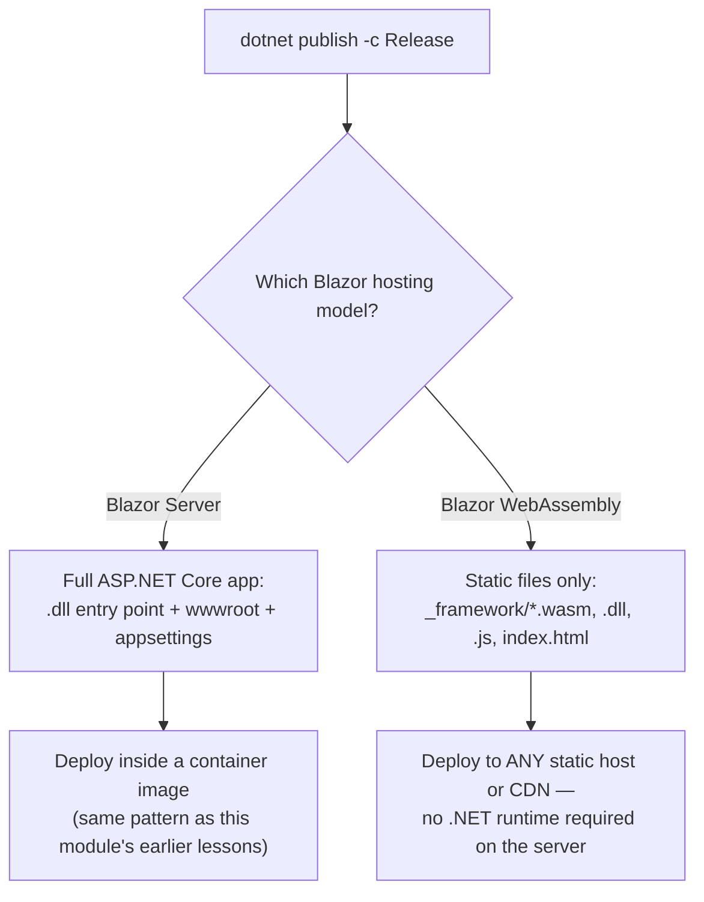
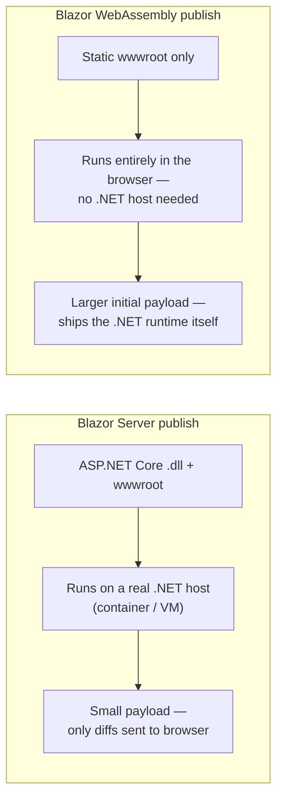

# Publishing a Blazor App

## Introduction

Before reading this lesson, you should already be comfortable with **[Container Health Checks and Readiness Probes](../15-containers-blazor-maui/15-15-container-health-checks.md)**, and with the earlier Blazor lessons in this module that introduced Blazor Server and Blazor WebAssembly as two different hosting models for the same component model. Every earlier lesson in this module has, at some point, produced something running — a container, a health endpoint, a live component tree. This lesson asks a different question: once a Blazor app is finished, how does it actually leave your machine and reach a user? The answer turns out to depend entirely on which of the two hosting models you built, and that dependency is exactly what this lesson unpacks.

By the end of this lesson, you will be able to:

- Explain what `dotnet publish` produces for a Blazor Server app versus a Blazor WebAssembly app
- Publish a Blazor Server app as a deployable ASP.NET Core artifact, ready for the container images built earlier in this module
- Publish a Blazor WebAssembly app to a folder of static files servable from any static host
- Identify why a Blazor WebAssembly app's initial payload is larger than a Server app's, and which publish-time settings shrink it
- Configure Brotli/gzip compression so a CDN serves a published WebAssembly app efficiently
- Recognize when a published Blazor Server app is simply another ASP.NET Core container image, using patterns already covered earlier in this module

## Publishing a Blazor App — A Layman's Perspective

Picture two very different restaurants, both serving the exact same menu, and imagine what it would take to franchise each one to a new neighborhood. The first restaurant has a live chef in the kitchen who prepares every dish to order, the instant a customer asks for it. To franchise this restaurant, you don't ship food anywhere — you ship the entire operating kitchen: the equipment, the recipes, the trained staff, everything needed to actually cook, and you install that whole kitchen at a real location with plumbing, gas lines, and electricity already in place. Every single customer who ever eats there is, in effect, placing a live order with that specific kitchen, over and over, for as long as they're seated at the table. If the kitchen goes down, or the customer's table loses its connection to it, nothing gets served until that connection comes back.

The second restaurant works completely differently. Instead of a live kitchen, it sells meal kits — a sealed box containing every ingredient, every utensil, and a detailed recipe card, packed once at a central facility and then shipped out to be assembled and "cooked" entirely on the customer's own kitchen counter. Franchising this one doesn't mean installing a kitchen anywhere at all — it means packing boxes, and then handing those boxes to absolutely any delivery service, any warehouse, any corner store willing to stock them. The box takes longer to arrive than a single plated dish would, because it's carrying everything needed to make many dishes, not just tonight's order — but once it lands on the counter, the customer's own kitchen does all the cooking from that point forward, with no further deliveries required for that meal. And because it's just a sealed box sitting on a shelf, it doesn't need a real kitchen behind it at all — a random shelf in a random building, anywhere in the world, is a perfectly good place to store it and hand it out.

These two restaurants are exactly Blazor's two hosting models, seen through the lens of what "publishing" them actually means. A Blazor Server app is the live kitchen: publishing it produces a running ASP.NET Core service that must be installed somewhere with a real server behind it — a container, a VM, anywhere capable of keeping a kitchen running and a connection open to every customer currently being served. A Blazor WebAssembly app is the meal-kit box: publishing it produces a folder of self-contained static files that can be handed to any shelf at all — a plain file server, a content delivery network, a free static-hosting service — with zero cooking capability required from that shelf, because the customer's own browser does all the work once the box has fully arrived.

## Publishing a Blazor App — A Programming Language Perspective

`dotnet publish` compiles a project in `Release` configuration and produces the specific artifacts needed to *run* the app somewhere other than your development machine — distinct from `dotnet build`, which merely produces binaries for local testing. For a **Blazor Server** app, `dotnet publish` produces exactly what any ASP.NET Core project produces: an entry-point assembly, an `appsettings.json`, and a `wwwroot` of static assets — deployable using the same container and multi-stage Docker build patterns already covered earlier in this module, because a Blazor Server app *is* an ASP.NET Core app; its components just happen to render over a persistent SignalR circuit instead of returning HTML per request. For a **Blazor WebAssembly** app, `dotnet publish` produces something categorically different: a `wwwroot` folder containing `index.html`, a `_framework` directory holding the compiled .NET runtime itself compiled to WebAssembly (`dotnet.wasm`), your app's assemblies as `.dll` files, and a `blazor.boot.json` manifest the browser uses to fetch and initialize everything — no server-side .NET runtime is required to host any of it.

## How to Publish Each Blazor Hosting Model

Both models publish through the same command, `dotnet publish -c Release`, but the framework inspects the project's hosting model and produces one of two entirely different artifact shapes as a result — a running service in one case, a folder of static files in the other.


*Figure 1: The same publish command branches into two entirely different artifact shapes, depending on the Blazor hosting model.*

```csharp
// Program.cs — .NET 10 / C# 14 — Blazor WebAssembly host entry point
using Microsoft.AspNetCore.Components.Web;
using Microsoft.AspNetCore.Components.WebAssembly.Hosting;

WebAssemblyHostBuilder builder = WebAssemblyHostBuilder.CreateDefault(args);
builder.RootComponents.Add<App>("#app");
builder.RootComponents.Add<HeadOutlet>("head::after");

builder.Services.AddScoped(sp => new HttpClient
{
    BaseAddress = new Uri(builder.HostEnvironment.BaseAddress)
});

await builder.Build().RunAsync();
```

```text
> dotnet publish -c Release -o ./publish-output

Restored /src/BlazorCatalog.csproj
BlazorCatalog -> /src/bin/Release/net10.0/BlazorCatalog.dll
Optimizing assemblies for size, which may change the behavior of the app. ...
Compressing Blazor WebAssembly publish artifacts. This may take a while...
BlazorCatalog (Blazor output) -> /src/bin/Release/net10.0/wwwroot
BlazorCatalog -> /src/publish-output/

publish-output/wwwroot/
├── index.html
├── css/app.css
└── _framework/
    ├── blazor.boot.json
    ├── dotnet.wasm
    ├── dotnet.js
    └── BlazorCatalog.dll
```

Nothing in that `publish-output/wwwroot` folder is server-specific — no `.exe`, no `.dll` the *server* needs to execute. Every file there is downloaded once by the browser and executed inside it. The `_framework` folder is the meal-kit box from the analogy: the .NET runtime itself, compiled to WebAssembly, shipped alongside your own app code so the browser can run both without any server-side .NET installation at all.

## Real-Time Example: Publishing the E-Commerce Order Tracker

We extend the E-Commerce Order Processing domain, specifically the `Order` and checkout API this module containerized in an earlier lesson. Alongside that API, the team has built two Blazor front ends against it: an internal **Order Admin Dashboard** (Blazor Server, used only by warehouse staff on the corporate network) and a public-facing **Order Status Tracker** (Blazor WebAssembly, used by any customer checking on their order from any browser, anywhere). Publishing each one looks different, precisely because of what each artifact needs to run.

```csharp
// OrderTrackingService.cs — .NET 10 / C# 14 — used by the Blazor WebAssembly Order Status Tracker
public sealed class OrderTrackingService(HttpClient http)
{
    public async Task<OrderStatusResult> GetStatusAsync(string orderId)
    {
        OrderStatusResult? result = await http.GetFromJsonAsync<OrderStatusResult>(
            $"/api/orders/{orderId}/status");

        return result ?? new OrderStatusResult(orderId, "Unknown", DateTimeOffset.UtcNow);
    }
}

public sealed record OrderStatusResult(string OrderId, string Status, DateTimeOffset AsOfUtc);
```

```text
> cd OrderStatusTracker
> dotnet publish -c Release -o ./dist

BlazorWebAssembly.Sdk: Compressing 6 assets with Brotli, 6 assets with gzip...
   dotnet.wasm            1,842 KB -> 621 KB (Brotli)
   OrderStatusTracker.dll    38 KB ->  14 KB (Brotli)
OrderStatusTracker -> /src/dist/

> cd ../OrderAdminDashboard
> dotnet publish -c Release -o ./dist

OrderAdminDashboard -> /src/dist/OrderAdminDashboard.dll
OrderAdminDashboard -> /src/dist/  (wwwroot + appsettings.json included)
```

The `OrderStatusTracker`'s `dist` folder is copied — as-is, with no server process attached — straight onto a static file host or a CDN, exactly like the meal-kit box handed to any shelf. The `OrderAdminDashboard`'s `dist` folder instead becomes the contents of a container image, built with the same `Dockerfile` pattern this module used for the checkout API, because a Blazor Server app is an ASP.NET Core app first and a Blazor app second. Two publish commands, two artifact shapes, one shared checkout API underneath both.

## Blazor Server Publish vs Blazor WebAssembly Publish

The core distinction is where the published artifact needs to *run*. A Blazor Server publish output is inert without a real ASP.NET Core host process behind it — there is no meaningful way to "just open" its `.dll` in a browser. A Blazor WebAssembly publish output is inert without a browser in front of it — there is no server-side process to start at all, only files to serve. That difference cascades into everything about how each gets deployed, cached, and scaled, and it's why WASM's `wwwroot` foreshadows a hosting option this curriculum returns to directly in Module 16: an **Azure Static Web App**, which does nothing but serve exactly this kind of folder, globally, from edge locations close to each visitor.

The other consequence worth planning for at publish time is size. A Blazor Server publish output is small — the browser only ever receives HTML diffs and a thin JavaScript interop layer, because all real computation happens on the server. A Blazor WebAssembly publish output must ship an entire .NET runtime to the browser before a single line of app code can run, which is why `dotnet publish` automatically Brotli- and gzip-compresses `_framework` assets, and why a CDN in front of a WASM deployment — caching those content-hashed, rarely-changing runtime files aggressively while caching `index.html` itself only briefly — meaningfully improves the experience for every visitor after the very first one.


*Figure 2: Two publish outputs that solve the same UI problem with opposite trade-offs between where computation happens and how much must be downloaded up front.*

| Aspect | Blazor Server publish | Blazor WebAssembly publish |
|---|---|---|
| What's produced | ASP.NET Core `.dll` + `wwwroot` + `appsettings.json` | Static `wwwroot` only — no server executable |
| Where it runs | On a real .NET host (container, VM) | Entirely inside the visitor's browser |
| Requires a .NET runtime on the host? | Yes | No — the runtime ships inside `_framework` |
| Initial payload | Small — no runtime download | Larger — includes the WASM-compiled .NET runtime |
| Typical deploy target | Container image, App Service, Kubernetes | Any static host or CDN (foreshadows Azure Static Web Apps) |

## Types of Blazor Deployment Concepts Covered Across This Module

1. **[Blazor Server Fundamentals](../15-containers-blazor-maui/15-05-blazor-server-fundamentals.md)** — the hosting model whose publish output is a full ASP.NET Core service.
2. **[Blazor WebAssembly Fundamentals](../15-containers-blazor-maui/15-06-blazor-webassembly-fundamentals.md)** — the hosting model whose publish output is static files only.
3. **[Blazor Server vs Blazor WebAssembly — Comparison](../15-containers-blazor-maui/15-08-blazor-server-vs-wasm.md)** — the runtime-level trade-offs that this lesson's publish-time trade-offs mirror.
4. **[Dockerizing an ASP.NET Core Application](../15-containers-blazor-maui/15-02-dockerizing-aspnetcore-app.md)** — the container pattern a published Blazor Server app slots directly into.
5. **[Multi-Stage Docker Builds for .NET](../15-containers-blazor-maui/15-14-multi-stage-docker-builds.md)** — how a Blazor Server publish output becomes a small, production-ready image layer.
6. **[Publishing a MAUI App](../15-containers-blazor-maui/15-17-publishing-a-maui-app.md)** — next lesson, where publishing gets platform-specific in an entirely different way.

## What You've Learned & What's Next

`dotnet publish` doesn't produce one universal artifact for Blazor — it produces a running ASP.NET Core service for Blazor Server, deployable exactly like every other containerized app this module has built, or a folder of self-contained static files for Blazor WebAssembly, deployable to any host or CDN willing to serve files, with compression and caching strategy determining how quickly that larger initial payload reaches a first-time visitor.

Continue your learning journey with **[Publishing a MAUI App](../15-containers-blazor-maui/15-17-publishing-a-maui-app.md)**, where publishing gets more complicated still — not because the artifact is bigger, but because there are three distinct native platforms, each with its own package format, its own signing requirements, and its own distribution channel.

---
*Applies to: .NET 10 / C# 14. Last reviewed 2026-08-16.*
