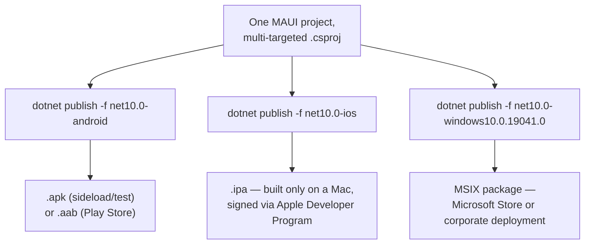
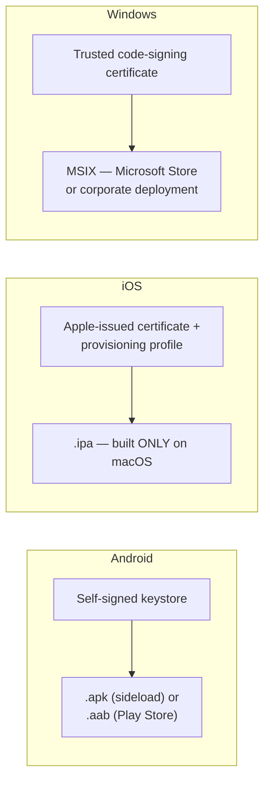

# Publishing a MAUI App

## Introduction

Before reading this lesson, you should already be comfortable with **[Publishing a Blazor App](../15-containers-blazor-maui/15-16-publishing-a-blazor-app.md)**, where a single `dotnet publish` command branched into exactly two possible artifact shapes depending on the Blazor hosting model. MAUI publishing takes that same idea — one project, more than one possible output — and multiplies it by three, because a MAUI app doesn't target "the browser" or "a server," it targets real operating systems, each with its own packaging format, its own signing rules, and its own gatekeeper deciding whether the result may reach a device at all.

By the end of this lesson, you will be able to:

- Explain why MAUI publishing is platform-specific rather than a single universal output
- Publish a MAUI app for Android as an `.apk` for direct testing and as an `.aab` for Play Store submission
- Explain why publishing for iOS requires a Mac and an active Apple Developer Program enrollment
- Publish a MAUI app for Windows as an MSIX package
- Target a specific platform at publish time using framework monikers such as `net10.0-android`
- Describe, at a conceptual level, what app store submission requires — signing, provisioning, and a store listing — without performing a full store-submission walkthrough

## Publishing a MAUI App — A Layman's Perspective

Imagine a manufacturer with one finished product design, ready to sell in three different countries, and discovering that "shipping it" means three completely different customs processes rather than one shared shipping label. The product itself doesn't change — the factory floor, the materials, the assembly line are identical everywhere — but the paperwork required before any single unit can legally reach a shelf in each country is entirely its own.

For the first country, the manufacturer fills out a standard export form, has the crate stamped by any licensed inspector, and can then either hand a crate straight to a local shop directly, or route it through the country's official retail warehouse network for wider distribution — either path works, and the manufacturer chooses depending on how widely they want that particular batch available. For the second country, the rules are far stricter: crates bound for this country can only be inspected and stamped at one specific certified facility, physically located inside that country's own borders, run by an inspector who must personally be enrolled with that country's trade authority before they're allowed to stamp anything at all — no other facility on Earth is accepted as a substitute, no matter how similar its equipment. For the third country, there's a third kind of paperwork again — a tamper-evident certification wrapper, recognized specifically by that country's retail authority and by any corporate buyer receiving a bulk shipment directly, neither of which the other two countries' stamps satisfy.

That's the situation a finished MAUI app is in in the real world. The one underlying app doesn't change — the same C# code, the same XAML pages, the same view models. But turning it into something a phone or a laptop will actually install requires three unrelated, non-interchangeable certification processes. Android's process is comparatively open: sign the package yourself with your own key, and you can hand it to a device directly for testing, or submit it through Google's store for wider distribution — your choice. iOS's process is the strict one: an app destined for an iPhone can only be built, signed, and packaged on Apple's own hardware — a Mac — by a developer enrolled in Apple's official developer program, with no substitute build environment accepted, ever, regardless of how good the code is. Windows has its own third certification wrapper, a package format recognized by the Microsoft Store and by IT departments deploying software directly to company laptops, which again satisfies neither of the other two platforms' requirements. Three shelves, three completely separate sets of paperwork, one product.

## Publishing a MAUI App — A Programming Language Perspective

A MAUI project is *multi-targeted*: its `.csproj` lists several target framework monikers (TFMs) such as `net10.0-android`, `net10.0-ios`, and `net10.0-windows10.0.19041.0`, and `dotnet publish` must be told which one to build for with the `-f` flag, since there is no single "MAUI binary" the way there is a single Blazor WebAssembly `wwwroot`. Publishing for **Android** with `dotnet publish -f net10.0-android -c Release` produces either an `.apk` (installable directly on a device for testing, or sideloaded outside any store) or, with packaging properties set, an `.aab` (Android App Bundle, the format Google Play requires for store submission) — both require the package to be signed with a keystore before a real device will trust it. Publishing for **iOS** with `dotnet publish -f net10.0-ios -c Release` produces a signed `.ipa`, but this build can only run to completion on macOS with Xcode installed, using a code-signing certificate and provisioning profile issued through an active Apple Developer Program membership — even from Visual Studio on Windows, this step is executed by pairing to a networked Mac. Publishing for **Windows** with `dotnet publish -f net10.0-windows10.0.19041.0 -c Release` produces an MSIX package, Windows's own signed, tamper-evident installer format.

## How to Publish a MAUI App for Each Platform

Each platform's publish command shares the same shape — `dotnet publish -f <TFM> -c Release` — but the TFM you choose determines which platform-specific toolchain runs underneath it, and each toolchain expects its own signing material before it will finish successfully.


*Figure 1: One multi-targeted project, three independent publish commands, three unrelated package formats.*

```xml
<!-- BankMobile.csproj — excerpt showing multi-targeting and Android signing -->
<PropertyGroup>
  <TargetFrameworks>net10.0-android;net10.0-ios;net10.0-windows10.0.19041.0</TargetFrameworks>
  <ApplicationTitle>Bank Mobile</ApplicationTitle>
  <ApplicationId>com.northwind.bankmobile</ApplicationId>
</PropertyGroup>

<PropertyGroup Condition="'$(TargetFramework)'=='net10.0-android'">
  <AndroidKeyStore>true</AndroidKeyStore>
  <AndroidSigningKeyStore>bankmobile-release.keystore</AndroidSigningKeyStore>
  <AndroidSigningKeyAlias>bankmobile</AndroidSigningKeyAlias>
</PropertyGroup>
```

```text
> dotnet publish -f net10.0-android -c Release

Restored /src/BankMobile.csproj (net10.0-android)
BankMobile -> /src/bin/Release/net10.0-android/BankMobile.dll
Signing BankMobile.apk with keystore 'bankmobile-release.keystore'...
BankMobile -> /src/bin/Release/net10.0-android/publish/com.northwind.bankmobile-Signed.apk
```

The `-Signed.apk` at the end of that path is the artifact a device will actually accept — an unsigned build produced without the keystore properties would install for local debugging only, never on a device outside development mode. Switching the `-f` flag to `net10.0-ios` or `net10.0-windows10.0.19041.0` reuses the exact same source project but hands control to a completely different platform toolchain underneath.

## Real-Time Example: Publishing the Banking/ATM Mobile App

We extend the Banking/ATM domain, specifically the `Account` and `Transaction` types this curriculum has built up around ATM and online banking scenarios in earlier modules. The bank's mobile team has built **Bank Mobile**, a MAUI app letting customers check balances and review recent transactions from their phone, and now needs to get it in front of real customers on both major mobile platforms.

```csharp
// AccountSummaryService.cs — .NET 10 / C# 14 — shared across all three MAUI targets
public sealed class AccountSummaryService(HttpClient http)
{
    public async Task<AccountSummary> GetSummaryAsync(string accountId)
    {
        AccountSummary? summary = await http.GetFromJsonAsync<AccountSummary>(
            $"/api/accounts/{accountId}/summary");

        return summary ?? throw new InvalidOperationException(
            $"Account '{accountId}' could not be retrieved.");
    }
}

public sealed record AccountSummary(string AccountId, decimal Balance, int RecentTransactionCount);
```

```text
> dotnet publish -f net10.0-android -c Release
BankMobile -> .../publish/com.northwind.bankmobile-Signed.apk   (18.4 MB)
   Ready for: direct install on a test device, or upload to Google Play Console (.aab variant)

> dotnet publish -f net10.0-android -c Release -p:AndroidPackageFormat=aab
BankMobile -> .../publish/com.northwind.bankmobile-Signed.aab   (16.1 MB)
   Ready for: Google Play Console submission

> dotnet publish -f net10.0-ios -c Release
   (requires a paired or networked Mac with Xcode + an Apple Developer Program certificate)
BankMobile -> .../publish/BankMobile.ipa
   Ready for: TestFlight or App Store Connect submission
```

The same `AccountSummaryService` class, and the same underlying banking API, back all three published artifacts — nothing about the account balance logic changes per platform. What changes entirely is the box each platform demands before it will let that logic anywhere near a real customer's device: Android accepts a self-signed `.apk` for testing today and an `.aab` for the Play Store tomorrow; iOS accepts nothing at all until it has passed through Apple's own signing infrastructure on Apple's own hardware.

## Android vs iOS vs Windows Publish Requirements

The three platforms don't just use different file extensions — they encode fundamentally different levels of gatekeeping before a build can reach a user. Android is the most permissive: you sign the package yourself, with your own keystore, and Android does not require that signing to happen through any particular vendor-controlled service — a valid signature from *any* keystore satisfies a device, which is why direct sideloading (installing an `.apk` outside any store) is a normal, supported workflow, not a hack. iOS inverts that entirely: no build can be signed, and no signature will be trusted by a device, unless it was produced under a certificate and provisioning profile issued by Apple itself to a specific, paid Apple Developer Program membership — and that signing step can only be executed on macOS, which is why teams building MAUI apps on Windows still need a Mac somewhere in the pipeline (physically, in the cloud, or paired over the network) purely for this one step. Windows's MSIX format sits in between: it requires a valid code-signing certificate, but that certificate can come from a recognized certificate authority the team already trusts, without requiring Apple-style pre-enrollment for every build.

None of this lesson is a substitute for each store's own submission documentation — app store review guidelines, screenshots, privacy disclosures, and pricing all change independently of anything covered here. What matters at the publishing level is simply this: know, before you start, which of the three packaging pipelines your target platform demands, and whether your build environment is even capable of producing it.


*Figure 2: Three publish pipelines for one MAUI project, each gatekept by a different signing authority.*

| Aspect | Android (.apk / .aab) | iOS (.ipa) | Windows (MSIX) |
|---|---|---|---|
| Package format | `.apk` (direct) or `.aab` (store) | `.ipa` | `.msix` / `.msixbundle` |
| Signing requirement | Self-managed keystore | Apple-issued certificate + provisioning profile | Trusted code-signing certificate |
| Build machine requirement | Any (Windows, Mac, Linux) | macOS with Xcode, always | Any (Windows recommended) |
| Primary distribution channel | Google Play Console | App Store Connect / TestFlight | Microsoft Store or corporate deployment |
| Sideloading/testing without a store | Yes — install the `.apk` directly | Limited — TestFlight or a registered test device | Yes — direct MSIX install with a trusted cert |

## Types of MAUI Concepts This Publishing Step Builds On

1. **[Introduction to .NET MAUI](../15-containers-blazor-maui/15-09-introduction-to-maui.md)** — the framework whose single project this lesson published to three platforms.
2. **[MAUI Cross-Platform UI Basics](../15-containers-blazor-maui/15-10-maui-cross-platform-ui-basics.md)** — the shared UI layer that stays identical across every published package.
3. **[MAUI Data Binding and MVVM](../15-containers-blazor-maui/15-11-maui-data-binding-and-mvvm.md)** — the pattern behind services like `AccountSummaryService` in this lesson's example.
4. **[MAUI vs Blazor Hybrid — Comparison](../15-containers-blazor-maui/15-12-maui-vs-blazor-hybrid.md)** — a third MAUI-adjacent option with its own publishing implications.
5. **[Publishing a Blazor App](../15-containers-blazor-maui/15-16-publishing-a-blazor-app.md)** — the previous lesson's contrasting, simpler two-way publish split.
6. **[Choosing Blazor vs MAUI vs ASP.NET Core — Decision Guide](../15-containers-blazor-maui/15-18-choosing-blazor-maui-aspnetcore.md)** — next lesson, this module's capstone.

## What You've Learned & What's Next

Publishing a MAUI app is never a single command with a single output — it's three independent packaging pipelines, one per platform, each with its own file format, its own signing authority, and its own rules about which build machine is even allowed to produce it, with Android the most permissive, iOS the strictest, and Windows its own separate case in between.

Continue your learning journey with **[Choosing Blazor vs MAUI vs ASP.NET Core — Decision Guide](../15-containers-blazor-maui/15-18-choosing-blazor-maui-aspnetcore.md)**, the capstone of this entire module, where we step back from any single technology and build the decision framework for choosing among all three application models this curriculum has covered.

---
*Applies to: .NET 10 / C# 14. Last reviewed 2026-08-16.*
