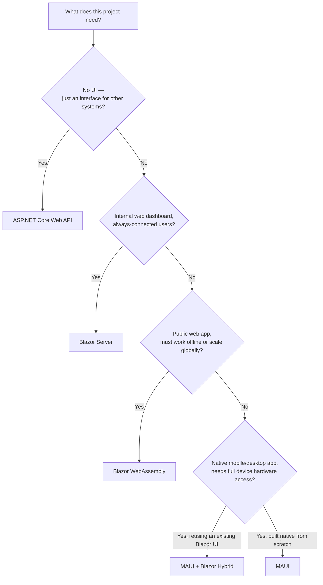
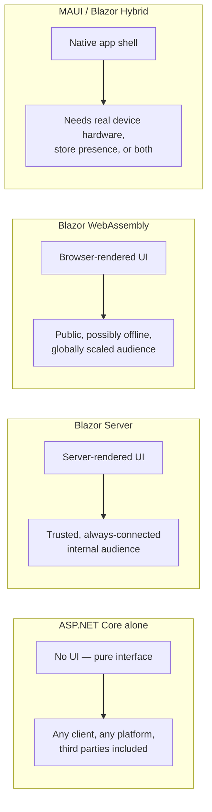

# Choosing Blazor vs MAUI vs ASP.NET Core — Decision Guide

## Introduction

Before reading this lesson, you should already be comfortable with **[Publishing a MAUI App](../15-containers-blazor-maui/15-17-publishing-a-maui-app.md)**, and in truth, with everything this module has built since its very first lesson. This is the eighteenth and final lesson of Module 15, Containers, Blazor & MAUI, and it exists to answer a question every earlier lesson quietly assumed had already been settled: given a new project, which of the application models this module covered should you actually reach for? Not "how does Blazor Server work" or "how do you publish a MAUI app" — those questions are already answered — but the question that comes *before* any of them: ASP.NET Core alone, Blazor Server, Blazor WebAssembly, MAUI, or MAUI with Blazor Hybrid? This lesson is the decision framework across all of Modules 10 and 15 combined, and the bridge into Module 16, where everything you choose here needs somewhere to actually run — Azure.

By the end of this lesson, you will be able to:

- State the underlying question each of the four application models is built to answer
- Choose a pure ASP.NET Core Web API when the consumer is a third party, another service, or an unknown future client
- Choose Blazor Server for an internal, low-latency dashboard, and Blazor WebAssembly for a public, offline-capable web app
- Choose MAUI for a native mobile or desktop app, and recognize when Blazor Hybrid specifically reuses an existing web UI inside that native shell
- Map a realistic set of project scenarios to the correct application model using a single decision table
- Recount, at a high level, how all eighteen lessons of this module — containers, Blazor, MAUI, and publishing — built toward this one decision

## Choosing an Application Model — A Layman's Perspective

Imagine a company deciding how to reach its customers, and picture four completely different ways of doing it, each suited to a different kind of relationship with the person on the other end. The first option is a dedicated phone line, published in a directory, that any partner business can call directly, using whatever phone or system they already own — the company never controls what device is on the other end, only the conversation itself, spoken in a fixed, agreed format both sides understand. The second option is a fully staffed reception desk inside the company's own building — a visitor walks up, and a live employee handles everything for them, in real time, for as long as that visitor stays in the building; the moment they leave the building, the conversation ends, because the employee never actually left with them. The third option is a self-service kiosk the company installs out in the world — at an airport, in a shopping mall — fully stocked and pre-loaded so it keeps working even during a power flicker to the company's own systems, because everything the kiosk needs to serve a customer is already sitting inside it. The fourth option is different again: a small branded shop the company physically builds inside a customer's own neighborhood, permanently theirs, wired into that neighborhood's own utilities and infrastructure — able to use things the phone line and the kiosk simply can't, like a neighborhood's own dedicated fire alarm system or its physical mail slot — with or without ever calling back to headquarters.

Those four are, respectively, a pure API, a Blazor Server app, a Blazor WebAssembly app, and a MAUI app. The phone line is ASP.NET Core alone: no visual front door of its own, just a well-defined interface that any caller — a browser-based app, a mobile app, another company's system entirely — can dial into, each building whatever "phone" they like on their end. The reception desk is Blazor Server: a real, live process inside the company's own building doing all the actual work, serving a visitor beautifully for as long as they're physically present and connected, but useless the instant that connection breaks. The kiosk is Blazor WebAssembly: fully self-contained once installed, running independently of the company's live building, able to keep functioning even without a constant line back to headquarters. And the neighborhood shop is MAUI: the one option built to live permanently on the customer's own turf, with genuine access to that turf's own native infrastructure — a phone's camera, its fingerprint sensor, its own notification system — things none of the other three options can ever fully reach, because none of them are actually installed there.

There is one more variation worth naming: sometimes the company wants that neighborhood shop, but doesn't want to redesign the interior from scratch — instead they ship the exact same interior fittings used in the phone-line-and-kiosk business, and simply mount those same fittings inside a native shop shell so it *also* gets native turf access. That's Blazor Hybrid: MAUI's native shell, wrapped around the very same Blazor UI already built for the web, reused rather than rebuilt. Four fundamentally different relationships with a customer, each one right for a different situation, none of them right for all of them.

## Choosing an Application Model — A Programming Language Perspective

**ASP.NET Core** alone exposes HTTP (or gRPC) endpoints with no UI of its own, consumed by any client capable of speaking that protocol — a browser SPA, a mobile app, or another backend service. **Blazor Server** renders Razor components on the server and streams UI diffs to the browser over a persistent SignalR circuit; the browser holds almost no application state, so the connection must stay open for the app to function at all. **Blazor WebAssembly** compiles the same component model to run entirely inside the browser via WebAssembly, after a one-time download of the .NET runtime itself, and needs no persistent server connection once loaded. **MAUI** compiles XAML-based UI to genuinely native controls per platform, with full access to device and OS APIs, packaged per platform exactly as the previous lesson covered. **Blazor Hybrid** is MAUI's native shell hosting a `BlazorWebView` control that renders an existing Blazor component library locally, in-process, with no network hop at all — reuse of web UI investment inside a native app shell.

## How to Apply the Decision Framework in Code

The framework below isn't just a mental model — it maps directly onto a small piece of decision logic, matching a project's stated need to the model this module recommends for it.


*Figure 1: The decision framework as a sequence of yes/no questions, each one this module built the vocabulary to answer.*

```csharp
// Program.cs — .NET 10 / C# 14
enum ProjectNeed
{
    ThirdPartyApiConsumers,
    InternalWebDashboard,
    PublicOfflineCapableWebApp,
    NativeMobileApp,
    CrossPlatformAppReusingWebUi
}

string Recommend(ProjectNeed need) => need switch
{
    ProjectNeed.ThirdPartyApiConsumers => "ASP.NET Core Web API",
    ProjectNeed.InternalWebDashboard => "Blazor Server",
    ProjectNeed.PublicOfflineCapableWebApp => "Blazor WebAssembly",
    ProjectNeed.NativeMobileApp => "MAUI (native)",
    ProjectNeed.CrossPlatformAppReusingWebUi => "MAUI + Blazor Hybrid",
    _ => "Unknown need -- revisit the requirements"
};

foreach (ProjectNeed need in Enum.GetValues<ProjectNeed>())
{
    Console.WriteLine($"{need} -> {Recommend(need)}");
}
```

**Console Output:**

```text
ThirdPartyApiConsumers -> ASP.NET Core Web API
InternalWebDashboard -> Blazor Server
PublicOfflineCapableWebApp -> Blazor WebAssembly
NativeMobileApp -> MAUI (native)
CrossPlatformAppReusingWebUi -> MAUI + Blazor Hybrid
```

There's nothing exotic in that `switch` expression, and that's exactly the point — the hard part of this decision was never the code, it was correctly naming what a project actually needs before reaching for a technology. Once the need is named precisely, the recommendation nearly writes itself.

## Real-Time Example: One E-Commerce Platform, Four Application Models at Once

We return, one final time, to the E-Commerce Order Processing domain and its `Order` and checkout API — containerized earlier in this module, and already serving traffic. A real e-commerce platform rarely picks just *one* of these four models; it composes several of them around the same backend, each serving a different audience.

```csharp
// PlatformSurfaces.cs — .NET 10 / C# 14 — Real-Time Example (E-Commerce Order Processing)
public sealed record OrderStatusDto(string OrderId, string Status, DateTimeOffset AsOfUtc);

public sealed record PlatformSurface(string Name, string AppModel, string Audience);

PlatformSurface[] surfaces =
[
    new("Partner Integrations", "ASP.NET Core Web API", "Third-party logistics and payment partners"),
    new("Order Admin Dashboard", "Blazor Server", "Warehouse staff on the corporate network"),
    new("Public Order Tracker", "Blazor WebAssembly", "Any customer, any browser, must survive spotty connectivity"),
    new("Delivery Driver App", "MAUI", "Drivers needing GPS, camera, and push notifications on their own phones")
];

Console.WriteLine("Surfaces consuming the shared Order API:");
foreach (PlatformSurface surface in surfaces)
{
    Console.WriteLine($" - {surface.Name,-22} [{surface.AppModel,-22}] -> {surface.Audience}");
}

Console.WriteLine();
Console.WriteLine("All four surfaces consume the same contract:");
Console.WriteLine(new OrderStatusDto("ORD-88421", "OutForDelivery", DateTimeOffset.UtcNow));
```

**Console Output:**

```text
Surfaces consuming the shared Order API:
 - Partner Integrations      [ASP.NET Core Web API   ] -> Third-party logistics and payment partners
 - Order Admin Dashboard     [Blazor Server           ] -> Warehouse staff on the corporate network
 - Public Order Tracker      [Blazor WebAssembly      ] -> Any customer, any browser, must survive spotty connectivity
 - Delivery Driver App       [MAUI                    ] -> Drivers needing GPS, camera, and push notifications on their own phones

All four surfaces consume the same contract:
OrderStatusDto { OrderId = ORD-88421, Status = OutForDelivery, AsOfUtc = 2026-08-16T00:00:00.0000000+00:00 }
```

Notice what stays constant across all four rows: the `OrderStatusDto` contract, and the underlying ASP.NET Core API serving it. What changes is only which *front end* each audience gets, chosen independently for each audience's own constraints — a partner's system doesn't want a UI at all, a warehouse employee wants speed on a trusted network, a customer wants something that survives a shaky mobile signal, and a driver wants their phone's own GPS. This is the real lesson behind the decision framework: it's rarely "pick one model for the whole company," it's "pick the right model for each surface, against one shared backend."

## The Decision Guide: ASP.NET Core vs Blazor vs MAUI

This is the single most important table in the entire module, because every other lesson assumed you already knew which model you were building. The decision rests on two questions asked in sequence: first, *does this surface need a UI at all*, and second, if it does, *where does that UI need to live and what does it need access to*. A "no" to the first question ends the decision immediately at ASP.NET Core, regardless of anything else about the project — building any UI at all for a surface with no human user is pure waste. A "yes" splits further on connectivity and trust: an audience that is always connected and always inside a trusted network favors Blazor Server, because its thin payload and instant server-side data access outweigh its hard dependency on that connection; an audience that might be offline, might be anywhere in the world, or might need to scale to millions of concurrent users without a persistent server-side circuit per user favors Blazor WebAssembly instead, at the cost of a larger first download. Once the need for genuinely native behavior enters the picture — camera access, biometric sensors, background location, push notifications, or simply an app-store presence — Blazor's two web-based flavors stop being sufficient no matter how the connectivity question was answered, and MAUI becomes the only model left standing; whether that MAUI app is built natively from the ground up or wraps an existing Blazor component library inside a `BlazorWebView` depends entirely on whether there's already a web UI worth reusing.

Crucially, none of these four models makes the others obsolete, and the earlier module recap example makes that concrete: a single company can run a public ASP.NET Core API, an internal Blazor Server dashboard, a public Blazor WebAssembly tracker, and a native MAUI driver app, all at once, all against the same backend, each chosen independently for the audience it actually serves. The decision framework isn't "which one wins" — it's "which one wins for *this* surface, *this* audience, *this* set of constraints."


*Figure 2: The four models this module covered, each answering a different combination of "who's the audience" and "what does the UI need access to."*

| Scenario | Recommended Model | Why |
|---|---|---|
| Public API consumed by third-party developers or partner systems | **ASP.NET Core Web API** | No UI needed at all — the contract itself is the product, and the consumer builds their own front end |
| Internal web dashboard used by employees on a trusted corporate network | **Blazor Server** | Thin client, instant server-side data access, connection reliability is a non-issue on an internal network |
| Public-facing web app that must keep working offline or scale to huge numbers of users | **Blazor WebAssembly** | No persistent per-user server connection required; runs entirely client-side once downloaded |
| Native mobile or desktop app needing full OS/hardware access (camera, biometrics, push, GPS) | **MAUI** | Only a true native shell reaches these APIs; neither Blazor flavor can |
| Cross-platform native app that must reuse an existing Blazor web UI rather than rebuild it | **MAUI + Blazor Hybrid** | Native shell for hardware access, `BlazorWebView` reusing the existing component investment, no network hop |

| Aspect | ASP.NET Core alone | Blazor Server | Blazor WebAssembly | MAUI / Blazor Hybrid |
|---|---|---|---|---|
| Ships a UI? | No | Yes | Yes | Yes |
| Runs where | Server only | Server (rendering) + thin browser client | Entirely in the browser | Native OS process on the device |
| Needs a live connection to function? | N/A (stateless per request) | Yes — persistent SignalR circuit | No, after initial load | No (Blazor Hybrid has no network hop at all) |
| Native device/hardware access | N/A | No | No | Yes |
| Covered by publishing lesson | *(container image, Module 15 Lessons 1-3, 13-14)* | **[Publishing a Blazor App](../15-containers-blazor-maui/15-16-publishing-a-blazor-app.md)** | **[Publishing a Blazor App](../15-containers-blazor-maui/15-16-publishing-a-blazor-app.md)** | **[Publishing a MAUI App](../15-containers-blazor-maui/15-17-publishing-a-maui-app.md)** |

## Types of Application Model Building Blocks This Module Covered

1. **[Introduction to Blazor](../15-containers-blazor-maui/15-04-introduction-to-blazor.md)** — where the shared component model behind both Blazor hosting flavors was introduced.
2. **[Blazor Server vs Blazor WebAssembly — Comparison](../15-containers-blazor-maui/15-08-blazor-server-vs-wasm.md)** — the runtime-level trade-offs this lesson's decision table condenses into one row each.
3. **[Introduction to .NET MAUI](../15-containers-blazor-maui/15-09-introduction-to-maui.md)** — where native, cross-platform UI entered the picture.
4. **[MAUI vs Blazor Hybrid — Comparison](../15-containers-blazor-maui/15-12-maui-vs-blazor-hybrid.md)** — the finer-grained decision this lesson's fifth scenario relies on.
5. **[Publishing a Blazor App](../15-containers-blazor-maui/15-16-publishing-a-blazor-app.md)** and **[Publishing a MAUI App](../15-containers-blazor-maui/15-17-publishing-a-maui-app.md)** — how each chosen model actually reaches a user, covered in the two lessons immediately before this one.
6. **[Introduction to Azure for .NET Developers](../16-azure-for-dotnet-developers/16-01-introduction-to-azure-for-dotnet.md)** — next lesson, opening Module 16, where every one of these published artifacts finally needs somewhere real to live.

## What You've Learned & What's Next — Module 15 Recap

Read end to end, Module 15's eighteen lessons tell one continuous story about getting a .NET application in front of users, in whatever shape that application takes. It opened with containers (Lessons 1–3): Docker fundamentals, dockerizing an ASP.NET Core app, and Compose for multi-container setups — the packaging foundation everything after it would eventually rest on. It then introduced Blazor (Lessons 4–8): the shared component model, its two hosting flavors, data binding, and the comparison between them. It moved to MAUI (Lessons 9–12): cross-platform native UI, data binding and MVVM, and the comparison against Blazor Hybrid. Lessons 13–15 brought containers and Blazor/MAUI back together in practice: containerizing the order API as a real-time example, multi-stage builds for lean production images, and health checks so a container can prove it's actually ready to serve traffic. Lessons 16–17, immediately before this one, closed the loop on deployment itself — publishing a Blazor app, and publishing a MAUI app across three entirely different native platforms. This lesson is where all of it converges: not one more technology, but the framework for choosing correctly among every technology the module covered, for whichever audience a given surface actually serves.

Continue your learning journey with **[Introduction to Azure for .NET Developers](../16-azure-for-dotnet-developers/16-01-introduction-to-azure-for-dotnet.md)**, the first lesson of Module 16, where the focus shifts one level up again — from choosing and packaging an application to giving it a real, production home in the cloud.

---
*Applies to: .NET 10 / C# 14. Last reviewed 2026-08-16.*
