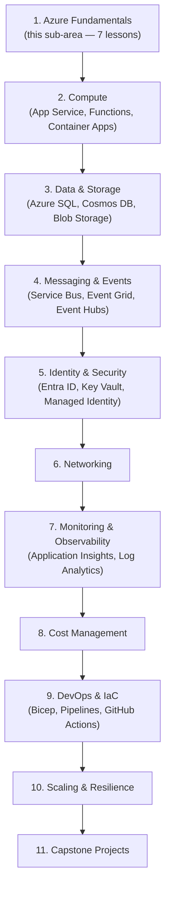
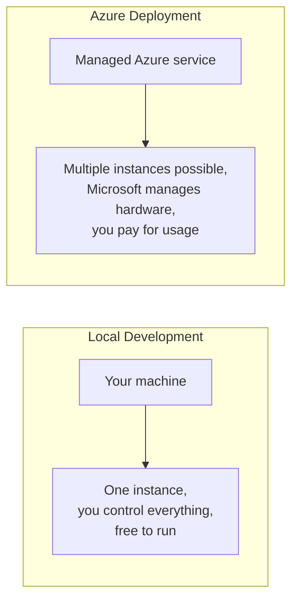

# Introduction to Azure for .NET Developers

## Introduction

Before reading this lesson, you should already be comfortable with **[Choosing Blazor vs MAUI vs ASP.NET Core — Decision Guide](../15-containers-blazor-maui/15-18-choosing-blazor-maui-aspnetcore.md)**, and really with everything the curriculum has built up to this point: language fundamentals, object-oriented design, collections, LINQ, async and concurrency, memory, files, ASP.NET Core, EF Core, gRPC and SignalR, and finally how to package an application as a container, a Blazor app, or a MAUI app. Every one of those lessons ended with something runnable on your own machine. This module asks the next question: where does it run for everyone else? That is what Azure is for, and this lesson opens Module 16 — Azure for .NET Developers, the largest module in this curriculum at 78 lessons — with a map of where we're headed before we take the first step.

By the end of this lesson, you will be able to:

- Explain what Azure is and what "the cloud" actually means in concrete, non-marketing terms
- Explain why a .NET curriculum treats a cloud module as its natural conclusion rather than an optional add-on
- Name the category of problem Azure solves that a single developer machine cannot
- Describe, at a high level, the 11 sub-areas this 78-lesson module is organized into
- Identify where in the module a given Azure topic (compute, data, messaging, security, cost, DevOps) will be covered

## Azure — A Layman's Perspective

Imagine you've spent months building a beautiful restaurant kitchen in your garage. You've got the layout right, the recipes perfected, the staff trained, everything tested and working exactly as intended. There's just one problem: it's in your garage. No customer can walk in off the street, the power goes out whenever a storm hits your neighborhood specifically, and if a hundred people show up at once, there's exactly one stove to cook for all of them. Everything you built is genuinely good — it's just built in a place that was never meant to serve the public.

Now imagine instead that you could rent space in a professional commercial kitchen facility, one of thousands spread across the world, each with its own backup generators, its own fire suppression, its own security, its own staff monitoring the equipment around the clock. You don't own the building. You don't maintain the generators. You don't hire the security guards. You just rent exactly the amount of kitchen space you need this week, and if next month you suddenly need to cook for ten times as many customers, you rent more space in the same facility, right now, without waiting for a construction crew. If your usual facility has a problem, there's an identical one in the next city over you can lean on instead. You pay only for what you actually use, and you can shut it down the moment you stop needing it.

That commercial kitchen facility is Azure — or any public cloud, for that matter. Microsoft built and maintains enormous physical data centers, all over the world, stocked with computers, storage, and networking equipment, and then rents out precise, adjustable slices of that capacity to anyone with an account and a credit card. You don't buy servers. You don't run network cables. You don't replace a failed hard drive at 3 a.m. You describe what you need — "a place to run my web app," "a database," "a place to store uploaded files" — and Azure hands you a working slice of its infrastructure within seconds to minutes, billed by the hour or even by the second.

This matters to you as a .NET developer for a very ordinary reason: everything you've built across this entire curriculum has, until now, lived on one machine — yours. A console app, a class library, even a containerized ASP.NET Core API, all of it has been running on your laptop or a single test machine, reachable only by you. The moment a real person other than you needs to use what you've built, it needs a home that's always on, reachable from anywhere, resilient to a single machine failing, and able to grow when demand grows. That home, for the overwhelming majority of production .NET applications today, is a cloud platform — and for a .NET developer specifically, that is very often Azure, because of how deeply it integrates with the tools, languages, and identity systems .NET already uses.

This lesson, and the 77 that follow it in this module, are about learning to rent — and correctly configure — space in that commercial kitchen.

## Azure — A Programming Language Perspective

**Azure** is Microsoft's public cloud platform: a globally distributed set of data centers exposing compute, storage, networking, database, messaging, identity, and monitoring services through a consistent management layer, **Azure Resource Manager (ARM)**, itself reachable via the Azure Portal, the `az` command-line interface, Azure PowerShell, and native SDKs including `Azure.*` NuGet packages for .NET. Everything you provision in Azure is represented as an ARM **resource** — a VM, a database, a storage account — grouped into **resource groups** within a **subscription**, the billing and access-control boundary. For .NET specifically, Azure offers first-class SDK support, Visual Studio and Visual Studio Code tooling, and managed services — App Service, Azure Functions, Azure SQL, Azure Container Apps, among many others — purpose-built to host ASP.NET Core, Blazor, and containerized workloads with minimal reconfiguration from what you've already built.

## How This Module Is Organized

Before diving into specific services, it's worth seeing the whole map. Module 16 is deliberately the largest module in this curriculum — 78 lessons — because "deploy it to Azure" is not one skill but a family of related skills: provisioning, compute hosting choices, data, messaging, identity, monitoring, cost control, and the DevOps pipelines that tie it all together. The diagram below shows how those pieces fit together as sub-areas, roughly in the order this module covers them.


*Figure 1: The 11 sub-areas of Module 16, building from fundamentals through compute, data, and security, into DevOps and full deployment capstones.*

Rather than a single runnable C# example, this lesson's "how-to" is the roadmap itself — a lookup table showing which sub-area to expect a given concern in, expressed as a small piece of illustrative Azure CLI output confirming you have a working account to build all of it on top of.

```bash
# Confirm you have an active Azure subscription before this module continues
az account show --output table
```

**Illustrative Azure CLI Output:**

```text
Name                              CloudName    SubscriptionId                        State    IsDefault
---------------------------------  -----------  ------------------------------------  -------  -----------
Pay-As-You-Go                     AzureCloud   3f2504e0-4f89-11d3-9a0c-0305e82c3301  Enabled  True
```

That single command — confirming an active, enabled subscription — is the prerequisite every remaining lesson in this module quietly assumes. Lesson 2 shows exactly how to reach this point from a fresh account, using the Portal, the CLI, or PowerShell, whichever fits your workflow.

## Real-Time Example: Where the E-Commerce Order API Ends Up

Across earlier modules, the E-Commerce Order Processing domain grew from plain `Order` and `Customer` classes into a containerized ASP.NET Core Web API, tested locally with Docker Compose and health checks. Concretely, this module will take that exact same container image and give it: a managed compute host that restarts it automatically if it crashes (Compute sub-area), a real database instead of a local SQL Server container (Data & Storage), a way to notify a shipping partner when an order ships without a synchronous HTTP call (Messaging & Events), a way to authenticate warehouse staff without hand-rolled passwords (Identity & Security), dashboards showing request latency and error rates in production (Monitoring), a monthly cost you can predict and cap (Cost Management), and a pipeline that redeploys automatically whenever the team pushes new code (DevOps & IaC).

```csharp
// OrderApiDeploymentTargets.cs — .NET 10 / C# 14 — Real-Time Example (E-Commerce Order Processing)
public sealed record DeploymentConcern(string SubArea, string AzureService, string Solves);

DeploymentConcern[] concerns =
[
    new("Compute", "Azure Container Apps", "Always-on hosting for the order API container"),
    new("Data & Storage", "Azure SQL Database", "Replaces the local SQL Server container"),
    new("Messaging & Events", "Azure Service Bus", "Notify shipping partners without blocking the API"),
    new("Identity & Security", "Microsoft Entra ID", "Authenticate warehouse staff and partner services"),
    new("Monitoring", "Application Insights", "See latency and errors once real traffic arrives"),
    new("Cost Management", "Azure Cost Management + Budgets", "Predictable, capped monthly spend"),
    new("DevOps & IaC", "GitHub Actions + Bicep", "Automatic, repeatable redeployment")
];

Console.WriteLine("Order API — production concerns and where this module addresses each:");
foreach (DeploymentConcern c in concerns)
{
    Console.WriteLine($" - [{c.SubArea,-20}] {c.AzureService,-28} -> {c.Solves}");
}
```

**Console Output:**

```text
Order API — production concerns and where this module addresses each:
 - [Compute             ] Azure Container Apps         -> Always-on hosting for the order API container
 - [Data & Storage       ] Azure SQL Database           -> Replaces the local SQL Server container
 - [Messaging & Events    ] Azure Service Bus            -> Notify shipping partners without blocking the API
 - [Identity & Security   ] Microsoft Entra ID           -> Authenticate warehouse staff and partner services
 - [Monitoring            ] Application Insights         -> See latency and errors once real traffic arrives
 - [Cost Management       ] Azure Cost Management + Budgets -> Predictable, capped monthly spend
 - [DevOps & IaC          ] GitHub Actions + Bicep       -> Automatic, repeatable redeployment
```

Nothing here is a new class or algorithm — it is a map of the same order API you've already built onto the eleven sub-areas this module will walk through, one concern at a time, so that by the module's end that container is genuinely production-ready rather than merely working on your laptop.

## Local Development vs Cloud Deployment

It's worth being precise about what changes and what doesn't when code moves from your machine to Azure. Your C# code, your class design, your LINQ queries, your async patterns — none of that changes. What changes is everything *around* the code: where it physically runs, how it's reached over the network, how its secrets are stored, how its failures are observed, and who is billed for the electricity and hardware underneath it.


*Figure 2: The same application, before and after it leaves a single developer machine for a managed cloud service.*

| Aspect | Local Development | Azure Deployment |
|---|---|---|
| Who manages the hardware | You | Microsoft |
| Reachable by others? | Only on your network, if at all | Globally, by default (configurable) |
| Cost model | Free (your own machine) | Pay-as-you-go, billed for what you provision/use |
| Failure recovery | Manual — you notice and restart it | Automated restarts, health probes, multiple instances |
| Scaling under load | Limited to your machine's resources | Can add capacity on demand |

## Types of Topics This Module Covers

Module 16's 78 lessons group into the following sub-areas, several of which are large enough to be full mini-curriculums in their own right:

1. **Azure Fundamentals** *(this sub-area, Lessons 1-7)* — the Portal, CLI, PowerShell, ARM, regions, IaC basics, pricing, and the shared responsibility model.
2. **Compute** — App Service, Azure Functions, Container Apps, and Azure Kubernetes Service, covered starting at [Introduction to Azure App Service](../16-azure-for-dotnet-developers/16-08-introduction-to-app-service.md).
3. **Data & Storage** — Azure SQL Database, Cosmos DB, and Blob Storage, extending the EF Core module's local database work into managed cloud data services.
4. **Messaging & Events** — Service Bus, Event Grid, and Event Hubs, building on the delegates/events module's in-process patterns at cloud scale.
5. **Identity & Security** — Microsoft Entra ID, Key Vault, and Managed Identity, replacing hand-rolled authentication with managed platform services.
6. **DevOps & Infrastructure as Code** — Bicep, ARM templates, and CI/CD pipelines, where the brief Bicep introduction in this sub-area's Lesson 5 becomes a full deep-dive.

## What You've Learned & What's Next

Azure is, at its core, rented and managed infrastructure — a way to give the applications you've already built a home that's always on, reachable by anyone, and resilient to failure, without owning or maintaining a single physical machine yourself. This module's 78 lessons exist to teach you, sub-area by sub-area, exactly how to rent that infrastructure correctly for a real .NET application.

Continue your learning journey with **[The Azure Portal, CLI, and PowerShell](../16-azure-for-dotnet-developers/16-02-azure-portal-cli-powershell.md)**, where you'll get hands-on with the three interchangeable tools used to manage every Azure resource this module introduces.

---
*Applies to: .NET 10 / C# 14. Last reviewed 2026-08-16.*
