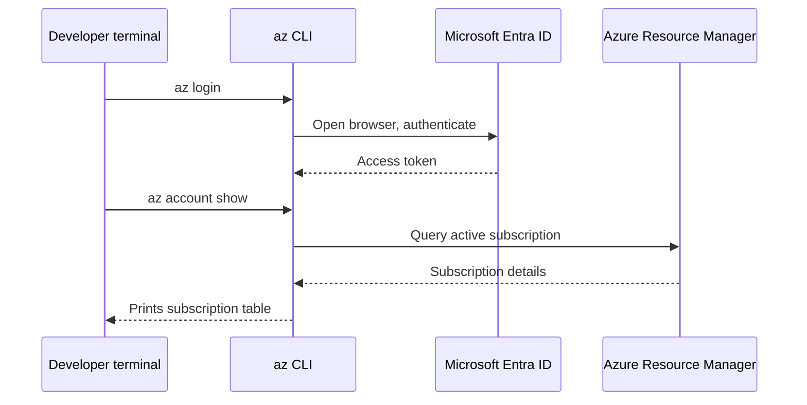
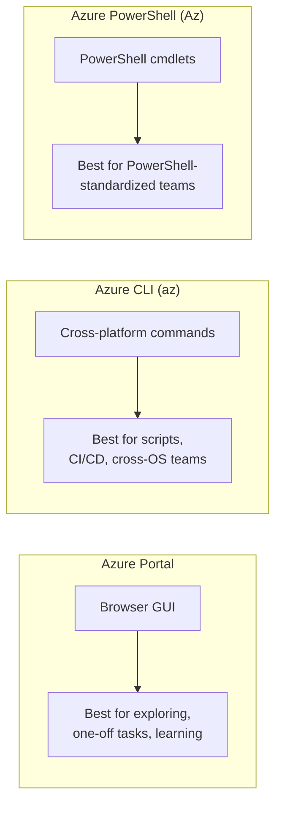

# The Azure Portal, CLI, and PowerShell

## Introduction

Before reading this lesson, you should already be comfortable with **[Introduction to Azure for .NET Developers](../16-azure-for-dotnet-developers/16-01-introduction-to-azure-for-dotnet.md)**, including the idea that Azure resources live behind a single management layer regardless of how you reach them. This lesson introduces the three tools you'll actually use to reach that layer throughout the rest of the module: the Azure Portal, the Azure CLI (`az`), and Azure PowerShell (the `Az` module).

By the end of this lesson, you will be able to:

- Describe what each of the three Azure management tools is and how they relate to one another
- Log in and confirm your active subscription using the CLI
- Explain why all three tools produce identical results underneath, regardless of which one you use
- Choose the right tool for a given task — exploring, scripting, or automating
- Recognize the same resource-group creation task expressed in the Portal, the CLI, and PowerShell

## Managing Azure — A Layman's Perspective

Picture a large self-storage facility with thousands of individual units, and three completely different ways a customer can manage their own unit. The first is walking into the front office in person: a receptionist sits you down at a counter, shows you a visual map of the whole facility, lets you click through pictures of available units, and walks you through renting one, extending a lease, or listing what you currently have rented — all through clicking and pointing, with no need to remember a single command or form field. The second way is calling a dedicated phone line where you speak in a short, precise sentence — "rent unit B-12 for one month" — and the automated system on the other end executes exactly that request instantly, without any menus to click through, and lets you write down a whole list of such sentences in advance to be read out one after another. The third way is nearly identical to the second — another phone line, staffed by an equally capable automated system, that happens to be run by a different department, uses slightly different sentence structures, and is especially convenient if you already spend your whole day talking to that department for other reasons.

These are the Azure Portal, the Azure CLI, and Azure PowerShell, respectively. The Portal is the front office: a visual, browser-based interface where you can see every resource you own laid out as forms, panels, and clickable buttons, ideal the first time you're renting something new and want to see all your options before committing. The CLI is the first phone line: a command typed as `az resource-group create ...` executes immediately and precisely, and because it's just typed text, you can save a whole sequence of such commands in a script file and hand that script to a teammate, a build pipeline, or your future self, to run identically every time. Azure PowerShell is the second phone line — functionally just as capable as the CLI, using PowerShell's own verb-noun command style instead (`New-AzResourceGroup` instead of `az group create`), and it earns its keep specifically for teams that already live inside PowerShell for other infrastructure work, like Windows Server administration, where reusing the same shell, scripting patterns, and object pipeline for Azure too avoids context-switching entirely.

Here's the detail that matters most: none of these three has any authority that the others lack. Every one of them is just a different front door onto the exact same storage facility office — the same underlying inventory of resources, the same account, the same billing. Renting a unit through the phone line and checking on it through the front office the next day shows you the exact same unit, because there was only ever one office being managed, just reached through different doors. That's precisely how the Portal, CLI, and PowerShell relate: three doors onto the one same set of Azure resources, chosen by convenience and habit, never by capability.

The bridge back to code: as a .NET developer, you'll mostly live in the CLI, because its commands are trivially easy to drop into a script, a `Dockerfile`, or a CI/CD pipeline step — exactly the automation-friendly habit this module builds toward.

## Azure Tooling — A Programming Language Perspective

The **Azure Portal** is a browser-based GUI at `portal.azure.com` that issues ARM API calls on your behalf as you click through it. The **Azure CLI** is a cross-platform command-line tool (`az`), written to run identically on Windows, macOS, and Linux, whose commands follow a consistent `az <group> <subcommand>` grammar (e.g., `az group create`, `az webapp list`) and can emit output as human-readable tables, JSON, or TSV via the `--output` flag, making it easy to pipe into scripts. **Azure PowerShell** is the `Az` PowerShell module, providing cmdlets in PowerShell's Verb-Noun convention (`New-AzResourceGroup`, `Get-AzWebApp`) that return strongly typed .NET objects rather than plain text, which PowerShell users can pipe directly into further cmdlets. All three ultimately call the same Azure Resource Manager REST API underneath; none has capabilities the others lack, though scripting ergonomics differ by ecosystem.

## How to Authenticate and Query Azure with the CLI

Getting comfortable with the CLI starts with two commands you'll run constantly throughout this module: logging in, and confirming which subscription is currently active before you provision anything against it.


*Figure 1: Authenticating once with `az login`, then every subsequent `az` command reuses that same token to call Azure Resource Manager.*

```bash
# Log in — opens a browser for interactive authentication
az login

# Confirm which subscription is currently active
az account show --output table

# List all subscriptions you have access to
az account list --output table --query "[].{Name:name, IsDefault:isDefault}"
```

**Illustrative Azure CLI Output:**

```text
Name             SubscriptionId                        State    IsDefault
---------------  ------------------------------------  -------  -----------
Pay-As-You-Go    3f2504e0-4f89-11d3-9a0c-0305e82c3301  Enabled  True

Name                  IsDefault
--------------------  -----------
Pay-As-You-Go         True
Visual Studio Ent...  False
```

This is illustrative Azure CLI output, not a literal C# console trace — there's no live subscription backing this lesson, but the shape and columns shown are exactly what a real `az account show` returns. `az login` establishes a token tied to your Microsoft Entra ID identity; every subsequent `az` command silently reuses that token until it expires. `az account show` matters because many teams have access to several subscriptions, and provisioning against the wrong one is a common, avoidable mistake this single check prevents.

## Real-Time Example: Standing Up the Order API's Resource Group, Three Ways

Continuing the E-Commerce Order Processing domain's container image from Module 15, the very first Azure step for the order API is creating a resource group to hold everything related to it. Here is that identical action performed through all three tools, to make concrete that they are truly interchangeable.

```bash
# Option 1: Azure CLI
az group create --name rg-orderapi-prod --location eastus

# Option 2: Azure PowerShell (Az module)
# New-AzResourceGroup -Name "rg-orderapi-prod" -Location "eastus"

# Option 3: Azure Portal
# Portal path: Home -> Resource groups -> + Create
#   Subscription: Pay-As-You-Go
#   Resource group name: rg-orderapi-prod
#   Region: (US) East US
#   -> Review + create -> Create
```

**Illustrative Azure CLI Output:**

```text
{
  "id": "/subscriptions/3f2504e0-4f89-11d3-9a0c-0305e82c3301/resourceGroups/rg-orderapi-prod",
  "location": "eastus",
  "name": "rg-orderapi-prod",
  "properties": {
    "provisioningState": "Succeeded"
  }
}
```

Whichever door you walked through, `az group show --name rg-orderapi-prod` the next morning would return this exact same JSON, because there was only ever one resource group created, in one subscription, regardless of which tool issued the create request. In practice, most teams building something like this order API use the Portal to explore what a service offers the first time, then switch to the CLI (often invoked from a shell script or a GitHub Actions workflow) for every repeatable action afterward — creating the same resource group in a teammate's subscription, in a CI pipeline, or in a disaster-recovery region, without retyping anything by hand.

## Portal vs CLI vs PowerShell

The three tools differ mainly in interactivity and scriptability, not in capability. The Portal is the most discoverable — every option is visible as a labeled field or dropdown, which makes it excellent for a first look at an unfamiliar service, but it does not scale to repeating an action ten or a thousand times without manual clicking. The CLI and PowerShell both solve that by making every action a single line of text that can be saved, versioned, and rerun — the CLI favoring cross-platform, `bash`-friendly scripts and JSON output, PowerShell favoring teams already standardized on `.ps1` scripts and its structured object pipeline.


*Figure 2: Same underlying Azure Resource Manager, three different front doors, chosen by task and team convention.*

| Aspect | Azure Portal | Azure CLI (`az`) | Azure PowerShell (`Az`) |
|---|---|---|---|
| Interface style | Browser GUI | Command-line, text in/out | Command-line, object in/out |
| Cross-platform | Any OS with a browser | Windows, macOS, Linux | Windows, macOS, Linux (PowerShell 7+) |
| Best for | Exploring, one-off tasks, learning | Scripting, CI/CD, repeatable automation | Teams already standardized on PowerShell |
| Output format | Visual panels | Table, JSON, TSV (`--output`) | Strongly typed .NET objects |
| Underlying mechanism | ARM REST API calls | ARM REST API calls | ARM REST API calls |

## Types of Azure Tooling Worth Knowing

1. **[Azure Resource Manager, Subscriptions, and Resource Groups](../16-azure-for-dotnet-developers/16-03-arm-subscriptions-resource-groups.md)** — the single API layer all three tools in this lesson ultimately call.
2. **Azure Cloud Shell** — a browser-embedded terminal in the Portal with the CLI and PowerShell pre-installed, useful when you don't want to install anything locally.
3. **Visual Studio / VS Code Azure extensions** — GUI panels inside your IDE that wrap the same CLI/ARM calls for common tasks like publishing an App Service.
4. **Azure SDK for .NET (`Azure.*` NuGet packages)** — programmatic access to Azure resources directly from C# code, covered later in the Compute and Data sub-areas.
5. **[ARM Templates vs Bicep — Introduction](../16-azure-for-dotnet-developers/16-05-arm-templates-vs-bicep-intro.md)** — declarative alternatives to issuing imperative CLI/PowerShell commands one at a time.

## What You've Learned & What's Next

The Azure Portal, the CLI, and Azure PowerShell are three interchangeable front doors onto the exact same Azure Resource Manager, differing only in interactivity and scriptability — pick the Portal to explore, the CLI or PowerShell to automate. From here forward, this module's examples default to the CLI for its brevity and cross-platform scriptability.

Continue your learning journey with **[Azure Resource Manager, Subscriptions, and Resource Groups](../16-azure-for-dotnet-developers/16-03-arm-subscriptions-resource-groups.md)**, where we look underneath all three tools at the management layer they all actually call.

---
*Applies to: .NET 10 / C# 14. Last reviewed 2026-08-16.*
