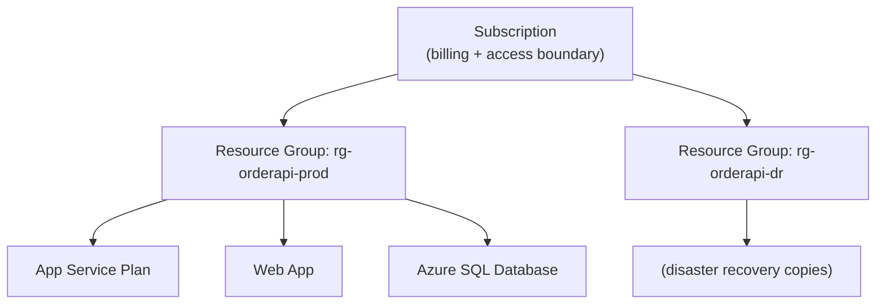
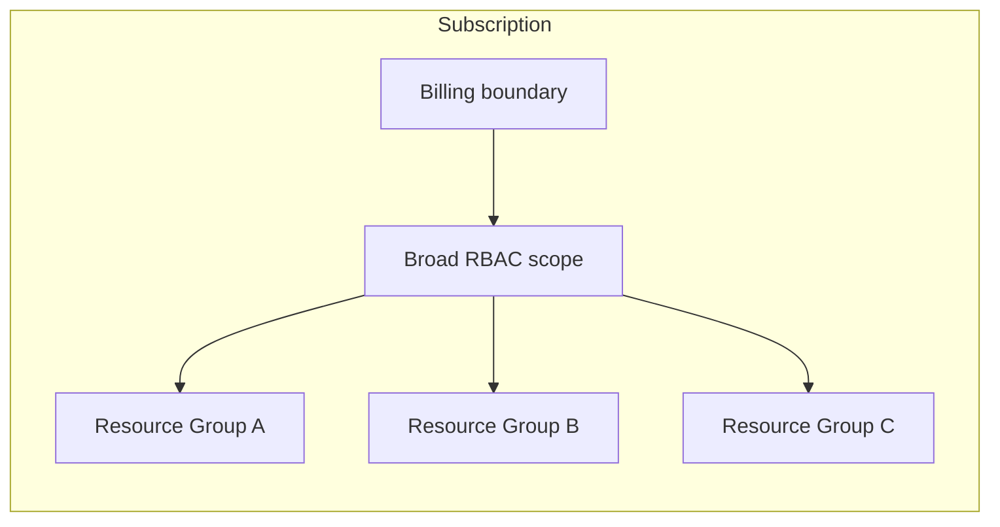

# Azure Resource Manager, Subscriptions, and Resource Groups

## Introduction

Before reading this lesson, you should already be comfortable with **[The Azure Portal, CLI, and PowerShell](../16-azure-for-dotnet-developers/16-02-azure-portal-cli-powershell.md)**, including the fact that all three tools ultimately call the same underlying API. This lesson names that API — Azure Resource Manager — and introduces the two organizational concepts, subscriptions and resource groups, that every resource you ever create in Azure belongs to.

By the end of this lesson, you will be able to:

- Explain what Azure Resource Manager (ARM) is and why every Azure operation passes through it
- Define a subscription as Azure's billing and access-control boundary
- Define a resource group as a logical container for resources that share a lifecycle
- Create a resource group with the CLI and understand what "deploy and delete together" means in practice
- Decide how to group a set of related resources into one or more resource groups

## ARM, Subscriptions, and Resource Groups — A Layman's Perspective

Think about a large university campus. Every single request that happens on that campus — a new student enrolling, a professor requesting a lab renovation, a department ordering new lab equipment — passes through one central administrative office before it becomes real. That office doesn't teach classes or run experiments itself; its entire job is to receive requests, check whether the requester is allowed to make them, record what was approved, and keep a master ledger of everything that exists on campus and who's responsible for paying for it. No matter which entrance a request comes through — a phone call, a walk-in form, an online portal — it all funnels through that one office before anything actually happens.

That central office is Azure Resource Manager. Whether you clicked a button in the Portal, typed an `az` command, or ran a PowerShell cmdlet, the actual instruction — "create this," "delete that," "show me what exists" — is handled by this one office, and only this one office. It is the reason the previous lesson could truthfully say all three tools are interchangeable: none of them do the actual work themselves, they just forward the request to the same administrative office, which is the one place actually doing anything.

Now think about how that university organizes its budget and its buildings. At the top level, the whole university has one master financial account it uses to pay every bill — that's your subscription, the single account everything eventually gets billed against, and also the boundary for who's allowed to touch what at the broadest level. Below that, the campus is organized into individual buildings, each one dedicated to a specific purpose — the Chemistry Building holds only chemistry labs and chemistry offices, the Athletics Complex holds only athletic facilities — and critically, when the university decides to demolish and rebuild the Chemistry Building, everything inside it goes together, in one project, because everything in that building shares the same purpose and the same lifecycle. Nobody tries to keep just the third-floor lab running while the rest of the building comes down around it.

Those buildings are resource groups. A resource group is not itself a physical thing — it doesn't run anything, store anything, or serve any traffic — it's simply a labeled folder that groups related resources together because they share a purpose and, usually, a lifecycle: you build them together, you often update them together, and critically, when the whole project is retired, you delete the resource group and everything inside it vanishes in one action, rather than having to hunt down and individually delete a dozen scattered pieces. Choosing good resource group boundaries — one project per group, rather than dumping every resource the whole company owns into a single group — is exactly like choosing sensible building boundaries on a campus: it makes cleanup, billing review, and access control dramatically simpler later, precisely because things that belong together were kept together from the start.

## ARM, Subscriptions, and Resource Groups — A Programming Language Perspective

**Azure Resource Manager (ARM)** is the deployment and management layer that receives every create, read, update, and delete request for any Azure resource, regardless of which client (Portal, CLI, PowerShell, SDK) issued it, and enforces role-based access control (RBAC), policy, and tagging consistently across all of them. A **subscription** is the top-level billing and access boundary — an agreement tied to a Microsoft account with an associated payment method, under which all resource usage is metered and billed, and against which Azure RBAC role assignments and Azure Policy definitions are typically scoped. A **resource group** is a logical, non-physical container — itself an ARM resource, identified by a name unique within its subscription and a `location` property used only for storing the group's own metadata — that groups resources sharing a deployment lifecycle; deleting a resource group cascades to delete every resource it contains, making it the standard unit of "tear this whole thing down."

## How to Create and Inspect a Resource Group

Every resource this module provisions from here forward needs a resource group to live in first, so this pattern — create the group, confirm it exists, later delete it as one action — recurs throughout the rest of Module 16.


*Figure 1: One subscription containing two resource groups, each grouping resources that share a deployment lifecycle.*

```bash
# Create a resource group -- the container everything else in this module lives in
az group create --name rg-orderapi-prod --location eastus

# List all resource groups in the current subscription
az group list --output table

# Show what's inside a specific resource group (empty right after creation)
az resource list --resource-group rg-orderapi-prod --output table

# Delete the resource group and everything inside it, in one action
az group delete --name rg-orderapi-prod --yes --no-wait
```

**Illustrative Azure CLI Output:**

```text
Name                Location    Status
------------------  ----------  ---------
rg-orderapi-prod    eastus      Succeeded

Name    ResourceGroup    Location    Type
------  ---------------  ----------  ------
```

The second table is empty on purpose — a freshly created resource group is just an empty folder, with nothing provisioned inside it yet. `az group delete --yes --no-wait` matters as much as `az group create`: it demonstrates the entire point of grouping resources this way, that a whole project's worth of infrastructure can be removed with one command instead of tracking down and deleting each piece individually.

## Real-Time Example: Organizing the Order API's Azure Footprint

Returning to the E-Commerce Order Processing domain, the order API needs several Azure resources working together: an App Service to run the container, an Azure SQL Database, and a storage account for uploaded invoice PDFs. The question this lesson answers concretely is: one resource group, or several?

```csharp
// OrderApiResourceGroups.cs — .NET 10 / C# 14 — Real-Time Example (E-Commerce Order Processing)
public sealed record AzureResource(string Name, string ResourceGroup, string Purpose);

AzureResource[] resources =
[
    new("app-orderapi-prod", "rg-orderapi-prod", "Runs the order API container"),
    new("sql-orderapi-prod", "rg-orderapi-prod", "Stores orders, customers, inventory"),
    new("storderapiprodinv", "rg-orderapi-prod", "Stores generated invoice PDFs"),
    new("app-orderapi-staging", "rg-orderapi-staging", "Pre-production testing copy"),
    new("sql-orderapi-staging", "rg-orderapi-staging", "Staging database, safe to reset")
];

var groups = resources.GroupBy(r => r.ResourceGroup);
foreach (var group in groups)
{
    Console.WriteLine($"Resource Group: {group.Key}");
    foreach (AzureResource r in group)
    {
        Console.WriteLine($"  - {r.Name,-24} -> {r.Purpose}");
    }
}
```

**Console Output:**

```text
Resource Group: rg-orderapi-prod
  - app-orderapi-prod       -> Runs the order API container
  - sql-orderapi-prod       -> Stores orders, customers, inventory
  - storderapiprodinv       -> Stores generated invoice PDFs
Resource Group: rg-orderapi-staging
  - app-orderapi-staging    -> Pre-production testing copy
  - sql-orderapi-staging    -> Staging database, safe to reset
```

The production App Service, its database, and its storage account share one resource group, `rg-orderapi-prod`, because they are always deployed and torn down together as one production environment. Staging resources live in a separate group entirely, `rg-orderapi-staging`, precisely because a team should be able to delete and rebuild the entire staging environment for a test — including its database — without any risk of accidentally deleting anything production depends on. This is the practical payoff of resource groups: the boundary between "safe to delete during testing" and "never delete without a very good reason" is drawn once, at the resource-group level, instead of being re-decided resource by resource every time.

## Resource Groups vs Subscriptions

A subscription and a resource group solve different problems and sit at different scopes, though both are frequently confused by newcomers. A subscription is fundamentally about billing and broad access — "who pays for this, and who can touch anything in here at all" — and a single organization commonly has just a handful of subscriptions total (production, development, perhaps one per business unit). A resource group is fundamentally about lifecycle and organization within that billing boundary — "which resources belong to the same project and should live and die together" — and a single subscription routinely contains dozens or hundreds of resource groups, one per project or environment.


*Figure 2: One subscription as the billing boundary, containing many resource groups as lifecycle boundaries.*

| Aspect | Subscription | Resource Group |
|---|---|---|
| Primary purpose | Billing and broad access boundary | Lifecycle grouping of related resources |
| Typical count per org | A handful | Dozens to hundreds |
| Deleting it | Closes the account/billing relationship | Deletes every resource inside it |
| Contains | Resource groups | Individual resources (VMs, databases, apps) |
| Scoped RBAC/policy | Yes, broadly | Yes, more granularly |

## Types of ARM Concepts Worth Knowing

1. **[Regions and Availability Zones](../16-azure-for-dotnet-developers/16-04-regions-and-availability-zones.md)** — the `--location` property every resource group and resource requires.
2. **Management Groups** — an optional layer above subscriptions, for organizations with many subscriptions to govern together.
3. **Azure RBAC (Role-Based Access Control)** — how ARM decides who's allowed to create, read, or delete a given resource.
4. **Azure Policy** — rules ARM enforces automatically, such as "only allow resources in these two regions."
5. **[ARM Templates vs Bicep — Introduction](../16-azure-for-dotnet-developers/16-05-arm-templates-vs-bicep-intro.md)** — declaring an entire resource group's contents in one file instead of one command at a time.

## What You've Learned & What's Next

Azure Resource Manager is the single layer every Azure operation passes through no matter which tool issues it, and subscriptions and resource groups are the two organizational boundaries built on top of it — subscriptions for billing and broad access, resource groups for grouping resources that share a deployment lifecycle so they can be created and torn down together.

Continue your learning journey with **[Regions and Availability Zones](../16-azure-for-dotnet-developers/16-04-regions-and-availability-zones.md)**, where we look at the `location` every resource group requires, and what it actually determines.

---
*Applies to: .NET 10 / C# 14. Last reviewed 2026-08-16.*
