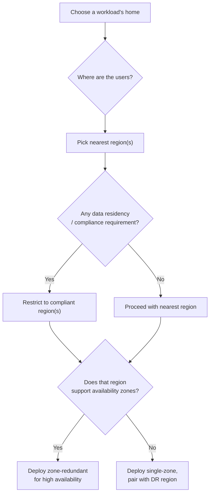
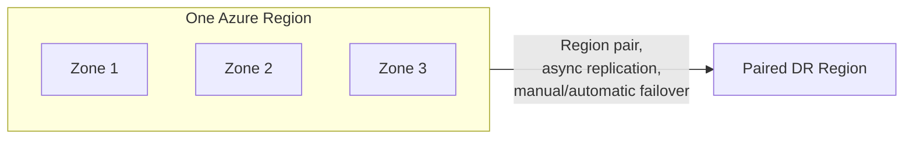

# Regions and Availability Zones

## Introduction

Before reading this lesson, you should already be comfortable with **[Azure Resource Manager, Subscriptions, and Resource Groups](../16-azure-for-dotnet-developers/16-03-arm-subscriptions-resource-groups.md)**, including the fact that every resource group requires a `location`. This lesson explains exactly what that location represents — an Azure region — and introduces availability zones, the finer-grained structure within a region that protects against localized failures.

By the end of this lesson, you will be able to:

- Define an Azure region as a specific geographic data center location
- Define an availability zone as a physically separate facility within a region
- Choose a region based on latency to users and data residency/compliance requirements
- Explain what a region pair is and why it matters for disaster recovery
- Decide when a workload needs availability-zone redundancy versus a single-zone deployment

## Regions and Availability Zones — A Layman's Perspective

Picture a national grocery chain deciding where to build its stores. It doesn't build one giant warehouse in the middle of the country and ship every order from there — a customer in a coastal city would wait days for a carton of milk. Instead, the chain builds full-sized regional distribution centers in many different cities across the country, each capable of independently serving everyone nearby. A customer in Chicago gets served by the Chicago center; a customer in Dallas gets served by the Dallas center. Choosing which regional center serves you is mostly about geography — you want the nearest one, so your order arrives fast — though sometimes it's about rules rather than distance: a company might be required by law to keep certain records only within its own home country's regional centers, even if a nearer one across the border would otherwise be faster.

That's an Azure region: a specific, real, physical cluster of data centers in a particular part of the world — East US, West Europe, Southeast Asia, and dozens of others — and choosing a region for your resources is mostly about choosing which regional center is geographically closest to the people who'll actually use what you built, because physical distance still costs real time even at the speed of light and fiber-optic cable. Sometimes, just like the grocery chain, the choice isn't about distance at all but about a legal requirement that certain data physically stay within a certain country's borders.

Now picture that Chicago distribution center more closely. A well-run one isn't a single building — it's actually three or four separate warehouse buildings, deliberately built a few miles apart from each other, each with its own independent power supply, its own independent cooling, its own independent staff. If a transformer fails or a fire breaks out in one building, the other buildings keep operating completely normally, because they never shared the failure point in the first place. A customer's order can be quietly routed to whichever of those buildings is currently healthy, and they'd never notice the difference.

Those separate buildings within one city are availability zones. Not every region has them, but where they exist, they let you run a truly resilient application: instead of trusting a single data center building to never have a bad day, you spread your application across two or three physically separate buildings within the same region, so a fire, a power outage, or a cooling failure in one building doesn't take your application down, because the other buildings pick up the slack automatically. And finally, every Azure region is deliberately paired with a specific sibling region, usually hundreds of miles away, for the rare case where an entire city-sized disaster — not just one building — takes out a whole region at once; that pairing is your last line of defense, kept far enough away that whatever took out the first region is exceedingly unlikely to also take out its pair.

## Regions and Availability Zones — A Programming Language Perspective

An Azure **region** is a set of physical data centers deployed within a defined geographic area, exposed to ARM as a `location` string (e.g., `eastus`, `westeurope`) that most resources require at creation time; not every Azure service is available in every region. An **availability zone** is one of typically three physically separate facilities within a region supporting availability zones, each with independent power, cooling, and networking, so a failure isolated to one zone does not affect the others; zone-redundant services (e.g., zone-redundant storage, Azure SQL Database configured for zone redundancy) automatically replicate across zones. A **region pair** is a predefined association between two regions within the same geography (e.g., East US paired with West US, in some geographies specifically chosen to reduce the odds of both being affected by the same event), used for cross-region disaster recovery and, for some services, coordinated platform updates that never roll out to both paired regions simultaneously.

## How to Query Regions and Check Availability Zone Support

Choosing a region well starts with knowing what's actually available where — not every region supports every service, and not every region has availability zones at all.


*Figure 1: The decision path from "where are the users" through compliance constraints to zone-redundancy and disaster-recovery choices.*

```bash
# List all Azure regions available to this subscription
az account list-locations --output table --query "[].{Name:name, DisplayName:displayName}"

# Check whether a specific region supports availability zones for a given resource type
az vm list-skus --location eastus --size Standard_D2s_v5 --zone --output table

# Look up the disaster-recovery pair for a region
az account list-locations --output table --query "[?name=='eastus'].{Name:name, Pair:metadata.pairedRegion[0].name}"
```

**Illustrative Azure CLI Output:**

```text
Name          DisplayName
------------  --------------
eastus        East US
westus        West US
westeurope    West Europe
southeastasia Southeast Asia

Name      Pair
--------  -------
eastus    westus
```

This is illustrative Azure CLI output rather than a literal C# console trace. `az account list-locations` is typically the first command run when standing up a new project, so the team can decide, deliberately, which region best matches its users and any compliance requirements before a single resource group gets created in it.

## Real-Time Example: Choosing Regions for the Order API's Customer Base

Continuing the E-Commerce Order Processing domain, suppose the order API's customer base is split between North America and Western Europe, and the company has a legal requirement that European customer records stay within the EU. That single requirement shapes the whole regional layout.

```csharp
// OrderApiRegionPlan.cs — .NET 10 / C# 14 — Real-Time Example (E-Commerce Order Processing)
public sealed record RegionalDeployment(string CustomerBase, string PrimaryRegion, string DrRegion, string Reason);

RegionalDeployment[] plan =
[
    new("North America customers", "eastus", "westus",
        "Nearest region to most US customers; eastus/westus is an official region pair"),
    new("EU customers", "westeurope", "northeurope",
        "EU data residency requirement keeps European customer records inside the EU")
];

Console.WriteLine("Order API regional deployment plan:");
foreach (RegionalDeployment d in plan)
{
    Console.WriteLine($" - {d.CustomerBase,-24} primary={d.PrimaryRegion,-10} dr={d.DrRegion,-10}");
    Console.WriteLine($"     reason: {d.Reason}");
}
```

**Console Output:**

```text
Order API regional deployment plan:
 - North America customers  primary=eastus     dr=westus
     reason: Nearest region to most US customers; eastus/westus is an official region pair
 - EU customers              primary=westeurope  dr=northeurope
     reason: EU data residency requirement keeps European customer records inside the EU
```

Two completely separate deployments of the same order API container run in different Azure regions here, not because the code differs at all, but because the customers and the legal requirements around their data differ. Each primary region is deployed with availability-zone redundancy for day-to-day resilience, and each also has a same-geography DR region ready in case an entire region becomes unavailable — the two failure scenarios this lesson distinguishes, handled at two different scopes.

## Availability Zones vs Region Pairs

It's easy to conflate these two resilience mechanisms, but they protect against different sizes of failure. Availability zones protect against a failure isolated to one data center building within a region — a power outage, a cooling failure, a localized fire — and because the zones sit close together (typically within the same metro area), replicating data between them is fast enough to do synchronously, with no data loss and often no visible interruption to users. A region pair protects against a failure that takes out an entire region at once — a widescale natural disaster, a major regional outage — and because the paired region is deliberately far away, replication between regions is usually asynchronous, meaning a failover to the paired region can lose a small window of the most recent data, and typically requires either an automated or manual failover step rather than happening invisibly.


*Figure 2: Availability zones protect against building-level failures within a region; a region pair protects against losing the entire region.*

| Aspect | Availability Zones | Region Pairs |
|---|---|---|
| Protects against | Single data center failure | Entire region failure |
| Physical distance | Same metro area | Hundreds of miles apart |
| Replication | Typically synchronous | Typically asynchronous |
| Failover | Often automatic, invisible | Often requires explicit failover step |
| Data loss risk | Effectively none | Possible small window of recent data |

## Types of Regional Considerations Worth Knowing

1. **[ARM Templates vs Bicep — Introduction](../16-azure-for-dotnet-developers/16-05-arm-templates-vs-bicep-intro.md)** — declaring a region as a parameter so the same template deploys to any region.
2. **Data residency and sovereignty requirements** — legal constraints (GDPR and similar) that can override a pure latency-based region choice.
3. **Availability Sets** — an older, rack-level resilience mechanism for VMs, distinct from zone-level resilience.
4. **Traffic Manager / Front Door** — services that route users to the nearest healthy regional deployment automatically.
5. **Azure Site Recovery** — a managed service for automating region-pair failover for VM-based workloads.

## What You've Learned & What's Next

An Azure region is a real, physical geographic data center location chosen primarily for latency to your users and any data residency requirements; availability zones are physically separate facilities within a region protecting against localized failures; and region pairs are the geography-spanning safety net for when an entire region goes down. Together, these three concepts determine not just where your application runs, but how resilient it is to failure at every scale.

Continue your learning journey with **[ARM Templates vs Bicep — Introduction](../16-azure-for-dotnet-developers/16-05-arm-templates-vs-bicep-intro.md)**, where we move from manually issuing one CLI command at a time to declaring an entire deployment — regions included — in a single file.

---
*Applies to: .NET 10 / C# 14. Last reviewed 2026-08-16.*
