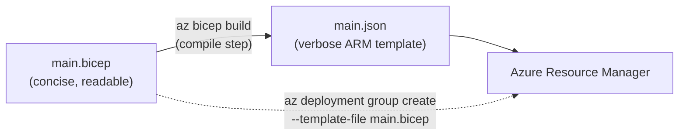
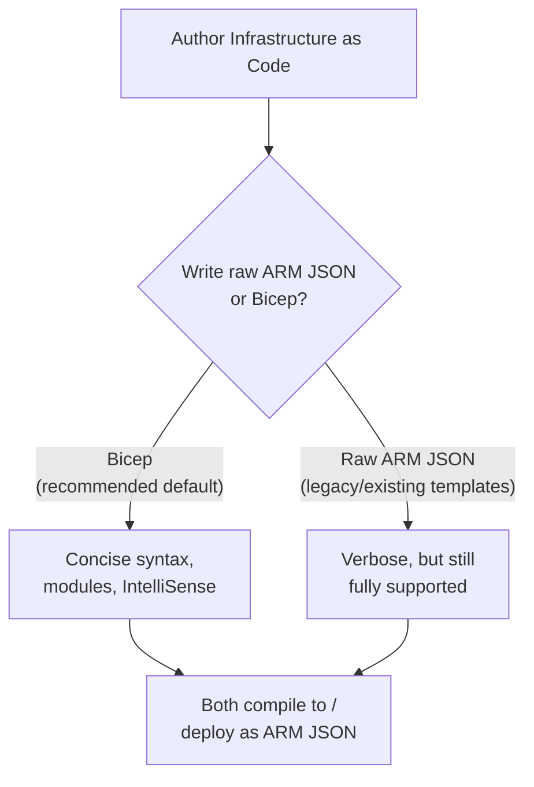

# ARM Templates vs Bicep — Introduction

## Introduction

Before reading this lesson, you should already be comfortable with **[Regions and Availability Zones](../16-azure-for-dotnet-developers/16-04-regions-and-availability-zones.md)**, including the idea that creating even a single resource requires specifying a handful of properties like name, location, and SKU. Every lesson so far has created resources one CLI command at a time. This lesson introduces the alternative: describing an entire set of resources declaratively, in a file, so the whole deployment can be created — or recreated — consistently, as a single unit.

By the end of this lesson, you will be able to:

- Explain what Infrastructure as Code (IaC) means and why it beats issuing commands by hand
- Describe ARM templates as Azure's original, JSON-based IaC format
- Describe Bicep as a cleaner domain-specific language that compiles down to ARM JSON
- Compare the same resource defined in both ARM JSON and Bicep, side by side
- Explain why Bicep is Microsoft's current recommended default for new Azure IaC work

## Infrastructure as Code — A Layman's Perspective

Imagine two different ways an architect can hand off a building design to a construction crew. In the first way, the architect writes out an enormously detailed, mechanically precise specification document — every wall's exact coordinates, every pipe's exact length, every electrical connection spelled out explicitly, with no shorthand allowed, because the document has to be unambiguous enough for a machine to read and execute without a human ever having to interpret intent. It works perfectly, and a crew given this document will build exactly the right building every time, but a human reading that document to understand "wait, what does this building actually look like?" has a genuinely hard time, because so much of what's on the page is repetitive scaffolding rather than the actual design decisions.

In the second way, the same architect works from a clean, readable blueprint — walls drawn as walls, rooms labeled by name, a floor plan any other architect can glance at and immediately understand. Crucially, this blueprint isn't handed to the construction crew directly — there's a translation step, an established, mechanical process that converts the readable blueprint into that same painfully precise specification document the crew's machinery actually needs. The architect never writes the machine-precise document by hand at all; they write the readable blueprint, and trust the translation process to produce an equivalent, correct machine specification every time.

That machine-precise specification document is an ARM template: raw JSON, exhaustively explicit, exactly what Azure's deployment engine consumes, and genuinely difficult for a human to read or write directly at any real size because so much of the file is structural boilerplate rather than actual design intent. The readable blueprint is Bicep: a deliberately concise language for describing Azure resources, built specifically to be pleasant for a human to read and write, that a compilation step converts into that exact same ARM JSON before Azure ever sees it. You never lose anything by writing Bicep instead of raw JSON — every single thing an ARM template can express, a Bicep file can also express — you simply stop having to write and read the verbose form yourself, because the translation step does that mechanical work for you, faithfully, every time.

This is why Bicep isn't a competing product to ARM templates the way, say, two different database engines compete — it's a friendlier front end for producing the exact same underlying artifact, the same way the Azure CLI and the Portal are two friendlier front ends onto the exact same Azure Resource Manager API you learned about a few lessons ago. Microsoft's own guidance today is unambiguous: for new work, write Bicep, and let the tooling handle the JSON.

## ARM Templates vs Bicep — A Programming Language Perspective

An **ARM template** is a JSON document following a fixed schema (`$schema`, `contentVersion`, `parameters`, `variables`, `resources`, `outputs`) that Azure Resource Manager consumes directly to create, update, or delete a set of resources declaratively, rather than imperatively one command at a time. **Bicep** is a domain-specific language, maintained by Microsoft, with its own concise syntax for declaring resources, parameters, variables, and outputs; the Bicep CLI (bundled with the Azure CLI as `az bicep`) transpiles a `.bicep` file into fully equivalent ARM JSON before deployment, meaning Bicep introduces zero new runtime capability — it is strictly a superior authoring experience for the exact same ARM deployment engine. As of the current Azure tooling, Bicep is Microsoft's recommended default for new Infrastructure as Code work on Azure, with `az deployment group create --template-file main.bicep` accepting `.bicep` files directly, compiling them on the fly.

## How to Compare an ARM Template and Its Bicep Equivalent

The clearest way to see the relationship is to look at the same single resource — a storage account — expressed both ways, then compile one into the other and confirm they're equivalent.


*Figure 1: Bicep compiles to ARM JSON before deployment; the CLI can also compile it transparently in a single deployment command.*

```bicep
// main.bicep -- a single storage account, Bicep syntax
param storageAccountName string = 'storderapiprodinv'
param location string = resourceGroup().location

resource storageAccount 'Microsoft.Storage/storageAccounts@2023-01-01' = {
  name: storageAccountName
  location: location
  sku: {
    name: 'Standard_LRS'
  }
  kind: 'StorageV2'
}
```

```json
// main.json -- the exact ARM template Bicep compiles the above into (abbreviated)
{
  "$schema": "https://schema.management.azure.com/schemas/2019-04-01/deploymentTemplate.json#",
  "contentVersion": "1.0.0.0",
  "parameters": {
    "storageAccountName": { "type": "string", "defaultValue": "storderapiprodinv" },
    "location": { "type": "string", "defaultValue": "[resourceGroup().location]" }
  },
  "resources": [
    {
      "type": "Microsoft.Storage/storageAccounts",
      "apiVersion": "2023-01-01",
      "name": "[parameters('storageAccountName')]",
      "location": "[parameters('location')]",
      "sku": { "name": "Standard_LRS" },
      "kind": "StorageV2"
    }
  ]
}
```

```bash
# Compile the Bicep file to ARM JSON, and inspect that they describe the same resource
az bicep build --file main.bicep --outfile main.json
az deployment group create --resource-group rg-orderapi-prod --template-file main.bicep
```

**Illustrative Azure CLI Output:**

```text
{
  "properties": {
    "provisioningState": "Succeeded",
    "outputResources": [
      { "id": "/subscriptions/.../resourceGroups/rg-orderapi-prod/providers/Microsoft.Storage/storageAccounts/storderapiprodinv" }
    ]
  }
}
```

Notice how much shorter the Bicep file is for identical meaning — no `$schema`, no `contentVersion`, no bracketed `"[parameters('...')]"` expression syntax, just a resource declared plainly with a type, a name, and properties. `az deployment group create` accepts the `.bicep` file directly; the CLI silently performs the same compilation step shown separately here, so in everyday use you rarely even run `az bicep build` by hand.

## Real-Time Example: Declaring the Order API's Resource Group Contents

Continuing the E-Commerce Order Processing domain, instead of running the separate `az group create`, `az appservice plan create`, and `az webapp create` commands from earlier lessons by hand, a Bicep file can declare all of them together, so the whole environment is created — or recreated identically for a new environment — from one file.

```bicep
// order-api.bicep -- declares the App Service plan and web app together
param location string = 'eastus'
param environmentName string = 'prod'

resource appServicePlan 'Microsoft.Web/serverfarms@2023-12-01' = {
  name: 'plan-orderapi-${environmentName}'
  location: location
  sku: { name: 'B1', tier: 'Basic' }
}

resource orderApiApp 'Microsoft.Web/sites@2023-12-01' = {
  name: 'app-orderapi-${environmentName}'
  location: location
  properties: {
    serverFarmId: appServicePlan.id
    siteConfig: {
      linuxFxVersion: 'DOTNETCORE|10.0'
    }
  }
}

output orderApiUrl string = 'https://${orderApiApp.properties.defaultHostName}'
```

**Illustrative Azure CLI Output:**

```text
{
  "properties": {
    "provisioningState": "Succeeded",
    "outputs": {
      "orderApiUrl": { "type": "String", "value": "https://app-orderapi-prod.azurewebsites.net" }
    }
  }
}
```

Standing up a second, independent environment — say, `environmentName: 'staging'` — is now just re-running this same file with a different parameter value, rather than re-typing a sequence of CLI commands and hoping nothing was typed differently the second time. This is the real payoff of IaC: the file itself is the source of truth for what the environment should look like, checked into source control alongside the order API's own C# code.

## ARM Templates vs Bicep

Both formats deploy through the exact same ARM engine and support the exact same resource types, parameters, and outputs — the difference is entirely in authoring experience. ARM JSON requires bracketed expression syntax for anything dynamic (`"[concat(...)]"`, `"[parameters('x')]"`), has no native modularity beyond nested/linked templates, and its verbosity scales poorly as a deployment grows past a handful of resources. Bicep provides plain expressions, string interpolation, first-class modules for splitting large deployments into reusable files, and built-in tooling (IntelliSense, type checking) that catches mistakes before deployment rather than after a failed `provisioningState`.


*Figure 2: Bicep and ARM JSON both terminate at the same ARM deployment engine; only the authoring path differs.*

| Aspect | ARM Templates (JSON) | Bicep |
|---|---|---|
| Format | JSON | Purpose-built DSL |
| Readability | Verbose, hard to hand-author at scale | Concise, close to plain English |
| Modularity | Nested/linked templates | Native `module` keyword |
| Tooling | Basic | IntelliSense, type checking (VS Code extension) |
| Relationship | The format Azure actually deploys | Compiles down to ARM JSON before deployment |
| Microsoft's current guidance | Still fully supported | **Recommended default for new work** |

## Types of Infrastructure as Code Topics Worth Knowing

1. **Bicep modules** — splitting a large deployment into reusable, composable files, covered in this module's full DevOps sub-area (Lesson 55).
2. **Parameters and parameter files** — supplying environment-specific values (like `environmentName`) without editing the template itself.
3. **What-if deployments** (`az deployment group what-if`) — previewing exactly what a deployment would change before it runs.
4. **Bicep decompile** (`az bicep decompile`) — converting an existing ARM JSON template into Bicep, useful for legacy templates.
5. **Terraform on Azure** — a popular third-party, multi-cloud alternative to both ARM templates and Bicep, mentioned here for completeness though outside this module's scope.

## What You've Learned & What's Next

ARM templates are Azure's original, verbose JSON Infrastructure as Code format, and Bicep is a concise DSL that compiles down to that exact same JSON — meaning Bicep costs you nothing in capability while making deployments dramatically easier to read, write, and maintain, which is why it's now Microsoft's recommended default. This lesson's minimal comparison is just a first taste; the full Bicep deep-dive, including modules, parameter files, and what-if deployments, arrives later in this module's DevOps & Infrastructure as Code sub-area.

Continue your learning journey with **[Understanding Azure Pricing and the Free Tier](../16-azure-for-dotnet-developers/16-06-azure-pricing-and-free-tier.md)**, where we shift from how resources are declared to what they actually cost.

---
*Applies to: .NET 10 / C# 14. Last reviewed 2026-08-16.*
