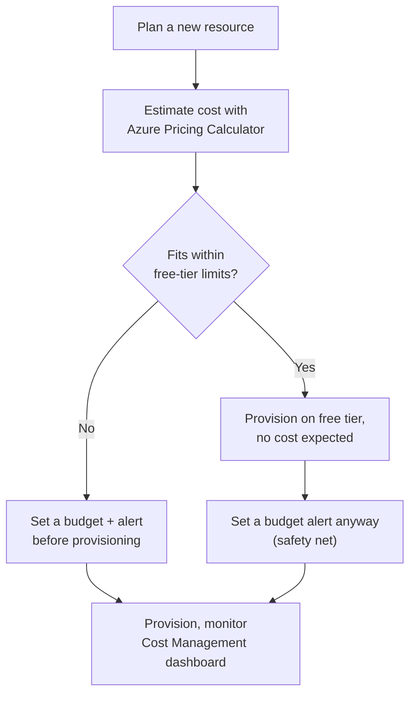
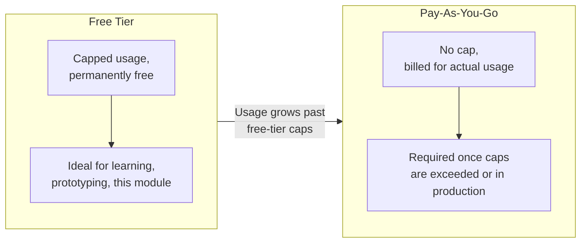

# Understanding Azure Pricing and the Free Tier

## Introduction

Before reading this lesson, you should already be comfortable with **[ARM Templates vs Bicep — Introduction](../16-azure-for-dotnet-developers/16-05-arm-templates-vs-bicep-intro.md)**, and with the resource groups, regions, and services this module has provisioned in every hands-on example so far. Every one of those examples has quietly assumed something never yet addressed head-on: that provisioning a resource costs money. This lesson addresses that directly, so you can follow the rest of this module's hands-on examples without an unpleasant surprise on a billing statement.

By the end of this lesson, you will be able to:

- Explain Azure's pay-as-you-go pricing model in plain terms
- Identify the free account benefits and always-free tier services useful for following this module
- Use the Azure Pricing Calculator to estimate a workload's monthly cost before provisioning it
- Set a budget and cost alert to avoid a surprise bill
- Recognize which of this module's examples can be followed on the free tier and which cannot

## Azure Pricing — A Layman's Perspective

Think about your household electricity bill. You don't pay a single flat fee regardless of usage, and you don't pay per appliance you own sitting idle in a closet — you pay for the electricity that actually flows through the meter, measured continuously, and billed at the end of the month based on exactly how much you used. Leave a light on overnight by mistake, and you pay for that specific overnight of extra usage; nobody warns you in the moment, the bill simply reflects it later.

Azure's pricing works the same way, and this is genuinely the single most important thing to internalize before provisioning anything: almost every resource meters continuously, by the hour, minute, or even by the request, for as long as it exists and however lightly or heavily it's used — not just while you're actively working with it. An App Service plan you created for a five-minute demo and forgot about a week ago has been quietly billing every one of those days in between, exactly like a light left on in an empty room. This is the single most common way a curious learner gets an unpleasant billing surprise: not from anything they used heavily, but from something small they created, used for a few minutes, and never turned back off.

Fortunately, utility companies sometimes offer a limited free allowance to new customers to help them get started — a certain number of free kilowatt-hours in your first months of service — and Azure does something directly analogous through its free account and its permanently free-tier services. New Azure accounts typically receive an initial credit usable across almost any service for a limited time, plus a specific list of services that remain free every month, forever, up to a generous usage cap, regardless of how long you've had the account — enough compute, storage, and database capacity, in most cases, to follow along with an entire learning curriculum like this one without spending a cent, provided you stay under those caps and remember to delete what you don't still need.

The practical habit this lesson wants to instill, more than any specific number, is this: before you create anything in Azure, ask what it will cost while sitting idle, not just while you're using it, and set up an automatic budget alert so that if something unexpected does start accumulating cost — a demo resource left running, a database tier that's larger than it needed to be — you get an email about it in near-real time rather than discovering it a month later on an invoice. That one habit, more than memorizing this lesson's specific numbers, is what actually prevents surprise bills, because Azure's own free-tier limits and pricing structure change over time far faster than any lesson can promise to stay current.

## Azure Pricing — A Programming Language Perspective

Azure's default billing model is **pay-as-you-go**: most resources are metered continuously by a unit appropriate to the service (compute hours, storage gigabytes-per-month, database transaction units, HTTP requests), and invoiced monthly against the payment method on the subscription, independent of whether the resource is actively serving traffic. New subscriptions typically include a limited-time credit plus a defined **free tier** — a fixed monthly allowance of specific services (e.g., a certain number of App Service compute hours, a capped-size database, a bounded number of Functions executions) that remains free indefinitely, distinct from the initial credit, which expires. The **Azure Pricing Calculator**, a public web tool, lets you model a planned architecture's resources and receive an estimated monthly cost before provisioning anything, and **Azure Cost Management + Budgets** lets you define a spending threshold on a subscription or resource group that triggers an email or automated action when approached or exceeded.

## How to Estimate Cost and Set a Budget Alert Before Provisioning

The two habits worth building before you provision anything for this module's remaining lessons: estimate first, then set a floor beneath which you'll be notified.


*Figure 1: Estimating cost and setting a budget alert before provisioning, rather than discovering cost after the fact.*

```bash
# Check current spend on a subscription so far this billing period
az consumption usage list --output table --top 5

# Create a monthly budget of $20 on a resource group, with an alert at 80% of that
az consumption budget create \
  --budget-name budget-orderapi-learning \
  --amount 20 \
  --category cost \
  --time-grain monthly \
  --start-date 2026-08-01 \
  --end-date 2027-08-01 \
  --resource-group rg-orderapi-prod
```

**Illustrative Azure CLI Output:**

```text
UsageStart    UsageEnd      InstanceName          PretaxCost   Currency
------------  ------------  --------------------  -----------  --------
2026-08-01    2026-08-02    app-orderapi-prod     0.42         USD
2026-08-02    2026-08-03    app-orderapi-prod     0.42         USD

{
  "name": "budget-orderapi-learning",
  "amount": 20,
  "category": "Cost",
  "timeGrain": "Monthly",
  "notifications": {
    "actual_GreaterThan_80_Percent": {
      "enabled": true,
      "threshold": 80,
      "contactEmails": ["tummala.kishore@acg-world.com"]
    }
  }
}
```

This is illustrative Azure CLI output, not a literal C# console trace — real numbers depend entirely on what's actually provisioned and current Azure pricing at the time you run it. The point of the second command is the habit it represents: a budget with an alert defined *before* a resource has a chance to accumulate a month's worth of unnoticed cost, not after.

## Real-Time Example: Estimating the Order API's Monthly Cost

Continuing the E-Commerce Order Processing domain, before committing to a production Azure footprint for the order API, it's worth modeling roughly what App Service, Azure SQL Database, and storage will cost per month, so the team can decide with real numbers rather than guessing.

```csharp
// OrderApiCostEstimate.cs — .NET 10 / C# 14 — Real-Time Example (E-Commerce Order Processing)
public sealed record CostLineItem(string Resource, string Tier, decimal EstimatedMonthlyCost, bool FreeTierEligible);

CostLineItem[] estimate =
[
    new("App Service Plan", "B1 Basic", 13.14m, FreeTierEligible: false),
    new("Azure SQL Database", "Basic (5 DTU)", 4.90m, FreeTierEligible: false),
    new("Storage Account", "Standard LRS, <5GB", 0.10m, FreeTierEligible: true),
    new("Application Insights", "Free tier, <5GB/month ingestion", 0.00m, FreeTierEligible: true)
];

decimal total = estimate.Sum(e => e.EstimatedMonthlyCost);

Console.WriteLine("Order API — estimated monthly cost (Pricing Calculator, illustrative):");
foreach (CostLineItem item in estimate)
{
    string freeNote = item.FreeTierEligible ? "(free-tier eligible)" : "";
    Console.WriteLine($" - {item.Resource,-22} [{item.Tier,-28}] ${item.EstimatedMonthlyCost,6:F2} {freeNote}");
}
Console.WriteLine($"Estimated total: ${total:F2}/month");
```

**Console Output:**

```text
Order API — estimated monthly cost (Pricing Calculator, illustrative):
 - App Service Plan       [B1 Basic                    ] $ 13.14 
 - Azure SQL Database     [Basic (5 DTU)                ] $  4.90 
 - Storage Account        [Standard LRS, <5GB           ] $  0.10 (free-tier eligible)
 - Application Insights   [Free tier, <5GB/month ingestion] $  0.00 (free-tier eligible)
Estimated total: $18.14/month
```

For a solo developer following this module's examples on a free account, that same architecture at its smallest viable size — a free-tier App Service instead of Basic, and the smallest available SQL Database tier or a free Cosmos DB tier instead — often lands at or near $0/month, comfortably inside free-tier limits. The moment the same architecture starts serving real customer traffic in production, though, those numbers above are a far more realistic planning baseline, and this is exactly the kind of estimate a team should run *before* choosing tiers, not after the first invoice arrives.

## Free Tier vs Pay-As-You-Go Production Pricing

The free tier and pay-as-you-go pricing aren't two different products — they're the same services, at two different scales, governed by the same metering. The free tier exists specifically to let you learn and prototype without financial risk, capped at a level generous enough for personal projects and coursework but far below what any real production workload needs; a production deployment serving actual customers will, almost without exception, need to move beyond free-tier caps into standard pay-as-you-go tiers; and reserved capacity or savings plans (purchasing committed usage upfront) exist as a further optimization once a workload's usage pattern is well understood and stable, outside this lesson's scope.


*Figure 2: The same services, scaled from free-tier learning caps up into uncapped pay-as-you-go production usage.*

| Aspect | Free Tier | Pay-As-You-Go |
|---|---|---|
| Cost | $0, within defined caps | Billed continuously for actual usage |
| Usage cap | Fixed monthly allowance per service | None |
| Suitable for | Learning, this module's examples, prototypes | Real production traffic |
| Available services | A defined subset of Azure services | All Azure services |
| Risk of surprise cost | Low (capped) | Real — requires active budget monitoring |

## Types of Cost-Related Topics Worth Knowing

1. **[The Shared Responsibility Model](../16-azure-for-dotnet-developers/16-07-shared-responsibility-model.md)** — next lesson, on the security side of what you own once you provision a paid resource.
2. **Azure Cost Management + Budgets** — this module's full Cost Management sub-area, covering budgets, alerts, and cost analysis dashboards in depth.
3. **Azure Advisor cost recommendations** — automated suggestions for right-sizing or removing underused resources.
4. **Reserved Instances / Savings Plans** — committing to usage upfront for a discount, once a workload's baseline usage is known.
5. **Azure Hybrid Benefit** — reusing existing on-premises licenses to reduce certain Azure compute costs.

## What You've Learned & What's Next

Azure bills continuously for what's provisioned, whether or not it's actively used, which makes "estimate before you provision, then set a budget alert" the single most valuable habit in this lesson; the free account and free-tier services exist specifically so you can follow this module's examples with little to no cost, provided you stay within their caps and clean up what you no longer need.

Continue your learning journey with **[The Shared Responsibility Model](../16-azure-for-dotnet-developers/16-07-shared-responsibility-model.md)**, the capstone of this Fundamentals sub-area, where we shift from what you pay for to what you're actually responsible for securing once you've paid for it.

---
*Applies to: .NET 10 / C# 14. Last reviewed 2026-08-16.*
