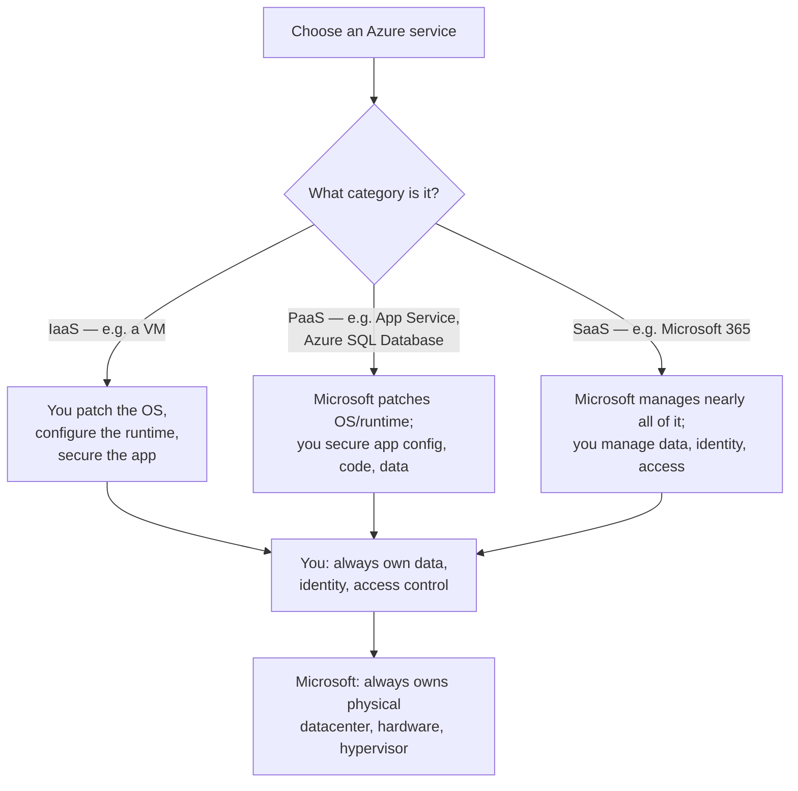
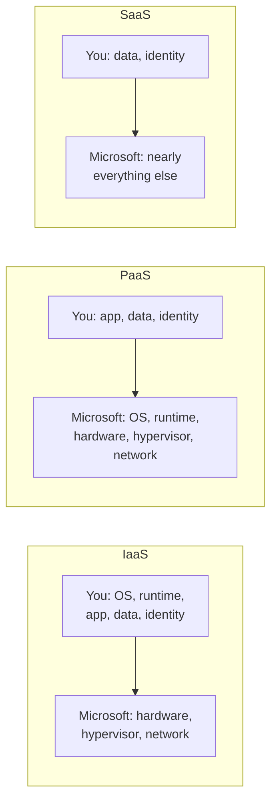

# The Shared Responsibility Model

## Introduction

Before reading this lesson, you should already be comfortable with **[Understanding Azure Pricing and the Free Tier](../16-azure-for-dotnet-developers/16-06-azure-pricing-and-free-tier.md)**, and in truth with all six lessons before it in this Azure Fundamentals sub-area. This is the seventh and final lesson of that sub-area, and it exists to answer a question every earlier lesson quietly assumed had already been settled: once Microsoft is running the physical data center your resources live in, what exactly is left for *you* to secure? The answer is the shared responsibility model, and it is the right note to end Fundamentals on, because every remaining lesson in Module 16 — starting with Compute in the very next lesson — will build on top of it without restating it.

By the end of this lesson, you will be able to:

- State the shared responsibility model in one sentence: security is a partnership, and the line is never all-or-nothing
- List what Microsoft always secures, regardless of which Azure service you use
- List what you always secure, regardless of which Azure service you use
- Explain how the responsibility line shifts across IaaS, PaaS, and SaaS service types
- Recall, at a high level, the seven lessons of the Fundamentals sub-area and how they built toward this one

## The Shared Responsibility Model — A Layman's Perspective

Picture renting an apartment in a large, professionally managed apartment building, and consider everything that has to go right for you to live there safely. The building's structural engineer already made sure the building won't collapse. The building's own security team already made sure there's a locked front entrance, and staff watching the lobby around the clock. The building's maintenance crew already made sure the elevators, the wiring behind the walls, and the plumbing all work, and they keep working on all of it without you ever having to think about any of it. None of that is your job as a tenant — you didn't design the building, and you have no ability to change any of it even if you wanted to.

But there is a very real list of things that absolutely are your job, and no landlord in the world will do them for you. You have to lock your own apartment door when you leave, every time — the building's front entrance being locked does nothing if you leave your own door standing open. You decide who gets a copy of your key, and you're responsible for whoever you hand one to. You decide what valuables you keep inside and how carefully you store them. If you leave your window unlocked on the ground floor, the building's excellent lobby security guard cannot help you, because the failure happened entirely inside the boundary that was always yours to manage.

Now here's the part that makes this genuinely interesting rather than a fixed list you memorize once: that boundary between the landlord's job and your job moves depending on what kind of place you rent. Rent a completely bare, unfurnished apartment, and you're responsible for almost everything inside your unit — your own furniture, your own appliances, your own everything, on top of your door and your key. Rent a fully furnished, serviced apartment instead, with weekly cleaning and appliance maintenance included, and a great deal of what used to be your job has now shifted over to the building's staff — you're still responsible for locking your door and controlling your key, but far less of the interior is now yours to worry about. And book a hotel room for one night instead of either, and almost everything has shifted to the hotel's staff — housekeeping, towels, the television working, all of it — leaving you responsible for little more than your own belongings and not leaving your door propped open.

That sliding boundary is precisely the Azure shared responsibility model. Microsoft, like the building's engineer and maintenance crew, always secures the physical data centers, the physical hardware, and the core infrastructure underneath everything, no matter which Azure service you use — that part of the boundary never moves. You, like the tenant, always secure your own data, who has access to it, and how you configure your own application — that part never moves either. What *does* move, service type by service type, is everything in between: the more "ready-made" the service (a fully managed, furnished, serviced apartment versus a bare one), the more of that middle ground Microsoft has already handled for you, and the less is left for you to configure yourself.

## The Shared Responsibility Model — A Programming Language Perspective

The **shared responsibility model** partitions security obligations between the cloud provider and the customer along a boundary that shifts by service category: **Infrastructure as a Service (IaaS)** (e.g., a plain Azure Virtual Machine), **Platform as a Service (PaaS)** (e.g., Azure App Service, Azure SQL Database), and **Software as a Service (SaaS)** (e.g., Microsoft 365). Microsoft always retains responsibility for physical datacenters, physical network and host infrastructure, and the hypervisor layer, across every service category without exception. The customer always retains responsibility for their own data, endpoint devices, account and identity management, and access permissions, again without exception. Everything between those two constants — operating system patching, network controls, runtime configuration, application-level settings — shifts toward Microsoft as the service category becomes more fully managed: IaaS leaves the guest OS, runtime, and application layer entirely to the customer; PaaS shifts OS and runtime patching to Microsoft while the customer retains application configuration and code; SaaS shifts nearly everything except data, identity, and end-user device security to the provider.

## How to Reason About Responsibility for a Given Azure Service

Before provisioning any Azure resource, it's worth explicitly asking which security tasks are now yours versus already handled — a habit worth building now, since every remaining Compute, Data, and Security lesson in this module will assume you can answer it.


*Figure 1: Two constants — Microsoft's floor and your data/identity ceiling — with everything in between shifting by service category.*

```bash
# Illustrative: check who last modified access permissions on a resource -- this is squarely
# a "your responsibility" task regardless of service category (identity and access management)
az role assignment list --resource-group rg-orderapi-prod --output table
```

**Illustrative Azure CLI Output:**

```text
Principal                          Role                 Scope
----------------------------------  -------------------  ------------------------------------------
warehouse-staff-group@company.com   Reader               /subscriptions/.../rg-orderapi-prod
deploy-pipeline-sp                  Contributor          /subscriptions/.../rg-orderapi-prod
```

This is illustrative Azure CLI output rather than a literal C# console trace. Reviewing exactly who holds which role against a resource group is a task that belongs to you in every single Azure service category, IaaS through SaaS, because access management is one of the two constants on the customer's side of the line that never shift toward Microsoft, no matter how "managed" the underlying service becomes.

## Real-Time Example: The Order API's Responsibilities Across Three Service Types

Continuing the E-Commerce Order Processing domain, imagine the order API's infrastructure actually mixes all three service categories: a legacy inventory-sync job still runs on a plain Azure VM (IaaS), the order API itself runs on Azure App Service (PaaS), and the team also uses Microsoft 365 for internal order-exception email alerts (SaaS). Each layer carries a different split of responsibility.

```csharp
// OrderApiResponsibilitySplit.cs — .NET 10 / C# 14 — Real-Time Example (E-Commerce Order Processing)
public sealed record ResponsibilityRow(string Component, string ServiceCategory, string CustomerOwns, string MicrosoftOwns);

ResponsibilityRow[] rows =
[
    new("Legacy inventory-sync job", "IaaS (Azure VM)",
        "OS patching, runtime install, app config, data, identity",
        "Physical hardware, hypervisor, network infrastructure"),
    new("Order API web app", "PaaS (App Service)",
        "App code, app config, data, identity",
        "OS patching, runtime, physical hardware, hypervisor"),
    new("Order-exception email alerts", "SaaS (Microsoft 365)",
        "Data, identity, access permissions",
        "Nearly everything else")
];

Console.WriteLine("Order API infrastructure -- responsibility split by component:");
foreach (ResponsibilityRow r in rows)
{
    Console.WriteLine($"\n{r.Component} [{r.ServiceCategory}]");
    Console.WriteLine($"  You own:        {r.CustomerOwns}");
    Console.WriteLine($"  Microsoft owns: {r.MicrosoftOwns}");
}
```

**Console Output:**

```text
Order API infrastructure -- responsibility split by component:

Legacy inventory-sync job [IaaS (Azure VM)]
  You own:        OS patching, runtime install, app config, data, identity
  Microsoft owns: Physical hardware, hypervisor, network infrastructure

Order API web app [PaaS (App Service)]
  You own:        App code, app config, data, identity
  Microsoft owns: OS patching, runtime, physical hardware, hypervisor

Order-exception email alerts [SaaS (Microsoft 365)]
  You own:        Data, identity, access permissions
  Microsoft owns: Nearly everything else
```

Notice that "data" and "identity" appear on the customer's side in all three rows without exception — that consistency is the whole point of the model. What changes row to row is only how much of the *infrastructure and runtime* burden Microsoft has absorbed, and the team's move from the legacy VM toward App Service was, in security terms, a deliberate decision to hand OS patching and runtime maintenance to Microsoft, freeing the team to focus their limited security effort on the application and data layer that was always theirs regardless.

## IaaS vs PaaS vs SaaS — The Shifting Responsibility Line

Every Azure service falls into one of these three categories, and the category is the single biggest predictor of how much security work is left for you to do. IaaS gives you the most control and the most responsibility — you choose the OS, you patch it, you configure the network, you own the runtime and everything above it, trading convenience for full flexibility. PaaS removes the OS and runtime maintenance burden entirely — Microsoft patches the underlying platform automatically — while you retain full control and responsibility over your application code, its configuration, and your data. SaaS removes nearly everything except the two constants that never move: your data, and who has access to it.


*Figure 2: The responsibility line shifting toward Microsoft as the service category becomes more fully managed, left to right.*

| Aspect | IaaS (e.g., Azure VM) | PaaS (e.g., App Service, Azure SQL DB) | SaaS (e.g., Microsoft 365) |
|---|---|---|---|
| OS patching | You | Microsoft | Microsoft |
| Runtime/platform maintenance | You | Microsoft | Microsoft |
| Network controls | You (mostly) | Shared | Microsoft |
| Application configuration/code | You | You | N/A or minimal |
| Data and identity | You | You | You |
| Physical hardware/hypervisor | Microsoft | Microsoft | Microsoft |

## Types of Shared-Responsibility Topics Worth Knowing

1. **[Introduction to Azure App Service](../16-azure-for-dotnet-developers/16-08-introduction-to-app-service.md)** — next lesson, the first Compute service, a PaaS offering that puts this lesson's PaaS row into practice.
2. **Microsoft Entra ID** — the identity layer implementing "you own identity" across every service category, covered in this module's Identity & Security sub-area.
3. **Azure Key Vault** — where application secrets are stored, a customer responsibility regardless of service category.
4. **Azure Policy and Microsoft Defender for Cloud** — tooling that helps monitor whether your side of the responsibility line is actually being upheld.
5. **Data residency and compliance** (revisited from [Regions and Availability Zones](../16-azure-for-dotnet-developers/16-04-regions-and-availability-zones.md)) — a customer responsibility with direct ties to region choice.

## What You've Learned & What's Next — Fundamentals Sub-Area Recap

The shared responsibility model has two constants and one variable: Microsoft always secures the physical infrastructure beneath every service, you always secure your data, identity, and access control on top of every service, and everything in between shifts toward Microsoft as a service becomes more fully managed — from IaaS, where you own nearly everything above the hardware, through PaaS, where Microsoft absorbs OS and runtime maintenance, to SaaS, where Microsoft absorbs nearly everything except your data and who can reach it.

Read end to end, this seven-lesson Fundamentals sub-area told one continuous story about the ground floor every later lesson in Module 16 stands on. It opened with what Azure actually is and a roadmap of the 78-lesson module ahead (Lesson 1). It introduced the three interchangeable tools — Portal, CLI, PowerShell — used to manage every resource this module will ever create (Lesson 2), then named the single management layer, Azure Resource Manager, that all three actually call, along with the subscription and resource-group boundaries every resource lives inside (Lesson 3). It covered where resources physically live and how that choice affects latency, compliance, and resilience through availability zones and region pairs (Lesson 4), then moved from issuing commands one at a time to declaring entire deployments as code, comparing ARM JSON against Bicep (Lesson 5). It addressed what all of this costs, and how to use the free tier and budget alerts to avoid a surprise bill (Lesson 6). And this lesson closes the sub-area by drawing the line between what Microsoft secures and what you secure — a line that every remaining lesson in this module, starting with Compute, will build on without restating.

Continue your learning journey with **[Introduction to Azure App Service](../16-azure-for-dotnet-developers/16-08-introduction-to-app-service.md)**, the first lesson of Module 16's Compute sub-area, where the order API finally gets its first real, managed home in Azure.

---
*Applies to: .NET 10 / C# 14. Last reviewed 2026-08-16.*
