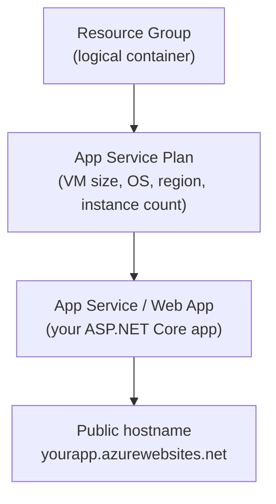
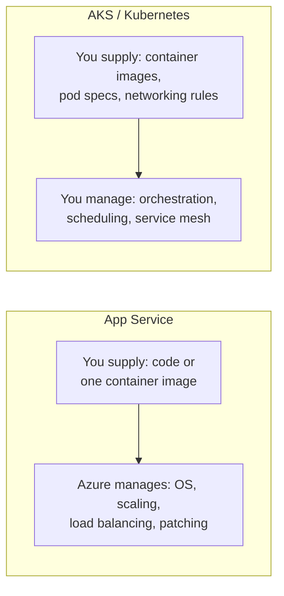

# Introduction to Azure App Service

## Introduction

Before reading this lesson, you should already be comfortable with **[The Shared Responsibility Model](../16-azure-for-dotnet-developers/16-07-shared-responsibility-model.md)** — specifically, how much of the stack Azure manages for you shifts depending on whether you're using IaaS, PaaS, or SaaS. This lesson puts that idea to work on the single service most .NET web developers meet first in Azure: **App Service**, a PaaS offering purpose-built for hosting web apps and APIs, including the ASP.NET Core Minimal API this curriculum has been building since Module 10.

By the end of this lesson, you will be able to:

- Explain what Azure App Service is and where it sits on the shared responsibility spectrum
- Describe the relationship between an App Service (the app) and an App Service Plan (the compute it runs on)
- Name the major App Service pricing tiers and what each is suited for
- Decide when App Service is the right host for a workload, and when containers or AKS earn their extra complexity instead
- Provision an App Service Plan and Web App using the Azure CLI

## Azure App Service — A Layman's Perspective

Imagine two very different ways a growing business can get office space. The first way: buy a plot of land, hire architects and contractors, install your own electrical wiring, your own plumbing, your own elevators, hire your own security guards and your own building maintenance crew — and only then move your desks in. Every pipe that leaks, every bulb that burns out, every fire code inspection is now your problem, forever, in addition to actually running your business. The second way: rent a fully furnished, fully staffed serviced office in an existing office tower. The building has power, water, elevators, security, a fire suppression system, and a maintenance team already in place and already working, all managed by someone else. You show up with your desks, your staff, and your work — and none of the building's plumbing is ever your problem. You still choose *how big* a suite you rent, and you can move to a bigger suite in the same tower the moment you outgrow the current one.

Azure App Service is the serviced office. The "plot of land, build it yourself" option is a virtual machine — an IaaS offering where Azure hands you a blank computer and you install and patch the operating system, the web server, the runtime, and everything else yourself, exactly as the Shared Responsibility Model lesson described. App Service instead hands you a *ready-to-run web hosting platform*: point it at your ASP.NET Core app, and the operating system patching, the underlying web server process, the load balancing across however many instances you've asked for, and the health monitoring that restarts a crashed instance are all already handled, by Azure, as part of what you're renting. You never open a remote desktop session to an App Service instance to run Windows Update — that instance doesn't feel like "yours" to administer at that level, because it isn't; it's a suite inside someone else's building.

The serviced office metaphor holds for one more crucial detail: the building itself — the elevators, the wiring, the shared lobby — is not one suite, it's the whole tower, and multiple tenants (or, if you choose, just you) can occupy suites within it. That shared tower is what Azure calls an **App Service Plan**: the actual compute — the virtual machine size, the region, the operating system — that one or more App Service apps run on top of. Renting a bigger suite, or moving to a bigger tower entirely, is a deliberate, visible decision you make about the plan, completely separate from the day-to-day decision of what your business actually does inside that space. Two different apps can even share the same tower (the same plan) to save cost, the same way two small businesses might share a floor of serviced offices without knowing much about each other's day-to-day work.

What the serviced office *can't* offer is total control over the building's own infrastructure — you can't rewire the elevators to behave in some entirely custom way, and if your business needs exactly that level of infrastructure control, or needs to run dozens of wildly different specialized machines side by side under one roof, at some point a serviced office stops being the right model, and owning (or precisely orchestrating) your own building starts to make sense. That's the honest trade-off this lesson closes with: App Service is extraordinary for the overwhelming majority of web apps and APIs, right up until a workload's needs genuinely outgrow what a well-managed shared tower can offer.

## Azure App Service — A Programming Language Perspective

**Azure App Service** is a fully-managed Platform-as-a-Service (PaaS) for hosting web applications, REST APIs, and mobile backends, supporting .NET, Java, Node.js, Python, PHP, and custom Linux containers. Azure owns the operating system, the runtime patching, the underlying web server process (Kestrel behind Azure's front-end proxy on Linux, or IIS/ANCM on Windows), load balancing, and health monitoring; you own the application code and its configuration. The compute an App Service app runs on is defined by an **App Service Plan**, a distinct Azure resource specifying the region, operating system, VM size (SKU), and instance count; one plan can host multiple apps, each isolated at the process level, sharing the plan's underlying compute and billing. Deployment happens via zip deploy, Git-based continuous deployment, CI/CD pipelines, or a container image — covered in the next lesson.

## How to Provision an App Service in Azure

Every App Service app requires, at minimum, a resource group to live in, an App Service Plan to define its compute, and the App Service (Web App) resource itself, which is what actually hosts your code and gets a public hostname.


*Figure 1: An App Service app always runs on top of an App Service Plan, which in turn runs inside a resource group.*

```text
# Azure CLI — illustrative commands, not a literal C# console trace
az group create --name rg-ecommerce-orders --location eastus

az appservice plan create \
  --name plan-ecommerce-orders \
  --resource-group rg-ecommerce-orders \
  --sku B1 \
  --is-linux

az webapp create \
  --name app-ecommerce-orders \
  --resource-group rg-ecommerce-orders \
  --plan plan-ecommerce-orders \
  --runtime "DOTNETCORE:10.0"
```

**Console Output** (illustrative Azure CLI output):

```text
{
  "location": "eastus",
  "name": "rg-ecommerce-orders",
  "properties": {
    "provisioningState": "Succeeded"
  }
}
{
  "name": "plan-ecommerce-orders",
  "sku": { "name": "B1", "tier": "Basic" },
  "provisioningState": "Succeeded"
}
{
  "defaultHostName": "app-ecommerce-orders.azurewebsites.net",
  "name": "app-ecommerce-orders",
  "state": "Running"
}
```

Three resources, three responsibilities: the resource group is a logical folder for billing and lifecycle management, the plan is the actual rented compute (a Basic-tier Linux VM, in this case), and the web app is the hosting slot for your code, immediately reachable at a generated `azurewebsites.net` hostname before you've deployed a single line of your own code. Nothing here has touched your ASP.NET Core project yet — provisioning the host and deploying to it are deliberately separate steps, which the next lesson covers.

## Real-Time Example: Sizing an App Service Plan for the E-Commerce Order API

We continue the **E-Commerce Order Processing** case study, specifically the Minimal API from **[Minimal APIs](../10-aspnetcore/10-02-minimal-apis.md)** that exposes `Order` lookup, creation, status updates, and cancellation. Before that API can go live, someone has to decide what App Service Plan tier it deserves — a decision driven by expected traffic, not guesswork.

```csharp
// PlanSizing.cs — .NET 10 / C# 14 — Real-Time Example (E-Commerce Order Processing)
public sealed record AppServiceTier(string Sku, int VCpu, int RamGb, bool SupportsSlots, bool SupportsAutoscale);

Dictionary<string, AppServiceTier> tiers = new()
{
    ["B1"]  = new("B1",  1, 1.75, SupportsSlots: false, SupportsAutoscale: false),
    ["S1"]  = new("S1",  1, 1.75, SupportsSlots: true,  SupportsAutoscale: true),
    ["P1V3"] = new("P1V3", 2, 8,   SupportsSlots: true,  SupportsAutoscale: true)
};

string workload = "Order API — launch traffic, needs staging slots before go-live";
AppServiceTier recommended = tiers["S1"];

Console.WriteLine($"Workload: {workload}");
Console.WriteLine($"Recommended tier: {recommended.Sku} " +
    $"({recommended.VCpu} vCPU, {recommended.RamGb} GB RAM, " +
    $"slots={recommended.SupportsSlots}, autoscale={recommended.SupportsAutoscale})");
```

**Console Output:**

```text
Workload: Order API — launch traffic, needs staging slots before go-live
Recommended tier: S1 (1 vCPU, 1.75 GB RAM, slots=True, autoscale=True)
```

The `B1` Basic tier is the cheapest way to get the Order API running, but it can't host a staging slot — a feature the very next lessons in this module depend on — and it can't autoscale under a sales spike. The `S1` Standard tier costs more but unlocks both, which is exactly why "smallest tier that runs the code" and "correct tier for the plan" are two different questions. This decision — plan tier as a direct trade of cost against capability, not just raw compute — recurs every time this case study's API needs a new environment.

## App Service vs Containers / AKS

App Service and a container platform like Azure Kubernetes Service (AKS) both run your code without you managing physical hardware, but they sit at very different points on the control-versus-convenience spectrum. App Service asks for almost no infrastructure knowledge: point it at a runtime and your published code (or a single container image), and scaling, patching, and load balancing are handled for you, within the shape App Service itself defines. AKS asks for real orchestration knowledge in return for real control: you define exactly how many replicas of exactly which container images run, how they're networked to each other, how they're scheduled across nodes, and how sidecars, service meshes, or custom health probes fit in — none of which App Service exposes, because App Service isn't trying to be a general-purpose orchestrator.

The honest deciding question is whether a workload is "a web app or API that needs to run reliably" or "a system of multiple interdependent services that need fine-grained orchestration." The Order API, on its own, is squarely the first kind of workload — which is precisely why it belongs on App Service rather than a Kubernetes cluster it doesn't actually need.


*Figure 2: App Service trades control for convenience; AKS trades convenience for fine-grained orchestration control.*

| Aspect | App Service | Containers on AKS |
|---|---|---|
| Setup complexity | Low — a plan and a web app | High — cluster, node pools, manifests |
| What you manage | Just your app and its settings | Orchestration, networking, scheduling |
| Best for | A web app or API as a single deployable unit | Many interdependent services, custom orchestration needs |
| Scaling model | Built-in autoscale rules (Lesson 11) | Kubernetes HPA + cluster autoscaler |
| Multi-container systems | Awkward — one app per plan slot | Native — this is what it's designed for |

## Types of App Service Hosting Options

1. **[Deploying an ASP.NET Core App to App Service](../16-azure-for-dotnet-developers/16-09-deploying-aspnetcore-to-app-service.md)** — how code actually gets onto the App Service this lesson provisioned.
2. **[App Service Deployment Slots](../16-azure-for-dotnet-developers/16-10-app-service-deployment-slots.md)** — the staging-slot capability the `S1` tier above unlocked.
3. **[App Service Scaling (Vertical and Horizontal)](../16-azure-for-dotnet-developers/16-11-app-service-scaling.md)** — growing an app's capacity once launch traffic proves the tier choice out.
4. **Web App for Containers** — the same App Service Plan hosting a single container image instead of a zip-deployed app, when you want App Service's convenience with a container's packaging.
5. **[Introduction to Azure Functions](../16-azure-for-dotnet-developers/16-12-introduction-to-azure-functions.md)** — a different PaaS compute model entirely, billed per execution rather than per always-on plan.

## What You've Learned & What's Next

Azure App Service is a managed PaaS: you supply application code, Azure supplies and maintains the operating system, web server, and load balancing underneath it, all running on the compute an App Service Plan defines. Choosing a plan tier is a real decision — driven by required features like deployment slots and autoscale, not just raw CPU — and App Service itself is the right home for a single web app or API, right up until a workload's orchestration needs genuinely outgrow it.

Continue your learning journey with **[Deploying an ASP.NET Core App to App Service](../16-azure-for-dotnet-developers/16-09-deploying-aspnetcore-to-app-service.md)**, where the Order API this lesson only provisioned space for finally gets published and deployed.

---
*Applies to: .NET 10 / C# 14. Last reviewed 2026-08-16.*
