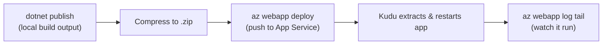
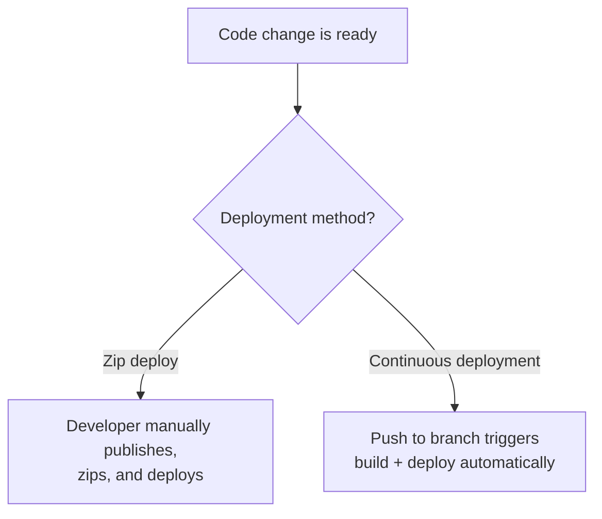

# Deploying an ASP.NET Core App to App Service

## Introduction

Before reading this lesson, you should already be comfortable with **[Introduction to Azure App Service](../16-azure-for-dotnet-developers/16-08-introduction-to-app-service.md)** — specifically, that provisioning an App Service Plan and a Web App gives you an empty, running hosting slot with its own public hostname, but no code of yours inside it yet. This lesson closes that gap: turning the E-Commerce Order Processing Minimal API from `dotnet publish` output into a live, internet-reachable deployment, and then watching it work in real time through its logs.

By the end of this lesson, you will be able to:

- Produce deployment-ready output from an ASP.NET Core project with `dotnet publish`
- Package that output and push it to Azure App Service using zip deploy
- Deploy the E-Commerce Order Processing Minimal API to a live App Service instance
- Confirm a deployment succeeded by calling the live endpoint
- Stream an App Service app's live logs with `az webapp log tail`

## Deploying to App Service — A Layman's Perspective

Picture the serviced office from the previous lesson again — the suite is rented, the lights are on, the building manager is standing by — but the suite itself is still completely empty. Nobody has actually moved a desk, a chair, or a single box into it yet. Moving day works in a very specific order: first, everything you own gets packed into labeled boxes back at your old place — nothing goes anywhere until it's properly boxed. Then, and only then, a moving truck carries those boxes to the new building and hands them to the building's own loading dock, where the building's own staff unpack them into the suite exactly as labeled. You never personally carry a couch through the lobby; you hand off sealed boxes, and the building's own process takes it from there.

That's precisely the two-step shape of deploying an ASP.NET Core app to App Service. "Packing the boxes" is `dotnet publish` — it doesn't touch Azure at all, it just gathers your compiled application, every file it needs to actually run, into one tidy folder on your own machine, exactly as it will need to exist on the other end. "The moving truck and loading dock" is zip deploy — you compress that published folder into a single zip file and hand it to Azure's own deployment engine, which unpacks it inside your App Service instance and starts the app running, without you ever needing to know the internal layout of the "building" your suite lives in.

There's a second, quieter service worth appreciating once you've moved in: a live intercom line to your own suite, so you can hear exactly what's happening inside it without physically walking over. That's what streaming an App Service app's logs gives you — a real-time feed of everything your freshly moved-in app is actually doing right now: which requests are arriving, which ones are succeeding, and which ones are quietly failing in a way you'd otherwise only discover from an angry phone call. Without that intercom line, a deployment either "seems to be up" or "seems to be down," and you're left guessing why. With it, the first request that hits your newly deployed app shows up on your screen the instant it happens.

The one thing this moving-day process deliberately does *not* do is touch the building itself, or any other tenant in it — packing boxes and trucking them to a loading dock never involves reworking the elevators or the electrical wiring, and a zip deploy never touches the App Service Plan underneath your app. That separation — what you deploy versus what you provisioned in the previous lesson — is exactly why the two topics needed two separate lessons: provisioning happens rarely, deployment happens constantly, every time there's a new box to send.

## Deploying to App Service — A Programming Language Perspective

`dotnet publish` compiles an ASP.NET Core project in `Release` configuration and copies everything the app needs at runtime — assemblies, the `web.config` (on Windows) or startup script, static assets, and the runtime configuration — into a single output directory, independent of any deployment target. **Zip deploy** takes that output directory, compressed into a single `.zip` archive, and pushes it to App Service's Kudu deployment engine over its `/api/zipdeploy` endpoint, which the Azure CLI's `az webapp deploy` (or the older `az webapp deployment source config-zip`) command wraps. Kudu extracts the archive into the app's `wwwroot` (or equivalent) directory and restarts the app's worker process, after which the new code is what actually serves requests. `az webapp log tail` opens a persistent connection to App Service's log stream, printing new log lines — including ASP.NET Core's own console logging output — as they're written, without needing to remote into the instance.

## How to Publish and Deploy an ASP.NET Core App

The path from source code to a live App Service deployment always follows the same three stages: publish locally, deploy the published output, then verify.


*Figure 1: Publish, zip, deploy, then observe — the same four commands regardless of app size.*

```text
# Terminal / Azure CLI — illustrative commands, not a literal C# console trace
dotnet publish ./OrderApi.csproj -c Release -o ./publish

Compress-Archive -Path ./publish/* -DestinationPath ./publish.zip -Force

az webapp deploy \
  --resource-group rg-ecommerce-orders \
  --name app-ecommerce-orders \
  --src-path ./publish.zip \
  --type zip

az webapp log tail \
  --resource-group rg-ecommerce-orders \
  --name app-ecommerce-orders
```

**Console Output** (illustrative CLI/deployment output):

```text
Build succeeded.
    OrderApi -> /repo/OrderApi/bin/Release/net10.0/OrderApi.dll
Publish succeeded. Output written to ./publish

Deployment of ./publish.zip to app-ecommerce-orders in progress...
Deployment successful. Site restarted.

2026-08-16T09:14:02  Application started. Press Ctrl+C to shut down.
2026-08-16T09:14:02  Hosting environment: Production
2026-08-16T09:14:02  Content root path: /home/site/wwwroot
2026-08-16T09:14:11  info: OrderApi[0]
                      GET /api/orders responded 200 in 8ms
```

Nothing in `dotnet publish`'s output knows anything about Azure — it's the same published folder you'd copy to any web server. The zip deploy step is what actually crosses into Azure, and the log tail at the bottom is the same ASP.NET Core console logging you've seen locally throughout this curriculum, just streamed from a machine you've never logged into directly.

## Real-Time Example: Deploying the E-Commerce Order API

We deploy the exact Minimal API built in **[Minimal APIs](../10-aspnetcore/10-02-minimal-apis.md)** — the `Order` record and its `/api/orders` endpoints — to the App Service instance provisioned in the previous lesson, then confirm it's actually serving traffic from Azure rather than from a developer's own machine.

```text
# Terminal — illustrative end-to-end deployment of the Order API
dotnet publish ./OrderApi.csproj -c Release -o ./publish
Compress-Archive -Path ./publish/* -DestinationPath ./publish.zip -Force

az webapp deploy \
  --resource-group rg-ecommerce-orders \
  --name app-ecommerce-orders \
  --src-path ./publish.zip \
  --type zip

curl https://app-ecommerce-orders.azurewebsites.net/api/orders
```

**Console Output** (illustrative CLI and HTTP output):

```text
Deployment successful. Site restarted.

HTTP/1.1 200 OK
Content-Type: application/json; charset=utf-8

[
  {"orderId":"ORD-1001","customerName":"Priya Nair","total":249.50,"status":"Shipped"},
  {"orderId":"ORD-1002","customerName":"Miguel Alvarez","total":89.00,"status":"Pending"}
]
```

```text
az webapp log tail --resource-group rg-ecommerce-orders --name app-ecommerce-orders
```

```text
2026-08-16T09:16:44  info: OrderApi[0]
                      GET /api/orders responded 200 in 6ms
2026-08-16T09:17:02  info: OrderApi[0]
                      POST /api/orders responded 201 in 11ms
```

The same `Order` list this curriculum first exercised locally is now being served from `app-ecommerce-orders.azurewebsites.net`, reachable by anything on the internet — a storefront, a warehouse system, a support tool — none of which need to know or care that the code runs inside an App Service instance rather than on a developer's laptop. The log tail at the end matters just as much as the deployment itself: it's the difference between "I deployed something" and "I can prove, right now, that a real request just hit it and got the right response back."

## Zip Deploy vs Continuous Deployment

Zip deploy, as shown above, is a manual, one-shot push: you decide when to publish, when to zip, and when to deploy, and nothing happens automatically in between. **Continuous deployment** — wiring App Service to a GitHub repository or an Azure DevOps pipeline — flips that model: every push to a chosen branch triggers a build and deployment automatically, without a human running any of the commands above by hand. Zip deploy is the right tool for a first deployment, a one-off hotfix, or simply understanding what's actually happening under the hood; continuous deployment is the right tool for a team shipping regularly, where "someone has to remember to deploy" is itself a source of risk.


*Figure 2: Zip deploy is a deliberate, manual action; continuous deployment removes the human step entirely.*

| Aspect | Zip Deploy | Continuous Deployment (GitHub Actions / Azure DevOps) |
|---|---|---|
| Trigger | Manual CLI command | Automatic, on push/merge |
| Setup effort | None — works immediately | Requires a pipeline/workflow file |
| Best for | First deployments, hotfixes, learning the mechanics | Ongoing team delivery |
| Consistency | Depends on whoever runs the command | Same steps every time, no human variance |
| Rollback | Redeploy a previous zip manually | Redeploy a previous commit/build |

## Types of App Service Deployment Methods

1. **Zip Deploy** — the manual `dotnet publish` + `az webapp deploy` workflow this lesson covered directly.
2. **Local Git Deployment** — pushing to a Git remote App Service exposes, triggering a build on the server itself.
3. **GitHub Actions / Azure DevOps Pipelines** — continuous deployment triggered by source control events, contrasted above.
4. **Container Registry Deployment** — deploying a container image instead of a zipped publish output, for apps already packaged as containers.
5. **[App Service Deployment Slots](../16-azure-for-dotnet-developers/16-10-app-service-deployment-slots.md)** — deploying to an isolated staging slot rather than directly to production, covered next.

## What You've Learned & What's Next

`dotnet publish` produces deployment-ready output entirely locally; zip deploy compresses and pushes that output to a live App Service instance via Azure's Kudu engine; and `az webapp log tail` proves, in real time, that the deployed app is actually serving requests correctly — exactly as demonstrated with the E-Commerce Order API.

Continue your learning journey with **[App Service Deployment Slots](../16-azure-for-dotnet-developers/16-10-app-service-deployment-slots.md)**, where we stop deploying straight to production and instead deploy to a safe, isolated staging slot first.

---
*Applies to: .NET 10 / C# 14. Last reviewed 2026-08-16.*
