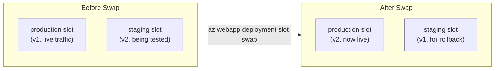
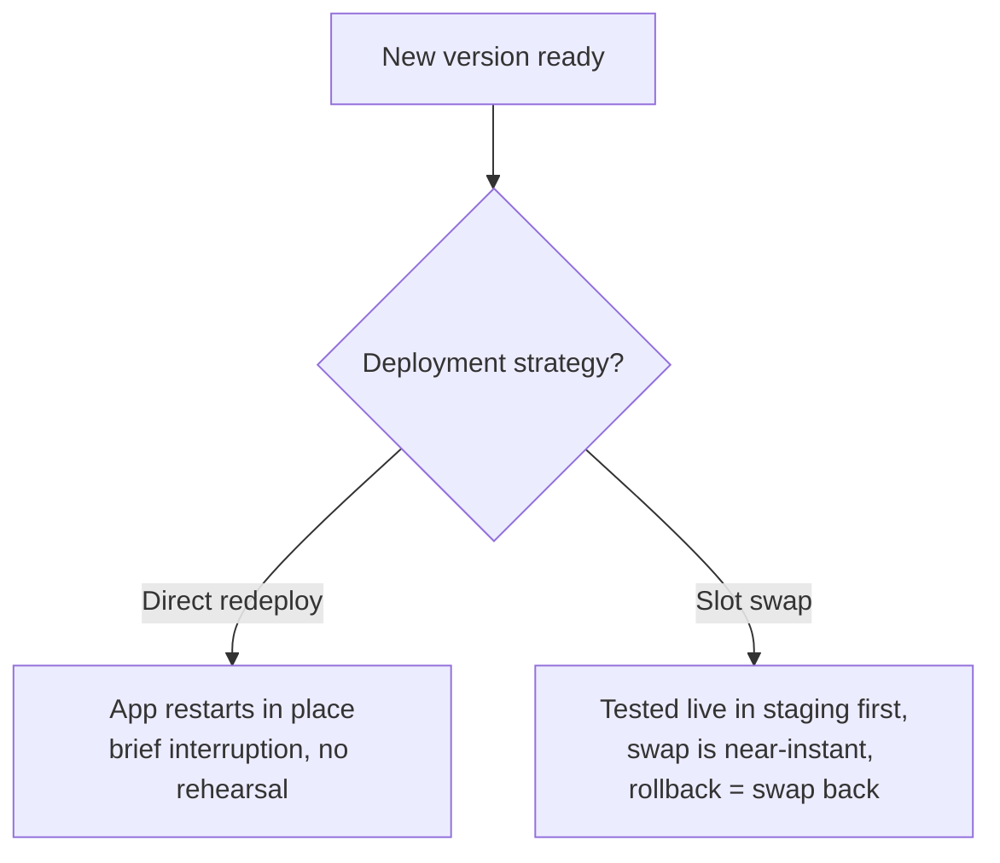

# App Service Deployment Slots

## Introduction

Before reading this lesson, you should already be comfortable with **[Deploying an ASP.NET Core App to App Service](../16-azure-for-dotnet-developers/16-09-deploying-aspnetcore-to-app-service.md)** — specifically, that a zip deploy pushes new code directly onto the App Service instance already serving live traffic. That directness is also the risk: the moment a bad deployment finishes extracting, it's already live, with no safety net. This lesson introduces the feature that removes that risk entirely: **deployment slots**.

By the end of this lesson, you will be able to:

- Explain what an App Service deployment slot is and how it differs from the production slot
- Create a staging slot and deploy to it without affecting production traffic
- Test a new deployment in staging using its own dedicated hostname
- Perform a slot swap to promote staging to production with effectively zero downtime
- Explain why warming up an app before a swap matters, and how App Service automates it

## Deployment Slots — A Layman's Perspective

Imagine a restaurant that never wants to surprise its regular diners with an untested new menu. Instead of testing new dishes on live paying customers, the restaurant keeps a second, fully equipped kitchen and dining room next door — same building, same staff on call, same supplies — reserved entirely for rehearsal. New dishes are cooked there first, tasted by the head chef and a few trusted staff, adjusted, tasted again, until everyone agrees it's ready for the public. Nothing about that rehearsal room affects a single paying customer sitting in the real dining room next door; the two rooms run completely independently, right up until the moment the restaurant is confident.

Here's the clever part: when the new menu is finally ready, the restaurant doesn't move a single dish, plate, or chair between the two rooms. It simply swaps the signage on the two doors — the door that used to say "Dining Room" now says "Rehearsal Room," and vice versa. The paying customers who were already seated never left their seats and never noticed a service interruption; they just discover, at their next order, that they're now being served from what used to be the rehearsal kitchen, fully proven, fully ready, and already warmed up because the ovens in that room had been running the whole time.

That's exactly what an App Service **deployment slot** gives you. The production slot is the real dining room, serving real traffic to real users at the app's real hostname. A **staging slot** is the rehearsal room — a fully separate, fully running App Service instance, with its own hostname, sharing the same building (the same App Service Plan) but completely isolated from production traffic. You deploy new code to staging, test it against its own URL for as long as you need, and only when you're satisfied do you perform a **slot swap** — the sign-swapping moment — which redirects live traffic to what used to be staging, and vice versa, with the users already connected barely noticing a thing.

The one part of this restaurant metaphor worth calling out explicitly is the "already warmed up" detail. A rehearsal kitchen that's been cold and empty until the exact second it becomes the real dining room would serve its first few orders badly — ovens not yet at temperature, staff not yet in rhythm. A slot swap avoids that exact problem by warming the newly-promoted app up — sending it a few requests, letting its startup logic run to completion — *before* the swap is finalized, so the very first real customer to hit the newly-production slot gets an app that's already fully awake, not one still stretching after a nap.

## Deployment Slots — A Programming Language Perspective

An App Service **deployment slot** is a separate, fully functional live App Service instance running within the same App Service Plan as its parent app, with its own hostname (`app-name-slotname.azurewebsites.net`) and its own independent app settings, connection strings, and deployed code — while sharing the plan's underlying compute. A **slot swap**, triggered via `az webapp deployment slot swap`, does not physically move files between instances; it swaps the routing metadata (and any settings *not* marked "sticky" to a slot) between two slots at Azure's front-end layer, so what was previously "staging" instantly becomes what production traffic resolves to, and vice versa — an operation Azure completes with effectively zero downtime for connected clients. Before finalizing a swap, App Service can run a configured **warm-up** step — issuing local requests to the app being promoted, and optionally waiting on `applicationInitialization` configuration — ensuring the newly-promoted slot has already completed startup work before it starts receiving real traffic.

## How to Create a Staging Slot and Swap It

Deployment slots require an App Service Plan tier that supports them (Standard and above, as the previous lesson's plan-sizing example already accounted for) — the workflow itself is three commands: create the slot, deploy to it, and swap it.


*Figure 1: A swap exchanges which slot is "production" without moving a single file — v1 and v2 simply trade places.*

```text
# Azure CLI — illustrative commands, not a literal C# console trace
az webapp deployment slot create \
  --resource-group rg-ecommerce-orders \
  --name app-ecommerce-orders \
  --slot staging

az webapp deploy \
  --resource-group rg-ecommerce-orders \
  --name app-ecommerce-orders \
  --slot staging \
  --src-path ./publish.zip \
  --type zip

curl https://app-ecommerce-orders-staging.azurewebsites.net/api/orders

az webapp deployment slot swap \
  --resource-group rg-ecommerce-orders \
  --name app-ecommerce-orders \
  --slot staging \
  --target-slot production
```

**Console Output** (illustrative CLI/HTTP output):

```text
Slot 'staging' created.
Deployment successful. Site restarted.

HTTP/1.1 200 OK
[{"orderId":"ORD-1001","customerName":"Priya Nair","total":249.50,"status":"Shipped"}]

Swap in progress: staging -> production
Warm-up requests sent to staging.
Swap completed successfully.
```

Notice the swap step happens only after the staging URL was already tested directly — the slot swap command doesn't validate the code for you, it only performs the traffic exchange once a human (or a pipeline) has decided the staging deployment is good. That decision point is the entire reason slots exist.

## Real-Time Example: Zero-Downtime Rollout for the Order API

We continue deploying the E-Commerce Order Processing API, now shipping a change that adds a `cancellationReason` field to cancelled orders — a change worth testing against real traffic patterns in staging before every customer-facing client sees it.

```csharp
// Order.cs — .NET 10 / C# 14 — Real-Time Example (E-Commerce Order Processing)
public sealed record Order(
    string OrderId,
    string CustomerName,
    decimal Total,
    string Status,
    string? CancellationReason = null);
```

```text
# Terminal — deploying v2 to staging, verifying, then swapping
dotnet publish ./OrderApi.csproj -c Release -o ./publish
Compress-Archive -Path ./publish/* -DestinationPath ./publish.zip -Force

az webapp deploy --resource-group rg-ecommerce-orders --name app-ecommerce-orders \
  --slot staging --src-path ./publish.zip --type zip

curl -X PUT https://app-ecommerce-orders-staging.azurewebsites.net/api/orders/ORD-1002/status \
  -H "Content-Type: application/json" \
  -d "{\"status\":\"Cancelled\",\"cancellationReason\":\"Customer changed mind\"}"

az webapp deployment slot swap --resource-group rg-ecommerce-orders \
  --name app-ecommerce-orders --slot staging --target-slot production
```

**Console Output** (illustrative CLI/HTTP output):

```text
Deployment successful. Site restarted.

HTTP/1.1 200 OK
{"orderId":"ORD-1002","customerName":"Miguel Alvarez","total":89.00,
 "status":"Cancelled","cancellationReason":"Customer changed mind"}

Swap in progress: staging -> production
Swap completed successfully.
```

Every order-cancellation client already integrated against the production API kept working the entire time this new field was being built, deployed, and tested — because none of that activity ever touched the production slot until the swap itself, which took effect for already-connected clients without a single dropped connection. If the new field had broken something instead, swapping staging and production back — the same command, reversed — is the rollback plan, and it's just as fast as the original swap.

## Slot Swap vs Direct Redeployment to Production

Redeploying straight to production, as covered in the previous lesson, briefly restarts the app in place — a short window exists where in-flight requests can be interrupted, and there's no isolated place to catch a bad deployment before real users do. A slot swap eliminates both problems: the new code is fully live and fully tested in staging *before* it ever becomes production, and the swap itself only exchanges already-running, already-warmed-up instances, rather than restarting anything mid-swap. The cost is real, though — a slot doubles the running instances for that app (production plus staging), which is exactly why slots require a plan tier that supports the extra capacity.


*Figure 2: Direct redeployment is simpler but riskier; a slot swap trades one extra running instance for a safety net and a rollback path.*

| Aspect | Direct Redeployment | Slot Swap |
|---|---|---|
| Pre-production testing | None — production *is* the test | Full testing against staging's live URL |
| Downtime / interruption risk | Brief restart window | Effectively zero — swap of already-warm instances |
| Rollback | Redeploy the previous build | Swap back — just as fast as the original swap |
| Extra cost | None | One extra running instance (the staging slot) |
| Requires plan tier | Any | Standard tier or above |

## Types of Slot-Related Capabilities

1. **Slot Swap with Preview** — a multi-phase swap that lets you apply production settings to staging and verify before completing the swap.
2. **Auto Swap** — automatically swapping a slot into production the moment a deployment to it succeeds, for fully automated pipelines.
3. **Sticky (Slot-Specific) App Settings** — configuration values, like a connection string, that stay pinned to a slot and don't swap with the code.
4. **Warm-Up via `applicationInitialization`** — configuring specific request paths App Service calls automatically before completing a swap.
5. **[App Service Scaling (Vertical and Horizontal)](../16-azure-for-dotnet-developers/16-11-app-service-scaling.md)** — the next lever for handling load once a deployment strategy is already solid.

## What You've Learned & What's Next

A deployment slot is a fully separate, fully live App Service instance for staging new code without touching production, and a slot swap exchanges which slot is "production" through a near-instant routing change rather than a file copy or a restart — with a warm-up step ensuring the newly promoted slot is never caught cold. The E-Commerce Order API's `CancellationReason` rollout showed exactly this: tested live in staging, swapped in with zero disruption to already-connected clients.

Continue your learning journey with **[App Service Scaling (Vertical and Horizontal)](../16-azure-for-dotnet-developers/16-11-app-service-scaling.md)**, where we look at what happens once deployments are safe and traffic itself starts growing.

---
*Applies to: .NET 10 / C# 14. Last reviewed 2026-08-16.*
