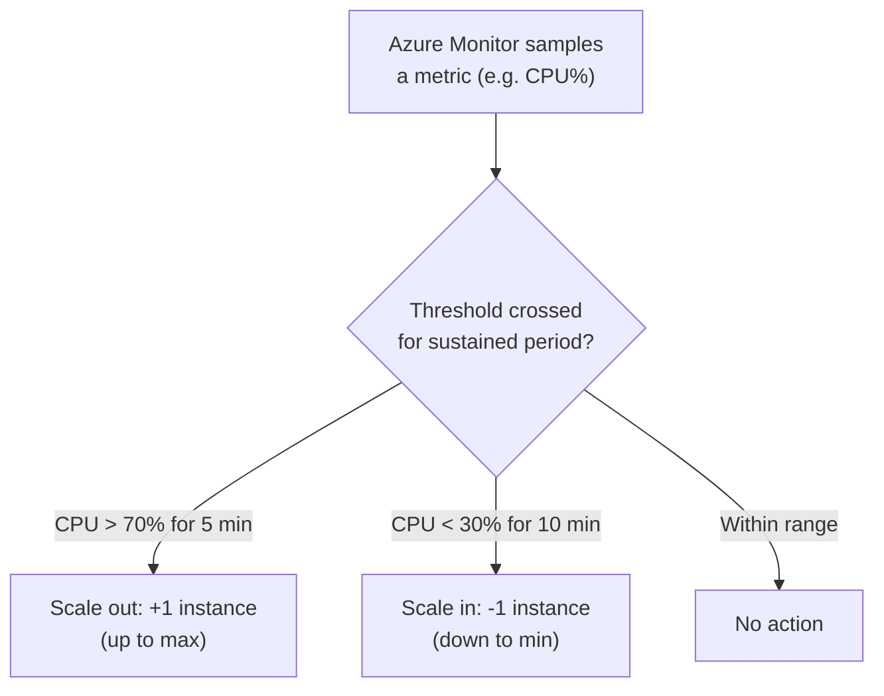
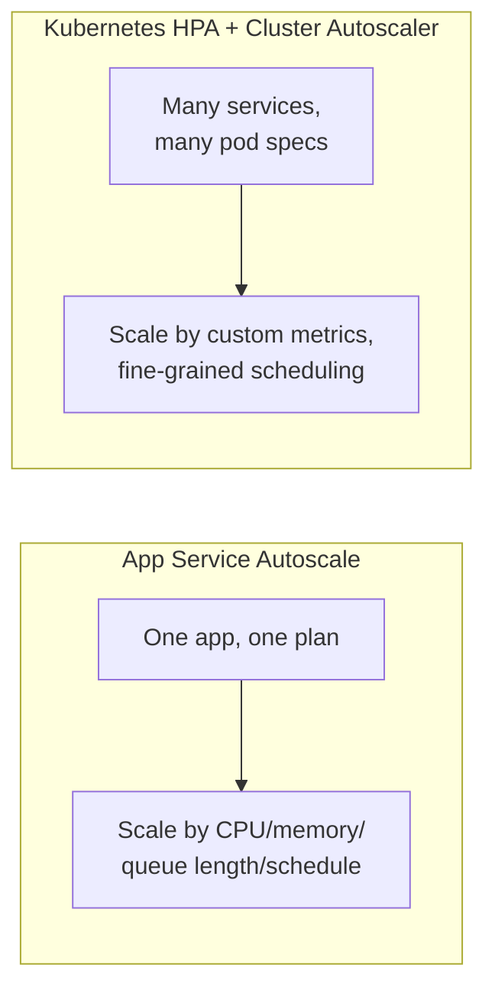

# App Service Scaling (Vertical and Horizontal)

## Introduction

Before reading this lesson, you should already be comfortable with **[App Service Deployment Slots](../16-azure-for-dotnet-developers/16-10-app-service-deployment-slots.md)** — deployments are now safe and reversible, which means it's finally reasonable to ask a different question entirely: what happens when the E-Commerce Order API this module has been deploying starts getting real traffic, and one instance on one modest tier can no longer keep up? This lesson covers the two fundamentally different answers App Service offers, and Azure's autoscale engine that can apply one of them automatically.

By the end of this lesson, you will be able to:

- Distinguish scaling up (vertical) from scaling out (horizontal) in App Service
- Change an App Service Plan's tier to scale up
- Change an App Service Plan's instance count to scale out, manually or automatically
- Define an autoscale rule that reacts to a real metric like CPU percentage or request count
- Recognize when App Service's scaling model is sufficient, and when a workload needs Kubernetes-level control instead

## Scaling — A Layman's Perspective

Picture a small neighborhood grocery store with exactly one checkout lane and one cashier. On a quiet Tuesday morning, that's plenty. But the store's owner has, broadly, two different ways to handle a busier day. The first way: replace that one cashier and that one register with a single much faster cashier at a much faster register — someone who scans items twice as fast, on equipment that never jams. Same one lane, same one line, just handled more capably per customer. The second way: leave the original cashier exactly as they are, and simply open two more checkout lanes next to the first one, each staffed by another cashier, so three separate lines can move at once instead of one line moving faster.

The first approach is scaling **up** (vertical scaling) — you keep the same number of "lanes" but make each one more capable. In App Service terms, that's moving your App Service Plan to a higher tier: more CPU, more memory, per instance, without changing how many instances you're running. The second approach is scaling **out** (horizontal scaling) — you keep each lane exactly as capable as it already was, and instead add more of them running in parallel. In App Service terms, that's increasing the instance count on your plan: the exact same app, running as multiple identical copies, with Azure's own load balancer spreading incoming requests across all of them.

A well-run grocery store, of course, does both, at different times, for different reasons. On an ordinary weekday, one modestly fast cashier is plenty. During the weekly Saturday rush, the owner doesn't rebuild the store into a warehouse superstore just for a few peak hours — they simply open the extra lanes they already have the physical space for, then close them again once the rush passes. That flexible, temporary response to a *predictable, repeating pattern of demand* is what App Service's **autoscale** does automatically: watching a real signal (how busy the store already is right now), and opening or closing extra "lanes" in direct response, without a manager standing there making that call by hand every single time.

There's a limit to how far this particular store can grow, though. At some point, "add another checkout lane" stops being the answer, and the real fix becomes an entirely different kind of building — a warehouse with forklifts, specialized loading docks, and a completely different operational model no ordinary grocery store owner would casually take on. That's the honest ceiling on App Service's own scaling: it's superb at making one kind of "lane" faster or more numerous, but it was never designed to become the kind of intricately orchestrated, many-different-kinds-of-work operation that a system like Kubernetes exists specifically to run.

## Scaling — A Programming Language Perspective

**Scaling up** (vertical scaling) changes the App Service Plan's SKU — its underlying VM size and feature tier (for example, `B1` to `S1` to `P1V3`) — giving every instance on that plan more vCPU and memory without changing how many instances exist, via `az appservice plan update --sku`. **Scaling out** (horizontal scaling) changes the plan's instance count instead, running multiple identical copies of the same app behind Azure's built-in load balancer, via `az appservice plan update --number-of-workers` for a fixed count, or an **autoscale setting** for a dynamic one. An autoscale setting, created with `az monitor autoscale create` and populated with rules via `az monitor autoscale rule create`, defines a minimum, maximum, and default instance count, plus one or more rules that scale out when a metric (CPU percentage, memory percentage, HTTP queue length, or request count) crosses a threshold for a sustained period, and scale back in when it falls again — all evaluated continuously by Azure Monitor without any code change to the app itself.

## How to Configure Autoscale Rules

An autoscale setting attaches to an App Service Plan and evaluates its rules on a schedule, adding or removing instances as thresholds are crossed, always staying within the configured minimum and maximum bounds.


*Figure 1: Autoscale continuously compares a live metric against configured thresholds and adjusts instance count accordingly.*

```text
# Azure CLI — illustrative commands, not a literal C# console trace
az appservice plan update \
  --name plan-ecommerce-orders \
  --resource-group rg-ecommerce-orders \
  --sku S1

az monitor autoscale create \
  --resource-group rg-ecommerce-orders \
  --resource plan-ecommerce-orders --resource-type Microsoft.Web/serverfarms \
  --name orders-autoscale --min-count 2 --max-count 10 --count 2

az monitor autoscale rule create \
  --resource-group rg-ecommerce-orders --autoscale-name orders-autoscale \
  --condition "Percentage CPU > 70 avg 5m" --scale out 1

az monitor autoscale rule create \
  --resource-group rg-ecommerce-orders --autoscale-name orders-autoscale \
  --condition "Percentage CPU < 30 avg 10m" --scale in 1
```

**Console Output** (illustrative CLI output):

```text
Plan 'plan-ecommerce-orders' updated to SKU: S1
Autoscale setting 'orders-autoscale' created (min: 2, max: 10, default: 2)
Rule added: scale OUT by 1 when Percentage CPU > 70 (avg 5m)
Rule added: scale IN by 1 when Percentage CPU < 30 (avg 10m)
```

The plan first scaled up (`B1` to `S1`, more capable instances), and only after that did autoscale get layered on top, controlling *how many* of those more-capable instances are running at any moment. The two axes are independent: you could scale up without ever touching instance count, or scale out on a `B1` plan without ever moving to a bigger SKU — most real systems tune both, but they're two separate dials, not one.

## Real-Time Example: Handling a Flash Sale on the Order API

We continue the **E-Commerce Order Processing** case study. The Order API normally runs comfortably on two instances, but the marketing team has scheduled a one-day flash sale expected to multiply order-creation traffic by ten — exactly the kind of predictable, temporary spike autoscale exists for.

```csharp
// AutoscalePlan.cs — .NET 10 / C# 14 — Real-Time Example (E-Commerce Order Processing)
public sealed record AutoscaleRule(string Metric, string Condition, int InstanceDelta);

AutoscaleRule[] rules =
[
    new("CPU %", "> 70 for 5 minutes", InstanceDelta: +1),
    new("CPU %", "< 30 for 10 minutes", InstanceDelta: -1),
    new("HTTP Queue Length", "> 50 for 3 minutes", InstanceDelta: +2)
];

int currentInstances = 2;
const int min = 2, max = 10;

foreach (AutoscaleRule rule in rules)
{
    int projected = Math.Clamp(currentInstances + rule.InstanceDelta, min, max);
    Console.WriteLine($"{rule.Metric} {rule.Condition} -> instances: {currentInstances} -> {projected}");
}
```

**Console Output:**

```text
CPU % > 70 for 5 minutes -> instances: 2 -> 3
CPU % < 30 for 10 minutes -> instances: 2 -> 2
HTTP Queue Length > 50 for 3 minutes -> instances: 2 -> 4
```

During the actual flash sale, sustained high CPU and a growing HTTP request queue would each independently push the instance count upward, and Azure Monitor evaluates every configured rule continuously, applying whichever ones currently apply — the queue-length rule alone can jump the count by two at once, reacting faster than the more conservative CPU rule. Once the sale ends and both metrics drop, the scale-in rule brings the instance count back down on its own, so the team isn't left paying for ten instances' worth of capacity at 2 a.m. the next day.

## App Service Autoscale vs Kubernetes-Level Scaling

App Service's autoscale is superb at exactly one shape of problem: "run more or fewer copies of this one app, based on this one plan's own metrics." A Kubernetes cluster's Horizontal Pod Autoscaler, combined with a cluster autoscaler, solves a broader problem: scaling many *different* services independently, each potentially on its own container image, with fine-grained control over how pods are scheduled onto nodes, custom metrics beyond CPU/memory/queue length, and orchestration features like pod affinity or rolling updates with custom health gates. If the Order API were the entire system, App Service's autoscale is not just sufficient, it's simpler and cheaper to operate than standing up a cluster to solve the same problem. If the Order API were one of forty interdependent microservices needing independent, finely-tuned scaling policies and custom scheduling rules, AKS starts to earn the operational overhead App Service intentionally avoids exposing.


*Figure 2: App Service autoscale solves single-app capacity; Kubernetes autoscaling solves many-service orchestration.*

| Aspect | App Service Autoscale | Kubernetes (HPA + Cluster Autoscaler) |
|---|---|---|
| Scope | One App Service Plan | An entire multi-service cluster |
| Setup complexity | A few CLI commands | Cluster, manifests, metrics pipeline |
| Metric flexibility | Built-in metrics (CPU, memory, HTTP queue, schedule) | Any custom metric via metrics adapters |
| Scheduling control | None — App Service decides placement | Full control (affinity, taints, tolerations) |
| Best for | A single web app or API workload | Many interdependent services with distinct scaling needs |

## Types of App Service Scaling Configurations

1. **Manual Scale** — a fixed instance count you set directly, with no automatic reaction to load.
2. **Metric-Based Autoscale** — the CPU/memory/queue-length rules demonstrated above.
3. **Schedule-Based Autoscale** — different instance-count profiles for known time windows (e.g. business hours vs overnight).
4. **Scale-Up via Plan Tier Change** — moving to a higher SKU for more resources per instance, independent of instance count.
5. **[Introduction to Azure Functions](../16-azure-for-dotnet-developers/16-12-introduction-to-azure-functions.md)** — a compute model that scales differently again: per-execution, down to zero, rather than per-instance.

## What You've Learned & What's Next

Scaling up changes how capable each App Service instance is by moving to a higher plan tier; scaling out changes how many identical instances are running, either manually or via autoscale rules that react to real metrics like CPU percentage or request queue length. App Service's autoscale handles a single app's capacity extremely well, but a system of many independently-scaling services is where Kubernetes-level orchestration starts to earn its complexity instead.

Continue your learning journey with **[Introduction to Azure Functions](../16-azure-for-dotnet-developers/16-12-introduction-to-azure-functions.md)**, where compute stops being "instances you scale" altogether and becomes something billed and scaled per individual execution.

---
*Applies to: .NET 10 / C# 14. Last reviewed 2026-08-16.*
