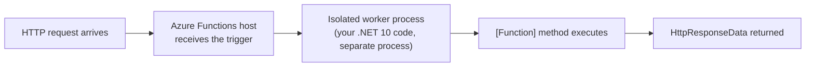
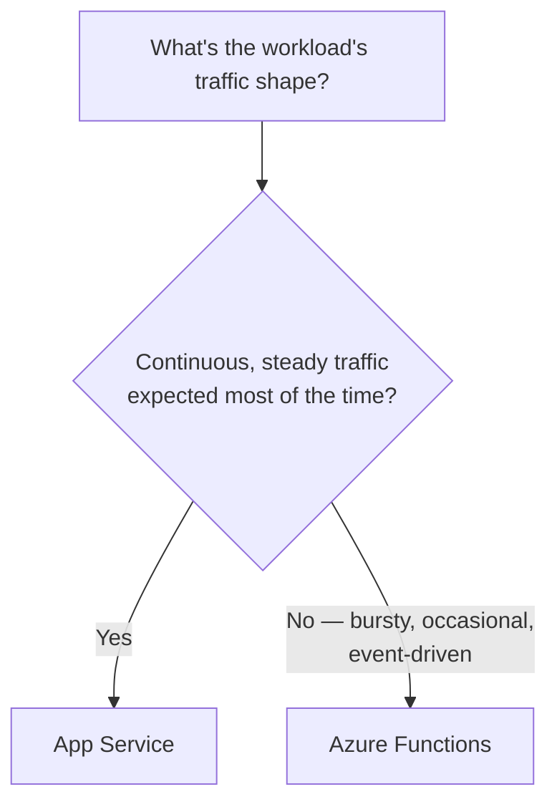

# Introduction to Azure Functions

## Introduction

Before reading this lesson, you should already be comfortable with **[App Service Scaling (Vertical and Horizontal)](../16-azure-for-dotnet-developers/16-11-app-service-scaling.md)** — specifically, that even a well-autoscaled App Service Plan is still, at minimum, always running *something*, ready to answer requests around the clock. This lesson introduces a genuinely different compute model built on the opposite premise: what if nothing runs, and nothing is paid for, until the exact instant it's actually needed? That's **Azure Functions** — serverless compute for small, individually-triggered pieces of code.

By the end of this lesson, you will be able to:

- Explain what "serverless" means in Azure Functions, and how it differs from App Service's always-on model
- Distinguish the Consumption, Premium, and Dedicated (App Service) hosting plans
- Explain why the isolated worker process model is the current, recommended model for .NET Azure Functions
- Write a minimal HTTP-triggered Azure Function using the isolated worker model
- Decide whether a given piece of work belongs on App Service or in a Function

## Azure Functions — A Layman's Perspective

Picture a busy office building again, but this time think about the courier who occasionally delivers packages to it, rather than any of the employees who work there permanently. That courier doesn't have a desk in the building. They don't sit around all day waiting for the next delivery to arrive; they exist, doing something else entirely, until a specific delivery request comes in — and only then do they appear, ride to the building, drop the package at the door, and immediately leave again. The building never pays the courier a salary for sitting idle between deliveries; it pays only for each individual delivery actually made. If ten deliveries need to happen at the exact same moment, ten couriers simply show up at once, entirely independently of each other, and then all ten vanish again the instant their own delivery is done.

That courier is precisely what an Azure Function is, and the difference from the App Service employee sitting at their desk all day (the previous ten lessons' entire subject) is the whole point of this lesson. An App Service instance is provisioned, running, and being paid for continuously, whether or not a single request has arrived in the last hour. An Azure Function, on the Consumption plan specifically, exists in no running state at all between invocations — it scales all the way down to zero, and a request arriving triggers Azure to instantiate exactly the code needed, run it, return the result, and then let it disappear again, with billing calculated only for the actual execution time and memory consumed, measured practically down to the individual invocation.

This courier model is extraordinary for one very specific kind of workload: short, self-contained, occasionally-or-unpredictably-triggered pieces of work, where paying for an always-on employee to sit around waiting would be pure waste. It struggles, by the same logic, with the opposite kind of workload: a courier who's never on-site has to physically travel to the building before doing anything, and that travel time — a genuine, measurable delay called a **cold start** — shows up as extra latency on whichever request happens to arrive right after a quiet period. A business that occasionally cares deeply about that first response being instant, every time, can pay extra to keep a small number of couriers permanently on standby nearby instead of dispatching them from scratch each time — which is exactly what the Premium hosting plan buys, as this lesson's next section covers.

## Azure Functions — A Programming Language Perspective

**Azure Functions** is Azure's serverless compute service: individual functions, each triggered by a specific event (HTTP request, timer, queue message, and more), run in isolation, scale independently, and — on the **Consumption** plan — are billed strictly per execution (execution time × memory) with automatic scale-to-zero when idle. The **Premium** plan trades the strictest pay-per-execution billing for pre-warmed instances that eliminate cold starts, VNet integration, and longer maximum execution durations, while remaining elastically scalable. The **Dedicated (App Service) plan** runs functions on a regular App Service Plan you already own — always on, predictably billed, and typically chosen when a team already has spare App Service capacity or needs functions to run continuously regardless of trigger frequency. On .NET, the **isolated worker process model** runs function code in its own separate .NET process, decoupled from the Functions host's own runtime version — the actively developed, recommended model as of .NET 10, superseding the older **in-process model**, which runs inside the host's process directly and is being phased out in favor of the isolated model's independence and extensibility.

## How to Write a Minimal HTTP-Triggered Function

An isolated-worker Azure Functions project starts from a small `Program.cs` that configures the worker host, plus one or more classes containing `[Function]`-attributed methods, each naming exactly one trigger.


*Figure 1: In the isolated worker model, the Functions host and your actual .NET code run as two separate processes, communicating over a lightweight RPC channel.*

```csharp
// Program.cs — .NET 10 / C# 14 (isolated worker model)
var builder = FunctionsApplication.CreateBuilder(args);
builder.ConfigureFunctionsWebApplication();
builder.Build().Run();
```

```csharp
// GreetFunction.cs — .NET 10 / C# 14 (isolated worker model)
public class GreetFunction(ILogger<GreetFunction> logger)
{
    [Function("Greet")]
    public HttpResponseData Run(
        [HttpTrigger(AuthorizationLevel.Anonymous, "get", Route = "greet/{name}")] HttpRequestData req,
        string name)
    {
        logger.LogInformation("Greet function processed a request for {Name}", name);

        HttpResponseData response = req.CreateResponse(HttpStatusCode.OK);
        response.WriteString($"Hello, {name}! This response came from a serverless function.");
        return response;
    }
}
```

**Console Output** (illustrative local `func start` output, not a literal C# console trace):

```text
Azure Functions Core Tools
Functions:
    Greet: [GET] http://localhost:7071/api/greet/{name}

[2026-08-16T09:20:11.100Z] Worker process started and initialized.
[2026-08-16T09:20:18.442Z] Executing 'Functions.Greet' (Reason='This function was programmatically called...')
[2026-08-16T09:20:18.451Z] Greet function processed a request for Ada
[2026-08-16T09:20:18.460Z] Executed 'Functions.Greet' (Succeeded, Duration=18ms)
```

`FunctionsApplication.CreateBuilder` sets up the isolated worker host, and `ConfigureFunctionsWebApplication` wires in ASP.NET Core-style HTTP integration, letting `HttpRequestData`/`HttpResponseData` (or ASP.NET Core's own request/response types, if preferred) represent the trigger's input and output. The `[HttpTrigger]` attribute is what actually declares this method as an HTTP-triggered function — everything else is ordinary C#, including constructor-injected dependencies like `ILogger<T>`, resolved from the same DI container this curriculum has used since Module 10.

## Real-Time Example: An On-Demand Receipt Function for E-Commerce Orders

We extend the **E-Commerce Order Processing** case study. The main Order API, running continuously on App Service, handles order lookup and status changes — but generating a formatted receipt on request is a small, occasional, self-contained task, a natural fit for a Function rather than another endpoint competing for the API's always-on capacity.

```csharp
// ReceiptFunction.cs — .NET 10 / C# 14 — Real-Time Example (E-Commerce Order Processing)
public sealed record Order(string OrderId, string CustomerName, decimal Total, string Status);

public class ReceiptFunction(ILogger<ReceiptFunction> logger)
{
    private static readonly Dictionary<string, Order> Orders = new()
    {
        ["ORD-1001"] = new("ORD-1001", "Priya Nair", 249.50m, "Shipped")
    };

    [Function("GenerateReceipt")]
    public HttpResponseData Run(
        [HttpTrigger(AuthorizationLevel.Function, "get", Route = "orders/{orderId}/receipt")] HttpRequestData req,
        string orderId)
    {
        if (!Orders.TryGetValue(orderId, out Order? order))
        {
            logger.LogWarning("Receipt requested for unknown order {OrderId}", orderId);
            return req.CreateResponse(HttpStatusCode.NotFound);
        }

        HttpResponseData response = req.CreateResponse(HttpStatusCode.OK);
        response.WriteString(
            $"RECEIPT\nOrder: {order.OrderId}\nCustomer: {order.CustomerName}\n" +
            $"Total: {order.Total:C}\nStatus: {order.Status}");
        return response;
    }
}
```

**Console Output** (illustrative HTTP output):

```text
GET /api/orders/ORD-1001/receipt HTTP/1.1

HTTP/1.1 200 OK

RECEIPT
Order: ORD-1001
Customer: Priya Nair
Total: $249.50
Status: Shipped
```

Receipt requests are rare compared to the constant order lookups and updates the main API handles, and they're entirely self-contained — no reason to keep dedicated App Service capacity warmed up around the clock just for the occasional receipt. On the Consumption plan, this function costs essentially nothing when no one is requesting a receipt, and scales out automatically if, say, a bulk export job suddenly requests a thousand receipts at once — without anyone having pre-provisioned capacity for that burst.

## Azure Functions vs App Service

The decision between these two isn't "which is better," it's "which shape does this workload actually have." App Service is the right home for a workload that's continuously active — an API expected to receive traffic essentially all the time, where an always-on process is simply the cost of doing business, and where the previous lessons' deployment slots and autoscale rules genuinely add value. Azure Functions is the right home for work that's inherently event-driven, bursty, or occasional — a receipt generator, an image thumbnail creator, a nightly report — where paying for constant availability would be paying for idle time nobody needs.


*Figure 2: Continuous, predictable load favors App Service; occasional, event-driven work favors Azure Functions.*

| Aspect | Azure Functions (Consumption) | App Service |
|---|---|---|
| Idle cost | Zero — scales to zero | Always billed for the running plan |
| Cold start | Possible after idle periods | None — always running |
| Billing model | Per execution (time × memory) | Per plan tier, regardless of traffic |
| Max execution duration | Bounded (varies by plan) | Unbounded — long-running processes fine |
| Best for | Short, event-driven, bursty work | Continuously active web apps and APIs |

## Types of Azure Functions Hosting Plans

1. **Consumption Plan** — true serverless, scale-to-zero, pay strictly per execution; the plan used above.
2. **Premium Plan** — pre-warmed instances eliminate cold starts, adds VNet integration, still elastically scaled.
3. **Dedicated (App Service) Plan** — functions running on a regular App Service Plan, always on, predictable cost.
4. **Isolated Worker Model** — the current, recommended .NET execution model demonstrated above, as opposed to the legacy in-process model.
5. **[Azure Functions Bindings and Triggers](../16-azure-for-dotnet-developers/16-13-azure-functions-bindings-triggers.md)** — the declarative connections to other Azure services that make functions genuinely useful beyond HTTP.

## What You've Learned & What's Next

Azure Functions is serverless compute: individual, independently-triggered pieces of code that, on the Consumption plan, scale to zero and cost nothing when idle — a fundamentally different economic and operational model from App Service's always-on instances. The isolated worker process model, shown in both the `Greet` and `GenerateReceipt` functions above, is the current, recommended way to write .NET functions, running your code in its own process rather than inside the Functions host directly.

Continue your learning journey with **[Azure Functions Bindings and Triggers](../16-azure-for-dotnet-developers/16-13-azure-functions-bindings-triggers.md)**, where we go beyond the HTTP trigger used here to triggers like Timer and Queue, and to bindings that connect a function to other Azure services without hand-written SDK code.

---
*Applies to: .NET 10 / C# 14. Last reviewed 2026-08-16.*
