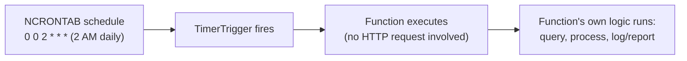
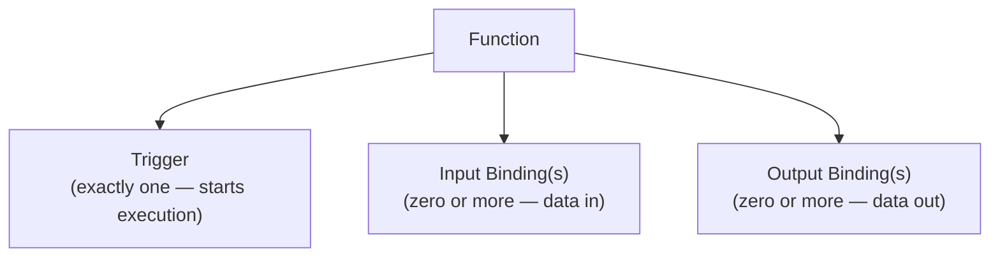

# Azure Functions Bindings and Triggers

## Introduction

Before reading this lesson, you should already be comfortable with **[Introduction to Azure Functions](../16-azure-for-dotnet-developers/16-12-introduction-to-azure-functions.md)** — specifically, the `[HttpTrigger]` attribute that started the `Greet` and `GenerateReceipt` functions. That attribute is one example of a much broader idea this lesson names precisely: **triggers**, the thing that starts a function running at all, and **bindings**, the broader family of declarative connections — of which a trigger is just one kind — that let a function talk to other Azure services without hand-written client SDK code.

By the end of this lesson, you will be able to:

- Define a trigger and name the most common trigger types beyond HTTP
- Define a binding, and distinguish input bindings from output bindings
- Explain why bindings reduce boilerplate compared to calling an Azure SDK client directly
- Write a Timer-triggered function using an NCRONTAB schedule expression
- Build a nightly overdue-books report function for the Library/Inventory Management case study

## Triggers and Bindings — A Layman's Perspective

Think about the difference between a doorbell and a hotel room's utility hookups. A doorbell is a single, specific event: someone presses it, and exactly one thing happens as a direct result — the chime sounds, and whoever's inside knows to go answer the door right now. Nothing else in the house cares about the doorbell, and the doorbell doesn't care about anything else in the house; it exists for one job, starting one specific response. A function's **trigger** is that doorbell — the one specific event, and only one, that causes the function to run at all. It might be an HTTP request arriving, a clock reaching a scheduled time, a new message landing in a queue, or a new file appearing in storage — but whichever it is, a function has exactly one trigger, and nothing runs until it fires.

Now think about everything else in a well-appointed hotel room that's already wired up and ready to use the moment you check in: a phone line already connected to the building's switchboard, an electrical outlet already wired into the building's own power grid, a mail slot already connected to the building's own mail-sorting room. You never had to run your own wiring to get any of these — they were simply *there*, pre-connected, the moment you arrived, and using them is as simple as picking up the phone or plugging something in. Those pre-wired connections are what a function's **bindings** are: declarative, ready-made connections to other systems — a database, a storage account, a queue, an email service — that Azure sets up for you automatically, based on nothing more than an attribute in your code declaring what you need. An **input binding** is like the mail slot delivering something *to* you before you even ask; an **output binding** is like the phone line letting you place a call *out* without you ever having to understand how the switchboard itself routes calls.

The distinction matters because a trigger and a binding solve two entirely different problems, even though they're declared in a strikingly similar way in code. The trigger answers "when does this function even start running?" — there's always exactly one answer. Bindings answer a completely different question — "once it's running, what does it need to read from, or write out to, along the way?" — and there can be several, or none at all. A Timer-triggered function that only writes a line to its own log needs no bindings whatsoever beyond its trigger; a Timer-triggered function that reads from one storage account and writes a report to another needs its one trigger *plus* two separate bindings, each pre-wired exactly like that hotel room's phone line and mail slot, so the function's own code never has to construct and authenticate an Azure SDK client by hand just to use them.

## Triggers and Bindings — A Programming Language Perspective

A **trigger** is the mechanism that causes a function to execute; every function has exactly one, expressed as an attribute on the triggering parameter — `[HttpTrigger]`, `[TimerTrigger]`, `[QueueTrigger]`, and `[BlobTrigger]` cover the large majority of real functions, with `[TimerTrigger]` accepting an **NCRONTAB** expression (six fields: second, minute, hour, day, month, day-of-week) defining when it fires. A **binding** is a declarative attribute-based connection between a function and a data source or sink, resolved by the Functions runtime rather than by application code constructing an SDK client directly; an **input binding** supplies data *into* the function (for example, reading a blob's contents into a parameter), and an **output binding** sends data *out* of the function (for example, writing a return value to a queue or a storage container) — both configured purely through attributes and parameter types, with the underlying authentication and client plumbing handled entirely by the Functions host on your behalf.

## How to Write a Timer-Triggered Function

A Timer trigger fires on a recurring schedule defined by an NCRONTAB expression, with no external event required to start it — the clock itself is the event.


*Figure 1: A Timer trigger's "request" is simply the clock reaching a scheduled moment — no caller, no HTTP request, no queue message involved at all.*

```csharp
// PingFunction.cs — .NET 10 / C# 14 (isolated worker model)
public class PingFunction(ILogger<PingFunction> logger)
{
    [Function("Ping")]
    public void Run([TimerTrigger("0 0 2 * * *")] TimerInfo timer)
    {
        logger.LogInformation("Ping fired at {Time}. Next run: {Next}",
            DateTime.UtcNow, timer.ScheduleStatus?.Next);
    }
}
```

**Console Output** (illustrative host log output, not a literal C# console trace):

```text
[2026-08-16T02:00:00.010Z] Executing 'Functions.Ping' (Reason='Timer fired at 2026-08-16T02:00:00.0000000Z')
[2026-08-16T02:00:00.014Z] Ping fired at 2026-08-16T02:00:00Z. Next run: 2026-08-17T02:00:00Z
[2026-08-16T02:00:00.020Z] Executed 'Functions.Ping' (Succeeded, Duration=10ms)
```

`"0 0 2 * * *"` reads as second 0, minute 0, hour 2, every day, every month, every day-of-week — 2 AM, daily. No HTTP request, no queue message, and no human action triggers this function at all; the Functions host itself tracks the schedule and invokes the method the moment the clock reaches it, which is exactly the behavior the real-time example below relies on.

## Real-Time Example: A Nightly Overdue-Books Report for Library/Inventory Management

We open the **Library/Inventory Management** case study inside this module with a function that needs to run once, every night, with no external trigger at all: scanning current loans for anything overdue and logging a report a librarian can review each morning.

```csharp
// OverdueReportFunction.cs — .NET 10 / C# 14 — Real-Time Example (Library/Inventory Management)
public sealed record Loan(string BookTitle, string BorrowerName, DateOnly DueDate);

public class OverdueReportFunction(ILogger<OverdueReportFunction> logger)
{
    private static readonly List<Loan> ActiveLoans =
    [
        new("Clean Code", "Amara Okafor", new DateOnly(2026, 8, 10)),
        new("The Pragmatic Programmer", "Wei Zhang", new DateOnly(2026, 8, 20)),
        new("Design Patterns", "Priya Nair", new DateOnly(2026, 8, 5))
    ];

    [Function("NightlyOverdueReport")]
    public void Run([TimerTrigger("0 0 2 * * *")] TimerInfo timer)
    {
        DateOnly today = DateOnly.FromDateTime(DateTime.UtcNow);
        List<Loan> overdue = ActiveLoans.Where(loan => loan.DueDate < today).ToList();

        logger.LogInformation("Nightly overdue report — {Count} overdue loan(s) as of {Today}",
            overdue.Count, today);

        foreach (Loan loan in overdue)
        {
            int daysLate = today.DayNumber - loan.DueDate.DayNumber;
            logger.LogWarning("OVERDUE: '{Title}' borrowed by {Borrower}, {Days} day(s) late",
                loan.BookTitle, loan.BorrowerName, daysLate);
        }
    }
}
```

**Console Output** (illustrative host log output, assuming `today` is 2026-08-16):

```text
[2026-08-16T02:00:00.030Z] Executing 'Functions.NightlyOverdueReport' (Reason='Timer fired...')
[2026-08-16T02:00:00.041Z] Nightly overdue report — 2 overdue loan(s) as of 2026-08-16
[2026-08-16T02:00:00.045Z] OVERDUE: 'Clean Code' borrowed by Amara Okafor, 6 day(s) late
[2026-08-16T02:00:00.048Z] OVERDUE: 'Design Patterns' borrowed by Priya Nair, 11 day(s) late
[2026-08-16T02:00:00.052Z] Executed 'Functions.NightlyOverdueReport' (Succeeded, Duration=22ms)
```

Nobody visits a page, calls an API, or drops a message in a queue to produce this report — the trigger is purely the clock reaching 2 AM, every night, indefinitely, without a single line of scheduling code written by hand. A production version of this function would typically add an **output binding** — writing the report directly to Blob storage or sending it through an email-sending service binding — rather than only logging it, which is exactly the kind of "send data out, declaratively" job an output binding exists to remove boilerplate from.

## Triggers vs Bindings

A trigger and a binding are declared almost identically — an attribute on a parameter — but they answer different questions and follow different cardinality rules. A trigger answers "what starts this function," and there is always exactly one per function; a binding answers "what does this function read from or write to along the way," and there can be zero, one, or several, freely mixed as input and output. It's also worth being precise about a subtlety: a trigger is technically a special case of an input binding — it both starts the function *and* supplies its initial data (the HTTP request, the queue message, the timer's own schedule info) — but it's given its own name and its own cardinality rule because of the unique role it plays in starting execution at all.


*Figure 2: Every function has exactly one trigger, and any number of additional input or output bindings layered on top of it.*

| Aspect | Trigger | Binding (Input / Output) |
|---|---|---|
| Cardinality per function | Exactly one | Zero or more |
| Role | Starts the function execution | Supplies data in, or sends data out |
| Examples | HTTP, Timer, Queue, Blob (as trigger) | Blob input/output, Table storage, Cosmos DB, Service Bus, SendGrid |
| Removes boilerplate for | Deciding *when* code runs | Hand-written SDK client code for reading/writing data |

## Types of Common Triggers and Bindings

1. **`[HttpTrigger]`** — starts a function on an incoming HTTP request, as shown in the previous lesson.
2. **`[TimerTrigger]`** — starts a function on an NCRONTAB schedule, as demonstrated by the overdue-report function above.
3. **`[QueueTrigger]`** — starts a function when a new message lands in a Storage Queue or Service Bus queue.
4. **`[BlobTrigger]` / Blob input-output bindings** — starts a function when a blob is created, or reads/writes blob content declaratively without a trigger.
5. **[Durable Functions](../16-azure-for-dotnet-developers/16-14-durable-functions.md)** — stateful orchestration built on top of ordinary triggers and bindings, for workflows spanning multiple function calls.

## What You've Learned & What's Next

A trigger is the one specific event — HTTP, Timer, Queue, Blob, and more — that starts a function running at all, while bindings are the broader, optional family of declarative input and output connections to other Azure services that remove hand-written SDK boilerplate from the function's own code. The nightly overdue-books report demonstrated a Timer trigger running entirely on its own schedule, with no external caller involved whatsoever.

Continue your learning journey with **[Durable Functions](../16-azure-for-dotnet-developers/16-14-durable-functions.md)**, where individual triggered functions like this one become steps in a longer, stateful, multi-step workflow.

---
*Applies to: .NET 10 / C# 14. Last reviewed 2026-08-16.*
