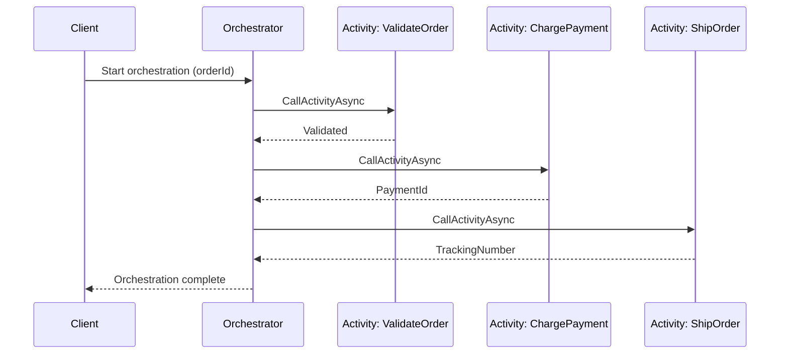
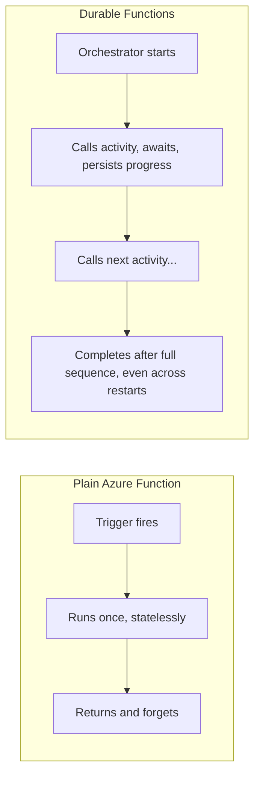

# Durable Functions

## Introduction

Before reading this lesson, you should already be comfortable with **[Azure Functions Bindings and Triggers](../16-azure-for-dotnet-developers/16-13-azure-functions-bindings-triggers.md)** — a regular Azure Function that wakes up on a trigger, runs to completion in seconds, and forgets everything the moment it returns. That statelessness is a feature for a single unit of work, but it becomes a real problem the moment a *business process* needs several steps, in order, possibly spanning minutes or days, with the outcome of each step determining what happens next. This lesson introduces **Durable Functions**, an extension to Azure Functions that adds exactly that missing capability: state and orchestration on top of the same serverless compute model.

By the end of this lesson, you will be able to:

- Explain why a regular Azure Function cannot safely coordinate a multi-step, long-running process on its own
- Distinguish an **orchestrator function** from the **activity functions** it coordinates
- Implement the **function chaining** pattern to run a sequence of steps where each one depends on the last
- Trace how Durable Functions persists progress so an orchestration survives restarts and delays
- Connect function chaining conceptually to the Saga pattern's orchestration style from Module 12

## Durable Functions — A Layman's Perspective

Picture a hospital's outpatient day-surgery unit versus its case-management office. The day-surgery unit handles one procedure at a time: a patient arrives, the procedure happens, the patient leaves, and the room is cleared for the next case. Nobody on that team is expected to remember what happened after the patient walked out the door — their job started and ended within a single, short, self-contained visit. That's a regular Azure Function: triggered, does its one job, returns, and forgets.

Now picture a very different kind of care: a patient going through a multi-stage treatment plan that unfolds over weeks — first a lab workup, then a specialist consultation once the labs come back, then a procedure once the specialist signs off, then a follow-up appointment after the procedure heals. No single department can own this. What actually makes it work is a case manager: one person (or one binder, if you prefer the older metaphor) who doesn't perform any of the medical steps themselves, but who tracks exactly which step the patient is on, calls the next department when a step finishes, and — crucially — can pick up exactly where things left off even if the case manager herself goes on vacation for a week in the middle of it. She isn't repeating the lab workup from scratch when she gets back; she's consulting her notes, sees the labs are already done, and picks up right at "schedule the specialist."

That case manager is the **orchestrator function**, and each medical department she calls into — the lab, the specialist, the surgical team, the follow-up clinic — is an **activity function**. The activity functions are exactly like the day-surgery unit: each one does a bounded, short piece of work and reports back. The orchestrator is the only thing in the whole picture that needs to remember the *sequence* — what's done, what's next, and what to do if a step comes back with bad news. And just like the case manager's binder survives her vacation, the orchestrator's progress survives the underlying compute host restarting, redeploying, or simply going idle for hours between steps — because the case history isn't kept in her head, it's kept in a durable record that outlives any single work session.

This distinction matters because a naive attempt to build a multi-step process out of regular, stateless functions runs into exactly the problem case management solves: something has to remember where the process is between steps, and something has to survive gaps of unpredictable length between one step finishing and the next one being ready to start. Bolting that memory on with your own database tables and polling loops is exactly the kind of infrastructure code a platform capability should be handling instead — which is what Durable Functions actually is: the case-management layer, provided by Azure, sitting on top of the same serverless functions you already know.

## Durable Functions — A Programming Language Perspective

Durable Functions is an extension library (`Microsoft.Azure.Functions.Worker.Extensions.DurableTask` in the .NET 10 isolated worker model) that adds two new function types to the Azure Functions programming model. An **orchestrator function**, marked with `[Function]` and an `[OrchestrationTrigger]` parameter, calls activity functions through `context.CallActivityAsync<T>(name, input)` and awaits the result exactly like ordinary `async`/`await` code — but the Durable Task Framework replays this function's code against a persisted **history table** every time it resumes, which is why orchestrator code must be deterministic (no direct `DateTime.Now`, no direct I/O — use the context's equivalents instead). An **activity function**, marked with `[ActivityTrigger]`, is an ordinary, stateless function that does the real work — a database call, an HTTP request, a calculation — and has no restrictions on determinism at all. The orchestration's state (which activities have completed, with what results) is persisted automatically to Azure Storage (or another supported backend), which is what lets an orchestration survive a host restart mid-way through a multi-day process.

## How to Build an Orchestrator Function in C#

The simplest and most common Durable Functions pattern is **function chaining**: call activity A, feed its output into activity B, feed that output into activity C — a straight-line sequence where each step depends on the previous one's success.


*Figure 1: Function chaining — the orchestrator calls three activity functions strictly in sequence, persisting progress after each one.*

```csharp
// OrderOrchestration.cs — .NET 10 / C# 14
using Microsoft.Azure.Functions.Worker;
using Microsoft.DurableTask;
using Microsoft.DurableTask.Client;

public sealed record StepResult(string Step, bool Success, string Detail);

public static class OrderOrchestration
{
    [Function(nameof(RunOrderOrchestrator))]
    public static async Task<List<StepResult>> RunOrderOrchestrator(
        [OrchestrationTrigger] TaskOrchestrationContext context)
    {
        string orderId = context.GetInput<string>()!;
        var results = new List<StepResult>();

        results.Add(await context.CallActivityAsync<StepResult>(nameof(ValidateOrder), orderId));
        results.Add(await context.CallActivityAsync<StepResult>(nameof(ChargePayment), orderId));
        results.Add(await context.CallActivityAsync<StepResult>(nameof(ShipOrder), orderId));

        return results;
    }

    [Function(nameof(ValidateOrder))]
    public static StepResult ValidateOrder([ActivityTrigger] string orderId) =>
        new("ValidateOrder", true, $"Order {orderId} passed validation");

    [Function(nameof(ChargePayment))]
    public static StepResult ChargePayment([ActivityTrigger] string orderId) =>
        new("ChargePayment", true, $"Payment captured for order {orderId}");

    [Function(nameof(ShipOrder))]
    public static StepResult ShipOrder([ActivityTrigger] string orderId) =>
        new("ShipOrder", true, $"Order {orderId} handed to carrier");

    [Function(nameof(StartOrderOrchestration))]
    public static async Task<string> StartOrderOrchestration(
        [DurableClient] DurableTaskClient client, string orderId)
    {
        return await client.ScheduleNewOrchestrationInstanceAsync(
            nameof(RunOrderOrchestrator), orderId);
    }
}
```

**Console Output** *(illustrative — from `func start` locally, then triggering with `orderId=ORD-9001`)*:

```text
[Durable] Orchestration 'a1f9c...' started for input 'ORD-9001'
[Durable] Activity 'ValidateOrder' completed: Order ORD-9001 passed validation
[Durable] Activity 'ChargePayment' completed: Payment captured for order ORD-9001
[Durable] Activity 'ShipOrder' completed: Order ORD-9001 handed to carrier
[Durable] Orchestration 'a1f9c...' completed with status: Completed
```

Every line prefixed `[Durable] Activity ... completed` corresponds to a checkpoint written to durable storage. If the Functions host restarted between `ChargePayment` and `ShipOrder`, the orchestrator would replay from history, skip re-running the two completed activities, and resume directly at `ShipOrder` — no lost progress, and no risk of double-charging the customer.

## Real-Time Example: An Order Pipeline in E-Commerce Order Processing

We extend the `Order` type from earlier modules with a genuine multi-step pipeline: **validate the order, charge the payment, then ship it** — three steps that must happen in order, where a failure partway through must not silently vanish. This is the same shape of problem the Saga pattern (Module 12, Lesson 44) solved with an orchestrated saga and compensating actions; Durable Functions is one concrete, serverless way to *implement* that orchestration style, using the platform's own persisted history instead of hand-rolled state tables.

```csharp
// OrderPipelineOrchestrator.cs — .NET 10 / C# 14 — Real-Time Example (E-Commerce Order Processing)
using Microsoft.Azure.Functions.Worker;
using Microsoft.DurableTask;

public sealed record Order(string OrderId, decimal Total, string CustomerEmail);
public sealed record PipelineOutcome(string OrderId, string FinalStatus, IReadOnlyList<string> StepsCompleted);

public static class OrderPipelineOrchestrator
{
    [Function(nameof(RunOrderPipeline))]
    public static async Task<PipelineOutcome> RunOrderPipeline(
        [OrchestrationTrigger] TaskOrchestrationContext context)
    {
        Order order = context.GetInput<Order>()!;
        var completed = new List<string>();

        try
        {
            await context.CallActivityAsync(nameof(ValidateOrderActivity), order);
            completed.Add("Validated");

            await context.CallActivityAsync(nameof(ChargePaymentActivity), order);
            completed.Add("PaymentCharged");

            await context.CallActivityAsync(nameof(ShipOrderActivity), order);
            completed.Add("Shipped");

            return new PipelineOutcome(order.OrderId, "Completed", completed);
        }
        catch (TaskFailedException ex)
        {
            // A real pipeline would call a compensating activity here, mirroring
            // the Saga pattern's compensating actions -- e.g. RefundPaymentActivity.
            return new PipelineOutcome(order.OrderId, $"Failed: {ex.Message}", completed);
        }
    }

    [Function(nameof(ValidateOrderActivity))]
    public static void ValidateOrderActivity([ActivityTrigger] Order order)
    {
        if (order.Total <= 0) throw new InvalidOperationException("Order total must be positive");
    }

    [Function(nameof(ChargePaymentActivity))]
    public static void ChargePaymentActivity([ActivityTrigger] Order order) { /* payment gateway call */ }

    [Function(nameof(ShipOrderActivity))]
    public static void ShipOrderActivity([ActivityTrigger] Order order) { /* carrier API call */ }
}
```

**Console Output** *(illustrative)*:

```text
[Durable] Orchestration started for order ORD-9001 (Total=249.99)
[Durable] ValidateOrderActivity completed
[Durable] ChargePaymentActivity completed
[Durable] ShipOrderActivity completed
[Durable] Orchestration result: PipelineOutcome { OrderId = ORD-9001, FinalStatus = Completed, StepsCompleted = [Validated, PaymentCharged, Shipped] }
```

If `ChargePaymentActivity` had thrown, the orchestrator's `catch` block would run with `completed` showing only `["Validated"]` — the exact information a compensating step would need to know that nothing needs refunding yet, only that the pipeline stopped early.

## Durable Functions vs. Plain Azure Functions

A plain Azure Function is a superb building block for one bounded unit of work but has no concept of "what came before" or "what should happen after a long wait" — coordinating multiple functions requires bolting on your own state store, retry logic, and timers. Durable Functions doesn't replace plain functions; activity functions largely *are* plain functions, just called from an orchestrator instead of from a trigger directly. The orchestrator is the only genuinely new concept, and it exists specifically to hold the sequencing logic that a stateless function was never meant to hold.


*Figure 2: A plain function's single run versus a durable orchestration's persisted, multi-step sequence.*

| Aspect | Plain Azure Function | Durable Functions Orchestrator |
|---|---|---|
| State between invocations | None — fully stateless | Persisted automatically in a history store |
| Typical duration | Seconds | Minutes to days (even months for eternal orchestrations) |
| Coordinates other functions? | No — one function, one job | Yes — calls activity functions in a defined sequence |
| Survives host restart mid-process? | N/A (nothing to survive) | Yes — replays history and resumes exactly where it left off |
| Code determinism requirement | None | Orchestrator code must be deterministic; activities have none |

## Types of Durable Functions Patterns

1. **Function Chaining** — the sequential pattern this lesson covered: step B only starts once step A succeeds.
2. **Fan-out/Fan-in** — run many activities in parallel, then wait for all of them before continuing (e.g., checking inventory across many warehouses at once).
3. **Async HTTP APIs** — an orchestrator exposes a status-check endpoint so a client can poll a long-running operation instead of holding a connection open.
4. **Monitor** — a recurring orchestration that polls some condition on a timer until it's satisfied, then completes.
5. **Human Interaction** — an orchestration pauses on `context.WaitForExternalEvent`, waiting for an approval or manual step before resuming.
6. **Eternal Orchestrations** — an orchestrator that calls `context.ContinueAsNew` to run indefinitely, useful for long-lived aggregators.

## What You've Learned & What's Next

Durable Functions adds exactly one missing capability to Azure Functions: a persisted, replay-safe way to coordinate multiple steps over an unbounded amount of time, using an orchestrator function to sequence ordinary activity functions. Function chaining is the simplest version of that idea, and it's the same orchestration style the Saga pattern relies on to keep a multi-service business process consistent.

Continue your learning journey with **[Azure Container Apps](../16-azure-for-dotnet-developers/16-15-azure-container-apps.md)**, where we move from serverless functions to a managed container platform built for running full microservices without owning a Kubernetes cluster.

---
*Applies to: .NET 10 / C# 14. Last reviewed 2026-08-16.*
