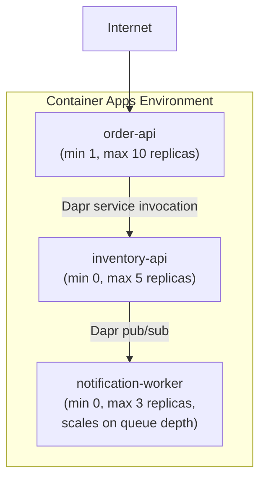
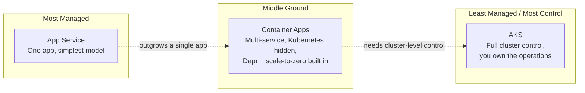

# Azure Container Apps

## Introduction

Before reading this lesson, you should already be comfortable with **[Durable Functions](../16-azure-for-dotnet-developers/16-14-durable-functions.md)** and, further back, with App Service as the simplest managed way to run a .NET web app. App Service is superb for a single web app or API, but it starts to strain the moment a system is actually a *set* of small, independently deployable services that need to talk to each other, scale independently, and sometimes talk in Kubernetes-native ways App Service was never designed to expose. Reaching for full Azure Kubernetes Service at that point solves the problem, but hands you a cluster to operate — nodes to patch, control-plane upgrades to plan, YAML to maintain. This lesson introduces **Azure Container Apps**, built specifically to sit in the gap between those two.

By the end of this lesson, you will be able to:

- Explain what problem Azure Container Apps solves that App Service cannot
- Explain what operational burden Azure Container Apps removes compared to running your own AKS cluster
- Describe how Container Apps is built on Kubernetes internally while hiding that fact from the developer
- Recognize Dapr's role as a built-in sidecar for service-to-service calls, state, and pub/sub
- Explain scale-to-zero and when it meaningfully reduces cost for a microservice
- Decide when Container Apps is the right fit versus App Service or AKS

## Azure Container Apps — A Layman's Perspective

Imagine three ways a growing business might house its operations. The first is renting a single serviced office suite — the landlord handles the building, the electricity, security, and cleaning; you just move your desk in and start working. That's fine for one small team, but the moment the business grows into five separate departments that each need their own space, their own hours, and the ability to hire and shrink independently, a single suite starts to feel cramped and tangled — everyone's phone lines and supply closets get mixed up together.

The second option is buying an entire industrial park outright — laying your own roads, running your own power substation, hiring your own security staff and facilities crew. You get to decide absolutely everything: which building gets more electricity this month, which road gets widened, exactly how each loading dock is configured. But now you're not just running a business anymore — you're also running a small utility company and a public-works department on the side, whether you wanted that job or not.

The third option is leasing space in a well-run business park that someone else built and maintains. The park already has roads, power, water, and security handled by the operator — you don't touch any of that, and you never even think about it. But unlike the single serviced suite, this park gives each of your departments its own building, with its own lease that can grow or shrink independently, its own front door, and its own ability to talk directly to a neighboring department's building over the park's shared internal roads whenever it needs to. If a department has no work overnight, its building can go completely dark and cost nothing until the morning shift needs it again, and the park brings it back online the moment someone walks up to the door.

That business park is Azure Container Apps. Underneath, the park absolutely does run on real infrastructure with real roads and real utilities — in Container Apps' case, an actual Kubernetes cluster — but you, the tenant, never see a Kubernetes manifest, never patch a node, and never plan a control-plane upgrade. You just describe your building: what container image runs inside it, how many copies you want at minimum and maximum, and what it needs to talk to. The park operator (Azure) handles literally everything below that line. And critically, unlike the single serviced office (App Service), you get several independent buildings — one per microservice — each scaling, updating, and, when idle, going dark independently of the others, without you ever having to buy and run the industrial park yourself (AKS).

## Azure Container Apps — A Programming Language Perspective

**Azure Container Apps** is a fully managed serverless container platform built on top of Kubernetes and open-source projects **Dapr**, **KEDA**, and **Envoy**, with all three abstracted away from the developer entirely — there is no `kubectl`, no cluster, and no YAML manifest exposed by default. A .NET application is packaged as an OCI container image (typically via a `Dockerfile`, as covered in Module 15) and deployed as a **Container App**, one of possibly many **Container Apps** sharing a **Container Apps Environment** — the logical boundary that groups apps sharing a virtual network and Log Analytics workspace. Scaling rules are declared per app (HTTP concurrency, CPU, a queue depth via KEDA scalers, and so on), including a minimum replica count of **zero**, at which point Azure stops billing for that app's compute entirely until the next inbound request wakes it. Dapr integration is opt-in per app via a sidecar container Azure injects automatically, giving the app simple HTTP/gRPC building blocks for service invocation, state management, and pub/sub without hand-rolling that plumbing in application code.

## How to Deploy a Microservice to Azure Container Apps

Deploying a .NET microservice to Container Apps starts from a container image, exactly like App Service's container deployment path, but adds environment-level networking and per-service scaling rules that App Service has no equivalent for.


*Figure 1: Three independently scaling Container Apps sharing one environment, two of them scaled to zero when idle.*

```text
# Azure CLI — illustrative output, run against a demo subscription

$ az containerapp env create \
    --name orders-env \
    --resource-group rg-ecommerce-demo \
    --location eastus

$ az containerapp create \
    --name order-api \
    --resource-group rg-ecommerce-demo \
    --environment orders-env \
    --image myregistry.azurecr.io/order-api:10.0 \
    --target-port 8080 \
    --ingress external \
    --min-replicas 1 \
    --max-replicas 10 \
    --enable-dapr \
    --dapr-app-id order-api

Container app created. Access your app at:
https://order-api.orange-forest-01a2b3.eastus.azurecontainerapps.io
```

```csharp
// Program.cs — .NET 10 / C# 14 — minimal API deployed as a Container App
var builder = WebApplication.CreateBuilder(args);
var app = builder.Build();

app.MapGet("/health", () => Results.Ok(new { status = "healthy", service = "order-api" }));
app.MapGet("/orders/{id}", (string id) => Results.Ok(new { orderId = id, status = "Processing" }));

app.Run();
```

**Console Output** *(illustrative — `curl` against the deployed endpoint)*:

```text
$ curl https://order-api.orange-forest-01a2b3.eastus.azurecontainerapps.io/health
{"status":"healthy","service":"order-api"}
```

Nothing in `Program.cs` mentions Azure, Kubernetes, or Dapr at all — it's an ordinary minimal API. Everything that makes it a scalable, independently-deployable microservice living in a shared environment came from the `az containerapp create` flags, not from application code.

## Real-Time Example: An E-Commerce Microservice Mesh on Container Apps

Continuing the E-Commerce Order Processing domain, imagine the order pipeline from the previous lesson split into three independently deployed services instead of one monolith: `order-api` (always at least one replica, since checkout traffic is constant), `inventory-api` (idle most of the day, scaled to zero), and `notification-worker` (triggered only when a queue has messages, also scaled to zero). Container Apps lets each be deployed, scaled, and billed entirely independently, while Dapr handles the calls between them without each service needing its own HTTP client boilerplate or service-discovery logic.

```csharp
// InventoryCheck.cs — .NET 10 / C# 14 — Real-Time Example (E-Commerce Order Processing)
// Runs inside order-api; calls inventory-api through the Dapr sidecar, not a raw HttpClient.
using Dapr.Client;

public sealed record StockCheck(string Sku, int AvailableUnits);

public static class InventoryCheck
{
    public static async Task<StockCheck> CheckStockAsync(DaprClient dapr, string sku)
    {
        return await dapr.InvokeMethodAsync<StockCheck>(
            HttpMethod.Get,
            appId: "inventory-api",
            methodName: $"stock/{sku}");
    }
}
```

**Console Output** *(illustrative — from `order-api`'s logs after a checkout request)*:

```text
[order-api] Checking stock for SKU WH-STD-BLK via Dapr -> inventory-api
[order-api] StockCheck { Sku = WH-STD-BLK, AvailableUnits = 42 }
[order-api] Stock sufficient, proceeding with order ORD-9012
```

The application code never hardcodes `inventory-api`'s network address, port, or replica count — the Dapr sidecar resolves it within the shared Container Apps Environment. If `inventory-api` had been scaled to zero moments before this call, Container Apps would transparently start a replica, add a brief cold-start delay to this one request, and route the call through once ready.

## Azure Container Apps vs. App Service vs. AKS

App Service is the right choice when the whole system genuinely is one deployable web app or API — it has no native concept of multiple independently scaling services sharing a network, and no sidecar model for service-to-service concerns. Full AKS gives complete control over the underlying Kubernetes cluster — custom controllers, specific networking plugins, node-level tuning — at the cost of the team owning that cluster's entire lifecycle. Container Apps deliberately gives up some of AKS's control in exchange for a platform that manages the cluster, the Dapr sidecars, and the autoscaling rules on your behalf, while still supporting multiple independently scaling services and revision-based traffic splitting that App Service simply has no model for.


*Figure 2: The compute spectrum this sub-area is building toward — App Service, Container Apps, and AKS as increasing control at the cost of increasing operational ownership.*

| Aspect | App Service | Azure Container Apps | AKS (full) |
|---|---|---|---|
| Unit of deployment | One web app/API | Multiple independently scaling container apps | Any number of pods/deployments you define |
| Kubernetes exposed to you? | No | No — hidden entirely | Yes — full `kubectl` access |
| Scale-to-zero | No (limited on some plans) | Yes, built in via KEDA | Only if you configure it yourself |
| Service-to-service plumbing | Roll your own | Dapr sidecar, built in | Roll your own or install Dapr/Istio yourself |
| Operational ownership | Azure manages almost everything | Azure manages the cluster; you manage apps | You manage nodes, upgrades, networking, and apps |

## Types of Azure Container Apps Building Blocks

1. **[AKS Fundamentals](../16-azure-for-dotnet-developers/16-16-aks-fundamentals.md)** — the full Kubernetes platform Container Apps builds on and hides.
2. **Container Apps Jobs** — a run-to-completion variant for scheduled or event-triggered batch-style work rather than always-on services.
3. **Revisions and Traffic Splitting** — Container Apps' built-in mechanism for canary or blue-green deployments across app versions.
4. **Dapr Building Blocks** — service invocation, state management, and pub/sub, each usable independently of the others.
5. **KEDA Scalers** — the library of triggers (queue depth, HTTP concurrency, cron schedules) driving scale-to-zero and scale-out decisions.

## What You've Learned & What's Next

Azure Container Apps exists for the exact gap between a single App Service app and a fully self-managed AKS cluster: multiple independently scaling microservices, Dapr-powered service-to-service calls, and true scale-to-zero, all without ever touching a Kubernetes manifest. It's built on Kubernetes, but that fact stays entirely behind the platform's curtain.

Continue your learning journey with **[AKS Fundamentals](../16-azure-for-dotnet-developers/16-16-aks-fundamentals.md)**, where we step behind that curtain and look at what Azure Kubernetes Service actually manages for you — and what it still leaves in your hands.

---
*Applies to: .NET 10 / C# 14. Last reviewed 2026-08-16.*
