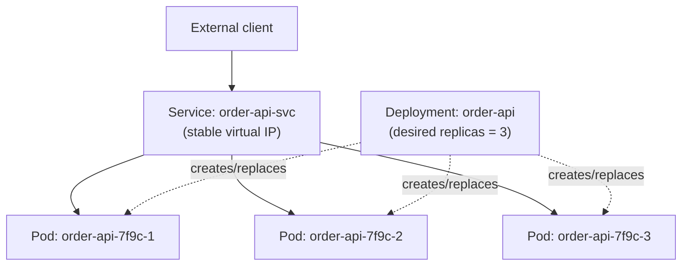
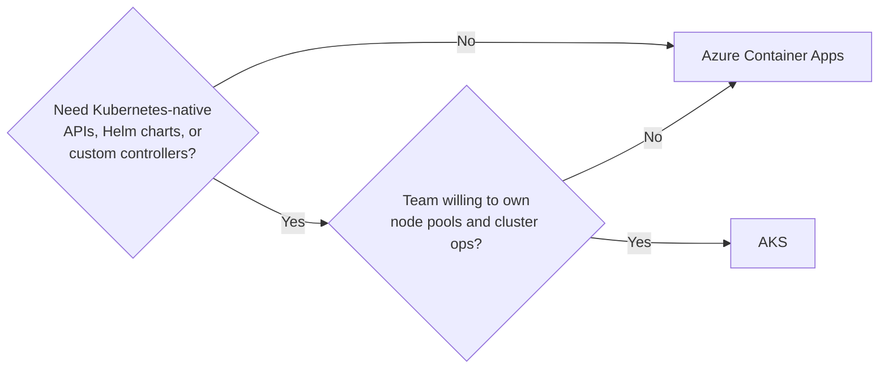

# AKS Fundamentals

## Introduction

Before reading this lesson, you should already be comfortable with **[Azure Container Apps](../16-azure-for-dotnet-developers/16-15-azure-container-apps.md)** — a platform that runs on Kubernetes but deliberately hides it from you. This lesson steps behind that curtain. **Azure Kubernetes Service (AKS)** is Azure's managed Kubernetes offering: Azure runs and patches the control plane, while you define and manage the workloads — and, to a real degree, the node pools — running on top of it. Understanding AKS's core vocabulary is what lets you judge, later in this sub-area, whether a given system actually needs that level of control.

By the end of this lesson, you will be able to:

- Explain what "managed Kubernetes" means in AKS specifically — what Azure runs versus what you run
- Define **pod**, **deployment**, and **service** and explain how they relate to each other
- Use basic `kubectl` commands to inspect and deploy workloads on an AKS cluster
- Deploy a simple .NET API to AKS as a `Deployment` fronted by a `Service`
- Decide when full AKS control is worth taking on over Azure Container Apps

## AKS Fundamentals — A Layman's Perspective

Think of the difference between renting a fully serviced apartment and buying and running your own small apartment building. In the serviced apartment (Container Apps), someone else owns the building, fixes the boiler, replaces the roof, and handles the elevator inspection — you just move your furniture in and live your life. Owning and running the building yourself is a different proposition entirely: you now decide exactly how many units there are, what each unit's floor plan looks like, which tenants go in which unit, how the building's plumbing is laid out, and how the whole thing responds when three units suddenly need more hot water at once. Nobody makes those decisions for you anymore, but nobody restricts your choices either.

Azure Kubernetes Service is a curious hybrid of the two: Azure genuinely owns and maintains the building's foundation, structural frame, and central utility systems — this is the **control plane**, the brains of Kubernetes that decide where workloads go and keep track of the whole cluster's health — and you never see or touch that part directly. But above the foundation, you own everything: the actual floors of the building (the **node pools**, which are just virtual machines Azure provisions on your behalf but which you size, scale, and patch-schedule), and every individual unit inside those floors (your actual application workloads). You decide how many units exist, how big each one is, what goes in each one, and how the building responds to a sudden crowd.

The vocabulary Kubernetes uses for "what goes in each unit" is worth learning precisely, because everything else in Kubernetes builds on it. A **pod** is the smallest thing Kubernetes actually runs — think of it as a single occupied room, holding one primary occupant (your container) and occasionally a small support cast that always moves in and out with it. Pods are disposable on purpose; if one gets damaged, Kubernetes doesn't repair it, it simply moves in a fresh replacement in a new room. A **deployment** is your standing instruction to the building manager: "always keep exactly three of this type of room occupied, and if one becomes vacant, immediately fill a new one from this same blueprint." A **service** is the building directory and internal phone system combined — a stable, unchanging way to reach "whichever rooms are currently running the checkout application," regardless of which specific rooms happen to be occupied at this exact moment, since rooms come and go constantly as the deployment self-heals and scales.

Owning the building is real work — you're now responsible for choosing good blueprints, keeping the utility system healthy, and reacting when something above the foundation breaks — but it also means nothing about the building's design is decided for you. That trade-off, not any particular feature, is the entire reason AKS exists alongside Container Apps.

## AKS Fundamentals — A Programming Language Perspective

**AKS** provisions a Kubernetes cluster where Azure fully manages the **control plane** (the API server, scheduler, etcd state store) at no direct compute cost, while you manage one or more **node pools** — Azure VM scale sets that run your actual workloads and that you choose the VM size, OS, and autoscaling rules for. A **Pod** is Kubernetes' smallest deployable unit, wrapping one or more tightly-coupled containers sharing network and storage. A **Deployment** is a declarative object specifying a desired pod template and replica count; the Kubernetes control loop continuously reconciles actual state toward that desired state, replacing failed pods automatically. A **Service** provides a stable virtual IP and DNS name in front of a dynamic set of pods selected by label, decoupling callers from any individual pod's ephemeral identity. All of these are typically declared as YAML manifests applied via `kubectl`, the Kubernetes command-line client that talks to the managed control plane's API server.

## How to Deploy a .NET API to AKS

A minimal .NET deployment to AKS needs two manifests: a `Deployment` describing the desired pods, and a `Service` exposing them.


*Figure 1: A Service providing a stable address in front of pods that a Deployment continuously keeps at three replicas.*

```text
# order-api-deployment.yaml — illustrative Kubernetes manifest
apiVersion: apps/v1
kind: Deployment
metadata:
  name: order-api
spec:
  replicas: 3
  selector:
    matchLabels: { app: order-api }
  template:
    metadata:
      labels: { app: order-api }
    spec:
      containers:
        - name: order-api
          image: myregistry.azurecr.io/order-api:10.0
          ports: [{ containerPort: 8080 }]
---
apiVersion: v1
kind: Service
metadata:
  name: order-api-svc
spec:
  selector: { app: order-api }
  ports: [{ port: 80, targetPort: 8080 }]
  type: ClusterIP
```

```text
# Azure CLI + kubectl — illustrative session against a demo AKS cluster

$ az aks get-credentials --resource-group rg-ecommerce-demo --name aks-ecommerce-demo
Merged "aks-ecommerce-demo" as current context in C:\Users\demo\.kube\config

$ kubectl apply -f order-api-deployment.yaml
deployment.apps/order-api created
service/order-api-svc created

$ kubectl get pods
NAME                         READY   STATUS    RESTARTS   AGE
order-api-7f9c8d6b5-4kxvq    1/1     Running   0          12s
order-api-7f9c8d6b5-9wq2m    1/1     Running   0          12s
order-api-7f9c8d6b5-p7hln    1/1     Running   0          12s

$ kubectl get services
NAME            TYPE        CLUSTER-IP     PORT(S)   AGE
order-api-svc   ClusterIP   10.0.142.55    80/TCP    14s
```

The three `order-api-*` pod names are unpredictable and change every time a pod is replaced — which is precisely why every caller talks to `order-api-svc` instead, never to a pod name directly.

## Real-Time Example: Migrating an E-Commerce Service from Container Apps to AKS

Continuing the E-Commerce Order Processing domain, imagine `order-api` has outgrown Container Apps: the platform team now needs a custom Kubernetes admission controller to enforce tagging policy across every workload in the cluster, plus a specific CNI plugin for a compliance requirement — capabilities Container Apps doesn't expose. Moving the same container image to AKS keeps the workload itself unchanged; what changes is the manifest describing it and the operational responsibility for the cluster underneath.

```csharp
// Program.cs — .NET 10 / C# 14 — unchanged from the Container Apps version
var builder = WebApplication.CreateBuilder(args);
var app = builder.Build();

app.MapGet("/health", () => Results.Ok(new { status = "healthy", service = "order-api" }));
app.MapGet("/orders/{id}", (string id) => Results.Ok(new { orderId = id, status = "Processing" }));

app.Run();
```

**Console Output** *(illustrative — `kubectl exec` into a running pod, then curling locally)*:

```text
$ kubectl exec -it order-api-7f9c8d6b5-4kxvq -- curl -s localhost:8080/health
{"status":"healthy","service":"order-api"}
```

The application code is identical to the Container Apps example from the previous lesson — nothing about the .NET API itself needed to change. What moved was purely operational: the team now owns the `Deployment` replica count, the node pool sizing behind it, and the cluster-wide policies layered on top, in exchange for capabilities Container Apps' simpler model didn't expose.

## AKS vs. Azure Container Apps

The decision between the two rarely hinges on the application code at all — as the example above shows, the same container image runs unmodified on either platform. It hinges on whether the team needs Kubernetes-native control (custom controllers, specific CNI plugins, fine-grained RBAC across many teams sharing one cluster, existing Helm charts) badly enough to justify owning node pool patching, cluster upgrades, and cluster-wide capacity planning. Most microservice systems never reach that bar; a meaningful minority genuinely do.


*Figure 2: The practical decision point between Container Apps and full AKS.*

| Aspect | Azure Container Apps | AKS |
|---|---|---|
| Control plane | Fully hidden, fully managed | Managed by Azure, still Kubernetes underneath |
| Node pools | Not exposed to you | You choose VM size, count, and OS patching cadence |
| `kubectl` access | None | Full access |
| Custom controllers/CRDs/Helm | Not supported | Fully supported |
| Operational overhead | Minimal | Real — upgrades, node health, capacity planning |

## Types of AKS Building Blocks

1. **[AKS Networking and Scaling](../16-azure-for-dotnet-developers/16-17-aks-networking-and-scaling.md)** — how traffic actually reaches pods and how the cluster grows and shrinks, covered next.
2. **Node Pools** — groups of VMs, potentially of different sizes, backing different workload types in the same cluster.
3. **Namespaces** — a way of partitioning one cluster into logically isolated groups of resources, often per team or environment.
4. **ConfigMaps and Secrets** — Kubernetes-native ways of injecting configuration and sensitive values into pods without baking them into the image.
5. **Helm Charts** — a packaging format for reusable, parameterized sets of Kubernetes manifests.

## What You've Learned & What's Next

AKS gives you a genuinely managed Kubernetes control plane while leaving node pools and workloads in your hands — pods as the smallest unit, deployments keeping a desired replica count running, and services giving callers a stable address regardless of which pods currently exist. That control is exactly what Container Apps trades away for simplicity, and it's worth taking on only when a system's requirements actually demand Kubernetes-native capabilities.

Continue your learning journey with **[AKS Networking and Scaling](../16-azure-for-dotnet-developers/16-17-aks-networking-and-scaling.md)**, where we go deeper into how traffic actually enters a cluster and how pods and nodes scale to meet demand.

---
*Applies to: .NET 10 / C# 14. Last reviewed 2026-08-16.*
