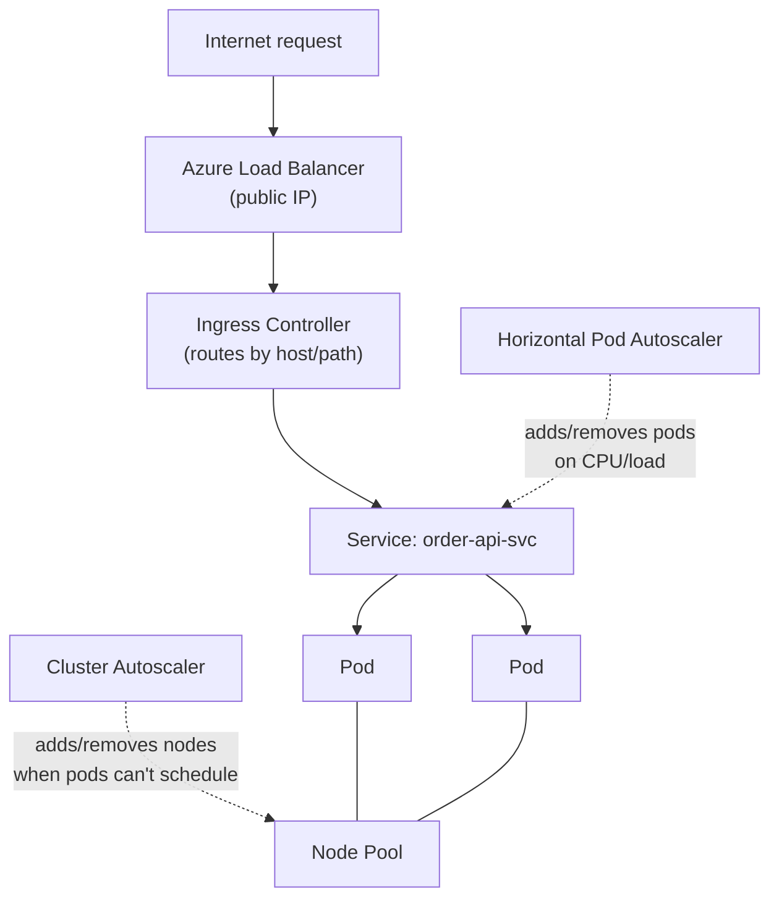
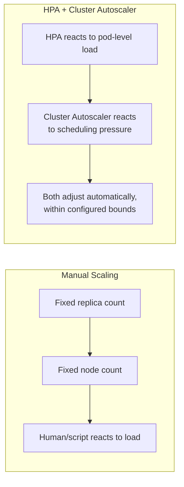

# AKS Networking and Scaling

## Introduction

Before reading this lesson, you should already be comfortable with **[AKS Fundamentals](../16-azure-for-dotnet-developers/16-16-aks-fundamentals.md)** — pods, deployments, and services as the basic vocabulary of a workload running on AKS. That lesson deliberately left two questions unanswered: how does traffic from outside the cluster actually reach a `Service`, and how does the cluster grow or shrink to meet real demand rather than sitting at a fixed size forever? This lesson answers both, covering how pods get IP addresses in the first place, how pod count and node count each scale independently, and how external traffic is routed in.

By the end of this lesson, you will be able to:

- Distinguish the **kubenet** and **Azure CNI** networking models and explain the trade-off between them
- Explain what the **Horizontal Pod Autoscaler (HPA)** scales and what triggers it
- Explain what the **Cluster Autoscaler** scales and how it complements the HPA rather than duplicating it
- Explain the role of an **Ingress controller** in routing external HTTP traffic to the correct service
- Trace a request from the internet down to a specific pod through all of these pieces together

## AKS Networking and Scaling — A Layman's Perspective

Picture a large apartment complex again, but now focus on two separate questions the previous lesson didn't touch: how does mail actually get delivered to the right unit, and how does the complex handle a sudden wave of new residents?

On the mail question, a complex has two very different ways it could be wired up. One approach gives every single unit its own full street address, directly on the city's own postal grid — any mail carrier in the city can find any unit directly, with no extra sorting step, but the complex needs the city to hand it a genuinely large block of addresses up front, and the city's address book grows by one entry per unit. That's **Azure CNI** — every pod gets a real, routable IP address from the same virtual network the rest of your Azure resources live on, simple and direct, at the cost of consuming a real IP address per pod. The other approach gives the complex itself just one street address, and an internal mailroom inside the building sorts every piece of incoming mail to the correct unit using its own private internal numbering system that the outside world never sees. That's **kubenet** — pods get IP addresses from a private, internal-only range, and a translation layer handles routing between that private range and the real network, using far fewer real IP addresses at the cost of that extra translation step.

Now, the sudden-wave-of-residents question, which actually has two separate answers layered on top of each other. First: what happens when the *people currently living* in existing units suddenly need more from the building — more hot water at rush hour, more elevator capacity? The building doesn't add units for this; it temporarily runs its existing systems harder, or, if demand justifies it, moves in a few identical furnished units from a nearby holding depot and takes them right back out again once the rush passes. That's the **Horizontal Pod Autoscaler** — watching CPU or request load on already-provisioned pods, adding and removing pod copies within the building's current footprint. Second, and separately: what happens when the building itself is completely full, every unit occupied, and there simply isn't a spare unit to bring in? At that point, no amount of clever furniture-shuffling helps — the complex needs to construct or lease an entirely new wing. That's the **Cluster Autoscaler** — watching whether pods are failing to schedule because no node has room, and adding or removing entire nodes (VMs) from the cluster in response.

Finally, how does a visitor arriving from the street even know which building entrance to walk through, out of many buildings in the complex, each hosting a different service? A single **doorman station** at the complex's main gate reads each visitor's stated destination and directs them to the correct building's specific entrance — never letting them wander the property looking for it themselves. That's the **Ingress controller**: one entry point for all external HTTP traffic, routing by hostname or path to the correct internal `Service`, so the cluster doesn't need a separate public entry point per application.

## AKS Networking and Scaling — A Programming Language Perspective

**Azure CNI** assigns each pod a routable IP address directly from the cluster's Azure virtual network subnet, making pods first-class citizens on that network at the cost of pre-allocating enough subnet address space for every pod the cluster might ever run. **Kubenet** instead assigns pods addresses from a separate, cluster-internal CIDR range and relies on network address translation and Azure route tables to reach them, conserving VNet address space at the cost of some routing indirection and reduced compatibility with certain Azure networking features. The **Horizontal Pod Autoscaler** is a Kubernetes controller that adjusts a `Deployment`'s replica count based on observed metrics (commonly CPU or memory, via `metrics-server`, or custom metrics) against a target defined in a `HorizontalPodAutoscaler` object. The **Cluster Autoscaler** is a separate, node-pool-level controller that watches for pods stuck in `Pending` state due to insufficient node capacity and adds nodes to the relevant node pool — or removes underutilized nodes — independently of any single deployment's HPA. An **Ingress** resource, served by an Ingress controller (such as NGINX or Azure Application Gateway Ingress Controller), defines host/path-based routing rules that map external HTTP(S) requests to internal `Service` objects, typically fronted by a single Azure Load Balancer public IP.

## How Traffic and Scaling Work Together in AKS

The full journey of one request touches all four pieces this lesson introduces, in a fixed order: network addressing decides how packets move at all, ingress decides which service a request is destined for, and the two autoscalers decide whether enough pods and nodes exist to handle it.


*Figure 1: A request flowing from the internet through the load balancer, ingress, and service to a pod, with the HPA and Cluster Autoscaler independently adjusting pod and node counts.*

```text
# kubectl + Azure CLI — illustrative session against a demo AKS cluster

$ kubectl apply -f order-api-ingress.yaml
ingress.networking.k8s.io/order-api-ingress created

$ kubectl autoscale deployment order-api --cpu-percent=70 --min=3 --max=15
horizontalpodautoscaler.autoscaling/order-api autoscaled

$ az aks update \
    --resource-group rg-ecommerce-demo \
    --name aks-ecommerce-demo \
    --enable-cluster-autoscaler \
    --min-count 2 \
    --max-count 8

$ kubectl get hpa
NAME        REFERENCE              TARGETS   MINPODS   MAXPODS   REPLICAS   AGE
order-api   Deployment/order-api   82%/70%   3         15        6          4m
```

```text
# order-api-ingress.yaml — illustrative Kubernetes manifest
apiVersion: networking.k8s.io/v1
kind: Ingress
metadata:
  name: order-api-ingress
spec:
  rules:
    - host: orders.contoso-demo.com
      http:
        paths:
          - path: /
            pathType: Prefix
            backend:
              service:
                name: order-api-svc
                port: { number: 80 }
```

`kubectl get hpa` shows `82%/70%` — actual CPU usage already above the 70% target — which is exactly why the HPA has grown replicas from its floor of 3 up to 6. If those 6 replicas' combined resource requests exceeded what the current node pool has free, the Cluster Autoscaler, configured separately in the `az aks update` call, would add nodes on its own; the HPA never talks to node capacity directly.

## Real-Time Example: A Flash Sale in E-Commerce Order Processing

Continuing the E-Commerce Order Processing domain, imagine `order-api` normally runs at 3 replicas on a 2-node pool, comfortably handling regular traffic. A flash sale is announced, and traffic to `/orders` spikes tenfold within minutes. The HPA and Cluster Autoscaler react to this independently and in sequence, not simultaneously by coincidence.

```csharp
// Program.cs — .NET 10 / C# 14 — unchanged; scaling is entirely infrastructure-level
var builder = WebApplication.CreateBuilder(args);
var app = builder.Build();

app.MapPost("/orders", (OrderRequest request) =>
    Results.Created($"/orders/{request.OrderId}", new { request.OrderId, status = "Accepted" }));

app.Run();

public sealed record OrderRequest(string OrderId, decimal Total);
```

**Console Output** *(illustrative — `kubectl get hpa,nodes` sampled at three points during the flash sale)*:

```text
-- T+0 min (before sale) --
NAME        REPLICAS   NODES
order-api   3          2

-- T+3 min (traffic spikes, HPA reacts first) --
NAME        REPLICAS   NODES
order-api   15         2   (some pods Pending -- insufficient node capacity)

-- T+6 min (Cluster Autoscaler reacts to Pending pods) --
NAME        REPLICAS   NODES
order-api   15         5   (all 15 pods now Running)
```

The sequence matters: the HPA responded within seconds to rising CPU by asking for more replicas, but hit a wall the moment the existing 2 nodes ran out of room — those extra pods sat `Pending`. Only then did the Cluster Autoscaler, watching for exactly that `Pending` condition, provision three more nodes, after which the already-requested 15th replica finally scheduled. Neither autoscaler could have handled the flash sale alone.

## HPA + Cluster Autoscaler vs. Manual Scaling

Manually setting a fixed replica count and a fixed node pool size is simpler to reason about but requires a human (or an external script) to predict load and react to it — exactly the kind of guesswork a flash sale makes impossible to get right in advance. The combination of HPA and Cluster Autoscaler automates both layers of that reaction, but the two must be configured coherently: an HPA `maxReplicas` set far above what the node pool's `maxCount` could ever host just produces a permanent backlog of `Pending` pods.


*Figure 2: Manual scaling requires a human in the loop; HPA and Cluster Autoscaler close that loop automatically, each at a different layer.*

| Aspect | Manual Scaling | HPA + Cluster Autoscaler |
|---|---|---|
| What triggers a change | A person or external script | Live metrics (HPA) and scheduling failures (Cluster Autoscaler) |
| Reaction time | As fast as the human/script | Seconds (HPA) to a few minutes (Cluster Autoscaler, VM provisioning) |
| Risk of over-provisioning | Depends entirely on prediction accuracy | Bounded by configured min/max on both layers |
| Handles both pod and node capacity? | Only if manually coordinated | Yes, as two coordinated but independent controllers |

## Types of AKS Networking and Scaling Building Blocks

1. **[Virtual Machines for .NET Workloads](../16-azure-for-dotnet-developers/16-18-virtual-machines-for-dotnet.md)** — the raw VM layer that node pools are ultimately built from, covered next.
2. **Network Policies** — Kubernetes-native rules restricting which pods may talk to which other pods, layered on top of whichever CNI model is chosen.
3. **Azure Application Gateway Ingress Controller (AGIC)** — an Azure-native alternative to a self-managed NGINX ingress controller.
4. **KEDA-based Pod Autoscaling** — scaling pods on external signals (queue depth, event counts) rather than only CPU/memory, as an alternative or supplement to the standard HPA.
5. **Node Pool Taints and Tolerations** — a mechanism for reserving specific nodes for specific workloads within one cluster.

## What You've Learned & What's Next

AKS networking and scaling operate as layered, largely independent systems: kubenet or Azure CNI decides how pods get addressed at all, an Ingress controller decides how external traffic finds the right service, the Horizontal Pod Autoscaler reacts to load by adjusting pod count within existing nodes, and the Cluster Autoscaler reacts to scheduling pressure by adjusting node count itself. A flash sale, or any real spike, typically needs all four working together.

Continue your learning journey with **[Virtual Machines for .NET Workloads](../16-azure-for-dotnet-developers/16-18-virtual-machines-for-dotnet.md)**, where we drop down one more level, to the raw infrastructure-as-a-service VMs that ultimately back every node pool this lesson discussed.

---
*Applies to: .NET 10 / C# 14. Last reviewed 2026-08-16.*
