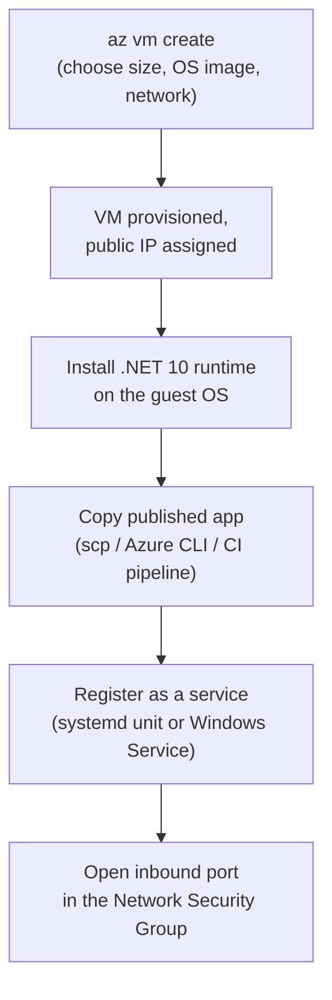
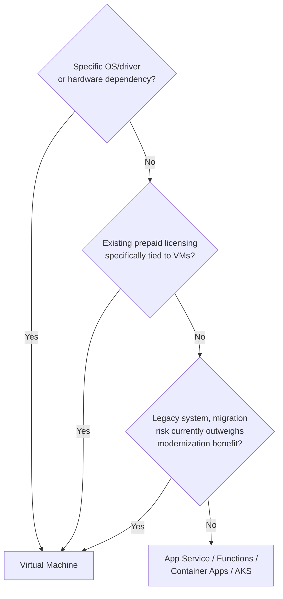

# Virtual Machines for .NET Workloads

## Introduction

Before reading this lesson, you should already be comfortable with **[AKS Networking and Scaling](../16-azure-for-dotnet-developers/16-17-aks-networking-and-scaling.md)** — and, looking back across this entire sub-area, with App Service, Functions, Container Apps, and AKS as progressively more hands-on ways of running .NET code in Azure. This lesson deliberately steps down to the most hands-on option of all: **Azure Virtual Machines**, plain infrastructure-as-a-service, where Azure's responsibility stops at the hypervisor and everything above it — OS, runtime, patching, application — is yours. Every option covered so far in this sub-area has tried to take responsibility *away* from you; this lesson explains why teams sometimes deliberately choose to keep it.

By the end of this lesson, you will be able to:

- Explain exactly where Azure's responsibility ends and yours begins on a plain VM
- Read a VM size name (e.g. `Standard_D4s_v5`) and explain what its series and suffix indicate
- Provision a Windows or Linux VM and deploy a .NET application to it directly
- Identify at least three realistic scenarios where a raw VM is still the right call over PaaS or containers
- Explain why "PaaS/containers are generally preferred" doesn't mean "VMs are never correct"

## Virtual Machines for .NET Workloads — A Layman's Perspective

Every option this sub-area has covered so far has been a version of renting something someone else built and maintains — a serviced office, a business park, a managed apartment building. A **Virtual Machine** is the one option that's genuinely different: it's renting an empty plot of land with basic utilities already connected — power, water, a road to your door — and nothing else. Nobody hands you a pre-built office; you decide, from the studs up, exactly what gets built on that land, in what layout, using what materials, following whatever obscure local building code you happen to need.

Most people renting land this bare don't do it because bare land is inherently better than a serviced office — it obviously involves far more work. They do it because they have a specific, non-negotiable requirement a pre-built office simply can't accommodate. Perhaps they're relocating a factory that's been running the exact same specialized machinery for thirty years, machinery that's finicky about the exact flooring, ventilation, and power configuration of the building around it, and no amount of modern office-park convenience is worth the risk of that machinery breaking in a move to somewhere it wasn't built for. Perhaps their business needs a very particular certified electrical setup that only a small number of contractors even offer, and a standard office park's electrical system, however good, simply isn't that specific thing. Or perhaps they already own an unusually good, prepaid, multi-year deal on land and utilities from years ago, and giving that up to rent someone else's office would be a straightforward waste of money already spent.

That's exactly the situation with an Azure Virtual Machine. Teams reach for raw IaaS not because it's generally the better choice — every other lesson in this sub-area exists precisely because, for most new workloads, it usually isn't — but because a specific, concrete requirement rules the more managed options out. A twenty-year-old line-of-business application, written against assumptions about the exact Windows Server version and file-system layout it was originally installed on, might genuinely break in subtle ways inside a container or a PaaS sandbox — "lift and shift" onto a VM configured to match its old environment as closely as possible is sometimes the only safe first move, with modernization planned as a *later*, separate project rather than attempted all at once. A workload depending on a very specific, unusual hardware driver — a specialized GPU configuration, a hardware security module, a legacy peripheral interface — might need direct, low-level OS access that no managed platform exposes. And an organization holding existing, already-paid-for Windows Server or SQL Server licenses under an agreement like Azure Hybrid Benefit might find that running those licenses on VMs it directly controls is simply the most cost-effective way to use money it has already committed, regardless of what's architecturally fashionable.

None of this makes VMs the *default* choice again — it makes them the *correct exception*, chosen deliberately, for a reason that's specific enough to name out loud.

## Virtual Machines for .NET Workloads — A Programming Language Perspective

An **Azure Virtual Machine** is an infrastructure-as-a-service (IaaS) offering: Azure provisions and maintains the physical host and hypervisor, while the customer owns the guest operating system, all patching above the hypervisor, the .NET runtime, and the deployed application itself — nothing about the application's execution environment is abstracted away. VMs are provisioned from a **size** (e.g., `Standard_D4s_v5`), whose name encodes a **series** (`D` = general purpose, `E` = memory-optimized, `F` = compute-optimized, `N` = GPU-enabled, among others), a **vCPU/memory ratio** implied by that series, a **version** number (`v5`), and optional capability suffixes (`s` for Premium SSD support, among others). A .NET 10 application deploys to a VM the same way it would to any physical or virtual Windows or Linux machine: publish a self-contained or framework-dependent build, copy it to the host (or bake it into a custom VM image ahead of time), and run it as a Windows Service, a `systemd` unit, or under IIS — none of the deployment models covered elsewhere in this sub-area apply here at all.

## How to Provision a VM and Deploy a .NET App to It

Provisioning a VM is the most granular deployment option in this sub-area — every step that App Service, Functions, Container Apps, and AKS each automate away is a step you perform explicitly here.


*Figure 1: Every step required to get a .NET app running on a VM — none of it automated by the platform.*

```text
# Azure CLI — illustrative session against a demo subscription

$ az vm create \
    --resource-group rg-library-demo \
    --name vm-reconciler-01 \
    --image Ubuntu2404 \
    --size Standard_D2s_v5 \
    --admin-username azureuser \
    --generate-ssh-keys

VM 'vm-reconciler-01' created. Public IP: 20.55.121.9

$ ssh azureuser@20.55.121.9 "sudo apt-get update && sudo apt-get install -y dotnet-sdk-10.0"
Reading package lists... Done
Setting up dotnet-sdk-10.0 ...

$ scp -r ./publish/* azureuser@20.55.121.9:/opt/reconciler/
```

```csharp
// Program.cs — .NET 10 / C# 14 — a plain console app deployed directly onto the VM
Console.WriteLine("Library Reconciliation Service starting on host " + Environment.MachineName);
Console.WriteLine("Running as a systemd unit -- no platform-managed scaling or restarts.");
Console.WriteLine("Reconciliation run complete.");
```

**Console Output** *(illustrative — `journalctl` output after `systemctl start reconciler`)*:

```text
$ journalctl -u reconciler.service -n 3
Library Reconciliation Service starting on host vm-reconciler-01
Running as a systemd unit -- no platform-managed scaling or restarts.
Reconciliation run complete.
```

If this service crashes at 3 a.m., nothing restarts it automatically unless you configured `systemd`'s own `Restart=on-failure` directive yourself — there is no platform-level self-healing here, because the platform's responsibility stopped at the hypervisor.

## Real-Time Example: Lift-and-Shift for a Legacy Library Reconciliation Job in Library/Inventory Management

Continuing the Library/Inventory Management domain, imagine a library consortium has run a nightly inventory reconciliation job for over a decade, originally written against a specific on-premises Windows Server file share layout and a legacy barcode-scanner driver that only ships a Windows driver, never containerized, never touched since it last worked. Rewriting it for AKS or Container Apps today is out of scope for this migration; the immediate goal is simply to get it off aging on-premises hardware before that hardware fails, with modernization deliberately deferred to a later project.

```csharp
// ReconciliationJob.cs — .NET 10 / C# 14 — Real-Time Example (Library/Inventory Management)
public sealed record InventoryDiscrepancy(string Isbn, int ExpectedCount, int ScannedCount);

public static class ReconciliationJob
{
    public static IEnumerable<InventoryDiscrepancy> FindDiscrepancies(
        Dictionary<string, int> expectedCounts, Dictionary<string, int> scannedCounts)
    {
        foreach ((string isbn, int expected) in expectedCounts)
        {
            int scanned = scannedCounts.GetValueOrDefault(isbn, 0);
            if (scanned != expected)
            {
                yield return new InventoryDiscrepancy(isbn, expected, scanned);
            }
        }
    }
}
```

**Console Output** *(illustrative — running on `vm-reconciler-01` against last night's scan file)*:

```text
Library Reconciliation Service starting on host vm-reconciler-01
Loaded 48,210 expected records, 48,193 scanned records
Discrepancy: Isbn=978-0143127550, ExpectedCount=3, ScannedCount=2
Discrepancy: Isbn=978-0345391803, ExpectedCount=5, ScannedCount=6
Reconciliation run complete. 17 discrepancies found.
```

Nothing about `ReconciliationJob` itself required a VM — the logic is ordinary C#. What required the VM was everything *around* it: the legacy scanner driver it depends on elsewhere in the real system, and the risk tolerance of moving a decade-old, rarely-touched job as-is rather than rewriting it during the same migration that's already replacing its hardware.

## Virtual Machines vs. PaaS/Containers

PaaS and container options generally win on total cost of ownership for new workloads, because the platform absorbs patching, scaling, and much of the operational burden — which is exactly why this sub-area presented them first. VMs win only when a specific constraint makes that abstraction actively harmful or impossible: an OS/driver dependency the abstraction can't expose, a licensing arrangement that specifically rewards VM-based deployment, or a legacy system whose risk of breaking during modernization currently outweighs the benefit of modernizing it.


*Figure 2: VMs as the deliberate exception, chosen only when a specific, nameable constraint rules out every more-managed option this sub-area covered.*

| Aspect | Virtual Machines (IaaS) | PaaS / Containers |
|---|---|---|
| What Azure manages | Physical host, hypervisor only | OS patching, runtime, scaling (varies by option) |
| What you manage | OS, runtime, patching, app, restarts | Just the application (and container image, if applicable) |
| Deployment granularity | Whole machine | App (PaaS) or container image |
| Best fit | Legacy lift-and-shift, driver/licensing constraints | New or modernizable workloads |
| Self-healing on crash | None, unless you configure it yourself | Built into the platform |

## Types of Azure VM Building Blocks

1. **[Azure Batch Basics](../16-azure-for-dotnet-developers/16-19-azure-batch-basics.md)** — a managed layer built *on top of* pools of VMs, covered next, for large-scale parallel jobs.
2. **VM Scale Sets** — a way to manage a group of identical VMs together, with autoscaling rules similar in spirit to the Cluster Autoscaler from the previous lesson.
3. **Availability Sets and Zones** — mechanisms for spreading VMs across failure domains for resilience.
4. **Azure Hybrid Benefit** — the licensing mechanism referenced in this lesson's real-time example, letting existing Windows Server/SQL Server licenses reduce Azure VM costs.
5. **Managed Disks** — the persistent storage layer attached to a VM, independent of the VM's own lifecycle.

## What You've Learned & What's Next

Azure Virtual Machines are the one option in this sub-area where Azure's responsibility stops at the hypervisor and everything above it is yours — the correct choice precisely when a specific constraint (a legacy dependency, a driver, an existing license) rules out every more-managed alternative already covered, not a generally preferred default.

Continue your learning journey with **[Azure Batch Basics](../16-azure-for-dotnet-developers/16-19-azure-batch-basics.md)**, the capstone of this Compute sub-area, where pools of VMs like the one in this lesson are provisioned and torn down automatically to run genuinely large-scale parallel batch workloads.

---
*Applies to: .NET 10 / C# 14. Last reviewed 2026-08-16.*
