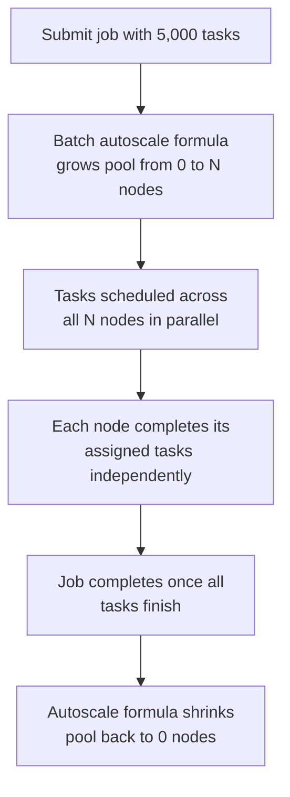
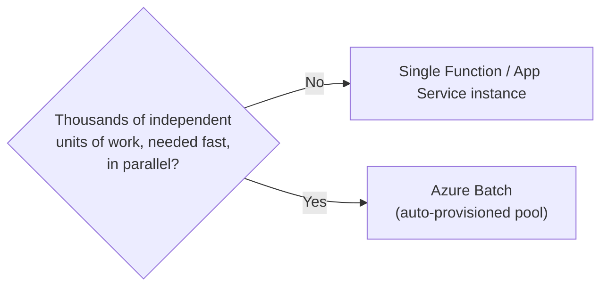

# Azure Batch Basics

## Introduction

Before reading this lesson, you should already be comfortable with **[Virtual Machines for .NET Workloads](../16-azure-for-dotnet-developers/16-18-virtual-machines-for-dotnet.md)**, and in truth with every compute option this sub-area has covered since App Service — because this lesson is the capstone of that entire arc. **Azure Batch** exists for one specific shape of problem none of the previous options were built for: a workload with genuinely enormous parallelism — thousands of independent units of work — that needs a pool of compute large enough to chew through all of them at once, and only for as long as the job takes to run.

By the end of this lesson, you will be able to:

- Explain what problem Azure Batch solves that a single Function, App Service instance, or even AKS deployment does not
- Describe how a Batch **pool**, **job**, and **tasks** relate to each other
- Trace how Batch auto-provisions a pool of VMs for a job and tears it down when the job completes
- Decide when a workload's scale genuinely justifies Batch over the other Compute options in this sub-area
- Recap the full Compute sub-area as a single spectrum from most-managed to least-managed

## Azure Batch — A Layman's Perspective

Every other option in this sub-area has been about hosting something that runs *continuously*: an API waiting for requests, a service waiting for triggers. Azure Batch is built for a fundamentally different shape of problem: not "keep something running," but "get an enormous, one-time (or nightly, or weekly) pile of independent work done as fast as possible, then stand everything down."

Picture a massive seasonal harvest on a large farm. The farm doesn't employ a permanent workforce of two thousand people year-round just to be ready for the three weeks a year the harvest actually happens — that would be absurd, and expensive every single week the harvest isn't happening. Instead, the farm calls a large seasonal labor agency the moment the harvest is ready, describes exactly how many workers it needs and for roughly how long, and the agency mobilizes a temporary workforce of exactly that size, trucks them out to the fields, has them pick every single row of crop in parallel — thousands of rows, each one an independent, self-contained task that doesn't depend on any other row being finished first — and the moment the harvest is fully picked, releases every one of those workers, who go back to whatever they were doing before. The farm never owned or managed that labor force; it simply described the job, and the agency handled sizing the workforce, dispatching it, and standing it back down.

That labor agency is Azure Batch. The "job" is the harvest as a whole. Each individual "task" is one row of crop — one independent, self-contained unit of work, like reconciling one warehouse's inventory records, or reprocessing one batch of failed orders, or rendering one video file. The "pool" is the temporary workforce itself — a group of virtual machines that Batch provisions specifically for this job, sized to however much parallel capacity the job actually needs, and that Batch tears back down the moment the job finishes, so nobody pays for idle harvest workers in the off-season.

This is precisely why none of the earlier options in this sub-area fit a genuinely large batch workload well. A single Azure Function or App Service instance is like asking one farmhand to pick two thousand rows of crop alone, one after another — technically possible, but absurdly slow for something that's inherently parallel. Even AKS, which absolutely *can* run large numbers of pods in parallel, still requires you to size, provision, and tear down that capacity yourself, or bolt on your own scaling logic to approximate what Batch already does as its core purpose. Azure Batch's entire reason to exist is jobs where the "how many workers, for how long" question has a genuinely large, genuinely temporary answer — and answering that question automatically, per job, is the one thing it's built to do that nothing else in this lesson series does as its primary job.

## Azure Batch — A Programming Language Perspective

**Azure Batch** is a managed service for running large-scale parallel and high-performance computing workloads across a dynamically sized **pool** of compute nodes (VMs), without the caller managing individual VM lifecycles directly. A **job** groups a collection of **tasks** — each task a single, independent unit of work, typically a command line invoking an executable or script (including a published .NET console application) — and the Batch service schedules tasks onto available nodes in the pool as capacity allows, running many tasks concurrently across the pool's nodes. Pools can be configured with **autoscale formulas** that grow the pool when a job is submitted and shrink it — down to zero nodes — once the queue of pending tasks empties, so compute cost is incurred only for the duration work actually exists. The .NET SDK (`Microsoft.Azure.Batch`) or the newer `Azure.Batch` client library lets a .NET application programmatically create pools, submit jobs, add tasks, and poll for completion, making Batch fully drivable from ordinary C# orchestration code rather than only the Azure CLI or portal.

## How to Submit a Batch Job from C#

A minimal Batch workflow has three steps in order: create (or reuse) a pool, create a job bound to that pool, then add many tasks to the job — Batch handles distributing those tasks across the pool's nodes as they become free.


*Figure 1: A Batch job's full lifecycle — the pool grows only for the duration work exists, then shrinks back to nothing.*

```csharp
// SubmitReconciliationJob.cs — .NET 10 / C# 14
using Microsoft.Azure.Batch;
using Microsoft.Azure.Batch.Auth;
using Microsoft.Azure.Batch.Common;

var credentials = new BatchSharedKeyCredentials(
    "https://libraryreconcile.eastus.batch.azure.com", "libraryreconcile", "<illustrative-key>");

using BatchClient batchClient = BatchClient.Open(credentials);

const string jobId = "nightly-reconciliation-2026-08-16";
CloudJob job = batchClient.JobOperations.CreateJob(jobId, new PoolInformation { PoolId = "reconcile-pool" });
job.Commit();

var tasks = Enumerable.Range(1, 5000)
    .Select(i => new CloudTask($"task-{i:D5}", $"dotnet Reconciler.dll --warehouse {i}"))
    .ToList();

await batchClient.JobOperations.AddTaskAsync(jobId, tasks);
Console.WriteLine($"Submitted job '{jobId}' with {tasks.Count} tasks.");
```

**Console Output** *(illustrative — Azure CLI polling the job, then the program's own output)*:

```text
Submitted job 'nightly-reconciliation-2026-08-16' with 5000 tasks.

$ az batch job show --job-id nightly-reconciliation-2026-08-16 --pool-id reconcile-pool
Pool 'reconcile-pool' state: resizing (0 -> 40 dedicated nodes)

$ az batch job show --job-id nightly-reconciliation-2026-08-16
Active tasks: 0   Running tasks: 40   Completed tasks: 4960
Job state: active

$ az batch job show --job-id nightly-reconciliation-2026-08-16
Completed tasks: 5000 / 5000
Job state: completed
Pool 'reconcile-pool' state: resizing (40 -> 0 dedicated nodes)
```

Five thousand tasks, each reconciling one warehouse's records independently, ran across forty auto-provisioned nodes without any code in `SubmitReconciliationJob.cs` deciding how many nodes to create — that decision lived entirely in the pool's autoscale formula, configured once and reused for every future job submitted against it.

## Real-Time Example: Nightly Inventory Reconciliation at Scale in Library/Inventory Management

Continuing the Library/Inventory Management domain from the previous lesson's single-VM reconciliation job, imagine that job has grown from one library's inventory to an entire consortium's: thousands of branches, each needing its own reconciliation pass, every night, within a fixed overnight maintenance window. A single VM, however capable, cannot finish thousands of independent branch reconciliations fast enough — this is exactly the scale Azure Batch exists for.

```csharp
// ReconciliationTaskRunner.cs — .NET 10 / C# 14 — Real-Time Example (Library/Inventory Management)
// This is the program each individual Batch task actually runs, once per branch.
public sealed record BranchReconciliationResult(string BranchId, int DiscrepancyCount);

public static class ReconciliationTaskRunner
{
    public static BranchReconciliationResult Run(string branchId, Dictionary<string, int> expected, Dictionary<string, int> scanned)
    {
        int discrepancies = expected.Count(kv => scanned.GetValueOrDefault(kv.Key, 0) != kv.Value);
        return new BranchReconciliationResult(branchId, discrepancies);
    }

    public static void Main(string[] args)
    {
        string branchId = args[0];
        var result = Run(branchId, LoadExpected(branchId), LoadScanned(branchId));
        Console.WriteLine($"Branch {result.BranchId}: {result.DiscrepancyCount} discrepancies found");
    }

    private static Dictionary<string, int> LoadExpected(string branchId) => new(); // loads from shared storage
    private static Dictionary<string, int> LoadScanned(string branchId) => new();  // loads from shared storage
}
```

**Console Output** *(illustrative — a sample of task-level stdout Batch aggregates from across the pool)*:

```text
Branch BR-0412: 3 discrepancies found
Branch BR-0413: 0 discrepancies found
Branch BR-0414: 7 discrepancies found
...
Branch BR-3241: 1 discrepancies found

Job 'nightly-reconciliation-2026-08-16' completed: 3,241 branches, 5,802 total discrepancies, finished in 41 minutes across 40 nodes.
```

Forty-one minutes for 3,241 independent branch reconciliations is the entire point: the same total amount of work run sequentially, one branch at a time, on a single VM like the one in the previous lesson, would take days rather than under an hour — and Batch billed for compute only during those 41 minutes, not around the clock.

## Azure Batch vs. a Single Function/App Service Instance

A single Azure Function or one App Service instance handles one unit of work at a time (or a modest handful, within one instance's own concurrency limits) — perfectly adequate for typical request volumes, but fundamentally the wrong tool once the actual requirement is "run tens of thousands of independent units of work in parallel, right now, then release all that compute." Reaching for Batch only when the workload's *scale* — not merely its *existence* — demands genuinely large parallel compute is the deciding factor; a nightly job processing a few hundred records has no need for Batch at all and is better served by a single Function on a timer trigger.


*Figure 2: The scale test that decides between a single compute instance and a Batch pool.*

| Aspect | Single Function/App Service | Azure Batch |
|---|---|---|
| Parallelism | Limited to one instance's concurrency | Thousands of tasks across many nodes at once |
| Compute lifetime | Long-running or per-trigger, ongoing | Provisioned per job, torn down after |
| Best fit | Steady request/trigger volume | Enormous, bursty, genuinely parallel batch jobs |
| Node/VM management | Abstracted away entirely | Pool sizing is explicit, though autoscale automates it |

## Types of Azure Batch Building Blocks

1. **Pools** — the group of VMs (dedicated or low-priority/spot) that tasks actually run on.
2. **Jobs** — the logical grouping of tasks submitted and tracked together, as in this lesson's nightly reconciliation job.
3. **Tasks** — the individual, independent units of work Batch schedules across pool nodes.
4. **Autoscale Formulas** — the pool-sizing logic that grows and shrinks node count based on queued work.
5. **Job Preparation and Release Tasks** — special tasks Batch runs once per node before and after the main task set, useful for shared setup/teardown.

## What You've Learned & What's Next — Compute Sub-Area Recap

Azure Batch exists for exactly one job: genuinely large-scale parallel compute, provisioned only for the duration the work exists. It's the deliberate extreme end of a spectrum this entire Compute sub-area has been walking down, one lesson at a time, from most-managed to least-managed. **App Service** asked for nothing but your code and gave you the least control in return. **Azure Functions**, extended by **Durable Functions**, added event-driven and stateful orchestration on the same fully managed foundation. **Azure Container Apps** introduced multiple independently scaling microservices with Kubernetes hidden entirely behind the platform. **AKS** pulled that curtain back, trading simplicity for full control over pods, deployments, and services, layered with real networking and autoscaling decisions. **Virtual Machines** went further still, handing you everything above the hypervisor — the correct choice only when a specific, nameable constraint demands it. And **Azure Batch**, this lesson's capstone, is a specialized, managed layer built *on top of* pools of VMs, purpose-built for the one shape of problem none of the others solve well: enormous, embarrassingly parallel batch work, sized and torn down automatically per job. Across all twelve lessons, the real skill was never memorizing any one platform — it was learning to match a workload's actual shape to its correct place on this spectrum.

Continue your learning journey with **[Azure SQL Database](../16-azure-for-dotnet-developers/16-20-azure-sql-database.md)**, where this module turns from *where code runs* to *where data lives* — the next foundational decision every one of these compute options ultimately depends on.

---
*Applies to: .NET 10 / C# 14. Last reviewed 2026-08-16.*
