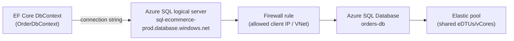
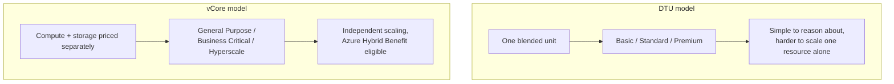

# Azure SQL Database

## Introduction

Before reading this lesson, you should already be comfortable with **[Azure Batch Basics](../16-azure-for-dotnet-developers/16-19-azure-batch-basics.md)** and, further back, with EF Core's `DbContext` and migrations from Module 11. This lesson turns to a question every one of those EF Core lessons quietly deferred: where does the actual SQL Server engine run in production? Azure SQL Database is Microsoft's answer for teams that want the SQL Server surface area they already know, without operating the server it runs on.

By the end of this lesson, you will be able to:

- Explain what "fully managed" means for Azure SQL Database and which operational burdens it removes
- Distinguish the DTU and vCore purchasing models and choose between them for a given workload
- Point an existing EF Core `DbContext` at an Azure SQL Database using a connection string
- Explain what an elastic pool is and when it fits a multi-tenant application better than one database per tenant
- Compare Azure SQL Database against running SQL Server yourself on an Azure VM

## Azure SQL Database — A Layman's Perspective

Imagine two ways to have a home cooked meal delivered to you every night. In the first, you buy a house, install a full kitchen, hire and train a cook, and manage that cook's schedule, sick days, and equipment repairs yourself — you get total control over the menu and the kitchen layout, but every failure in that kitchen, from a broken oven to a cook falling ill, is now your problem to fix, at whatever hour it happens. In the second, you subscribe to a meal service that owns and runs its own professional kitchens, staffed around the clock, with equipment maintained on a schedule you never see and never have to think about. You still choose your meals from a menu, you still get food delivered to your exact address every night without fail, but you never once touch a stove, never patch a gas line, and never get a call at 2 a.m. because a burner broke.

That second option is Azure SQL Database. The "kitchen" is the SQL Server database engine itself, and Microsoft owns and operates it: patching the underlying OS and SQL Server version, taking automatic backups on a schedule, replicating your data for high availability, and detecting hardware failures before you ever notice one. You still write the same T-SQL, still design the same tables and indexes, still connect with the same `Microsoft.Data.SqlClient` driver your EF Core app has used since Module 11 — none of that changes. What changes is who answers the 2 a.m. page when a disk starts failing. With a self-managed SQL Server on a virtual machine, that page comes to you. With Azure SQL Database, it never comes at all, because there is no server for you to be paged about — only a database.

The meal service also sells its capacity two different ways, and this maps directly onto Azure SQL Database's two purchasing models. One way is an all-inclusive weekly plan: a fixed number of meals at a fixed price, bundling ingredients, cooking time, and delivery into one number you don't have to think about — that's the DTU model, a single blended unit covering CPU, memory, and I/O together. The other way is an itemized menu: you specify exactly how many cores you want, how much memory, and how much storage, paying for each separately and scaling each independently — that's the vCore model, and it's also the one that lets you bring your own existing SQL Server license for a discount, the same way a corporate cafeteria plan might let you apply a membership you already hold.

Finally, picture an apartment building where dozens of tenants share one professional kitchen and one delivery fleet, rather than each tenant paying for their own dedicated kitchen that mostly sits idle between meals. That shared kitchen, sized for the building's combined peak demand rather than each tenant's individual peak, is an elastic pool — and it is exactly the shape a multi-tenant SaaS application needs when its tenants each have one modest database that spikes at different, unpredictable times.

## Azure SQL Database — A Programming Language Perspective

Azure SQL Database is a Platform-as-a-Service (PaaS) offering of the SQL Server database engine, exposing the same T-SQL surface and wire protocol that `Microsoft.EntityFrameworkCore.SqlServer` — the provider Module 11 already used — targets locally. An EF Core application requires no code changes to move from a local SQL Server instance to Azure SQL Database; only the connection string changes, typically adding `Encrypt=True` and an Azure AD or SQL-authentication credential. Two purchasing models govern billing: **DTU** (Database Transaction Unit), a single blended metric bundling CPU, memory, and I/O into Basic/Standard/Premium tiers; and **vCore**, which prices compute and storage independently across General Purpose, Business Critical, and Hyperscale service tiers, and supports Azure Hybrid Benefit licensing. An **elastic pool** is a set of databases sharing one allocation of eDTUs or vCores within a single logical server, billed once for the pool rather than per database.

## How to Connect an EF Core App to Azure SQL Database

Provisioning happens once, from the CLI or portal; from then on, the EF Core code you already wrote in Module 11 needs only a new connection string to point at the cloud instead of localhost.


*Figure 1: An EF Core app reaches an Azure SQL Database through a logical server, past a firewall rule, into a database that may sit inside a shared elastic pool.*

Provision the server and database first, using the Azure CLI:

```bash
# Azure CLI
az group create --name rg-ecommerce --location eastus

az sql server create \
  --name sql-ecommerce-prod \
  --resource-group rg-ecommerce \
  --location eastus \
  --admin-user sqladmin \
  --admin-password "P@ssw0rd-ChangeMe123!"

az sql server firewall-rule create \
  --resource-group rg-ecommerce \
  --server sql-ecommerce-prod \
  --name AllowMyClientIp \
  --start-ip-address 203.0.113.42 \
  --end-ip-address 203.0.113.42

az sql db create \
  --resource-group rg-ecommerce \
  --server sql-ecommerce-prod \
  --name orders-db \
  --edition GeneralPurpose \
  --family Gen5 \
  --capacity 2
```

**Azure CLI Output:**

```text
{
  "name": "orders-db",
  "status": "Online",
  "edition": "GeneralPurpose",
  "sku": { "name": "GP_Gen5", "tier": "GeneralPurpose", "capacity": 2 },
  "collation": "SQL_Latin1_General_CP1_CI_AS",
  "location": "eastus"
}
```

With the database online, the only EF Core change is the connection string:

```csharp
// Program.cs — .NET 10 / C# 14
using Microsoft.EntityFrameworkCore;

var connectionString =
    "Server=tcp:sql-ecommerce-prod.database.windows.net,1433;" +
    "Database=orders-db;" +
    "User ID=sqladmin;Password=P@ssw0rd-ChangeMe123!;" +
    "Encrypt=True;TrustServerCertificate=False;Connection Timeout=30;";

var options = new DbContextOptionsBuilder<OrderDbContext>()
    .UseSqlServer(connectionString)
    .Options;

using var db = new OrderDbContext(options);
db.Database.Migrate();

Console.WriteLine($"Connected to: {db.Database.GetDbConnection().DataSource}");
Console.WriteLine($"Database: {db.Database.GetDbConnection().Database}");
Console.WriteLine($"Pending migrations applied: {db.Database.GetAppliedMigrations().Count()}");

public class OrderDbContext(DbContextOptions<OrderDbContext> options) : DbContext(options)
{
    public DbSet<Order> Orders => Set<Order>();
}

public class Order
{
    public int Id { get; set; }
    public required string CustomerName { get; set; }
    public decimal Total { get; set; }
}
```

**Console Output:**

```text
Connected to: sql-ecommerce-prod.database.windows.net
Database: orders-db
Pending migrations applied: 1
```

Nothing about `DbSet<Order>`, `OnModelCreating`, or LINQ queries changes from what Module 11 taught — `UseSqlServer` accepts an Azure connection string exactly as happily as a local one. The only new concerns are the ones Azure adds on top: firewall rules controlling which IPs may reach the server, and `Encrypt=True` to keep traffic to that server encrypted in transit.

## Real-Time Example: Elastic Pools for a Multi-Tenant E-Commerce Platform

We extend the `Order` and `OrderDbContext` types from Module 11's EF Core lessons into a scenario those lessons didn't need to consider: a single e-commerce platform hosting many independent merchant tenants, each with their own `orders-db`, each with unpredictable and non-overlapping traffic spikes — one merchant's flash sale rarely coincides with another's.

```csharp
// TenantProvisioning.cs — .NET 10 / C# 14 — Real-Time Example (E-Commerce Order Processing)
public sealed record MerchantTenant(string Name, string DatabaseName, int PeakDtuEstimate);

MerchantTenant[] tenants =
[
    new("Aurora Outfitters", "orders-aurora", PeakDtuEstimate: 45),
    new("Riverbend Electronics", "orders-riverbend", PeakDtuEstimate: 80),
    new("Northgate Books", "orders-northgate", PeakDtuEstimate: 20),
    new("Solstice Home Goods", "orders-solstice", PeakDtuEstimate: 35)
];

int sumOfIndividualPeaks = tenants.Sum(t => t.PeakDtuEstimate);
int poolCapacity = 150; // eDTUs provisioned for the shared elastic pool

Console.WriteLine("Per-tenant peak eDTU estimates:");
foreach (var tenant in tenants)
{
    Console.WriteLine($" - {tenant.DatabaseName,-20} peak ~{tenant.PeakDtuEstimate} eDTUs");
}

Console.WriteLine();
Console.WriteLine($"Sum of individual peaks:  {sumOfIndividualPeaks} eDTUs (if each tenant had a dedicated database)");
Console.WriteLine($"Shared elastic pool size: {poolCapacity} eDTUs (tenants rarely peak simultaneously)");
Console.WriteLine($"Capacity saved by pooling: {sumOfIndividualPeaks - poolCapacity} eDTUs");
```

**Console Output:**

```text
Per-tenant peak eDTU estimates:
 - orders-aurora         peak ~45 eDTUs
 - orders-riverbend      peak ~80 eDTUs
 - orders-northgate      peak ~20 eDTUs
 - orders-solstice       peak ~35 eDTUs

Sum of individual peaks:  180 eDTUs (if each tenant had a dedicated database)
Shared elastic pool size: 150 eDTUs (tenants rarely peak simultaneously)
Capacity saved by pooling: 30 eDTUs
```

Each merchant still gets its own isolated database — its own `orders-<tenant>` catalog, its own `OrderDbContext` connection string, its own backup and restore boundary — but all four draw from one shared eDTU allocation instead of four separately-provisioned peaks. Because Riverbend's Monday flash sale and Northgate's holiday rush rarely land on the same hour, the pool can be sized well below the sum of everyone's individual worst case, without any tenant noticing a slowdown during their own peak. This is the exact scenario elastic pools were built for: many small-to-medium databases, uncorrelated usage spikes, one shared bill.

## DTU vs vCore Purchasing Models

The DTU model bundles CPU, memory, and I/O into one number and one tier name — Basic, Standard, or Premium — making it the simpler starting point for a small workload where you'd rather not reason about compute and storage separately. The vCore model unbundles those same resources: you pick a number of virtual cores, an amount of memory implied by that core count, and a storage size independently, across General Purpose (balanced, the default choice), Business Critical (lower latency, local SSD replicas, for workloads sensitive to I/O latency), and Hyperscale (storage that scales to 100 TB+, for the largest workloads). vCore is also the only model eligible for Azure Hybrid Benefit, which lets you apply an existing SQL Server license for a substantial discount — a meaningful saving for an enterprise that already owns SQL Server licensing.


*Figure 2: DTU bundles resources into one purchasing unit; vCore separates them and adds licensing flexibility.*

| Aspect | DTU Model | vCore Model |
|---|---|---|
| Pricing unit | Single blended DTU/eDTU | Separate vCore + storage charges |
| Tiers | Basic, Standard, Premium | General Purpose, Business Critical, Hyperscale |
| Independent scaling of CPU/memory/storage | No | Yes |
| Azure Hybrid Benefit (bring your own license) | Not eligible | Eligible |
| Best fit | Small, simple workloads; quick starts | Predictable large workloads; enterprises with existing SQL licenses |

## Types of Azure SQL Deployment Options

1. **Single database** — one database, one dedicated allocation of resources; the default for a standalone application.
2. **Elastic pool** — many databases sharing one resource allocation, covered above for the multi-tenant scenario.
3. **Azure SQL Managed Instance** — near-100% SQL Server surface-area compatibility (cross-database queries, SQL Agent, Service Broker) for lift-and-shift migrations that Azure SQL Database's single-database model doesn't support.
4. **Serverless compute tier** — auto-pauses and auto-scales compute for intermittent workloads, billing per second of actual use rather than per hour of provisioned capacity.
5. **[Introduction to Azure Cosmos DB](../16-azure-for-dotnet-developers/16-21-introduction-to-cosmos-db.md)** — the next lesson's globally-distributed, schema-flexible alternative for workloads that outgrow the relational model entirely.
6. **[EF Core with Azure Cosmos DB](../11-efcore/11-15-ef-core-with-cosmos-db.md)** — Module 11's capstone, showing the same `DbContext` pattern retargeted at a NoSQL store instead of SQL Server.

## What You've Learned & What's Next

Azure SQL Database gives you the SQL Server engine your EF Core code already expects, minus the patching, backup, and hardware failures you'd otherwise own yourself — a connection-string change, not a code change, and elastic pools let many small tenant databases share capacity efficiently. Continue your learning journey with **[Introduction to Azure Cosmos DB](../16-azure-for-dotnet-developers/16-21-introduction-to-cosmos-db.md)**, where we leave the relational model behind for a globally-distributed, multi-model NoSQL alternative.

---
*Applies to: .NET 10 / C# 14. Last reviewed 2026-08-16.*
