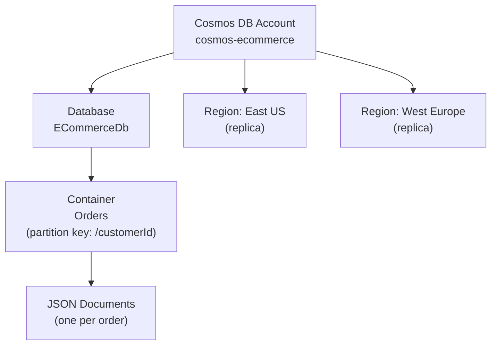
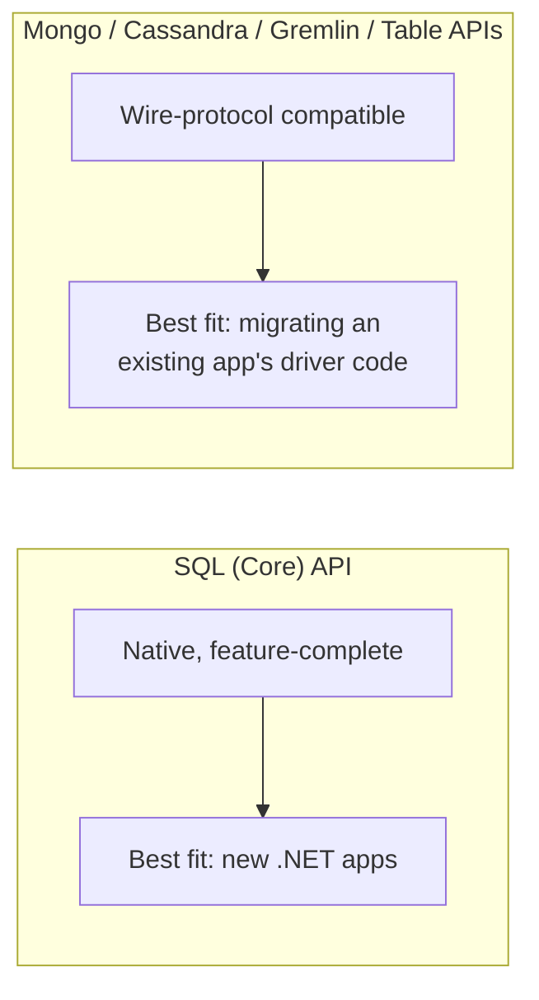

# Introduction to Azure Cosmos DB

## Introduction

Before reading this lesson, you should already be comfortable with **[Azure SQL Database](../16-azure-for-dotnet-developers/16-20-azure-sql-database.md)** — the previous lesson's fully managed, relational option. This lesson introduces the other direction Azure's data platform goes: a database that gives up the fixed rows-and-columns shape in exchange for global distribution and guaranteed low latency at any scale. That database is Azure Cosmos DB, and it connects directly to Module 11's `UseCosmos()` lesson, which you have already seen from the EF Core side.

By the end of this lesson, you will be able to:

- Explain what "globally distributed" and "multi-model" mean for Azure Cosmos DB
- List the APIs Cosmos DB supports and identify which one a new .NET application should default to
- State what Cosmos DB's single-digit-millisecond latency SLA actually guarantees
- Create a Cosmos DB account and container and read/write a document from C#
- Connect this lesson back to Module 11's EF Core Cosmos provider

## Azure Cosmos DB — A Layman's Perspective

Picture a chain of convenience stores built on one guiding promise to every customer: no matter which of the chain's locations you walk into, anywhere in the world, you'll be served within a few seconds, guaranteed, every time, day or night. To keep that promise, the chain doesn't run one giant central warehouse that every store phones home to for each sale — a single warehouse an ocean away could never answer fast enough. Instead, the chain keeps a full, independently-operating copy of its entire stock in each region, and it keeps those regional copies quietly in sync with each other behind the scenes, so a shopper in Tokyo gets served exactly as fast as a shopper in Toronto, from local stock, without ever noticing the synchronization happening a continent away.

That chain is Azure Cosmos DB, and "globally distributed" is exactly this promise made technical: you pick the Azure regions your data should live in, and Cosmos DB transparently replicates every write across all of them, so a read in any region is served from a nearby, fully-stocked copy rather than a round trip to wherever the data was originally written. The "single-digit-millisecond latency" guarantee is the chain's few-seconds promise turned into a contractual number — for reads and writes against a properly-provisioned container, Cosmos DB guarantees a 99th-percentile latency under 10 milliseconds, backed by a financial SLA, not just a marketing claim.

Now picture that same chain's stockroom. A traditional grocery store organizes everything into a strict grid — aisle 4, shelf 2, exactly the products that fit that shelf's fixed dimensions, nothing else. This chain's stockroom is different: it uses flexible bins that can hold anything shaped like anything — a small bin for jewelry, a big irregular bin for a bicycle, all stored side by side without needing the whole stockroom redesigned every time a new product shape shows up. That flexible-bin stockroom is Cosmos DB's core storage model — JSON documents, which don't require every item to share the same fixed columns the way a relational table does. A new field on one document doesn't require altering every other document, or the container itself, the way adding a column to a SQL Server table would.

Finally, this chain doesn't insist that every store front look identical either — one location operates as a familiar convenience store counter, another as a self-checkout kiosk, another still speaks the layout language of an entirely different retail chain it's partnering with, so that partner's existing point-of-sale systems can walk right in and use it without retraining staff. That's Cosmos DB's multi-model nature: the same underlying globally-distributed engine, exposed through several different "front counters," so applications already speaking MongoDB's language, or Cassandra's, or a simple key-value Table API, can point at Cosmos DB and mostly just work, alongside the native SQL (Core) API most new .NET applications reach for first.

## Azure Cosmos DB — A Programming Language Perspective

Azure Cosmos DB is a globally-distributed, horizontally-partitioned NoSQL database that stores schema-flexible JSON documents inside **containers**, grouped under a **database** inside a Cosmos **account**. It exposes five wire-protocol-compatible APIs: the **SQL (Core) API**, the native and most feature-complete option for new .NET applications, queried with a SQL-like syntax over JSON via `Microsoft.Azure.Cosmos`; the **API for MongoDB**, **API for Apache Cassandra**, and **Gremlin API** for graph workloads, each letting existing driver code target Cosmos DB with minimal change; and the **Table API**, compatible with Azure Table Storage's key-value model. Module 11's `Microsoft.EntityFrameworkCore.Cosmos` provider wraps the SQL (Core) API behind the familiar `DbContext`/`DbSet<T>` surface, trading some LINQ capability for that familiarity — this lesson introduces the SDK those EF Core internals ultimately call.

## How to Create a Cosmos DB Account and Read/Write a Document

A Cosmos account is provisioned once; from it, one or more databases, and inside those, one or more containers, each requiring a partition key path defined at creation time (the next lesson covers choosing that key well).


*Figure 1: A Cosmos account holds databases and containers, and replicates them across whichever regions you choose.*

```bash
# Azure CLI
az cosmosdb create \
  --name cosmos-ecommerce \
  --resource-group rg-ecommerce \
  --locations regionName=eastus failoverPriority=0 \
  --locations regionName=westeurope failoverPriority=1 \
  --default-consistency-level Session

az cosmosdb sql database create \
  --account-name cosmos-ecommerce \
  --resource-group rg-ecommerce \
  --name ECommerceDb

az cosmosdb sql container create \
  --account-name cosmos-ecommerce \
  --resource-group rg-ecommerce \
  --database-name ECommerceDb \
  --name Orders \
  --partition-key-path /customerId \
  --throughput 400
```

**Azure CLI Output:**

```text
{
  "name": "Orders",
  "resource": {
    "partitionKey": { "paths": ["/customerId"], "kind": "Hash" }
  },
  "options": { "throughput": 400 }
}
```

With the container provisioned, the SQL (Core) API SDK reads and writes documents directly, no schema migration required:

```csharp
// Program.cs — .NET 10 / C# 14
using Microsoft.Azure.Cosmos;

var client = new CosmosClient(
    accountEndpoint: "https://cosmos-ecommerce.documents.azure.com:443/",
    authKeyOrResourceToken: "<primary-key>");

Container orders = client.GetContainer("ECommerceDb", "Orders");

var order = new OrderDocument(
    Id: "ord-88421",
    CustomerId: "cust-4471",
    Items: ["USB-C Cable", "Wireless Mouse"],
    Total: 42.98m);

await orders.CreateItemAsync(order, new PartitionKey(order.CustomerId));

OrderDocument fetched = await orders.ReadItemAsync<OrderDocument>(
    id: "ord-88421",
    partitionKey: new PartitionKey("cust-4471"));

Console.WriteLine($"Stored order {fetched.Id} for customer {fetched.CustomerId}");
Console.WriteLine($"Items: {string.Join(", ", fetched.Items)}");
Console.WriteLine($"Total: {fetched.Total:C}");

public record OrderDocument(string Id, string CustomerId, string[] Items, decimal Total);
```

**Console Output:**

```text
Stored order ord-88421 for customer cust-4471
Items: USB-C Cable, Wireless Mouse
Total: $42.98
```

Notice there is no `CREATE TABLE`, no migration, and no fixed column list — `OrderDocument` is serialized to JSON exactly as its C# shape defines it, and a future order with an extra field (a discount code, say) can be written to the same container without altering anything already stored there.

## Real-Time Example: Order Documents Across Regions

We extend the `Order` type from Module 11's EF Core Cosmos lesson, this time reasoning about what happens to a single order document as it's written in one region and read back from another during global order processing.

```csharp
// GlobalOrderRead.cs — .NET 10 / C# 14 — Real-Time Example (E-Commerce Order Processing)
public sealed record RegionRead(string Region, string OrderId, double LatencyMs, bool ServedLocally);

RegionRead[] reads =
[
    new("East US (write region)", "ord-88421", LatencyMs: 3.1, ServedLocally: true),
    new("West Europe (replica)", "ord-88421", LatencyMs: 4.6, ServedLocally: true),
    new("Southeast Asia (replica)", "ord-88421", LatencyMs: 7.8, ServedLocally: true)
];

Console.WriteLine("Reads of the same order document, from three replicated regions:");
foreach (var read in reads)
{
    string source = read.ServedLocally ? "local replica" : "cross-region round trip";
    Console.WriteLine($" - {read.Region,-26} {read.LatencyMs,5:F1} ms  ({source})");
}

Console.WriteLine();
Console.WriteLine($"All reads stayed under the 10 ms SLA: {reads.All(r => r.LatencyMs < 10)}");
```

**Console Output:**

```text
Reads of the same order document, from three replicated regions:
 - East US (write region)     3.1 ms  (local replica)
 - West Europe (replica)      4.6 ms  (local replica)
 - Southeast Asia (replica)   7.8 ms  (local replica)

All reads stayed under the 10 ms SLA: True
```

A customer service rep in Singapore checking on `ord-88421` never pays the cost of a round trip back to East US, where the order was originally placed — Cosmos DB's replication already put a copy of that document within a few milliseconds of them. For a global e-commerce platform, this is the difference between a support dashboard that feels instant everywhere and one that only feels instant near its home region.

## Cosmos DB SQL (Core) API vs Other Cosmos APIs

Most new .NET applications should default to the SQL (Core) API: it is the API Cosmos DB's engine was built around, gets new features first, and is what the EF Core Cosmos provider from Module 11 wraps. The other four APIs exist chiefly for migration and interoperability — an application already built against MongoDB, Cassandra, Gremlin's graph model, or Azure Table Storage's key-value model can retarget its existing driver at Cosmos DB with little to no application code change, gaining Cosmos DB's global distribution and SLAs without a rewrite. Choosing a non-Core API for a brand-new .NET application, with no existing driver investment to protect, gives up SQL-API-only features for no real benefit.


*Figure 2: The SQL (Core) API for new development; the other four for protecting an existing driver investment during migration.*

| Aspect | SQL (Core) API | MongoDB / Cassandra / Gremlin / Table APIs |
|---|---|---|
| Query language | SQL-like queries over JSON | Native to each source technology |
| Feature parity with Cosmos DB engine | Full, gets new features first | Subset, protocol-compatible |
| .NET SDK | `Microsoft.Azure.Cosmos` | Existing driver for that technology (e.g., `MongoDB.Driver`) |
| EF Core support | Yes (`Microsoft.EntityFrameworkCore.Cosmos`) | No |
| Best fit | New .NET applications | Migrating an existing app off self-hosted Mongo/Cassandra/etc. |

## Types of Cosmos DB APIs and Concepts

1. **SQL (Core) API** — the native, feature-complete API this lesson used, and the default choice for new .NET development.
2. **API for MongoDB** — wire-protocol compatible with existing MongoDB drivers and tooling.
3. **API for Apache Cassandra** — compatible with CQL and existing Cassandra client code.
4. **Gremlin API** — graph queries and traversals over the same underlying storage.
5. **[Azure Table Storage](../16-azure-for-dotnet-developers/16-24-azure-table-storage.md)** — the simpler, cheaper key-value store the Table API is compatible with, covered later in this module.
6. **[EF Core with Azure Cosmos DB](../11-efcore/11-15-ef-core-with-cosmos-db.md)** — Module 11's capstone, using the SQL (Core) API through the familiar `DbContext` pattern.

## What You've Learned & What's Next

Azure Cosmos DB trades the fixed relational shape of Azure SQL Database for global distribution, schema flexibility, and a guaranteed single-digit-millisecond latency SLA — with the SQL (Core) API as the natural default for new .NET applications, and four other APIs available purely to ease migration from existing systems. Continue your learning journey with **[Cosmos DB Partitioning and Consistency Levels](../16-azure-for-dotnet-developers/16-22-cosmos-db-partitioning-consistency.md)**, where we cover the single most important decision in any Cosmos DB container: choosing a good partition key.

---
*Applies to: .NET 10 / C# 14. Last reviewed 2026-08-16.*
