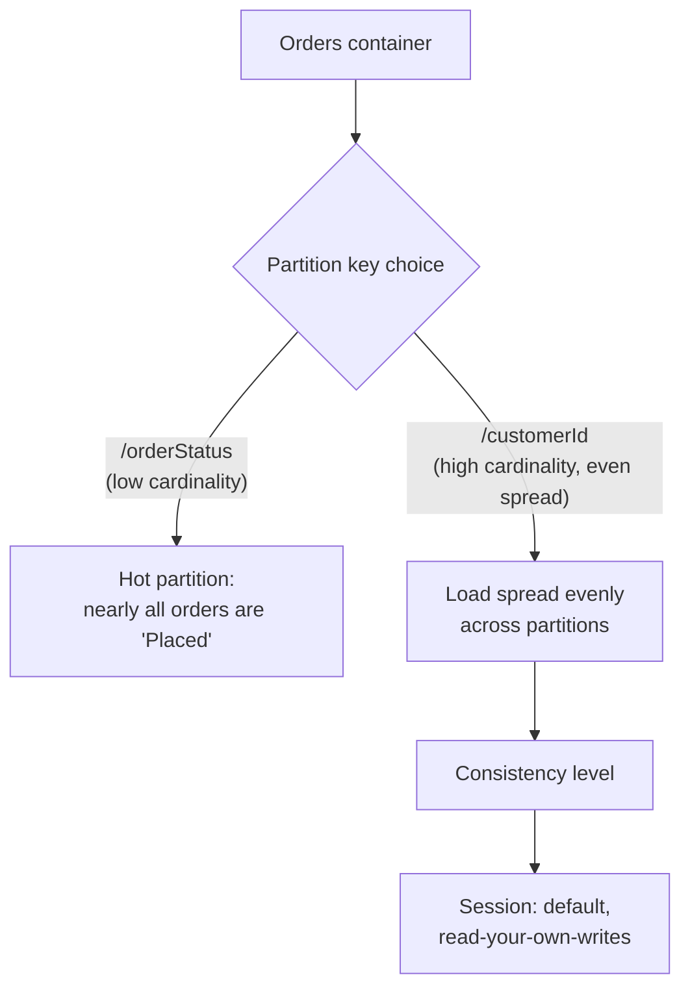
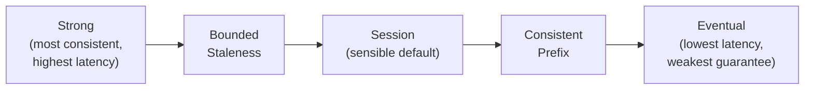

# Cosmos DB Partitioning and Consistency Levels

## Introduction

Before reading this lesson, you should already be comfortable with **[Introduction to Azure Cosmos DB](../16-azure-for-dotnet-developers/16-21-introduction-to-cosmos-db.md)**, including containers, the SQL (Core) API, and the global-distribution promise the previous lesson made. That lesson glossed over two decisions every container actually requires: how documents are physically spread across Cosmos DB's underlying servers, and how strictly a read is allowed to lag behind the most recent write. Both decisions matter more to a Cosmos DB container's real-world performance and cost than almost anything else you'll configure.

By the end of this lesson, you will be able to:

- Explain why the partition key is the single most important design decision in a Cosmos DB container
- Recognize what a "hot partition" is and why a poorly chosen partition key creates one
- List the five consistency levels from strongest to weakest and describe the tradeoff each one makes
- Explain why Session consistency is the sensible default for most applications
- Choose an appropriate partition key and consistency level for a real order-processing container

## Partitioning and Consistency — A Layman's Perspective

Picture a large public library that, instead of one enormous room, spreads its entire collection across many smaller reading rooms, each one staffed and each one able to serve patrons independently and simultaneously. The library's one rule for sorting books into rooms is a single label on the spine of each book — say, the author's last initial — and every room only ever holds books whose label matches the range assigned to it. If that label is chosen well, patrons spread themselves naturally across many rooms, and the library can serve enormous numbers of people at once, each room handling its own fair share. But if the library instead chose a bad label — say, sorting every book by "published this century" when 95% of the collection was published this century — nearly every patron ends up crammed into one enormous, overcrowded reading room, while the rest of the building sits nearly empty. That one overcrowded room becomes a bottleneck no amount of additional empty rooms elsewhere can fix. In Cosmos DB, that spine label is the **partition key**, and that overcrowded room is a **hot partition** — a partition receiving far more traffic than the others because too many documents shared the same key value, throttling exactly the requests that key was supposed to distribute.

Now picture something different: how quickly must a change made in one reading room be reflected in every other room's records before anyone can rely on it? One extreme is a library where every single room must confirm, in real time, before any patron anywhere is told a book was returned — perfectly reliable information everywhere, but every check-in takes as long as the slowest room's confirmation. The opposite extreme is a library that updates its central catalog only occasionally, in batches, whenever convenient — checkouts feel instant everywhere, but a patron might be told a book is available when it was actually returned to a different room minutes ago and hasn't been recorded yet. Most real libraries pick something in between: a patron who personally checked a book back in always sees their own change reflected instantly, no matter which room they ask at next, even if a stranger asking the same question a moment later might see slightly older information. That in-between answer — you always see your own actions, and casual visitors see something recent but not necessarily the very latest — is **Session consistency**, and it's why it fits most patrons' actual expectations better than either extreme.

Cosmos DB's five consistency levels are exactly this spectrum, laid out explicitly rather than left to chance: **Strong** consistency is the "every room confirms in real time" extreme — the most correct, and the slowest and least available during any network disruption. **Bounded Staleness** relaxes that only slightly, guaranteeing reads lag writes by no more than a specific, configurable amount of time or number of updates. **Session** is the "you always see your own actions" middle ground described above. **Consistent Prefix** guarantees that even if reads lag behind, they never see writes out of order — no reader is ever shown an update before an earlier one that happened first. **Eventual** is the batch-catalog extreme — the fastest and most available, with no guarantee about how stale a read might be, only that it will eventually catch up.

## Partitioning and Consistency — A Programming Language Perspective

A Cosmos DB container's **partition key** is a JSON property path — declared at container creation and immutable afterward — that Cosmos DB hashes to decide which physical partition stores a given document; all documents sharing a partition key value land on the same physical partition and share its throughput budget, so a key with low cardinality or skewed value distribution concentrates load onto too few partitions, a **hot partition**, throttling requests with HTTP 429 responses regardless of how much total throughput the container was provisioned with. Consistency is configured at the account level (with a per-request override available) via five levels, from strongest to weakest: **Strong**, **Bounded Staleness**, **Session**, **Consistent Prefix**, and **Eventual** — each successive level trading some read-freshness guarantee for lower latency and higher availability during network partitions, per the CAP theorem. `CosmosClientOptions.ConsistencyLevel` sets the default; individual requests may relax it further via `ItemRequestOptions.ConsistencyLevel`.

## How to Choose a Partition Key and Consistency Level in Code

Choosing a partition key means picking a property whose values are both high-cardinality (many distinct values) and evenly accessed (no single value dominates traffic); choosing a consistency level means picking the weakest guarantee your application can actually tolerate.


*Figure 1: A high-cardinality partition key spreads load evenly; Session consistency then governs how fresh each read is.*

```csharp
// Program.cs — .NET 10 / C# 14
using Microsoft.Azure.Cosmos;

var clientOptions = new CosmosClientOptions
{
    ConsistencyLevel = ConsistencyLevel.Session
};

var client = new CosmosClient(
    accountEndpoint: "https://cosmos-ecommerce.documents.azure.com:443/",
    authKeyOrResourceToken: "<primary-key>",
    clientOptions: clientOptions);

Container orders = client.GetContainer("ECommerceDb", "Orders");

// Simulate two writes from the same customer, then a read from the same session
var order1 = new OrderDocument("ord-88421", CustomerId: "cust-4471", Status: "Placed");
var order2 = new OrderDocument("ord-88422", CustomerId: "cust-4471", Status: "Placed");

await orders.CreateItemAsync(order1, new PartitionKey(order1.CustomerId));
await orders.CreateItemAsync(order2, new PartitionKey(order2.CustomerId));

// Because both writes and this read share one CosmosClient session token,
// Session consistency guarantees this read reflects both writes above.
OrderDocument readBack = await orders.ReadItemAsync<OrderDocument>(
    id: "ord-88422",
    partitionKey: new PartitionKey("cust-4471"));

Console.WriteLine($"Configured consistency: {clientOptions.ConsistencyLevel}");
Console.WriteLine($"Read own write immediately: {readBack.Id} -> {readBack.Status}");

public record OrderDocument(string Id, string CustomerId, string Status);
```

**Console Output:**

```text
Configured consistency: Session
Read own write immediately: ord-88422 -> Placed
```

Because the client used the same session token for both writes and the subsequent read, Session consistency guarantees `ord-88422` shows up immediately — even though another customer's read, in a different session, might still see slightly older data from a different replica for a brief moment. `/customerId` was chosen over `/orderStatus` precisely because customers vastly outnumber the handful of possible order statuses.

## Real-Time Example: Diagnosing a Hot Partition in Order Processing

We extend the `Orders` container from the previous lesson, this time simulating what happens when a well-intentioned but poorly chosen partition key concentrates nearly all traffic onto one partition during a flash sale.

```csharp
// HotPartitionCheck.cs — .NET 10 / C# 14 — Real-Time Example (E-Commerce Order Processing)
public sealed record PartitionLoad(string PartitionKeyValue, int RequestsPerSecond);

// Partition key = /orderStatus: almost every order is "Placed" during a sale
PartitionLoad[] byStatus =
[
    new("Placed", RequestsPerSecond: 4200),
    new("Shipped", RequestsPerSecond: 310),
    new("Cancelled", RequestsPerSecond: 40)
];

// Partition key = /customerId: thousands of distinct, evenly-loaded values
PartitionLoad[] byCustomer =
[
    new("cust-4471", RequestsPerSecond: 6),
    new("cust-5820", RequestsPerSecond: 5),
    new("cust-1193", RequestsPerSecond: 7)
    // ...thousands more customers, each a few requests/sec
];

Console.WriteLine("Partition key = /orderStatus (low cardinality):");
foreach (var p in byStatus)
    Console.WriteLine($" - {p.PartitionKeyValue,-10} {p.RequestsPerSecond,6} req/s{(p.RequestsPerSecond > 1000 ? "  <-- HOT PARTITION" : "")}");

Console.WriteLine();
Console.WriteLine("Partition key = /customerId (high cardinality):");
foreach (var p in byCustomer)
    Console.WriteLine($" - {p.PartitionKeyValue,-10} {p.RequestsPerSecond,6} req/s");
```

**Console Output:**

```text
Partition key = /orderStatus (low cardinality):
 - Placed        4200 req/s  <-- HOT PARTITION
 - Shipped        310 req/s
 - Cancelled       40 req/s

Partition key = /customerId (high cardinality):
 - cust-4471        6 req/s
 - cust-5820        5 req/s
 - cust-1193        7 req/s
```

During a flash sale, `/orderStatus` funnels nearly all writes onto the single "Placed" partition, throttling that partition with HTTP 429s no matter how much total throughput the container has been provisioned with elsewhere — the other partitions sit nearly idle while the sale grinds to a halt. `/customerId` spreads that same total load across thousands of lightly-used partitions instead, which is exactly why partition key choice, decided once at container creation and unchangeable afterward, deserves more design attention than almost any other Cosmos DB setting.

## Consistency Levels: A Spectrum, Not a Binary Choice

The five consistency levels are best understood as one continuous spectrum rather than five unrelated settings — each step away from Strong buys lower latency and higher availability during a regional network partition, at the cost of a looser guarantee about how fresh a read can be. Strong consistency is rarely the right default for a global application: it requires a majority of regions to confirm every write before acknowledging it, which reintroduces the cross-region latency Cosmos DB's whole design otherwise avoids. Eventual consistency, at the other end, is fast and cheap but offers so little guarantee that even ordering isn't promised, unsuitable for most user-facing scenarios. Session consistency sits at the point most applications actually need: a user always sees the results of their own actions immediately, which covers the overwhelming majority of real requirements — "did my order go through," "is my cart updated" — without paying Strong consistency's cross-region latency tax for every other user's unrelated reads.


*Figure 2: The five consistency levels as one spectrum trading consistency for latency and availability.*

| Consistency Level | Guarantee | Latency | Typical Fit |
|---|---|---|---|
| Strong | Reads always see the latest committed write | Highest | Financial ledgers, inventory counts that must never be wrong |
| Bounded Staleness | Reads lag writes by a configured max time/version count | High | Systems needing a known, bounded staleness window |
| Session | Your own writes are always visible to you immediately | Low | Most applications — the sensible default |
| Consistent Prefix | Reads never see writes out of order | Low | Event/activity feeds where order matters more than freshness |
| Eventual | Reads eventually converge, no ordering guarantee | Lowest | Like/view counters, analytics, non-critical aggregates |

## Types of Partitioning and Consistency Concepts

1. **Logical partition** — the set of documents sharing one partition key value; Cosmos DB's smallest unit of co-located data.
2. **Physical partition** — the actual server-side storage/throughput unit Cosmos DB maps one or more logical partitions onto.
3. **Synthetic partition key** — a concatenated key (e.g., `customerId_orderMonth`) used when no single natural property is both high-cardinality and evenly accessed.
4. **[Introduction to Azure Cosmos DB](../16-azure-for-dotnet-developers/16-21-introduction-to-cosmos-db.md)** — the previous lesson's container and API fundamentals this lesson builds directly on.
5. **Per-request consistency override** — relaxing (never strengthening) the account's default consistency level for an individual read via `ItemRequestOptions`.
6. **[Azure Blob Storage](../16-azure-for-dotnet-developers/16-23-azure-blob-storage.md)** — the next lesson's unstructured-data store, which has no partition key or consistency-level concept of its own.

## What You've Learned & What's Next

The partition key decides whether a Cosmos DB container's load spreads evenly or collapses onto a single overloaded partition, and the five consistency levels let you trade freshness for latency and availability along one clear spectrum — with Session consistency as the sensible default for most applications. Continue your learning journey with **[Azure Blob Storage](../16-azure-for-dotnet-developers/16-23-azure-blob-storage.md)**, where we move from structured and semi-structured data to storing unstructured files like images and documents.

---
*Applies to: .NET 10 / C# 14. Last reviewed 2026-08-16.*
