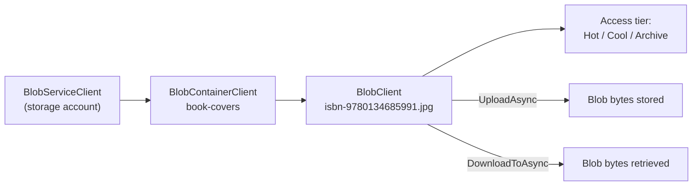
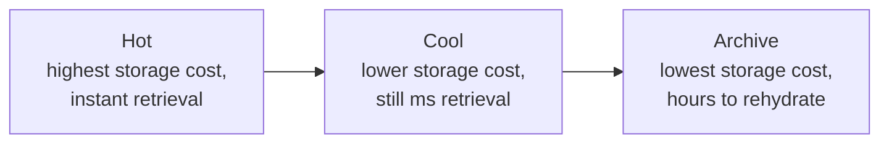

# Azure Blob Storage

## Introduction

Before reading this lesson, you should already be comfortable with **[Cosmos DB Partitioning and Consistency Levels](../16-azure-for-dotnet-developers/16-22-cosmos-db-partitioning-consistency.md)**. Both Azure SQL Database and Cosmos DB, covered so far in this module, store structured or semi-structured records — rows and JSON documents. This lesson turns to data that fits neither shape at all: a book cover image, a scanned PDF, a video file, a nightly backup archive. That's what Azure Blob Storage is built for.

By the end of this lesson, you will be able to:

- Explain what Azure Blob Storage is for and how it differs from a database
- Choose between the Hot, Cool, and Archive access tiers based on how often and how quickly data needs to be retrieved
- Upload and download a file from C# using the `Azure.Storage.Blobs` SDK
- Structure blobs into containers in a way that mirrors a real application's needs
- Recognize when Blob Storage, rather than a database, is the right place to store a piece of data

## Azure Blob Storage — A Layman's Perspective

Picture a large self-storage facility, the kind with hundreds of individual units rented out to different people, each unit holding whatever its renter puts in it — furniture, boxes, a car, a boat — with no requirement that any two units hold the same kind of thing or be organized the same way inside. The facility doesn't care what's in your box, doesn't index its contents, doesn't let you search "find me all boxes containing a red sweater" — it only cares about the label on the outside of your unit and getting you in and out of that exact unit quickly. That's the difference between this facility and, say, a library's card catalog, which is built specifically to organize and search structured information — author, title, subject — about things it doesn't actually contain. Azure Blob Storage is the self-storage facility; a database like Azure SQL Database or Cosmos DB is the card catalog. Blob Storage doesn't know or care what's inside a file — it just stores the bytes, under a name, inside a container, and lets you fetch them back byte-for-exact-byte later.

Now picture that same storage facility offering three different pricing plans, based on how often you expect to visit your unit. The first plan is a unit right at the front of the building, a short walk from the entrance, costing more per month but letting you grab your things in seconds any time you like — this is for the boxes you open constantly. The second plan is a unit further back, cheaper per month, still reachable the same day but requiring you to walk a bit further and maybe wait for staff to open a gate — fine for things you only need occasionally. The third plan is the cheapest by far: your things go into a climate-controlled vault at an entirely separate facility across town, and retrieving them means calling ahead and waiting hours, sometimes most of a day, before your unit's contents are driven back to you — perfect for the things you're legally required to keep for seven years but truly hope you never need to touch again.

Those three plans are Blob Storage's three access tiers. **Hot** is the front-of-building unit: highest storage cost, but instant, cheap retrieval, for data accessed frequently — think a product catalog's actively-browsed images. **Cool** is the further-back unit: lower storage cost, slightly higher retrieval cost, for data accessed only occasionally — last quarter's invoices, say. **Archive** is the off-site vault: by far the cheapest storage, but retrieval takes hours, not seconds, because the data has to be "rehydrated" out of true cold storage first — exactly right for seven-year compliance backups nobody expects to actually open. Picking the wrong plan for a given box doesn't just waste a bit of money; picking Archive for the catalog images your storefront needs to render in real time would make your storefront unusable, and picking Hot for backups you'll almost certainly never touch again would quietly overpay for years.

The facility's units are also grouped by a top-level building name — think "Building A," "Building B" — and each building holds many individually-named units inside it. That's a **container** inside a **storage account**: one account, many containers, each container holding as many individually-named blobs as you like, with no fixed schema forced on any of them.

## Azure Blob Storage — A Programming Language Perspective

Azure Blob Storage is an object store for unstructured binary data, organized as **storage account → container → blob**, where a blob is an arbitrary named sequence of bytes with associated metadata but no schema or query language over its contents. Three access tiers govern the storage-cost-versus-retrieval-latency tradeoff: **Hot** (lowest access latency, highest storage cost, retrieval instant), **Cool** (lower storage cost, still millisecond retrieval, intended for data accessed roughly monthly or less), and **Archive** (lowest storage cost by a wide margin, but retrieval requires an explicit rehydration operation taking hours). From C#, the `Azure.Storage.Blobs` SDK exposes this model through `BlobServiceClient` → `BlobContainerClient` → `BlobClient`, with `UploadAsync`/`DownloadAsync` (or streaming overloads) as the primary read/write operations, authenticated via a connection string, a shared access signature, or Microsoft Entra ID.

## How to Upload and Download a Blob from C#

Working with Blob Storage from C# means acquiring a `BlobContainerClient` for a known container, then a `BlobClient` for a specific blob name inside it, and calling `UploadAsync` or `DownloadToAsync` against that client.


*Figure 1: A storage account holds containers, each holding individually-named blobs, each independently assigned an access tier.*

```bash
# Azure CLI
az storage account create \
  --name stlibraryinventory \
  --resource-group rg-library \
  --sku Standard_LRS \
  --kind StorageV2

az storage container create \
  --account-name stlibraryinventory \
  --name book-covers \
  --auth-mode login
```

**Azure CLI Output:**

```text
{
  "name": "stlibraryinventory",
  "kind": "StorageV2",
  "sku": { "name": "Standard_LRS" },
  "primaryLocation": "eastus"
}
{
  "created": true
}
```

```csharp
// Program.cs — .NET 10 / C# 14
using Azure.Storage.Blobs;
using Azure.Storage.Blobs.Models;

var connectionString = "<storage-account-connection-string>";
var blobServiceClient = new BlobServiceClient(connectionString);
BlobContainerClient covers = blobServiceClient.GetBlobContainerClient("book-covers");

string blobName = "isbn-9780134685991.jpg";
BlobClient blob = covers.GetBlobClient(blobName);

await using FileStream fileStream = File.OpenRead("effective-csharp-cover.jpg");
await blob.UploadAsync(fileStream, overwrite: true);
await blob.SetAccessTierAsync(AccessTier.Hot);

BlobProperties properties = await blob.GetPropertiesAsync();
Console.WriteLine($"Uploaded: {blobName}");
Console.WriteLine($"Size: {properties.ContentLength:N0} bytes");
Console.WriteLine($"Access tier: {properties.AccessTier}");
Console.WriteLine($"URL: {blob.Uri}");
```

**Console Output:**

```text
Uploaded: isbn-9780134685991.jpg
Size: 184,320 bytes
Access tier: Hot
URL: https://stlibraryinventory.blob.core.windows.net/book-covers/isbn-9780134685991.jpg
```

The blob's URL is directly usable by any client with the right permissions — a web page can reference it in an `` tag, or a `SasBuilder` can mint a time-limited link for a client that shouldn't have standing access to the whole container. Nothing here required defining a schema, a table, or a document shape; the JPEG's bytes are exactly what gets stored and exactly what comes back.

## Real-Time Example: Book Cover Images in a Library Inventory System

We introduce a `Book` catalog entry into the Library/Inventory Management domain, storing each title's structured metadata in a database (as earlier lessons covered) while its cover image lives in Blob Storage, referenced only by URL.

```csharp
// BookCoverStorage.cs — .NET 10 / C# 14 — Real-Time Example (Library / Inventory Management)
using Azure.Storage.Blobs;
using Azure.Storage.Blobs.Models;

public sealed record Book(string Isbn, string Title, string Author);

public sealed class BookCoverStorage(BlobContainerClient container)
{
    public async Task<Uri> UploadCoverAsync(Book book, Stream imageStream, AccessTier tier)
    {
        BlobClient blob = container.GetBlobClient($"{book.Isbn}.jpg");
        await blob.UploadAsync(imageStream, overwrite: true);
        await blob.SetAccessTierAsync(tier);
        return blob.Uri;
    }
}

var container = new BlobContainerClient("<connection-string>", "book-covers");
var storage = new BookCoverStorage(container);

Book[] catalog =
[
    new("9780134685991", "Effective Java", "Joshua Bloch"),      // popular, browsed constantly
    new("9780596007126", "Head First Design Patterns", "Freeman"), // occasionally browsed
    new("9780201633610", "Design Patterns", "Gang of Four")        // rarely opened, kept for completeness
];

AccessTier[] tiers = [AccessTier.Hot, AccessTier.Cool, AccessTier.Archive];

for (int i = 0; i < catalog.Length; i++)
{
    using var placeholderImage = new MemoryStream(new byte[1024]); // stand-in for a real cover upload
    Uri url = await storage.UploadCoverAsync(catalog[i], placeholderImage, tiers[i]);
    Console.WriteLine($"{catalog[i].Title,-28} tier={tiers[i],-8} -> {url}");
}
```

**Console Output:**

```text
Effective Java                tier=Hot      -> https://stlibraryinventory.blob.core.windows.net/book-covers/9780134685991.jpg
Head First Design Patterns    tier=Cool     -> https://stlibraryinventory.blob.core.windows.net/book-covers/9780596007126.jpg
Design Patterns               tier=Archive  -> https://stlibraryinventory.blob.core.windows.net/book-covers/9780201633610.jpg
```

The library's catalog database still stores each `Book`'s ISBN, title, and author as structured rows or documents — exactly the kind of data Azure SQL Database or Cosmos DB was built for — but the cover images themselves live in Blob Storage, each tagged with the access tier that matches how often patrons actually browse that title. A frequently-borrowed bestseller's cover stays in Hot for instant rendering on the catalog homepage; a title nobody has requested in years can sit safely, cheaply, in Archive, retrieved only on the rare occasion someone specifically asks for it.

## Blob Storage Access Tiers Compared

The three tiers exist along one clear tradeoff: storage cost falls sharply as retrieval speed falls with it, so the right tier is determined entirely by how predictably and how urgently a given blob needs to be read back. Hot is the correct default for anything an application serves directly to users in real time. Cool suits data still needed occasionally, on a timescale of days or weeks, where paying slightly more per retrieval in exchange for much lower storage cost nets out favorably. Archive suits data kept only for compliance or disaster-recovery purposes, where an hours-long rehydration delay is a genuine non-issue because no one is waiting at the other end of that request.


*Figure 2: The three access tiers as one continuum trading storage cost against retrieval speed.*

| Aspect | Hot | Cool | Archive |
|---|---|---|---|
| Storage cost | Highest | Lower | Lowest |
| Retrieval cost/latency | Lowest / instant | Moderate / instant | Highest / hours (rehydration) |
| Minimum recommended retention | None | 30 days | 180 days |
| Typical fit | Actively-served images, current data | Monthly-or-less access | Compliance backups, long-term archives |

## Types of Blob Storage Concepts

1. **Block blobs** — the default blob type this lesson used, optimized for uploading and streaming discrete files like images and documents.
2. **Append blobs** — optimized for repeated small appends, such as log files written to continuously.
3. **Page blobs** — optimized for random read/write access, the type underlying Azure VM disks.
4. **Shared Access Signatures (SAS)** — time-limited, scoped URLs granting temporary access to a blob or container without sharing the account key.
5. **Lifecycle management policies** — rules that automatically move blobs between Hot, Cool, and Archive (or delete them) based on age, removing the need to set tiers by hand.
6. **[Azure Table Storage](../16-azure-for-dotnet-developers/16-24-azure-table-storage.md)** — next lesson's structured key-value store, living in the same storage account as the containers covered here.

## What You've Learned & What's Next

Azure Blob Storage is where unstructured files like images, documents, and backups belong — organized into containers within a storage account, with an access tier chosen per blob to balance storage cost against retrieval speed. Continue your learning journey with **[Azure Table Storage](../16-azure-for-dotnet-developers/16-24-azure-table-storage.md)**, where we cover the simple, cheap key-value store that shares a storage account with the blob containers introduced here.

---
*Applies to: .NET 10 / C# 14. Last reviewed 2026-08-16.*
