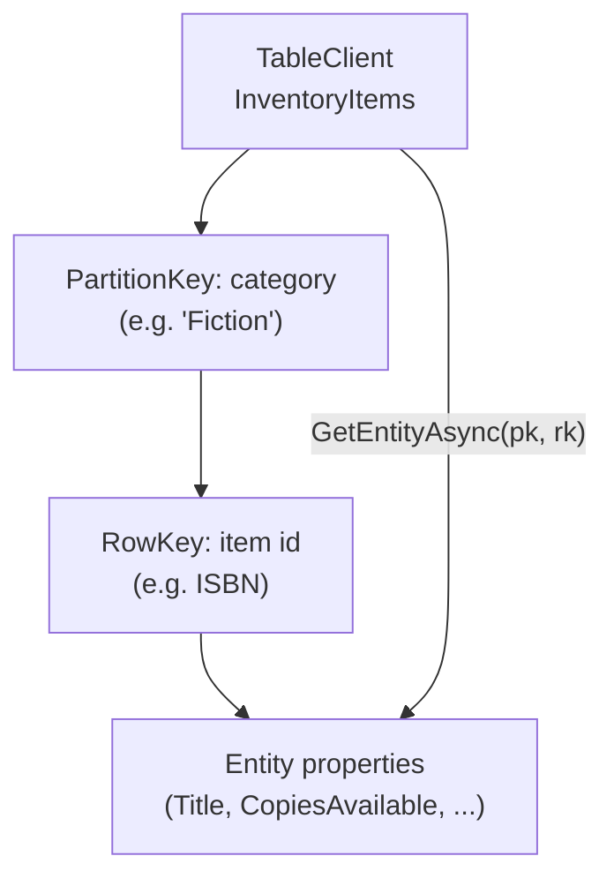
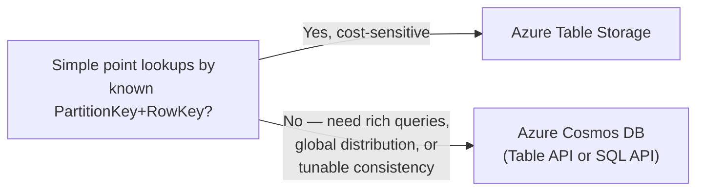

# Azure Table Storage

## Introduction

Before reading this lesson, you should already be comfortable with **[Azure Blob Storage](../16-azure-for-dotnet-developers/16-23-azure-blob-storage.md)**, including storage accounts and containers. This lesson stays inside that same storage account, but shifts from unstructured files to a different, much simpler kind of structured data: rows keyed by two properties, with none of Cosmos DB's global distribution, tunable consistency, or advanced query surface — because a great many real applications never needed any of that in the first place.

By the end of this lesson, you will be able to:

- Explain what Azure Table Storage is and how `PartitionKey` and `RowKey` together identify a row
- Read and write entities from C# using the `Azure.Data.Tables` SDK
- Recognize the access patterns Table Storage handles well, and the ones it doesn't
- Decide when Table Storage is a better fit than Cosmos DB for a given workload
- Explain why Table Storage lives in the same storage account as Blob Storage

## Azure Table Storage — A Layman's Perspective

Picture a small-town post office that sorts every piece of mail using a two-part system: first by street, then by house number on that street. Ask for "Elm Street, house 14" and the clerk walks directly to exactly the right shelf, in exactly the right slot, and hands it to you in seconds — there is no search, no browsing, because the two-part address alone was always enough to go straight to the answer. This post office doesn't offer fancy services either — no forwarding rules based on the contents of your mail, no sorting by return address across the whole town, no delivery guarantee that spans multiple towns at once. It does exactly one thing, extremely well and extremely cheaply: given a street and a house number, hand over the mail, instantly, for a fraction of what a full logistics company would charge for the same errand.

That post office is Azure Table Storage. The street is the **PartitionKey**, the house number is the **RowKey**, and together they're the only "address" Table Storage ever needs to find a row instantly — no query planner, no index tuning, just a direct lookup by two known values. It is, deliberately, a far simpler service than the globally-distributed, multi-model, tunable-consistency operation Cosmos DB runs — the previous two lessons' post office, so to speak, is a full international shipping company with warehouses on every continent, real-time tracking, and guaranteed delivery windows measured in single-digit milliseconds anywhere in the world. That capability is extraordinary, and it costs accordingly. The small-town post office doesn't do any of that, and for an enormous number of everyday deliveries — a receipt, a coupon, a single household's mail — nobody actually needed international shipping in the first place. They needed exactly what the small-town post office already does perfectly: a fast, dirt-cheap lookup by a known two-part address.

This is the case for Table Storage over Cosmos DB whenever an application's access pattern really is that simple: it always knows both parts of the "address" it's looking for, it doesn't need global replication, tunable consistency levels, or rich secondary-index queries, and it would rather pay a small fraction of Cosmos DB's cost for exactly the lookup it actually performs. Reach for the international shipping company when you need what only it offers; reach for the town post office when a direct, two-part lookup was always going to be enough.

## Azure Table Storage — A Programming Language Perspective

Azure Table Storage is a NoSQL key-value store where every entity (row) is uniquely identified by a **PartitionKey** and **RowKey** pair, both strings, with all entities sharing a `PartitionKey` stored and retrieved together as a unit. Entities are schemaless beyond these two required properties plus a system-managed `Timestamp` and `ETag`; additional properties may vary freely between entities in the same table. The `Azure.Data.Tables` SDK exposes `TableClient` with `AddEntityAsync`, `GetEntityAsync`, `UpsertEntityAsync`, and `Query<T>` methods, operating against any `ITableEntity`-implementing type (or the built-in `TableEntity` dictionary-like type). Table Storage lives in the same storage account resource as Blob Storage from the previous lesson, billed together on the same account, distinguished only by which service endpoint (`.table.` vs `.blob.`) a request targets.

## How to Read and Write Entities with Azure.Data.Tables

Every Table Storage operation needs both key values up front — an efficient point lookup supplies both `PartitionKey` and `RowKey` directly, while a query supplying only a `PartitionKey` still scans just that one partition rather than the whole table.


*Figure 1: A direct point lookup supplies both PartitionKey and RowKey and goes straight to one entity, no scan required.*

```bash
# Azure CLI
az storage table create \
  --account-name stlibraryinventory \
  --name InventoryItems \
  --auth-mode login
```

**Azure CLI Output:**

```text
{
  "created": true
}
```

```csharp
// Program.cs — .NET 10 / C# 14
using Azure;
using Azure.Data.Tables;

var connectionString = "<storage-account-connection-string>";
var tableClient = new TableClient(connectionString, "InventoryItems");
await tableClient.CreateIfNotExistsAsync();

var item = new InventoryItemEntity
{
    PartitionKey = "Fiction",
    RowKey = "9780134685991",
    Title = "Effective Java",
    CopiesAvailable = 3
};

await tableClient.UpsertEntityAsync(item);

InventoryItemEntity fetched = await tableClient.GetEntityAsync<InventoryItemEntity>(
    partitionKey: "Fiction",
    rowKey: "9780134685991");

Console.WriteLine($"{fetched.Title} ({fetched.RowKey}) - {fetched.CopiesAvailable} copies available");
Console.WriteLine($"Partition: {fetched.PartitionKey}");

public class InventoryItemEntity : ITableEntity
{
    public required string Title { get; set; }
    public int CopiesAvailable { get; set; }

    public string PartitionKey { get; set; } = string.Empty;
    public string RowKey { get; set; } = string.Empty;
    public DateTimeOffset? Timestamp { get; set; }
    public ETag ETag { get; set; }
}
```

**Console Output:**

```text
Effective Java (9780134685991) - 3 copies available
Partition: Fiction
```

The lookup by `PartitionKey` + `RowKey` went straight to one entity with no scan and no query plan to reason about — the same shape of speed and simplicity the post office analogy described, at a fraction of Cosmos DB's cost for a workload this simple.

## Real-Time Example: Inventory Lookups in a Library System

We extend the Library/Inventory Management domain's catalog, this time storing per-branch copy counts in Table Storage — a workload that is always looked up by a known category and item ID, never by an ad-hoc secondary query, making it a natural fit for Table Storage rather than Cosmos DB.

```csharp
// LibraryInventoryLookup.cs — .NET 10 / C# 14 — Real-Time Example (Library / Inventory Management)
using Azure;
using Azure.Data.Tables;

public class InventoryItemEntity : ITableEntity
{
    public required string Title { get; set; }
    public int CopiesAvailable { get; set; }
    public string PartitionKey { get; set; } = string.Empty;
    public string RowKey { get; set; } = string.Empty;
    public DateTimeOffset? Timestamp { get; set; }
    public ETag ETag { get; set; }
}

var tableClient = new TableClient("<connection-string>", "InventoryItems");
await tableClient.CreateIfNotExistsAsync();

InventoryItemEntity[] seed =
[
    new() { PartitionKey = "Fiction", RowKey = "9780134685991", Title = "Effective Java", CopiesAvailable = 3 },
    new() { PartitionKey = "Fiction", RowKey = "9780596007126", Title = "Head First Design Patterns", CopiesAvailable = 1 },
    new() { PartitionKey = "Reference", RowKey = "9780201633610", Title = "Design Patterns", CopiesAvailable = 2 }
];

foreach (var entity in seed)
{
    await tableClient.UpsertEntityAsync(entity);
}

// A checkout: decrement copies for one known (PartitionKey, RowKey) pair
InventoryItemEntity item = await tableClient.GetEntityAsync<InventoryItemEntity>("Fiction", "9780596007126");
item.CopiesAvailable--;
await tableClient.UpdateEntityAsync(item, item.ETag);

Console.WriteLine("Fiction category, after one checkout:");
await foreach (InventoryItemEntity row in tableClient.QueryAsync<InventoryItemEntity>(e => e.PartitionKey == "Fiction"))
{
    Console.WriteLine($" - {row.Title,-28} {row.CopiesAvailable} copies available");
}
```

**Console Output:**

```text
Fiction category, after one checkout:
 - Effective Java              3 copies available
 - Head First Design Patterns  0 copies available
```

Every operation here — the checkout update and the category listing — resolved against a single known `PartitionKey`, either alone or paired with a `RowKey`. That's the entire access pattern a real library inventory system needs for this piece of functionality: no cross-category joins, no full-text search over titles, no global replication. Table Storage handles it at a small fraction of what the same workload would cost on Cosmos DB, precisely because it was never asked to do anything Cosmos DB-shaped in the first place.

## Table Storage vs Cosmos DB

The decision between them rarely comes down to raw capability — Cosmos DB can do everything Table Storage does, and far more besides, including through its own Table API. It comes down to whether that "far more" is actually needed. An access pattern that always knows both key values up front, needs no secondary indexes, no global multi-region writes, no tunable consistency, and is sensitive to cost, is exactly what Table Storage was built for, at a fraction of Cosmos DB's price. An access pattern that needs rich queries across properties other than the keys, global distribution with regional failover, guaranteed single-digit-millisecond latency at scale, or a genuine choice of consistency levels has already outgrown Table Storage and should reach for Cosmos DB instead — potentially even through its own Table API, if the entity shape shouldn't change but the underlying capability needs to grow.


*Figure 2: The same PartitionKey/RowKey model, offered by two services at very different capability and cost points.*

| Aspect | Azure Table Storage | Azure Cosmos DB |
|---|---|---|
| Query model | PartitionKey/RowKey lookups, limited filtering | Rich SQL-like queries, secondary indexing |
| Global distribution | No | Yes, multi-region with configurable failover |
| Consistency levels | Strong only, single region | Five tunable levels (previous lesson) |
| Latency SLA | Best-effort, no formal SLA | Guaranteed single-digit-millisecond |
| Cost | Very low | Higher, reflecting the added capability |
| Best fit | Simple, cost-sensitive, known-key lookups | Complex queries, global scale, guaranteed latency |

## Types of Table Storage Concepts

1. **PartitionKey** — groups entities that are stored and queried together as a unit; the single most important design choice, same as a Cosmos DB partition key.
2. **RowKey** — uniquely identifies an entity within its partition; together with `PartitionKey`, forms the entity's full primary key.
3. **ETag and optimistic concurrency** — the `UpdateEntityAsync` call above used the entity's `ETag` to avoid overwriting a concurrent change, mirroring EF Core's concurrency tokens from Module 11.
4. **Batch transactions** — up to 100 entities sharing one `PartitionKey` can be written atomically in a single request via `SubmitTransactionAsync`.
5. **[Cosmos DB Partitioning and Consistency Levels](../16-azure-for-dotnet-developers/16-22-cosmos-db-partitioning-consistency.md)** — the richer partitioning and consistency model to reach for once Table Storage's simpler guarantees stop being enough.
6. **[Azure Files](../16-azure-for-dotnet-developers/16-25-azure-files.md)** — next lesson's fully managed file share, the remaining storage-account service this module has yet to cover.

## What You've Learned & What's Next

Azure Table Storage answers a narrower question than Cosmos DB does — a fast, cheap lookup by a known `PartitionKey` and `RowKey` — and answering that narrower question well, at a fraction of the cost, is exactly the point whenever an application's access pattern is genuinely that simple. Continue your learning journey with **[Azure Files](../16-azure-for-dotnet-developers/16-25-azure-files.md)**, the last of this storage account's core services, covering fully managed file shares.

---
*Applies to: .NET 10 / C# 14. Last reviewed 2026-08-16.*
