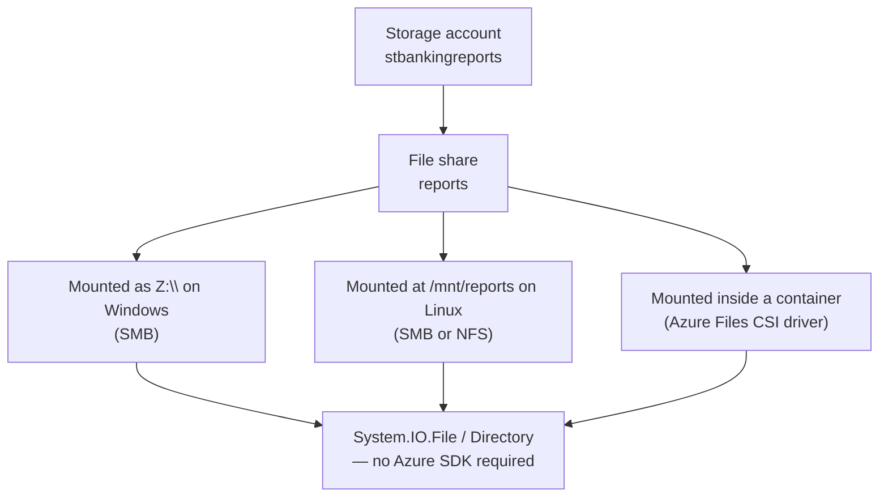
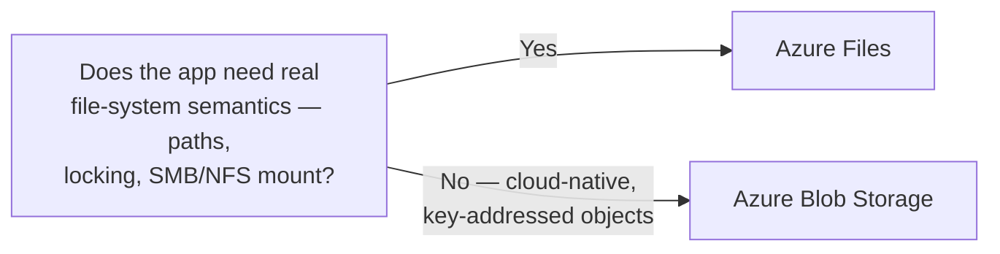

# Azure Files

## Introduction

Before reading this lesson, you should already be comfortable with **[Azure Table Storage](../16-azure-for-dotnet-developers/16-24-azure-table-storage.md)** and, further back, **[Azure Blob Storage](../16-azure-for-dotnet-developers/16-23-azure-blob-storage.md)** — both live in the same storage account as the service this lesson covers. Every storage option this module has covered so far is reached through an SDK call or a REST endpoint. This lesson introduces the one storage-account service that instead shows up as an ordinary drive letter or mount point: Azure Files, a fully managed file share your code doesn't need to know is running in the cloud at all.

By the end of this lesson, you will be able to:

- Explain what Azure Files is and how it differs from Blob Storage's object model
- Mount an Azure file share over SMB from Windows or Linux, and over NFS from Linux
- Read and write files against a mounted share using ordinary `System.IO` code
- Identify the two use cases Azure Files fits best: lift-and-shift and shared config across scaled-out instances
- Decide when a traditional file share is the right call instead of Blob Storage

## Azure Files — A Layman's Perspective

Picture a company that has always kept one shared filing cabinet in the break room — every employee walks up, opens a drawer, and reads or drops off a folder, exactly the way they always have, because that's simply how filing has worked at this company since before anyone currently employed there started. Now picture that company moving to a new office building across town. Rather than force every employee to relearn an entirely new filing system on day one, the company arranges for an identical-looking filing cabinet to be waiting for them at the new building — same drawers, same folder names, same everything — except this new cabinet is secretly serviced by a professional archival company behind the scenes, one that fireproofs it, backs up every folder automatically, and replaces the whole cabinet instantly if it's ever damaged, all without a single employee needing to be told any of that happened.

That secretly-professionally-managed cabinet is Azure Files. From an employee's chair, nothing changed — they still walk up to what looks and behaves like the exact same drawer-and-folder filing cabinet they've always used. What changed is everything happening behind that cabinet's back panel: Microsoft now owns the fireproofing, the backups, the hardware replacement, and the ability for that exact same cabinet to be reachable from a second, third, or fiftieth office branch simultaneously, all reading and writing the very same folders, with no separate copy sitting in each branch.

This is precisely why Azure Files exists, and precisely why it's different from the earlier lessons on Blob Storage and Table Storage. Blob Storage is more like a professional warehouse with a barcode-scanner front desk — extremely good at holding enormous quantities of stuff, but you don't walk in and browse shelves the way you'd rifle through a filing cabinet; you ask the front desk for exactly the barcode you want. Azure Files, by contrast, keeps the actual drawer-and-folder experience intact — a real hierarchical folder structure, files you can open directly by path, locking behavior when two people try to edit the same document, all the things a traditional office filing cabinet already did. That distinction matters enormously the moment a company has an existing application that was *written* assuming a filing cabinet exists — some older line-of-business software, for instance, that reads its configuration or writes its daily reports to a folder path it has always assumed was there, with no barcode scanner in sight. Rather than rewrite that application to speak a warehouse's barcode language, Azure Files lets it keep speaking the filing-cabinet language it always spoke, while quietly moving the actual cabinet into the cloud behind it.

The second reason a company might want this shared cabinet has nothing to do with an old application at all: sometimes several *new* branches of the same company each need to read and write the exact same shared set of folders — the same current price list, the same shared temp-workspace — and none of them want to keep their own separate, possibly out-of-sync copy. A single shared cabinet that every branch can open at once solves that immediately, without any branch needing to phone another branch to check whether its copy is current.

## Azure Files — A Programming Language Perspective

Azure Files is a fully managed cloud file share exposing the industry-standard **SMB** (Server Message Block) protocol, and, on Linux-based clients, the **NFS** (Network File System) protocol as well, so that any SMB- or NFS-capable client — Windows, Linux, macOS, a container, an on-premises server — can mount it as an ordinary network drive using the exact same `net use` / `mount` commands used against a local file server. Once mounted, application code reads and writes it through nothing more exotic than `System.IO.File` and `System.IO.Directory`, with no Azure-specific SDK involved at all; a `FileStream` opened against a UNC path pointed at an Azure file share behaves identically to one opened against a local disk, aside from network latency. Azure Files also exposes a native REST API and a `ShareClient`/`ShareFileClient` SDK surface (`Azure.Storage.Files.Shares`) for applications that want to manage or access shares programmatically without mounting them at all — useful for management tooling, less common for everyday file I/O.

## How to Mount and Use an Azure File Share

Provisioning a file share happens once, from the CLI or portal; from that point on, any SMB- or NFS-capable client mounts it exactly as it would a traditional file server, and application code needs no Azure-specific SDK to use it.


*Figure 1: One Azure file share, mounted identically by Windows, Linux, and containerized clients, all reading and writing through ordinary file I/O.*

```bash
# Azure CLI
az storage share create \
  --account-name stbankingreports \
  --name reports \
  --quota 100
```

**Azure CLI Output:**

```text
{
  "created": true
}
```

Mounting the share from Windows, over SMB:

```text
net use Z: \\stbankingreports.file.core.windows.net\reports /u:AZURE\stbankingreports <storage-account-key>
```

With the share mounted as `Z:\`, ordinary .NET file I/O just works:

```csharp
// Program.cs — .NET 10 / C# 14
string sharedReportsPath = @"Z:\daily-reconciliation";
Directory.CreateDirectory(sharedReportsPath);

string reportFile = Path.Combine(sharedReportsPath, "recon-2026-08-16.txt");
await File.WriteAllTextAsync(reportFile, "Branch 014: 412 transactions reconciled, 0 discrepancies.");

string readBack = await File.ReadAllTextAsync(reportFile);
Console.WriteLine($"Wrote and read back from: {reportFile}");
Console.WriteLine($"Contents: {readBack}");
Console.WriteLine($"Files currently in share: {Directory.GetFiles(sharedReportsPath).Length}");
```

**Console Output:**

```text
Wrote and read back from: Z:\daily-reconciliation\recon-2026-08-16.txt
Contents: Branch 014: 412 transactions reconciled, 0 discrepancies.
Files currently in share: 1
```

Nothing in that code block mentions Azure at all — `Directory.CreateDirectory`, `File.WriteAllTextAsync`, and `Path.Combine` are the same calls that would run against a local disk. That's the entire point of Azure Files: the mount, not the code, is where the cloud shows up.

## Real-Time Example: Shared Reconciliation Reports Across Banking Branch Servers

We extend the Banking/ATM domain's back-office processing, this time for a bank migrating an older on-premises reconciliation job to Azure without rewriting it. Every night, several regional processing servers each write a small reconciliation report to what their code has always assumed was a shared network drive — a lift-and-shift scenario where changing the *storage location* was acceptable, but rewriting decades-old file-handling code was not.

```csharp
// NightlyReconciliation.cs — .NET 10 / C# 14 — Real-Time Example (Banking / ATM)
public sealed record BranchReconciliation(string BranchId, int TransactionsProcessed, int Discrepancies);

string sharedReportsPath = @"Z:\daily-reconciliation"; // Azure file share, mounted identically on every branch server

BranchReconciliation[] branches =
[
    new("014", TransactionsProcessed: 412, Discrepancies: 0),
    new("027", TransactionsProcessed: 951, Discrepancies: 1),
    new("103", TransactionsProcessed: 288, Discrepancies: 0)
];

foreach (var branch in branches)
{
    string path = Path.Combine(sharedReportsPath, $"branch-{branch.BranchId}.txt");
    string line = $"Branch {branch.BranchId}: {branch.TransactionsProcessed} transactions, " +
                  $"{branch.Discrepancies} discrepancies.";
    await File.WriteAllTextAsync(path, line); // each branch server writes its own report to the SAME share
}

Console.WriteLine("Reports written by each branch server, read back from the shared file share:");
foreach (string file in Directory.GetFiles(sharedReportsPath, "branch-*.txt").OrderBy(f => f))
{
    Console.WriteLine($" - {Path.GetFileName(file)}: {await File.ReadAllTextAsync(file)}");
}
```

**Console Output:**

```text
Reports written by each branch server, read back from the shared file share:
 - branch-014.txt: Branch 014: 412 transactions, 0 discrepancies.
 - branch-027.txt: Branch 027: 951 transactions, 1 discrepancies.
 - branch-103.txt: Branch 103: 288 transactions, 0 discrepancies.
```

Three separate branch servers each wrote to the same `Z:\daily-reconciliation` path, and a fourth process — an overnight audit job, say — can read every branch's report back from that same shared location without any server-to-server networking of its own. This is the exact shape a legacy reconciliation job was already built around; migrating it to Azure Files meant changing a mount target, not rewriting a single line of the reconciliation logic itself.

## Azure Files vs Blob Storage

The decision between them comes down to what the consuming application already expects. An application written against a real hierarchical file system — one that opens files by path, expects directory listings, or relies on file locking during concurrent writes — needs Azure Files, because Blob Storage's flat, key-based object model doesn't offer any of that; a "folder" in Blob Storage is only ever a naming convention within a blob's key, never a real directory an SMB client can browse. Conversely, an application built from scratch for the cloud, storing large binary objects addressed by a key rather than a path, has no need for SMB or NFS at all and should default to Blob Storage's far larger scale ceiling and lower cost per gigabyte. Shared configuration or shared scratch space accessed identically from several App Service instances is the other common case Azure Files fits well, precisely because every instance can mount the same share and see the same files instantly, the way the earlier branch-server example depended on.


*Figure 2: The same storage account, two different consumption models — one a mountable file system, the other a flat object store.*

| Aspect | Azure Files | Azure Blob Storage |
|---|---|---|
| Access model | Mounted SMB/NFS share, real folder hierarchy | REST API / SDK, flat key-based objects |
| Client code | Ordinary `System.IO`, no Azure SDK needed | `BlobClient`/`BlobContainerClient` SDK calls |
| File locking | Yes, standard SMB locking semantics | No native locking concept |
| Best fit | Lift-and-shift apps, shared config across instances | Cloud-native apps, large-scale unstructured object storage |
| Max practical scale | Large, but well below Blob Storage's ceiling | Effectively unlimited, exabyte-scale |

## Types of Azure Files Concepts

1. **SMB protocol support** — the default, cross-platform protocol used from Windows and Linux clients alike, covered throughout this lesson.
2. **NFS protocol support** — a Linux-only alternative protocol, chosen for workloads needing NFS-specific semantics rather than SMB's.
3. **Azure File Sync** — keeps an on-premises Windows Server's local disk cached and synchronized with an Azure file share, easing a gradual, rather than immediate, lift-and-shift.
4. **Storage tiers (Transaction Optimized, Hot, Cool)** — pricing tiers trading transaction cost against storage cost, mirroring Blob Storage's own tiering model.
5. **Azure Files CSI driver** — mounts a file share directly into a Kubernetes pod or Azure Container Apps workload, extending this lesson's mount concept into containers.
6. **[Azure Cache for Redis](../16-azure-for-dotnet-developers/16-26-azure-cache-for-redis.md)** — next lesson's in-memory data store, covering a very different kind of shared state across scaled-out instances.

## What You've Learned & What's Next

Azure Files gives an application the exact filing-cabinet experience it may have always expected — real paths, real folders, real locking — while Microsoft quietly owns everything behind that cabinet's back panel, making it the natural fit for lift-and-shift migrations and for sharing config or scratch space across scaled-out instances. Continue your learning journey with **[Azure Cache for Redis](../16-azure-for-dotnet-developers/16-26-azure-cache-for-redis.md)**, where we cover a fundamentally different kind of shared state: an in-memory cache built for speed rather than file semantics.

---
*Applies to: .NET 10 / C# 14. Last reviewed 2026-08-16.*
