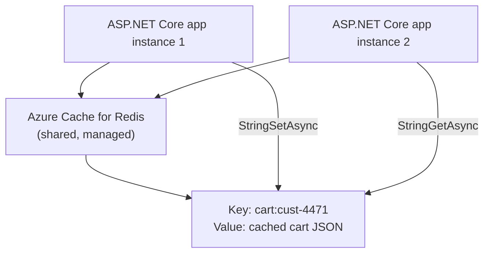
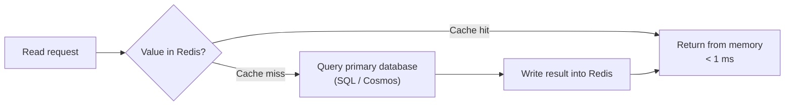

# Azure Cache for Redis

## Introduction

Before reading this lesson, you should already be comfortable with **[Azure Files](../16-azure-for-dotnet-developers/16-25-azure-files.md)** and, more importantly, with the scale-out problem **[SignalR Groups and Scaling](../14-grpc-signalr-security/14-05-signalr-groups-and-scaling.md)** raised back in Module 14: the moment an application runs on more than one server instance, anything held only in one instance's memory becomes invisible to the others. This lesson introduces the service built specifically to fix that class of problem — an in-memory data store shared by every instance at once, fast enough that borrowing it costs almost nothing.

By the end of this lesson, you will be able to:

- Explain what Redis is and why "in-memory" makes it dramatically faster than a disk-backed database for simple key-value access
- Describe what Azure Cache for Redis manages on your behalf versus running Redis yourself
- Use `StackExchange.Redis` to store and retrieve values from C#
- Apply Redis to session state for a scaled-out ASP.NET Core app and to general-purpose distributed caching
- Connect this lesson back to the SignalR backplane problem raised in Module 14

## Azure Cache for Redis — A Layman's Perspective

Picture the difference between a librarian who keeps the ten most-requested books stacked on a cart right behind the front desk, and one who has to walk to the archive basement, several floors down, every single time anyone asks for anything — even the same bestselling novel forty different patrons ask for on the same afternoon. The basement librarian gives the right answer every time, but the walk down and back costs real minutes, every single time, no matter how many times the exact same book gets requested. The front-desk cart, by contrast, holds nothing permanently — if the shelving staff ever rearranges the whole library overnight, that cart's contents no longer reflect the full collection and need refreshing — but for the ten books everyone actually keeps asking for right now, it answers in the time it takes to reach out an arm.

That front-desk cart is Redis: a place to keep the answers to your most frequently asked questions sitting in memory, arm's reach away, rather than re-fetching them from a slower, disk-backed database every single time. It never claims to be the library's actual permanent collection — the basement archive, a relational database or Cosmos DB, still holds the authoritative copy of everything — but for data worth keeping close, Redis answers in a fraction of a millisecond instead of the tens of milliseconds a full database round trip usually costs.

Now imagine that library has grown into a chain with five branches across town, and each branch wants its own front-desk cart. If each branch's cart is stocked independently, a patron who checks out a book at Branch A and walks into Branch B ten minutes later might find Branch B's cart still shows that book as available — its cart never learned about Branch A's checkout, because the two carts don't talk to each other at all. A shared, cloud-hosted cart that every branch reaches into instead solves this immediately: any branch that updates it, every other branch sees reflected right away, because there's only ever one cart, not five disconnected ones.

That shared, professionally managed cart — reachable by every branch, refilled and maintained by someone else so no branch has to run its own cart-stocking operation — is Azure Cache for Redis. It's the same Redis technology any team could install and run themselves on a server, except Microsoft now handles the patching, the failover if a cart breaks, and the scaling if the chain suddenly needs a bigger cart during a citywide book fair. What each branch's own application code experiences doesn't change at all: reach for a value by its key, and either get it back instantly, or learn it isn't there and go fetch the real answer from the basement archive instead.

## Azure Cache for Redis — A Programming Language Perspective

**Redis** is an open-source, in-memory data structure store, most commonly used as a key-value cache, where every value lives in RAM rather than on disk, giving reads and writes sub-millisecond latency at the cost of durability guarantees weaker than a full database's. **Azure Cache for Redis** is Microsoft's managed offering of that same Redis engine — the same wire protocol and command set, but with patching, high availability, clustering, and scaling handled by Azure rather than by your own team. From .NET, the **`StackExchange.Redis`** package is the de facto client library, exposing an `IConnectionMultiplexer` that yields an `IDatabase` for issuing Redis commands such as `StringSetAsync`, `StringGetAsync`, and `KeyExpireAsync` (for time-based cache expiration). ASP.NET Core also integrates Redis at a higher level of abstraction through `IDistributedCache` (via `Microsoft.Extensions.Caching.StackExchangeRedis`) for general-purpose distributed caching, and through the ASP.NET Core Session middleware, which can be configured to persist session state in Redis instead of in-process memory — precisely what a scaled-out deployment behind a load balancer requires.

## How to Read and Write Values with StackExchange.Redis

An `IConnectionMultiplexer` is created once and shared for the app's lifetime; every subsequent operation goes through the lightweight `IDatabase` it hands out, which maps almost one-to-one onto raw Redis commands.


*Figure 1: One shared Redis cache reachable by every scaled-out app instance, so a value set by one instance is immediately visible to another.*

```bash
# Azure CLI
az redis create \
  --name redis-ecommerce \
  --resource-group rg-ecommerce \
  --location eastus \
  --sku Standard \
  --vm-size c1
```

**Azure CLI Output:**

```text
{
  "hostName": "redis-ecommerce.redis.cache.windows.net",
  "sku": { "name": "Standard", "family": "C", "capacity": 1 },
  "provisioningState": "Succeeded",
  "sslPort": 6380
}
```

```csharp
// Program.cs — .NET 10 / C# 14
using StackExchange.Redis;

var connectionString = "redis-ecommerce.redis.cache.windows.net:6380,password=<primary-key>,ssl=True";
using ConnectionMultiplexer redis = await ConnectionMultiplexer.ConnectAsync(connectionString);
IDatabase db = redis.GetDatabase();

await db.StringSetAsync("product:sku-8842:price", "24.99", expiry: TimeSpan.FromMinutes(10));

string? cachedPrice = await db.StringGetAsync("product:sku-8842:price");
Console.WriteLine($"Cached price for sku-8842: {cachedPrice}");

bool exists = await db.KeyExistsAsync("product:sku-8842:price");
TimeSpan? ttl = await db.KeyTimeToLiveAsync("product:sku-8842:price");
Console.WriteLine($"Key exists: {exists}, expires in: {ttl?.TotalMinutes:F0} minutes");
```

**Console Output:**

```text
Cached price for sku-8842: 24.99
Key exists: True, expires in: 10 minutes
```

The price was written once with a ten-minute expiry and read back instantly — no round trip to the product catalog's real database was needed for this read, and the `KeyExpireAsync`-style TTL means a stale price can never linger in the cache indefinitely, since Redis itself removes the key once the expiry elapses.

## Real-Time Example: Distributed Session State for a Scaled-Out Shopping Cart

We extend the E-Commerce Order Processing domain's shopping cart, now running behind a load balancer across three ASP.NET Core instances. Without a shared cache, a shopper's cart would only exist in whichever single instance's memory happened to handle their first request — the exact same scale-out trap Module 14's SignalR lesson described for group membership, here applied to cart state instead.

```csharp
// SharedCartCache.cs — .NET 10 / C# 14 — Real-Time Example (E-Commerce Order Processing)
using StackExchange.Redis;
using System.Text.Json;

public sealed record CartItem(string Sku, string Name, int Quantity, decimal UnitPrice);
public sealed record ShoppingCart(string CustomerId, List<CartItem> Items);

var connection = await ConnectionMultiplexer.ConnectAsync(
    "redis-ecommerce.redis.cache.windows.net:6380,password=<primary-key>,ssl=True");
IDatabase cache = connection.GetDatabase();

string cartKey = "cart:cust-4471";

// Instance A: shopper adds an item; only instance A handled this particular request
var cart = new ShoppingCart("cust-4471",
[
    new CartItem("sku-8842", "Wireless Mouse", Quantity: 1, UnitPrice: 24.99m)
]);
await cache.StringSetAsync(cartKey, JsonSerializer.Serialize(cart), expiry: TimeSpan.FromHours(2));
Console.WriteLine("[Instance A] Cart written to shared Redis cache.");

// Instance B: a later request from the SAME shopper lands on a different server entirely
string? cachedJson = await cache.StringGetAsync(cartKey);
ShoppingCart? cartOnInstanceB = JsonSerializer.Deserialize<ShoppingCart>(cachedJson!);
Console.WriteLine($"[Instance B] Read the same cart with no knowledge of Instance A's memory:");
foreach (var item in cartOnInstanceB!.Items)
{
    Console.WriteLine($"  - {item.Name} x{item.Quantity} @ {item.UnitPrice:C}");
}
```

**Console Output:**

```text
[Instance A] Cart written to shared Redis cache.
[Instance B] Read the same cart with no knowledge of Instance A's memory:
  - Wireless Mouse x1 @ $24.99
```

Instance A and Instance B are two entirely separate processes, possibly on two entirely separate machines, and neither one holds the shopper's cart in its own memory at all — both simply read and write the same key in the shared Redis cache. A shopper can be load-balanced to any instance on any request, add an item on one, and check out from another, and never notice the difference, because the cart's actual state was never tied to a single instance's memory in the first place. This is precisely the pattern Module 14's SignalR backplane relied on Redis for too: a shared, external store that makes "which server instance handled this request" stop mattering.

## Redis Caching vs Querying the Primary Database Directly

Caching a value in Redis trades a small amount of staleness risk for a large latency win: a cache hit returns in well under a millisecond, versus tens of milliseconds (or more, under load) for a round trip to a relational database or Cosmos DB. The tradeoff only pays off for data read far more often than it changes — a product price shown to thousands of shoppers a minute, but updated only occasionally, is an excellent candidate; a bank account's current balance, which must always reflect the very latest transaction, is a poor one unless the caching strategy is designed with extreme care around invalidation. Expiration (`TimeSpan` on `StringSetAsync`) bounds how long stale data can survive; explicit invalidation on write (deleting or updating the cached key the moment the underlying value changes) tightens that bound further, at the cost of more code paths needing to remember the cache exists at all.


*Figure 2: The cache-aside pattern — check Redis first, fall back to the primary database only on a miss, then populate the cache for next time.*

| Aspect | Redis cache read | Primary database read |
|---|---|---|
| Typical latency | Sub-millisecond | Single-digit to tens of milliseconds |
| Data freshness | As fresh as the last write/expiry | Always current |
| Survives a cache-wide flush | No — falls back to the database | N/A, it is the source of truth |
| Best fit | Frequently read, tolerant of brief staleness | Anything requiring guaranteed current state |
| Cost per read at scale | Very low | Higher — real query/compute cost each time |

## Types of Azure Cache for Redis Use Cases

1. **Distributed session state** — replacing ASP.NET Core's default in-process session provider so any scaled-out instance can serve any user's session.
2. **General-purpose distributed caching** — via `IDistributedCache`, caching expensive query results or computed values across all instances.
3. **SignalR backplane** — the exact role Module 14's **[SignalR Groups and Scaling](../14-grpc-signalr-security/14-05-signalr-groups-and-scaling.md)** lesson described, letting group notifications reach clients connected to any server instance.
4. **Rate limiting and counters** — Redis's atomic `INCR` command makes it a natural fit for distributed request counters and rate limiters.
5. **Pub/Sub messaging** — lightweight publish/subscribe channels, useful for simple cross-instance notifications that don't need a full message broker.
6. **[Azure Data Lake Basics](../16-azure-for-dotnet-developers/16-27-azure-data-lake-basics.md)** — next lesson, moving from fast in-memory access to the opposite end of the spectrum: large-scale analytical storage.

## What You've Learned & What's Next

Azure Cache for Redis gives every instance of a scaled-out application a single, shared, in-memory place to keep frequently-read data close at hand — session state, cached query results, or a SignalR backplane — trading a small amount of staleness risk for a large latency win. Continue your learning journey with **[Azure Data Lake Basics](../16-azure-for-dotnet-developers/16-27-azure-data-lake-basics.md)**, where the module turns to the opposite end of the storage spectrum: not fast, small, in-memory data, but massive analytical datasets.

---
*Applies to: .NET 10 / C# 14. Last reviewed 2026-08-16.*
