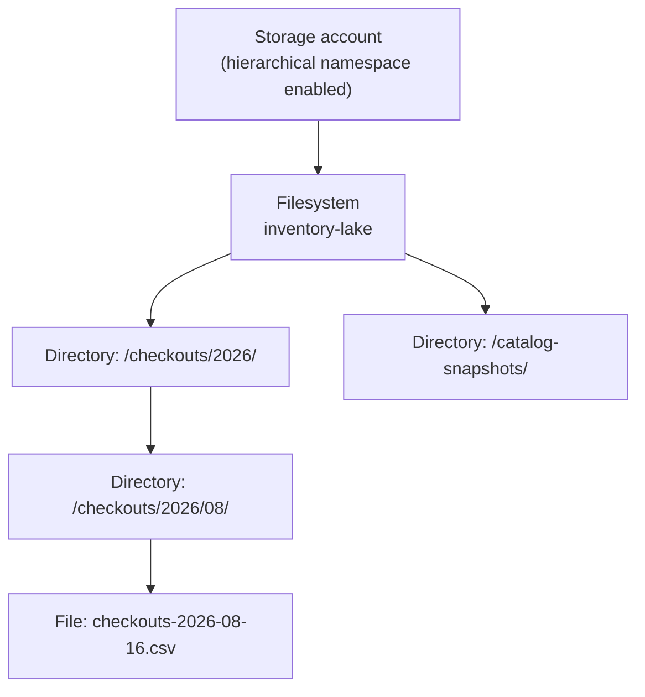
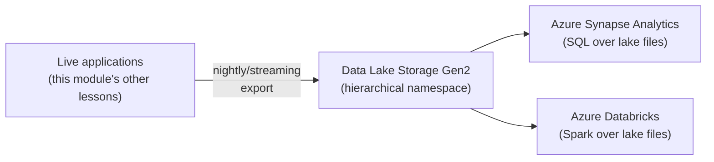

# Azure Data Lake Basics

## Introduction

Before reading this lesson, you should already be comfortable with **[Azure Cache for Redis](../16-azure-for-dotnet-developers/16-26-azure-cache-for-redis.md)** and, further back, **[Azure Blob Storage](../16-azure-for-dotnet-developers/16-23-azure-blob-storage.md)**. Every storage service this module has covered so far exists to serve an application's own live transactions — a shopping cart, an order, a cached price. This lesson introduces a fundamentally different purpose: storing enormous volumes of raw and processed data not to run today's application, but to be analyzed, in bulk, by people and systems asking questions about *all* the data at once.

By the end of this lesson, you will be able to:

- Explain what Azure Data Lake Storage Gen2 is and how it relates to Blob Storage
- Describe what a hierarchical namespace adds that flat blob storage doesn't have
- Explain why a data lake is built for analytics, not for typical transactional application access
- Upload and organize data in a Data Lake Storage Gen2 account from C#
- Describe, conceptually, how a data lake fits alongside analytics services like Synapse and Databricks

## Azure Data Lake Basics — A Layman's Perspective

Picture the difference between a small shop's daily cash register and a company's entire annual archive of every receipt, every supplier invoice, every inventory count sheet, going back years, stored in one enormous records warehouse. The cash register exists to answer one narrow, urgent question extremely fast: "does this customer owe $12.50 right now." The records warehouse exists to answer an entirely different kind of question, one nobody needs answered in a fraction of a second: "across every branch, every season, for the last five years, which product categories actually drove profit, and which ones quietly lost money the whole time." Nobody runs today's checkout line off the records warehouse, and nobody tries to answer a five-year trend question by staring at today's cash register tape.

Azure Data Lake Storage Gen2 is that records warehouse. It's built to hold enormous, heterogeneous volumes of data — structured, semi-structured, and completely unstructured, all side by side — cheaply enough that "just keep everything, we might need it later" is a realistic policy rather than a wildly expensive one. It is not where a live application checks a customer's current balance or a book's current availability; it's where that same data, and mountains more like it, eventually lands so that analysts and automated pipelines can ask sweeping questions about it, at their own pace, without ever touching the systems actually running today's transactions.

Here's the detail that makes this records warehouse more useful than just a bigger version of a regular storage room: it's organized with real folders and subfolders — sales by year, then by region, then by month — the same way a well-run physical archive room would be organized, rather than every single document just being tossed into one giant undifferentiated pile with a barcode sticker on it. That organized folder structure is what Data Lake Storage Gen2 adds on top of ordinary Blob Storage's flat design: a genuine hierarchy, so an analyst pulling "everything from Q3 2025" can be pointed straight at one real folder rather than having to sift a barcode-tagged pile for anything whose sticker happens to mention Q3.

And just as no single archive clerk personally reads all five years of receipts by hand to spot a trend, nobody expects to query a data lake's raw contents directly with the same tools used for today's checkout line. Specialized analytics services exist specifically to be pointed at that records warehouse and do the heavy reading and number-crunching on its behalf — services this lesson will only name, not build with, because the module's focus stays on .NET application development rather than the analytics platforms built on top of what this module's storage lessons produce.

## Azure Data Lake Basics — A Programming Language Perspective

**Azure Data Lake Storage Gen2** is Azure Blob Storage with one additional capability enabled at the storage account level: a **hierarchical namespace**, which turns folder paths from a mere naming convention within a blob's key (as in ordinary Blob Storage) into real, atomically-renameable, individually-permissioned directory objects, much closer to a traditional file system's semantics. Because it's built on the same underlying Blob Storage platform, existing Blob SDKs and REST APIs — `Azure.Storage.Blobs`, covered in the earlier Blob Storage lesson — continue to work against a Data Lake Storage Gen2 account largely unchanged; a dedicated **`Azure.Storage.Files.DataLake`** SDK adds directory-aware operations (`DataLakeDirectoryClient`, atomic directory rename, POSIX-style access control lists) on top of that same storage. Data Lake Storage Gen2 is designed for **big-data analytics workloads** — large sequential reads and writes across huge volumes of structured, semi-structured, and unstructured data — not the small, highly concurrent, latency-sensitive point reads and writes that Azure SQL Database, Cosmos DB, or Table Storage were built to serve for a live transactional application.

## How to Organize and Upload Data with the Data Lake SDK

A hierarchical namespace means directories are real, first-class objects rather than a naming convention, so creating and populating them uses directory-aware client types rather than only blob keys.


*Figure 1: A real directory hierarchy, not just key naming conventions — years, months, and datasets each a genuine directory object.*

```bash
# Azure CLI
az storage account create \
  --name stlibrarylake \
  --resource-group rg-library \
  --location eastus \
  --sku Standard_LRS \
  --kind StorageV2 \
  --enable-hierarchical-namespace true

az storage fs create \
  --account-name stlibrarylake \
  --name inventory-lake
```

**Azure CLI Output:**

```text
{
  "isHnsEnabled": true,
  "name": "stlibrarylake",
  "provisioningState": "Succeeded"
}
{
  "created": true,
  "name": "inventory-lake"
}
```

```csharp
// Program.cs — .NET 10 / C# 14
using Azure.Storage.Files.DataLake;

var serviceClient = new DataLakeServiceClient(
    new Uri("https://stlibrarylake.dfs.core.windows.net"),
    new Azure.Storage.StorageSharedKeyCredential("stlibrarylake", "<account-key>"));

DataLakeFileSystemClient fileSystem = serviceClient.GetFileSystemClient("inventory-lake");

DataLakeDirectoryClient directory = fileSystem.GetDirectoryClient("checkouts/2026/08");
await directory.CreateIfNotExistsAsync();

DataLakeFileClient file = directory.GetFileClient("checkouts-2026-08-16.csv");
byte[] csvBytes = System.Text.Encoding.UTF8.GetBytes("ISBN,Title,CheckedOutOn\n9780134685991,Effective Java,2026-08-16\n");
await file.UploadAsync(new MemoryStream(csvBytes), overwrite: true);

Console.WriteLine($"Uploaded to: {directory.Path}/{file.Name}");
Console.WriteLine($"Directory exists: {(await directory.ExistsAsync()).Value}");
```

**Console Output:**

```text
Uploaded to: checkouts/2026/08/checkouts-2026-08-16.csv
Directory exists: True
```

`checkouts/2026/08` was created as a genuine directory object, not merely implied by a slash character inside a blob key — a real distinction the moment something needs to rename, move, or set access permissions on that whole `2026/08` directory as one atomic operation, rather than touching every individually-named blob underneath it one at a time.

## Real-Time Example: Landing Library Checkout History for Analysis

We extend the Library/Inventory Management domain's checkout records, this time not for the live catalog application from earlier lessons, but for a nightly job that lands a full day's checkout activity into the data lake so an analytics team can later ask questions no live application query was ever designed to answer — "which genres see the steepest seasonal drop-off," across years of history.

```csharp
// CheckoutHistoryLanding.cs — .NET 10 / C# 14 — Real-Time Example (Library / Inventory Management)
using Azure.Storage.Files.DataLake;
using System.Text;

public sealed record CheckoutRecord(string Isbn, string Title, string Genre, DateOnly CheckedOutOn);

var fileSystem = new DataLakeFileSystemClient(
    new Uri("https://stlibrarylake.dfs.core.windows.net/inventory-lake"),
    new Azure.Storage.StorageSharedKeyCredential("stlibrarylake", "<account-key>"));

CheckoutRecord[] todaysCheckouts =
[
    new("9780134685991", "Effective Java", "Technology", new DateOnly(2026, 8, 16)),
    new("9780596007126", "Head First Design Patterns", "Technology", new DateOnly(2026, 8, 16)),
    new("9780345339706", "The Fellowship of the Ring", "Fantasy", new DateOnly(2026, 8, 16))
];

string datePath = $"checkouts/{todaysCheckouts[0].CheckedOutOn:yyyy}/{todaysCheckouts[0].CheckedOutOn:MM}";
DataLakeDirectoryClient directory = fileSystem.GetDirectoryClient(datePath);
await directory.CreateIfNotExistsAsync();

var csv = new StringBuilder("ISBN,Title,Genre,CheckedOutOn\n");
foreach (var record in todaysCheckouts)
{
    csv.AppendLine($"{record.Isbn},{record.Title},{record.Genre},{record.CheckedOutOn:yyyy-MM-dd}");
}

string fileName = $"checkouts-{todaysCheckouts[0].CheckedOutOn:yyyy-MM-dd}.csv";
DataLakeFileClient file = directory.GetFileClient(fileName);
await file.UploadAsync(new MemoryStream(Encoding.UTF8.GetBytes(csv.ToString())), overwrite: true);

Console.WriteLine($"Landed {todaysCheckouts.Length} checkout records to: {datePath}/{fileName}");
Console.WriteLine("This file is not read by the live catalog app — it's read later, in bulk, by an analytics pipeline.");
```

**Console Output:**

```text
Landed 3 checkout records to: checkouts/2026/08/checkouts-2026-08-16.csv
This file is not read by the live catalog app — it's read later, in bulk, by an analytics pipeline.
```

Nothing about the live library catalog application changes because this job exists — the catalog still reads and writes its per-branch availability counts through Table Storage, exactly as an earlier lesson covered. This nightly landing job runs entirely separately, accumulating one small file per day into a `checkouts/YYYY/MM/` directory structure that, over years, becomes exactly the kind of large, organized, historical dataset a big-data analytics query is built to scan across — a question the live catalog's own storage was never designed to answer efficiently, or at all.

## Data Lake Storage Gen2 and the Wider Analytics Landscape

A data lake account is rarely queried directly by an application the way this module's other storage services are; it's typically the *landing zone* that dedicated analytics services are pointed at. **Azure Synapse Analytics** can query files sitting directly in a Data Lake Storage Gen2 account using either serverless SQL pools (paying only per query, no cluster to manage) or dedicated SQL pools (a provisioned data warehouse), letting an analyst write familiar SQL against files that were never loaded into a traditional database at all. **Azure Databricks** takes a complementary approach, running Apache Spark clusters directly against the same lake for large-scale distributed processing, machine learning pipelines, and transformations too complex or too large for SQL alone. Both services read the lake as their source of truth rather than duplicating its contents into their own storage first, which is exactly why organizing data well within the lake — the directory structure the earlier example built — matters so much: a well-organized lake is what makes both of these downstream services efficient rather than a slow full scan every time.


*Figure 2: Live applications feed the lake; dedicated analytics services query it directly, rather than the lake being queried by the applications themselves.*

| Aspect | Transactional storage (SQL/Cosmos/Table, earlier lessons) | Azure Data Lake Storage Gen2 |
|---|---|---|
| Primary consumer | The live application itself | Analytics services (Synapse, Databricks) and data engineers |
| Access pattern | Small, frequent, low-latency reads/writes | Large, bulk, sequential reads across huge datasets |
| Data shape | Structured rows or documents, schema-enforced or flexible | Structured, semi-structured, and unstructured, side by side |
| Namespace | Rows/documents keyed by primary/partition key | Real hierarchical directories (Gen2's defining feature) |
| Typical question answered | "What is this customer's current cart?" | "What happened, in aggregate, across five years of data?" |

## Types of Data Lake and Big-Data Concepts

1. **Hierarchical namespace** — the feature distinguishing Data Lake Storage Gen2 from ordinary Blob Storage, covered throughout this lesson.
2. **Azure Synapse Analytics** — a SQL-based analytics service that can query lake data directly, mentioned conceptually above.
3. **Azure Databricks** — an Apache Spark-based analytics and machine-learning platform, also able to read lake data directly.
4. **[Azure Blob Storage](../16-azure-for-dotnet-developers/16-23-azure-blob-storage.md)** — the underlying flat object storage platform Data Lake Storage Gen2 builds its hierarchy on top of.
5. **POSIX-style access control lists** — per-directory and per-file permissions Data Lake Storage Gen2 supports beyond ordinary Blob Storage's container-level access model.
6. **[Azure SQL vs Cosmos DB — Comparison](../16-azure-for-dotnet-developers/16-28-azure-sql-vs-cosmos-db.md)** — next lesson, returning to the transactional side of the storage landscape this lesson deliberately stepped outside of.

## What You've Learned & What's Next

Azure Data Lake Storage Gen2 takes Blob Storage's cheap, massive-scale object storage and adds a real directory hierarchy on top of it, purpose-built for big-data analytics rather than the small, frequent, latency-sensitive access patterns a live transactional application needs — with services like Synapse and Databricks doing the actual querying and processing on top of it. Continue your learning journey with **[Azure SQL vs Cosmos DB — Comparison](../16-azure-for-dotnet-developers/16-28-azure-sql-vs-cosmos-db.md)**, where we return to this module's two transactional database options and put them directly side by side.

---
*Applies to: .NET 10 / C# 14. Last reviewed 2026-08-16.*
