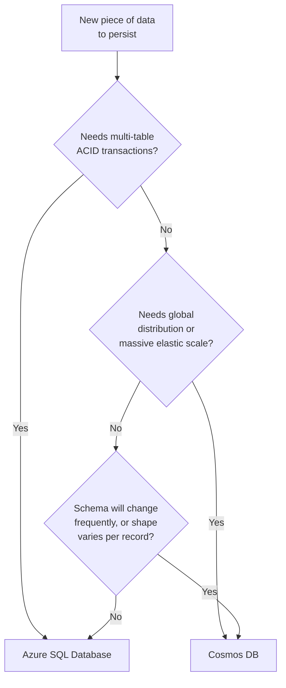
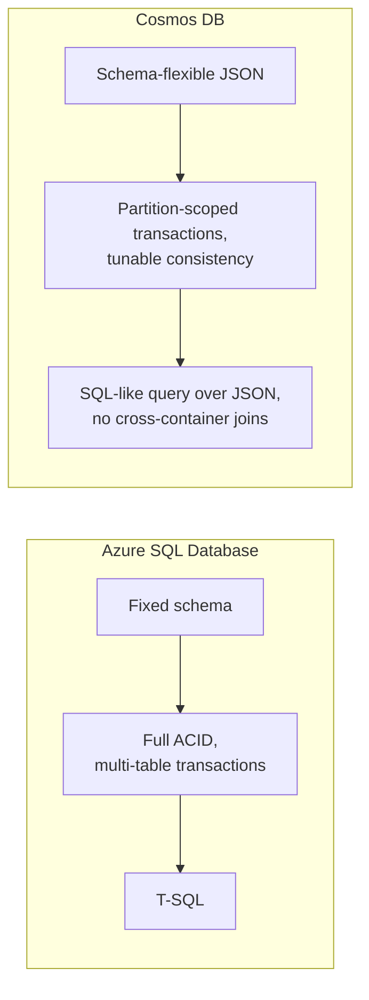

# Azure SQL vs Cosmos DB — Comparison

## Introduction

Before reading this lesson, you should already be comfortable with **[Azure Data Lake Basics](../16-azure-for-dotnet-developers/16-27-azure-data-lake-basics.md)** and, more directly, with **[Azure SQL Database](../16-azure-for-dotnet-developers/16-20-azure-sql-database.md)** and **[Introduction to Azure Cosmos DB](../16-azure-for-dotnet-developers/16-21-introduction-to-cosmos-db.md)** from earlier in this module. Both of those lessons introduced their database in isolation. This lesson puts them directly side by side, because the question every real project actually faces isn't "how does Cosmos DB work" — it's "which of these two do I reach for, right now, for this specific piece of data."

By the end of this lesson, you will be able to:

- State the core structural difference between a relational database and a document database in one sentence each
- Explain what ACID guarantees Azure SQL Database gives you that Cosmos DB does not give you by default
- Compare the two services' cost models and explain why they charge for fundamentally different things
- Contrast T-SQL against Cosmos DB's SQL (Core) API query language
- Use a scenario-based decision table to choose correctly for a new piece of data

## Azure SQL vs Cosmos DB — A Layman's Perspective

Picture two very different ways a bank could keep its ledgers. The first way is a single, tightly controlled vault room with one master ledger book, where every single entry must be written in a fixed, pre-printed format — a column for the account number, a column for the amount, a column for the date — and a strict clerk checks every entry against every other related entry before allowing it to be finalized, refusing anything that would leave the books unbalanced even for a moment. That vault room is slow by design, on purpose, because "slow but never, ever wrong" is exactly the guarantee a ledger needs. The second way is a distributed network of regional teller stations, each keeping its own local notebook of loosely-structured notes about accounts, synchronized with the other stations on a short delay rather than instantly, so that a teller in one city never has to wait for a teller in another city to confirm anything before serving the customer standing in front of them right now.

The first is Azure SQL Database's world: a single, rigorously enforced source of truth, where every entry's format is fixed in advance by a schema, and every related change either fully happens or fully doesn't — that's what "ACID" and "strong schema" mean in practice, a ledger that refuses to ever show you half of a transaction. The second is Cosmos DB's world: many regional copies, each answering fast because it never has to phone another region before answering, accepting that a teller in Tokyo might be looking at information that's a few milliseconds behind what a teller in Toronto just wrote, in exchange for never once making a customer wait for that faraway confirmation.

Neither ledger design is "better" in some absolute sense — they're built for different institutions with different priorities. A bank's core account balances genuinely can't tolerate the second design's brief, eventual-consistency lag; a single incorrect balance, even briefly, is unacceptable, and the strict format means every teller everywhere already agrees on exactly what an entry looks like before they even open the book. But a bank's mobile app showing a customer their last ten transactions across every branch they've ever visited, worldwide, with sub-second response no matter which continent they're standing on? That's exactly the second design's strength, and forcing it through the first design's single master vault would mean every mobile app request anywhere in the world queuing up behind that one strict clerk.

Cost follows the same split. The vault room bills you for a dedicated room and a dedicated clerk, sized for your peak day, whether or not most days actually need that much capacity — Azure SQL's DTU/vCore model, covered in an earlier lesson. The teller network bills you, instead, for how much reading and writing actually happens across all its regional stations combined — Cosmos DB's request-unit model, a direct meter on activity rather than a flat allocation of a dedicated room.

## Azure SQL Database vs Cosmos DB — A Programming Language Perspective

**Azure SQL Database** enforces a fixed relational schema, full ACID transactions across multiple related tables, and is queried with standard T-SQL, exactly as covered in this module's earlier lesson — every write either fully commits or fully rolls back, and every table's shape is declared up front and enforced by the engine itself. **Cosmos DB** stores schema-flexible JSON documents, transactions are guaranteed only *within* a single logical partition (not across partitions or containers), and its default account-level consistency can be tuned across five levels from Strong down to Eventual, as the earlier partitioning lesson covered — most applications run at Session consistency, which is not the same guarantee as full ACID across the whole dataset. Azure SQL Database bills primarily by provisioned compute capacity (DTUs or vCores) regardless of how much of that capacity is actually used at any given moment; Cosmos DB bills by **Request Units (RUs)** consumed, a normalized measure of the CPU, memory, and I/O cost of each individual operation, whether provisioned ahead of time in throughput units or consumed on-demand in serverless mode.

## How to Reason About the Decision in Code

The decision below isn't arbitrary — it maps onto a small set of concrete questions about the data itself, not about which database happens to be more fashionable.


*Figure 1: A sequence of concrete questions about the data itself, not a coin flip between two equally valid defaults.*

```csharp
// Program.cs — .NET 10 / C# 14
enum DataNeed
{
    MultiTableAcidTransactions,
    GlobalDistributionOrElasticScale,
    FrequentlyChangingSchema,
    FixedRelationalReporting
}

string Recommend(DataNeed need) => need switch
{
    DataNeed.MultiTableAcidTransactions => "Azure SQL Database",
    DataNeed.GlobalDistributionOrElasticScale => "Cosmos DB",
    DataNeed.FrequentlyChangingSchema => "Cosmos DB",
    DataNeed.FixedRelationalReporting => "Azure SQL Database",
    _ => "Unknown -- revisit the requirements"
};

foreach (DataNeed need in Enum.GetValues<DataNeed>())
{
    Console.WriteLine($"{need} -> {Recommend(need)}");
}
```

**Console Output:**

```text
MultiTableAcidTransactions -> Azure SQL Database
GlobalDistributionOrElasticScale -> Cosmos DB
FrequentlyChangingSchema -> Cosmos DB
FixedRelationalReporting -> Azure SQL Database
```

As with the Module 15 capstone's decision framework, the `switch` expression itself is trivial — the actual work is correctly naming what a given piece of data needs before reaching for either database.

## Real-Time Example: Splitting a Banking Platform's Data Across Both Databases

We extend the Banking/ATM domain, where a single modern banking platform genuinely uses both databases at once, each for the part of the system it fits best — proof that this decision is made per-dataset, not once for an entire application.

```csharp
// BankingDataPlacement.cs — .NET 10 / C# 14 — Real-Time Example (Banking / ATM)
public sealed record BankingDataset(string Name, string Database, string Reason);

BankingDataset[] datasets =
[
    new("Account balances and ledger entries", "Azure SQL Database",
        "Must never show a half-committed transfer between two accounts -- ACID across both rows, always"),
    new("ATM transaction event log", "Cosmos DB",
        "High write volume from thousands of ATMs worldwide, partitioned by ATM ID, no cross-record joins needed"),
    new("Customer profile and preferences", "Cosmos DB",
        "Schema varies per customer segment and changes often as new preference fields are added"),
    new("Regulatory reporting extracts", "Azure SQL Database",
        "Fixed report schema, joined across accounts/branches/customers, run on a strict schedule")
];

Console.WriteLine("Where each banking dataset actually lives, and why:");
foreach (var dataset in datasets)
{
    Console.WriteLine($" - {dataset.Name,-34} -> {dataset.Database,-18} ({dataset.Reason})");
}
```

**Console Output:**

```text
Where each banking dataset actually lives, and why:
 - Account balances and ledger entries    -> Azure SQL Database   (Must never show a half-committed transfer between two accounts -- ACID across both rows, always)
 - ATM transaction event log              -> Cosmos DB            (High write volume from thousands of ATMs worldwide, partitioned by ATM ID, no cross-record joins needed)
 - Customer profile and preferences       -> Cosmos DB            (Schema varies per customer segment and changes often as new preference fields are added)
 - Regulatory reporting extracts          -> Azure SQL Database   (Fixed report schema, joined across accounts/branches/customers, run on a strict schedule)
```

Notice that this single banking platform never had to pick just one database — the ledger's uncompromising correctness requirement sent it straight to Azure SQL Database, while the ATM event log's sheer write volume and lack of any cross-record join sent that same platform's other half straight to Cosmos DB. This is the realistic shape of the decision: per dataset, not per application.

## Azure SQL Database vs Cosmos DB — The Decision

The comparison rests on four pillars. **Data model**: Azure SQL Database enforces a fixed relational schema, with every table's shape declared and validated up front; Cosmos DB stores schema-flexible JSON documents, where two documents in the same container can legitimately have different shapes, and adding a field to future documents requires no migration at all. **Consistency**: Azure SQL Database guarantees full ACID transactions, including across multiple related tables in a single transaction; Cosmos DB guarantees transactional atomicity only within a single logical partition, and its default read consistency (commonly Session, per the earlier lesson) is weaker than Strong by design, in exchange for lower latency and higher availability. **Query language**: Azure SQL Database is queried with T-SQL, the full-featured, decades-mature SQL dialect covered throughout Module 11; Cosmos DB's SQL (Core) API uses a SQL-like syntax over JSON that resembles T-SQL on the surface but lacks arbitrary cross-container joins, since a Cosmos query is fundamentally scoped to one container's documents. **Cost model**: Azure SQL Database bills for provisioned compute capacity (DTUs or vCores) that exists whether or not it's fully used at any given moment; Cosmos DB bills by Request Units actually consumed, which can scale down to near-zero cost for a lightly-used container, or scale up smoothly for a traffic spike, without a manual resize.

The decision table below turns those four pillars into a direct scenario lookup — the fastest way to apply this lesson to a real dataset.


*Figure 2: Two structurally different databases, each internally consistent in its own tradeoffs — fixed structure and strict correctness on one side, flexible structure and tunable speed on the other.*

| Scenario | Recommended Database | Why |
|---|---|---|
| Core financial ledger requiring multi-row, multi-table ACID transactions | **Azure SQL Database** | Only a relational engine's full ACID guarantees prevent a half-committed transfer |
| Globally distributed catalog or event stream needing single-digit-millisecond latency worldwide | **Cosmos DB** | Multi-region replication and tunable consistency are Cosmos DB-only capabilities |
| Reporting workload with complex, ad hoc joins across many related tables | **Azure SQL Database** | T-SQL's join engine and mature query optimizer handle this far better than partition-scoped document queries |
| Data whose shape varies per record or changes frequently without a planned migration window | **Cosmos DB** | Schema flexibility avoids a migration every time the shape needs to change |
| Predictable, steady workload where a fixed capacity cost is easy to reason about and budget | **Azure SQL Database** | DTU/vCore provisioning gives a flat, predictable bill |
| Spiky or unpredictable traffic where paying only for consumed Request Units matters | **Cosmos DB** | RU-based billing (including serverless mode) scales cost with actual usage |

## Types of Considerations in This Decision

1. **ACID transactions** — Azure SQL Database's core guarantee across related tables; Cosmos DB offers this only within a single partition.
2. **Consistency levels** — Cosmos DB's tunable spectrum, covered in depth in the earlier **[Cosmos DB Partitioning and Consistency Levels](../16-azure-for-dotnet-developers/16-22-cosmos-db-partitioning-consistency.md)** lesson.
3. **Request Units (RUs)** — Cosmos DB's activity-based billing meter, contrasted here against Azure SQL's provisioned-capacity model.
4. **Schema evolution** — how each database handles a data shape that changes over the application's lifetime.
5. **The EF Core Cosmos provider** — **[EF Core with Azure Cosmos DB](../11-efcore/11-15-ef-core-with-cosmos-db.md)**, which lets the same `DbContext` programming model target either database, easing the choice's implementation cost.
6. **[Azure Table Storage](../16-azure-for-dotnet-developers/16-24-azure-table-storage.md)** — a third, simpler option worth remembering whenever neither of this lesson's two heavier databases is actually needed.

## What You've Learned & What's Next

Azure SQL Database and Cosmos DB aren't competing for the same job — one guarantees strict, fixed-schema, multi-table correctness at a predictable capacity cost, and the other trades some of that strictness for schema flexibility, global distribution, and usage-based billing, and a single real application very often uses both at once, one dataset at a time. Continue your learning journey with **[Storing E-Commerce Order Data in Cosmos DB — Real-Time Example](../16-azure-for-dotnet-developers/16-29-ecommerce-orders-in-cosmos-db.md)**, where this decision framework gets applied concretely to the `Order` domain model this curriculum has been building since Module 2.

---
*Applies to: .NET 10 / C# 14. Last reviewed 2026-08-16.*
