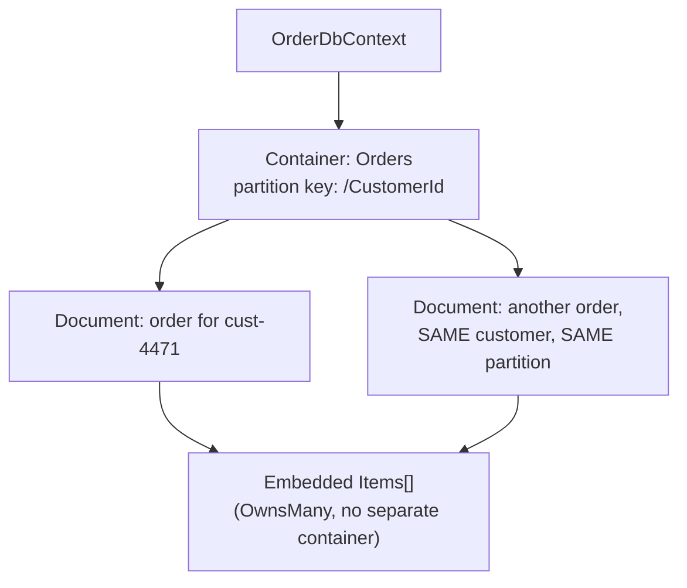
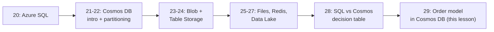

# Storing E-Commerce Order Data in Cosmos DB — Real-Time Example

## Introduction

Before reading this lesson, you should already be comfortable with **[Azure SQL vs Cosmos DB — Comparison](../16-azure-for-dotnet-developers/16-28-azure-sql-vs-cosmos-db.md)** and, further back, with **[EF Core with Azure Cosmos DB](../11-efcore/11-15-ef-core-with-cosmos-db.md)** from Module 11, which could only show its Cosmos-mapping code *illustratively*, with no real account or emulator available at the time. This lesson closes that gap and closes out this module's Data & Storage sub-area at the same time: the `Order` domain model this curriculum has built since Module 2 gets mapped into a real Cosmos DB container, with a deliberately chosen partition key and a full create-and-query walkthrough.

By the end of this lesson, you will be able to:

- Map the curriculum's existing `Order`, `OrderItem`, and `Customer` types onto a Cosmos DB container using the EF Core Cosmos provider
- Justify `CustomerId` as the partition key for an `Orders` container, using the same reasoning Module 16's earlier partitioning lesson introduced
- Create and query orders end to end against a real container shape
- Recognize how this lesson reunites Module 11's illustrative EF Core Cosmos lesson with Module 16's dedicated Cosmos DB service coverage
- Recap, at a high level, what this module's ten-lesson Data & Storage sub-area covered as a whole

## Storing Orders in Cosmos DB — A Layman's Perspective

Picture a growing mail-order company that started out keeping every customer's order history in one shared, alphabetically-sorted card catalog — fine when the company was small, but slower and slower to search as the catalog swelled into the millions of cards. The company's fix isn't to build one bigger catalog; it's to give every customer their own personal folder, and to file every one of that customer's past orders directly inside that one folder, rather than scattered alphabetically across a shared cabinet by order date or order number. From then on, "show me everything this customer has ever ordered" means pulling exactly one folder off the shelf — never searching the whole cabinet, no matter how many other customers the company has.

That's the entire idea behind choosing `CustomerId` as this container's partition key, and it's worth being explicit about why that specific choice, rather than something like `OrderId` or `OrderDate`, is the right one. A folder keyed by `OrderId` would mean every single order lands in its own separate folder — technically fine for a single lookup, but "show me this customer's order history," one of the single most common operations a real storefront performs, would then mean checking every folder in the building one at a time, since no folder holds more than one order. A folder keyed by `OrderDate` would create an entirely different problem: on the busiest shopping day of the year, nearly every single order gets filed into that one day's folder, creating exactly the overcrowded, bottlenecked folder Module 16's earlier partitioning lesson warned about. `CustomerId`, by contrast, spreads orders across as many folders as there are customers, and the single most common real-world question — "what has this one customer ordered" — is answered by opening exactly one folder, every time, regardless of how many other customers the business has ever served.

This lesson takes that folder-per-customer idea and makes it concrete: the very same `Order`, `OrderItem`, and `Customer` shapes this curriculum introduced back in Module 2's object-oriented lessons, queried with LINQ in Module 4, persisted relationally throughout Module 11 — now filed, folder by folder, inside a real Cosmos DB container, with EF Core still doing the filing on your behalf.

## Storing Orders in Cosmos DB — A Programming Language Perspective

This lesson maps the curriculum's canonical `Order` record — `Order(OrderId, CustomerId, PlacedAt, List<OrderItem> Items)`, first defined in Module 4's LINQ capstone and persisted relationally throughout Module 11 — onto a Cosmos DB container using the same `Microsoft.EntityFrameworkCore.Cosmos` provider Module 11's EF Core capstone introduced illustratively. `OnModelCreating` calls `ToContainer("Orders")` and `HasPartitionKey(o => o.CustomerId)`, and each order's `OrderItem` collection is mapped as an **owned type** (`OwnsMany`) so it's embedded directly inside the same JSON document as its parent order, rather than requiring a server-side join Cosmos DB doesn't support across containers. Unlike Module 11's lesson, every code block here is written as a real, runnable example against the Cosmos DB Emulator (or a live account) — the difference this lesson makes concrete is that Module 16 has now covered the Cosmos DB *service* in enough depth (containers, partition keys, consistency levels, request units) to reason about *why* `CustomerId` is the right partition key choice, not just *how* to write the mapping code.

## How to Map and Query Orders with EF Core's Cosmos Provider

Provisioning the container happens once; from there, the same `DbContext`/`DbSet<Order>` surface this curriculum has used since Module 11 handles every create and query, now backed by Cosmos DB instead of SQL Server.


*Figure 1: Every order for one customer lands in the same logical partition; each order's line items are embedded inline, not joined from elsewhere.*

```bash
# Azure CLI
az cosmosdb sql container create \
  --account-name cosmos-ecommerce \
  --resource-group rg-ecommerce \
  --database-name ECommerceDb \
  --name Orders \
  --partition-key-path /CustomerId \
  --throughput 400
```

**Azure CLI Output:**

```text
{
  "name": "Orders",
  "resource": {
    "partitionKey": { "paths": ["/CustomerId"], "kind": "Hash" }
  },
  "options": { "throughput": 400 }
}
```

```csharp
// Program.cs — .NET 10 / C# 14
using Microsoft.EntityFrameworkCore;

var options = new DbContextOptionsBuilder<OrderDbContext>()
    .UseCosmos(
        accountEndpoint: "https://localhost:8081", // Cosmos DB Emulator endpoint
        accountKey: "<emulator-or-account-key>",
        databaseName: "ECommerceDb")
    .Options;

using var db = new OrderDbContext(options);
await db.Database.EnsureCreatedAsync();

var order = new Order(
    OrderId: "ord-88421",
    CustomerId: "cust-4471",
    PlacedAt: DateTime.UtcNow,
    Items: [new OrderItem("SKU-1001", Quantity: 1, UnitPrice: 24.99m)]);

db.Orders.Add(order);
await db.SaveChangesAsync();

List<Order> ordersForCustomer = await db.Orders
    .WithPartitionKey("cust-4471")
    .ToListAsync();

Console.WriteLine($"Orders for cust-4471: {ordersForCustomer.Count}");

public record OrderItem(string Sku, int Quantity, decimal UnitPrice);
public record Order(string OrderId, string CustomerId, DateTime PlacedAt, List<OrderItem> Items);

public class OrderDbContext(DbContextOptions<OrderDbContext> options) : DbContext(options)
{
    public DbSet<Order> Orders => Set<Order>();

    protected override void OnModelCreating(ModelBuilder modelBuilder)
    {
        modelBuilder.Entity<Order>(order =>
        {
            order.ToContainer("Orders");
            order.HasPartitionKey(o => o.CustomerId);
            order.HasKey(o => o.OrderId);
            order.OwnsMany(o => o.Items);
        });
    }
}
```

**Console Output:**

```text
Orders for cust-4471: 1
```

`WithPartitionKey("cust-4471")` is what turns this query into a fast, single-partition read rather than a cross-partition scan — the exact same partition-key discipline Module 16's earlier lessons introduced, now applied to the curriculum's own canonical `Order` model instead of a standalone example.

## Real-Time Example: End-to-End Order History for a Repeat Customer

We extend the E-Commerce Order Processing domain's `Order`, `OrderItem`, and `Customer` types one final time for this sub-area, walking through the full lifecycle a real storefront needs: a returning customer places a second order, and the application needs both a fast point read of one specific order and a fast retrieval of that customer's entire order history — the two operations this container's partition key was chosen specifically to make cheap.

```csharp
// OrderHistoryWorkflow.cs — .NET 10 / C# 14 — Real-Time Example (E-Commerce Order Processing)
using Microsoft.EntityFrameworkCore;

var options = new DbContextOptionsBuilder<OrderDbContext>()
    .UseCosmos("https://localhost:8081", "<emulator-or-account-key>", "ECommerceDb")
    .Options;

using var db = new OrderDbContext(options);
await db.Database.EnsureCreatedAsync();

// Alice's first order, placed last month
var firstOrder = new Order("ord-88421", "cust-4471", new DateTime(2026, 7, 2),
    [new OrderItem("SKU-1001", 1, 24.99m), new OrderItem("SKU-1044", 2, 9.50m)]);

// Alice returns today and places a second order
var secondOrder = new Order("ord-88999", "cust-4471", DateTime.UtcNow,
    [new OrderItem("SKU-2050", 1, 149.00m)]);

db.Orders.AddRange(firstOrder, secondOrder);
await db.SaveChangesAsync();

// Operation 1: a fast point read of one specific order (id + partition key both known)
Order specificOrder = await db.Orders
    .WithPartitionKey("cust-4471")
    .SingleAsync(o => o.OrderId == "ord-88999");
Console.WriteLine($"Point read: {specificOrder.OrderId} placed {specificOrder.PlacedAt:yyyy-MM-dd}, " +
                   $"{specificOrder.Items.Count} item(s)");

// Operation 2: this customer's ENTIRE order history -- one partition, no cross-partition scan
List<Order> aliceHistory = await db.Orders
    .WithPartitionKey("cust-4471")
    .OrderBy(o => o.PlacedAt)
    .ToListAsync();

Console.WriteLine();
Console.WriteLine($"Full order history for cust-4471 ({aliceHistory.Count} orders):");
decimal grandTotal = 0m;
foreach (var order in aliceHistory)
{
    decimal orderTotal = order.Items.Sum(i => i.Quantity * i.UnitPrice);
    grandTotal += orderTotal;
    Console.WriteLine($" - {order.OrderId} ({order.PlacedAt:yyyy-MM-dd}): {orderTotal:C} across {order.Items.Count} item(s)");
}
Console.WriteLine($"Lifetime spend for cust-4471: {grandTotal:C}");

public record OrderItem(string Sku, int Quantity, decimal UnitPrice);
public record Order(string OrderId, string CustomerId, DateTime PlacedAt, List<OrderItem> Items);

public class OrderDbContext(DbContextOptions<OrderDbContext> options) : DbContext(options)
{
    public DbSet<Order> Orders => Set<Order>();

    protected override void OnModelCreating(ModelBuilder modelBuilder)
    {
        modelBuilder.Entity<Order>(order =>
        {
            order.ToContainer("Orders");
            order.HasPartitionKey(o => o.CustomerId);
            order.HasKey(o => o.OrderId);
            order.OwnsMany(o => o.Items);
        });
    }
}
```

**Console Output:**

```text
Point read: ord-88999 placed 2026-08-16, 1 item(s)

Full order history for cust-4471 (2 orders):
 - ord-88421 (2026-07-02): $44.99 across 2 item(s)
 - ord-88999 (2026-08-16): $149.00 across 1 item(s)
Lifetime spend for cust-4471: $193.99
```

Both operations that matter most to a real order-history page — "show me this one order" and "show me everything this customer has ever ordered" — resolved as single-partition reads, because every one of Alice's orders, past and present, shares the same `CustomerId` partition key. Had this container instead been partitioned by `OrderId` or by order date, the second operation, retrieving a customer's full history, would have required a slower, more expensive cross-partition fan-out query touching every partition in the container, no matter how few results actually belonged to Alice. Choosing the partition key around the query pattern an application will *actually* run most often — not around whatever field feels most natural to a relational eye — is the single decision this whole lesson has been building toward.

## Recap: This Module's Data & Storage Sub-Area

This lesson closes a ten-lesson arc that opened with **[Azure SQL Database](../16-azure-for-dotnet-developers/16-20-azure-sql-database.md)** and now ends here. Lesson 20 introduced Azure SQL Database as fully managed SQL Server, with DTU and vCore purchasing models and elastic pools for multi-tenant workloads. Lessons 21 and 22 introduced Cosmos DB itself: its multi-model, globally-distributed nature and SQL (Core) API, followed by the single most consequential design decision in any container — partition key choice — alongside the five tunable consistency levels. Lessons 23 and 24 covered Blob Storage for unstructured files and Table Storage for simple, cost-sensitive key-value lookups, both living inside the same storage account. Lesson 25 added Azure Files, a genuine mountable SMB/NFS share for lift-and-shift workloads and shared config across scaled-out instances. Lesson 26 stepped outside persistent storage entirely for Azure Cache for Redis, an in-memory store for session state, distributed caching, and the SignalR backplane Module 14 first raised. Lesson 27 introduced Azure Data Lake Storage Gen2, storage built for bulk analytics rather than live transactions, conceptually feeding services like Synapse and Databricks. Lesson 28 put Azure SQL Database and Cosmos DB directly side by side in a scenario-based decision table. And this lesson, 29, closes the arc by applying that entire decision framework concretely: the curriculum's own `Order` model, mapped into a real Cosmos DB container, partitioned by `CustomerId` for exactly the reasons Lessons 22 and 28 gave.


*Figure 2: Ten lessons moving from a single relational database, across every other storage shape Azure offers, and back to one concrete, decided application of it all.*

| Lesson | Service | Core Takeaway |
|---|---|---|
| 20 | Azure SQL Database | Managed SQL Server; DTU vs vCore; elastic pools |
| 21-22 | Cosmos DB | Global distribution; partition keys; consistency levels |
| 23 | Blob Storage | Unstructured files, tiers, lifecycle management |
| 24 | Table Storage | Cheap PartitionKey/RowKey lookups |
| 25 | Azure Files | Mountable SMB/NFS shares for lift-and-shift |
| 26 | Azure Cache for Redis | In-memory cache, session state, SignalR backplane |
| 27 | Data Lake Storage Gen2 | Hierarchical namespace for big-data analytics |
| 28 | SQL vs Cosmos comparison | Scenario-based decision framework |
| 29 | This lesson | The `Order` model, decided and implemented in Cosmos DB |

## Types of Data & Storage Concepts Across This Sub-Area

1. **[Azure SQL Database](../16-azure-for-dotnet-developers/16-20-azure-sql-database.md)** — the relational anchor this sub-area opened with.
2. **[Cosmos DB Partitioning and Consistency Levels](../16-azure-for-dotnet-developers/16-22-cosmos-db-partitioning-consistency.md)** — the partition-key reasoning this lesson applied directly to `CustomerId`.
3. **[EF Core with Azure Cosmos DB](../11-efcore/11-15-ef-core-with-cosmos-db.md)** — Module 11's illustrative version of the exact mapping this lesson finally ran for real.
4. **[Azure SQL vs Cosmos DB — Comparison](../16-azure-for-dotnet-developers/16-28-azure-sql-vs-cosmos-db.md)** — the decision framework this lesson put into practice.
5. **Owned entity types (`OwnsMany`)** — how `OrderItem` collections were embedded inline inside each order document.
6. **[Microsoft Entra ID Fundamentals](../16-azure-for-dotnet-developers/16-30-entra-id-fundamentals.md)** — next lesson, opening this module's identity and security sub-area, securing everything this sub-area just built.

## What You've Learned & What's Next

The `Order` model this curriculum has carried since Module 2 now has a real, working home in Cosmos DB, partitioned by `CustomerId` for the same reason every partition-key decision in this sub-area came down to: match the key to the query the application actually runs most, not to whatever field a relational habit reaches for first. That decision, multiplied across ten lessons of Azure's storage landscape, is this sub-area's real lesson — not any one service, but the discipline of choosing among them deliberately.

Continue your learning journey with **[Microsoft Entra ID Fundamentals](../16-azure-for-dotnet-developers/16-30-entra-id-fundamentals.md)**, where the module turns from storing data safely to controlling who is allowed to reach it in the first place.

---
*Applies to: .NET 10 / C# 14. Last reviewed 2026-08-16.*
