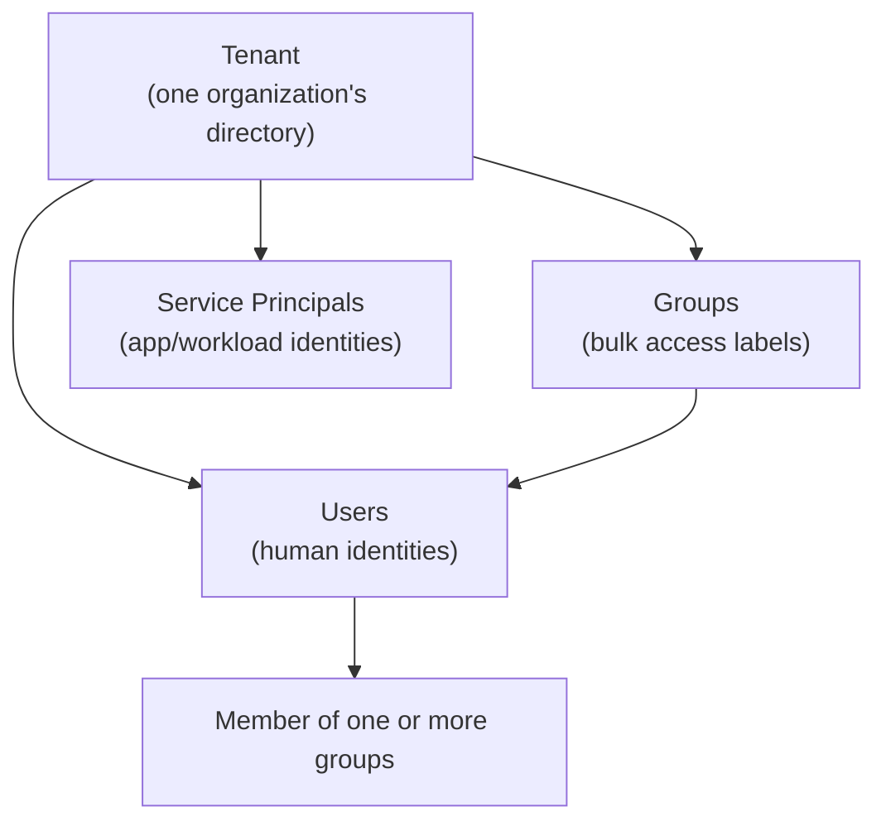
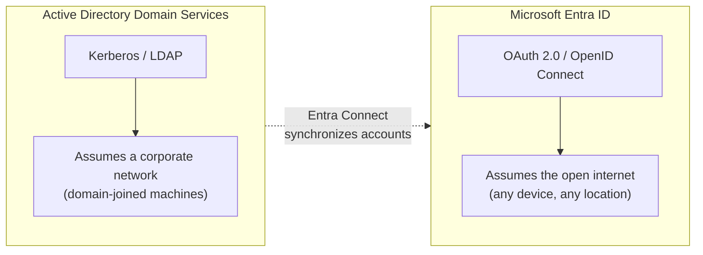

# Microsoft Entra ID Fundamentals

## Introduction

Before reading this lesson, you should already be comfortable with **[Storing E-Commerce Order Data in Cosmos DB — Real-Time Example](../16-azure-for-dotnet-developers/16-29-ecommerce-orders-in-cosmos-db.md)**. That lesson, and everything before it in this module, assumed your application's *data* had a secure home. This lesson opens the Identity & Security sub-area and asks a different question: who — or what — is allowed to reach that data in the first place? **Microsoft Entra ID** (formerly Azure Active Directory) is Microsoft's answer, and it is also the concrete, named identity provider that Module 14's OpenID Connect lesson deliberately left abstract, promising "a real provider like Microsoft Entra ID" would arrive later. It has now arrived.

By the end of this lesson, you will be able to:

- Explain what Microsoft Entra ID is and where it sits relative to Azure subscriptions and resources
- Define a **tenant** and explain why it is the fundamental identity boundary in Entra ID
- Distinguish **users**, **groups**, and **service principals** as the three core directory object types
- Connect Entra ID concretely to the OIDC concepts introduced in Module 14, Lesson 9
- Inspect a tenant's users and groups using the Azure CLI
- Explain how Entra ID differs from traditional, on-premises Active Directory

## Microsoft Entra ID — A Layman's Perspective

Picture a large office building that many different companies rent floors in. Before anyone can badge into any floor, they first need one thing that has nothing to do with which floor they work on: a building-wide identity badge, issued by the building's own security desk, that proves they are a real, registered person the building's security system knows about. That badge doesn't grant access to any particular floor by itself — it just answers the most basic question a building can ask: "who is this, and do we vouch for them?" Only after that badge is issued does the building's security system worry about which floors, which meeting rooms, and which filing cabinets that particular badge holder is allowed into.

Microsoft Entra ID is that building-wide security desk, and a **tenant** is one specific building. When a company signs up for Microsoft 365 or Azure, Microsoft doesn't hand them a shared, mixed identity pool with every other customer in the world — it hands them their own dedicated building, with its own security desk, its own badge-printing machine, and its own list of exactly who is allowed to exist inside it at all. Two different companies, even if they happen to use the exact same employee name twice, never share a directory; each tenant is a hard, isolated boundary around one organization's identities. Everything this lesson and the identity sub-area cover from here happens *inside* a tenant, never across one.

Inside that building, the security desk keeps three different kinds of records. First, **users** — actual people, each with a name, an email address, and one badge tied specifically to them, whether they're a permanent employee or a temporary contractor let in as a guest. Second, **groups** — not people at all, but labeled folders the security desk uses to manage badges in bulk, like a "Third Floor Marketing" folder that automatically extends third-floor access to every badge dropped into it, so a security officer never has to reconfigure a hundred individual badges one at a time when the whole marketing team needs a new door unlocked. Third, and less obviously, **service principals** — badges issued not to a person at all, but to a piece of automated equipment, like the building's own delivery robot, which still needs to prove who it is before a floor's sensors let it through, even though there's no human wearing it.

None of this, on its own, decides what any badge can actually *do* once it's recognized — that's a separate concern, covered by later lessons on app registrations, managed identities, and role assignments. This lesson is only about the security desk itself: the fact that a trusted, centralized authority exists at all, that it draws a hard line around one organization's people and things, and that it sorts everyone it recognizes into people, group folders, and non-human equipment badges. Bridging back to code: that security desk is precisely the "registration desk" Module 14's OpenID Connect lesson described issuing standardized ID token badges — Entra ID is simply that desk's real name, and a tenant is the one specific building whose badges your application has agreed to trust and read.

## Microsoft Entra ID — A Programming Language Perspective

**Microsoft Entra ID** is Microsoft's cloud-based identity and access management service: a multi-tenant directory that authenticates users and other principals and issues standards-based tokens — including the OIDC ID tokens and OAuth 2.0 access tokens covered in Module 14 — that applications and APIs consume to establish identity and authorization. A **tenant** is a dedicated, isolated instance of Entra ID, identified by a GUID **tenant ID**, that represents one organization's directory; every user, group, and registered application lives inside exactly one tenant (or is invited as a **guest** into another). The three core directory object types relevant here are the **user** object (a human identity, cloud-only or synchronized from on-premises Active Directory via Entra Connect), the **group** object (a named collection of users or other groups used to assign access in bulk), and the **service principal** (the identity representation of an application or automated workload inside a specific tenant — the concept the next lesson builds directly on).

## How to Explore an Entra ID Tenant

Before an application ever authenticates against Entra ID, it helps to see the tenant itself as a working directory — something you inspect the same way you'd inspect a database before writing queries against it. The diagram below shows the containment hierarchy every later Identity & Security lesson assumes.


*Figure 1: A single Entra ID tenant contains users, groups, and service principals; group membership is how bulk access is assigned to individual users.*

Inspecting a tenant starts with the Azure CLI, already familiar from earlier Azure Fundamentals lessons. `az ad` is the command group dedicated to Entra ID directory objects, distinct from `az resource`, which manages ordinary Azure resources like storage accounts or databases.

```bash
# Azure CLI — confirm the signed-in tenant, then list users and groups
az account show --query "{Tenant:tenantId, Subscription:name}" --output table

az ad user list --query "[].{DisplayName:displayName, UPN:userPrincipalName}" --output table --top 5

az ad group list --query "[].{DisplayName:displayName, ObjectId:id}" --output table --top 5
```

**Azure CLI Output:**

```text
Tenant                                Subscription
------------------------------------  --------------------
7a4c1e2f-9b3d-4e5a-8c6f-1d2e3f4a5b6c  Contoso-Library-Prod

DisplayName        UPN
------------------  --------------------------------------
Aditi Rao           aditi.rao@contosolibrary.onmicrosoft.com
Marcus Webb          marcus.webb@contosolibrary.onmicrosoft.com

DisplayName          ObjectId
--------------------  ------------------------------------
Librarians            2b6e4f10-8a7c-4d3e-9f1a-6c5b4a3d2e1f
BranchManagers         9d3f2a1b-7c6e-4b5a-8d4f-3e2c1b0a9f8e
```

That three-command sequence is the entire mental model this lesson teaches, made concrete: one tenant, a handful of user objects inside it, and a handful of group objects governing them. A small C# console program can mirror that same shape locally, without calling Azure at all, purely to reinforce how these three object types relate before the next lesson wires up real authentication.

```csharp
// Program.cs — .NET 10 / C# 14
public sealed record EntraUser(string DisplayName, string UserPrincipalName);
public sealed record EntraGroup(string DisplayName, IReadOnlyList<string> MemberUpns);

EntraUser aditi = new("Aditi Rao", "aditi.rao@contosolibrary.onmicrosoft.com");
EntraUser marcus = new("Marcus Webb", "marcus.webb@contosolibrary.onmicrosoft.com");

EntraGroup[] groups =
[
    new("Librarians", [aditi.UserPrincipalName]),
    new("BranchManagers", [marcus.UserPrincipalName])
];

Console.WriteLine("Tenant: contosolibrary.onmicrosoft.com");
foreach (EntraGroup group in groups)
{
    Console.WriteLine($" - Group '{group.DisplayName}' has {group.MemberUpns.Count} member(s):");
    foreach (string upn in group.MemberUpns)
    {
        Console.WriteLine($"     {upn}");
    }
}
```

**Console Output:**

```text
Tenant: contosolibrary.onmicrosoft.com
 - Group 'Librarians' has 1 member(s):
     aditi.rao@contosolibrary.onmicrosoft.com
 - Group 'BranchManagers' has 1 member(s):
     marcus.webb@contosolibrary.onmicrosoft.com
```

Nothing here calls Azure yet — that begins in earnest next lesson. The point is that a tenant's directory is just structured data: users, groups, and the membership relationship between them, exactly as shown in Figure 1, whether you're reading it from `az ad` or modeling it in C#.

## Real-Time Example: A Library System's Staff Directory in Entra ID

We extend the Library/Inventory Management domain into its identity layer for the first time. Earlier lessons in this curriculum modeled `Book`, `Member`, and library staff as plain C# classes running entirely on one machine. Now that the library's catalog and checkout system are Azure-hosted, "who is allowed to mark a book as lost" or "who can open the branch-transfer report" needs a real directory behind it — not a hardcoded list of names in a config file.

```csharp
// LibraryStaffDirectory.cs — .NET 10 / C# 14 — Real-Time Example (Library/Inventory Management)
public enum StaffRole { FrontDeskLibrarian, BranchManager, SystemAdministrator }

public sealed record StaffAccount(string DisplayName, string UserPrincipalName, StaffRole Role);

StaffAccount[] staff =
[
    new("Aditi Rao", "aditi.rao@contosolibrary.onmicrosoft.com", StaffRole.FrontDeskLibrarian),
    new("Marcus Webb", "marcus.webb@contosolibrary.onmicrosoft.com", StaffRole.BranchManager),
    new("Priya Nathan", "priya.nathan@contosolibrary.onmicrosoft.com", StaffRole.SystemAdministrator)
];

Dictionary<StaffRole, List<StaffAccount>> byRole = new();
foreach (StaffAccount account in staff)
{
    if (!byRole.TryGetValue(account.Role, out List<StaffAccount>? list))
    {
        list = [];
        byRole[account.Role] = list;
    }
    list.Add(account);
}

Console.WriteLine("Contoso Library — Entra ID tenant staff, grouped by role:");
foreach ((StaffRole role, List<StaffAccount> accounts) in byRole)
{
    Console.WriteLine($"{role}:");
    foreach (StaffAccount a in accounts)
    {
        Console.WriteLine($"   {a.DisplayName} <{a.UserPrincipalName}>");
    }
}
```

**Console Output:**

```text
Contoso Library — Entra ID tenant staff, grouped by role:
FrontDeskLibrarian:
   Aditi Rao <aditi.rao@contosolibrary.onmicrosoft.com>
BranchManager:
   Marcus Webb <marcus.webb@contosolibrary.onmicrosoft.com>
SystemAdministrator:
   Priya Nathan <priya.nathan@contosolibrary.onmicrosoft.com>
```

In the real system, these `StaffAccount` rows aren't hand-maintained C# objects at all — they're user objects and group memberships actually stored in the library's Entra ID tenant, with a `Librarians` group carrying `FrontDeskLibrarian` access and a `BranchManagers` group carrying elevated access to inventory-transfer and reporting features. The library's catalog application never stores a password or a role flag itself; it simply asks Entra ID, at sign-in time, who this person is and which groups they belong to — exactly the pattern the next lesson wires up in real ASP.NET Core code.

## Microsoft Entra ID vs Traditional Active Directory

The name similarity between Microsoft Entra ID and the decades-old **Active Directory Domain Services (AD DS)** is not an accident, but the two are architecturally different systems solving overlapping problems in very different environments. AD DS is built to govern a physical or virtual network you control — domain-joined Windows machines, on-premises file shares, printers — using protocols like Kerberos and LDAP that assume everything is reachable on the same corporate network. Entra ID is built for a world where users sign in from anywhere, to services that live anywhere, using internet-native, standards-based protocols: OAuth 2.0 and OpenID Connect (Module 14) rather than Kerberos, reachable over plain HTTPS rather than requiring a VPN back to a corporate LAN. Many organizations run both at once, using **Entra Connect** to synchronize on-premises AD DS accounts into an Entra ID tenant, so the same employee identity works for both a domain-joined laptop and a cloud-hosted web app.


*Figure 2: Two identity systems built for two different networks, commonly bridged by Entra Connect rather than replaced outright.*

| Aspect | Active Directory Domain Services | Microsoft Entra ID |
|---|---|---|
| Primary protocols | Kerberos, LDAP, NTLM | OAuth 2.0, OpenID Connect, SAML |
| Assumes | A trusted corporate network | The open internet |
| Typical client | Domain-joined Windows PC | Any browser, mobile app, or API client |
| Where it runs | On-premises servers you manage | Fully managed by Microsoft |
| Relevant to this module | Legacy/hybrid scenarios via Entra Connect | Every Azure identity lesson from here forward |

## Types of Entra ID Concepts Covered in This Sub-Area

Tenants, users, and groups are the foundation; the rest of the Identity & Security sub-area builds specific capabilities on top of them:

1. **[App Registrations and OAuth Flows](../16-azure-for-dotnet-developers/16-31-app-registrations-and-oauth-flows.md)** — how an application itself becomes a recognized identity inside the tenant.
2. **[Managed Identities](../16-azure-for-dotnet-developers/16-32-managed-identities.md)** — how Azure resources authenticate to each other without any secret ever being stored.
3. **[Azure Key Vault in Depth](../16-azure-for-dotnet-developers/16-33-azure-key-vault-in-depth.md)** — where the secrets that identity alone can't replace are stored safely.
4. **[RBAC and Azure Policy](../16-azure-for-dotnet-developers/16-34-rbac-and-azure-policy.md)** — how a recognized identity is granted specific permissions, not just recognized.
5. **[OpenID Connect](../14-grpc-signalr-security/14-09-openid-connect.md)** — the standards-based protocol Entra ID implements to issue the ID tokens this lesson's badges represent.

## What You've Learned & What's Next

Microsoft Entra ID is the trusted, tenant-scoped directory behind every identity decision the rest of this module makes: a hard boundary around one organization's users, groups, and application identities, and the real provider issuing the standardized tokens Module 14 described in the abstract. Nothing in this lesson granted access to anything yet — it only established who and what a tenant recognizes at all.

Continue your learning journey with **[App Registrations and OAuth Flows](../16-azure-for-dotnet-developers/16-31-app-registrations-and-oauth-flows.md)**, where an ASP.NET Core application becomes one of these recognized identities and actually authenticates a user against this tenant.

---
*Applies to: .NET 10 / C# 14. Last reviewed 2026-08-16.*
