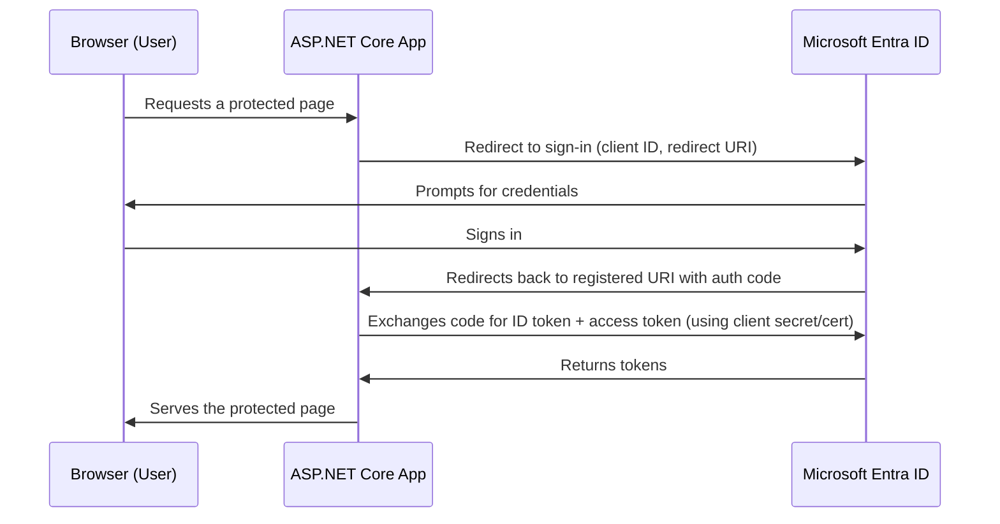
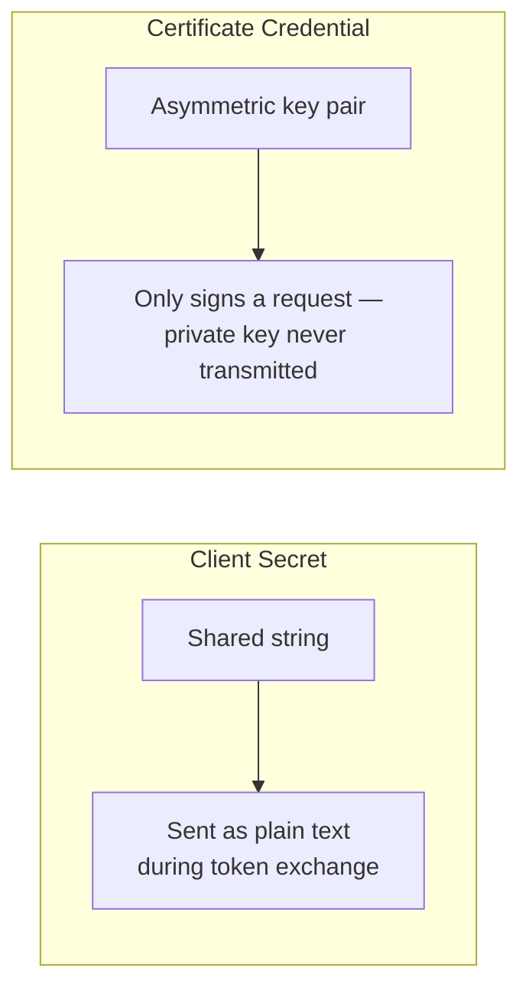

# App Registrations and OAuth Flows

## Introduction

Before reading this lesson, you should already be comfortable with **[Microsoft Entra ID Fundamentals](../16-azure-for-dotnet-developers/16-30-entra-id-fundamentals.md)**, particularly the idea that a tenant recognizes users, groups, and applications as distinct object types. That last category — applications — is this lesson's subject. Before any ASP.NET Core app can send a user through the Authorization Code flow from Module 14, the *application itself* must first be registered in the tenant as a recognized identity, with its own client ID, its own credential, and its own agreed-upon redirect destination. This lesson covers that registration, and the `Microsoft.Identity.Web` library that turns it into working sign-in code.

By the end of this lesson, you will be able to:

- Register an application in Microsoft Entra ID and identify its client ID, tenant ID, and credential
- Explain what a redirect URI is and why Entra ID refuses to send tokens anywhere else
- Choose between a client secret and a certificate credential for a confidential client
- Wire up an ASP.NET Core app to authenticate against Entra ID using `Microsoft.Identity.Web`
- Connect the resulting sign-in flow concretely back to the Authorization Code flow and ID tokens covered in Module 14

## App Registrations — A Layman's Perspective

Return to the office building from the previous lesson, with its badge-issuing security desk. So far, every badge in that story went to a person. But now imagine a food delivery company wants its couriers to be able to walk into the building's lobby, scan a package barcode at a lobby kiosk, and have the kiosk confirm the delivery — without any actual employee of the delivery company setting foot past the lobby. Before that can happen safely, the building's security office has to do something new: register the *delivery company's kiosk system itself* as a known party, separate from registering any individual courier. That registration gets its own building-issued ID number, its own secret PIN or signed credential the kiosk uses to prove it's really that registered system and not an impostor, and — critically — a pre-agreed statement of exactly which door in the building the kiosk is allowed to send confirmations back through. If the kiosk tries to send its confirmation through some other door it was never told about, security refuses it outright, no matter how valid its PIN was.

That registration record is an **app registration**, the ID number is the **client ID** (also called the application ID), the PIN or signed credential is the **client secret** or **certificate**, and the pre-agreed door is the **redirect URI**. None of this is about a person signing in yet — it's the building formally agreeing to recognize a specific piece of software as a specific, named party, before that software is ever trusted to ask a person to sign in through it. This is exactly why an app registration happens once, up front, typically by whoever administers the tenant, and stays stable for the lifetime of the application, while individual users sign in through it thousands of times afterward.

Once that kiosk system is registered, here's what actually happens when a courier scans a badge on it: the kiosk doesn't check the courier's identity itself. It redirects the courier straight to the building's own security desk — the one place a courier's credentials are ever actually shown — and only after the security desk confirms who the courier is does it send them *back*, through that one pre-agreed door, carrying a signed confirmation slip the kiosk can trust because it recognizes the desk's signature. The kiosk never touches a password. It only ever recognizes a slip signed by an authority it already trusts, delivered to the one door it registered in advance.

That whole choreography — a registered application, a trip to a central authority, and a signed slip delivered back through a specific, pre-agreed door — is precisely the Authorization Code flow from Module 14, now with named, concrete parts: the kiosk's registration is the app registration, the trip to the security desk is the redirect to Entra ID's sign-in page, and the signed confirmation slip is the ID token and access token handed back to the app's registered redirect URI.

## App Registrations — A Programming Language Perspective

An **app registration** is an object in an Entra ID tenant representing an application as a first-class security principal, identified by an **Application (client) ID** GUID and scoped to a **Directory (tenant) ID** GUID. A **confidential client** — any app with a secure backend, like an ASP.NET Core web app — additionally holds a credential proving its own identity to Entra ID: either a **client secret** (a shared, expiring string) or a **certificate** (an asymmetric key pair, with only the public key uploaded to Entra ID). Every app registration also declares one or more **redirect URIs**, exact URLs Entra ID is permitted to send authentication responses to; a mismatch causes Entra ID to reject the request outright, regardless of credential validity. `Microsoft.Identity.Web`, built on MSAL.NET, is Microsoft's current recommended library for wiring these pieces into ASP.NET Core via `AddMicrosoftIdentityWebApp()`, replacing the older, lower-level `Microsoft.AspNetCore.Authentication.OpenIdConnect` wiring with configuration-driven defaults suited to Entra ID specifically.

## How to Register an App and Wire Up Sign-In

Registration happens once per application, either through the Azure Portal's "App registrations" blade or, more repeatably, through the CLI — the same `az ad` command group from the previous lesson, extended to applications.


*Figure 1: The Authorization Code flow from Module 14, now with each participant named to its Entra ID counterpart.*

```bash
# Azure CLI — register the app, add a redirect URI, and issue a client secret
az ad app create --display-name "OrderAdminDashboard" \
  --web-redirect-uris "https://orderadmin.contoso.com/signin-oidc" \
  --sign-in-audience "AzureADMyOrg"

az ad app credential reset --id <app-client-id> --display-name "order-admin-secret" --years 1
```

**Azure CLI Output:**

```text
{
  "appId": "6b2f9d3e-1a4c-4e8b-9f2d-3c1b0a9e8d7f",
  "displayName": "OrderAdminDashboard",
  "signInAudience": "AzureADMyOrg"
}
{
  "appId": "6b2f9d3e-1a4c-4e8b-9f2d-3c1b0a9e8d7f",
  "password": "Q~8f2K...redacted...9pX",
  "tenant": "7a4c1e2f-9b3d-4e5a-8c6f-1d2e3f4a5b6c"
}
```

With the app registered, `Microsoft.Identity.Web` turns those three values — tenant ID, client ID, client secret — into a working sign-in pipeline with a handful of lines.

```csharp
// Program.cs — .NET 10 / C# 14
using Microsoft.Identity.Web;

var builder = WebApplication.CreateBuilder(args);

builder.Services
    .AddAuthentication(Microsoft.Identity.Web.Constants.AzureADOpenIDScheme)
    .AddMicrosoftIdentityWebApp(builder.Configuration.GetSection("AzureAd"));

builder.Services.AddAuthorization();
builder.Services.AddRazorPages().AddMicrosoftIdentityUI();

var app = builder.Build();
app.UseAuthentication();
app.UseAuthorization();
app.MapRazorPages();

app.MapGet("/whoami", (HttpContext ctx) =>
{
    string? name = ctx.User.Identity?.Name;
    return Results.Text(name is null ? "Not signed in" : $"Signed in as: {name}");
}).RequireAuthorization();

app.Run();
```

```json
// appsettings.json — .NET 10
{
  "AzureAd": {
    "Instance": "https://login.microsoftonline.com/",
    "TenantId": "7a4c1e2f-9b3d-4e5a-8c6f-1d2e3f4a5b6c",
    "ClientId": "6b2f9d3e-1a4c-4e8b-9f2d-3c1b0a9e8d7f",
    "ClientSecret": "Q~8f2K...redacted...9pX",
    "CallbackPath": "/signin-oidc"
  }
}
```

**Console Output (after a browser sign-in and a GET to `/whoami`):**

```text
Signed in as: Aditi Rao
```

That one string is the entire payoff of this lesson: `Microsoft.Identity.Web` handled the redirect, the code exchange, the token validation, and the claim extraction, exactly as diagrammed in Figure 1, leaving the application to read `ctx.User.Identity.Name` the same way it would read any other claims principal from Module 14 — because underneath, it *is* the same OpenID Connect middleware, pre-configured for Entra ID's specific token format and endpoints.

## Real-Time Example: Registering the E-Commerce Order Admin Dashboard

We continue the E-Commerce Order Processing domain's **Order Admin Dashboard** — the Blazor Server surface introduced back in Module 15's capstone lesson as the internal tool "warehouse staff on the corporate network" use to manage orders. Until now it existed only as a name in a decision table. This lesson gives it a real, registered identity in Contoso Retail's Entra ID tenant, and wires it to authenticate warehouse staff instead of any hand-rolled login form.

```csharp
// OrderAdminAuth.cs — .NET 10 / C# 14 — Real-Time Example (E-Commerce Order Processing)
public sealed record AppRegistration(string DisplayName, string ClientId, string TenantId, string RedirectUri);

AppRegistration orderAdminApp = new(
    DisplayName: "OrderAdminDashboard",
    ClientId: "6b2f9d3e-1a4c-4e8b-9f2d-3c1b0a9e8d7f",
    TenantId: "7a4c1e2f-9b3d-4e5a-8c6f-1d2e3f4a5b6c",
    RedirectUri: "https://orderadmin.contoso.com/signin-oidc");

Console.WriteLine("Order Admin Dashboard — registered app identity:");
Console.WriteLine($"  Client ID   : {orderAdminApp.ClientId}");
Console.WriteLine($"  Tenant ID   : {orderAdminApp.TenantId}");
Console.WriteLine($"  Redirect URI: {orderAdminApp.RedirectUri}");

string[] warehouseSignins = ["aditi.rao@contosoretail.onmicrosoft.com", "marcus.webb@contosoretail.onmicrosoft.com"];

Console.WriteLine();
Console.WriteLine("Simulated sign-ins against this registration:");
foreach (string upn in warehouseSignins)
{
    Console.WriteLine($"  -> {upn} authenticated; ID token issued for {orderAdminApp.DisplayName}");
}
```

**Console Output:**

```text
Order Admin Dashboard — registered app identity:
  Client ID   : 6b2f9d3e-1a4c-4e8b-9f2d-3c1b0a9e8d7f
  Tenant ID   : 7a4c1e2f-9b3d-4e5a-8c6f-1d2e3f4a5b6c
  Redirect URI: https://orderadmin.contoso.com/signin-oidc

Simulated sign-ins against this registration:
  -> aditi.rao@contosoretail.onmicrosoft.com authenticated; ID token issued for OrderAdminDashboard
  -> marcus.webb@contosoretail.onmicrosoft.com authenticated; ID token issued for OrderAdminDashboard
```

Every warehouse employee who signs into the Order Admin Dashboard now goes through Entra ID rather than a password stored anywhere near the order database, and the dashboard's own code never sees a password at all — only the ID token Entra ID hands back to the one redirect URI it agreed to trust. If a warehouse employee leaves the company, disabling their Entra ID account instantly locks them out of the dashboard, with no separate "delete this user from the app's own database" step required.

## Client Secret vs Certificate Credential

An app registration's credential proves the *application* is who it claims to be during the code-for-token exchange, and Entra ID supports two shapes for it. A **client secret** is the simpler of the two: a random string Entra ID generates and shows you exactly once, stored directly in configuration (ideally Key Vault, covered two lessons from now) and presented as plain text during token exchange. It is easy to set up but carries real weaknesses — it must be rotated manually before its expiry (at most two years), and because it's a bare string, a leaked configuration file leaks a fully usable credential outright. A **certificate credential** instead uses an asymmetric key pair: only the certificate's public key is uploaded to Entra ID, while the private key stays on the application's host (or, ideally, in Key Vault or an HSM) and is never transmitted during authentication — the app proves possession of the private key by signing a request, not by revealing a shared secret. Certificates are the credential Microsoft recommends for production confidential clients precisely because compromising them requires stealing a private key rather than merely reading a config file.


*Figure 2: A client secret is a shared value presented outright; a certificate proves possession of a private key without ever revealing it.*

| Aspect | Client Secret | Certificate Credential |
|---|---|---|
| What Entra ID stores | The secret's hash | Only the public key |
| Transmitted during token exchange? | Yes, as plain text | No — only a signature |
| Setup complexity | Very low | Higher (key generation, upload) |
| Rotation | Manual, before expiry (max 2 years) | Manual, but pairs well with Key Vault-managed certs |
| Recommended for | Dev/test, low-risk internal tools | Production confidential clients |

## Types of Credentials and Flows Around App Registrations

App registrations sit at the center of several related concepts covered across this module and Module 14:

1. **[OAuth 2.0 Fundamentals](../14-grpc-signalr-security/14-08-oauth2-fundamentals.md)** — the Authorization Code flow this lesson's sequence diagram names concretely.
2. **[OpenID Connect](../14-grpc-signalr-security/14-09-openid-connect.md)** — the ID token an app registration's sign-in ultimately produces.
3. **[Managed Identities](../16-azure-for-dotnet-developers/16-32-managed-identities.md)** — the next lesson's alternative: no client secret or certificate at all, for Azure-to-Azure calls.
4. **[Azure Key Vault in Depth](../16-azure-for-dotnet-developers/16-33-azure-key-vault-in-depth.md)** — where a client secret or certificate should actually be stored, rather than in `appsettings.json`.
5. **[Authorization Policies and Claims](../14-grpc-signalr-security/14-10-authorization-policies-and-claims.md)** — what happens with the claims inside the ID token once sign-in succeeds.

## What You've Learned & What's Next

An app registration gives an application its own recognized identity in an Entra ID tenant — a client ID, a tenant ID, a credential, and an agreed-upon redirect URI — and `Microsoft.Identity.Web` turns that registration into a working ASP.NET Core sign-in flow built directly on the OAuth 2.0 and OpenID Connect concepts from Module 14. Every warehouse employee signing into the Order Admin Dashboard now authenticates through Entra ID itself, never through a password the application stores.

Continue your learning journey with **[Managed Identities](../16-azure-for-dotnet-developers/16-32-managed-identities.md)**, where an Azure resource authenticates to *another* Azure resource with no client secret, no certificate, and no credential stored anywhere at all.

---
*Applies to: .NET 10 / C# 14. Last reviewed 2026-08-16.*
