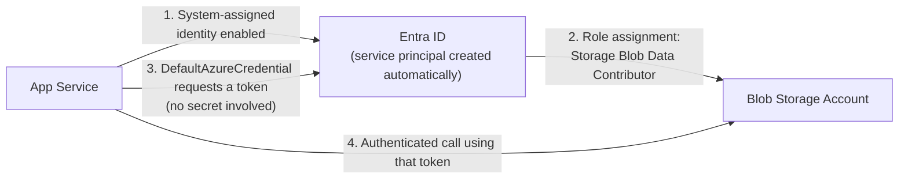
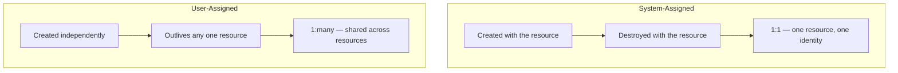

# Managed Identities

## Introduction

Before reading this lesson, you should already be comfortable with **[App Registrations and OAuth Flows](../16-azure-for-dotnet-developers/16-31-app-registrations-and-oauth-flows.md)**, and in particular with the fact that a confidential client needs a credential — a client secret or a certificate — to prove its identity. That lesson was about a *person* signing into an application. This lesson is about something different: one Azure resource authenticating to *another* Azure resource, with no person involved at all, and — this is the entire point — no client secret, no certificate, and no connection string stored anywhere a developer could leak, commit, or forget to rotate. That capability is a **managed identity**.

By the end of this lesson, you will be able to:

- Explain what a managed identity is and what specific problem it removes
- Distinguish a **system-assigned** managed identity from a **user-assigned** managed identity
- Assign a managed identity to an App Service and grant it a role on another resource
- Use `DefaultAzureCredential` in C# to authenticate without any secret in code or configuration
- Explain why this is strictly more secure than a stored connection string or access key

## Managed Identities — A Layman's Perspective

Think back to the delivery kiosk from the previous lesson, which needed its own registered identity, its own PIN, and its own agreed-upon door before it could vouch for a courier. Now imagine something subtly different: not a kiosk talking to a person, but one piece of the building's *own* infrastructure needing to talk to another piece of the same building's own infrastructure — say, the freight elevator needing to unlock a specific loading-dock door automatically whenever it arrives on that floor with a delivery cart. Nobody wants to hand the freight elevator its own PIN code to memorize, write down, and eventually leak. Instead, imagine the building itself simply *recognizes* its own elevator, natively and automatically, the moment it was built into the building — no PIN required, no separate registration paperwork, no secret anyone could ever accidentally photograph or paste into the wrong document. The elevator just is a piece of this building's own infrastructure, and the loading-dock door trusts that fact directly.

That native, no-secret recognition between two pieces of the same infrastructure is what a **managed identity** provides between two Azure resources. When an App Service is given a managed identity, Azure itself becomes responsible for creating an identity for that App Service inside Entra ID, and — this is the part that removes an entire category of risk — for silently rotating the underlying credential behind the scenes, on a schedule, forever, without a developer ever seeing it, typing it, or storing it anywhere. The developer never receives a secret to lose. There is no `appsettings.json` entry to accidentally commit to a public repository. There is no client secret with an expiry date someone forgets to renew until an outage happens on the exact day it lapses. The App Service simply *is* a recognized citizen of the tenant, the same way the freight elevator simply *is* part of the building, and other Azure resources — a Key Vault, a Blob Storage account, a database — can be told, in advance, "trust this specific App Service's identity for this specific level of access," full stop.

There are two flavors of this native trust, and the distinction matters practically. A **system-assigned** managed identity is permanently and exclusively tied to one resource — the freight elevator's own built-in recognition, created the moment the elevator itself is installed and destroyed the moment the elevator itself is removed; it cannot be handed to a different elevator later. A **user-assigned** managed identity is different: it's a standalone recognized identity the building's management office creates on its own, ahead of time, which can then be *attached* to several different pieces of equipment at once — the freight elevator and the loading-dock scanner might both be handed the same standalone identity, sharing the same set of trusted permissions, and either piece of equipment could later be swapped out without that shared identity being destroyed along with it.

The bridge back to code: neither flavor ever requires an application developer to generate, store, rotate, or protect a single secret value. The entire category of "a leaked connection string" or "an expired client secret nobody noticed" simply does not exist for a resource authenticating this way.

## Managed Identities — A Programming Language Perspective

A **managed identity** is an automatically managed Entra ID service principal, bound to an Azure resource, whose underlying credential Azure creates, rotates, and protects entirely outside application code. A **system-assigned** managed identity shares the exact lifecycle of the single resource it's enabled on (created and deleted alongside it); a **user-assigned** managed identity is a standalone Azure resource of its own (`Microsoft.ManagedIdentity/userAssignedIdentities`) that can be assigned to, and shared across, multiple resources, and outlives any one of them. In C#, `Azure.Identity`'s `DefaultAzureCredential` — or the more explicit `ManagedIdentityCredential` — transparently acquires a token for whichever managed identity the hosting environment provides, using the platform's local metadata endpoint, so the exact same client code (`BlobServiceClient`, `SecretClient`, and so on) that would otherwise need a connection string instead authenticates with zero stored secrets, both locally (via `DefaultAzureCredential` falling back to your developer sign-in) and in production (via the resource's managed identity).

## How to Assign and Use a Managed Identity

Enabling a managed identity is a one-line CLI operation on the resource itself; granting it access to another resource is a separate, explicit role assignment — managed identities are never granted access implicitly.


*Figure 1: An App Service's system-assigned identity, granted a role on Blob Storage, authenticates without any credential the application ever sees or stores.*

```bash
# Azure CLI — enable a system-assigned managed identity on an App Service
az webapp identity assign --name transaction-statement-svc --resource-group rg-banking-prod

# Grant that identity a role on a Blob Storage account (no keys generated or copied anywhere)
az role assignment create \
  --assignee-object-id <principalId-from-previous-output> \
  --assignee-principal-type ServicePrincipal \
  --role "Storage Blob Data Contributor" \
  --scope "/subscriptions/<sub-id>/resourceGroups/rg-banking-prod/providers/Microsoft.Storage/storageAccounts/bankingstatements"
```

**Azure CLI Output:**

```text
{
  "principalId": "e4f1a9d2-6c3b-4e7a-9f1d-8a2c3b4d5e6f",
  "tenantId": "7a4c1e2f-9b3d-4e5a-8c6f-1d2e3f4a5b6c",
  "type": "SystemAssigned"
}
{
  "roleDefinitionName": "Storage Blob Data Contributor",
  "principalId": "e4f1a9d2-6c3b-4e7a-9f1d-8a2c3b4d5e6f",
  "scope": "/subscriptions/.../storageAccounts/bankingstatements"
}
```

No key was generated, copied, or pasted anywhere in that sequence — only an identity was created and a role was granted to it. On the application side, `DefaultAzureCredential` picks up that identity automatically once the app runs inside Azure.

```csharp
// Program.cs — .NET 10 / C# 14
using Azure.Identity;
using Azure.Storage.Blobs;

var builder = WebApplication.CreateBuilder(args);

builder.Services.AddSingleton(_ =>
    new BlobServiceClient(
        new Uri("https://bankingstatements.blob.core.windows.net"),
        new DefaultAzureCredential()));

var app = builder.Build();

app.MapGet("/statements/{accountId}/latest", async (string accountId, BlobServiceClient client) =>
{
    BlobContainerClient container = client.GetBlobContainerClient("monthly-statements");
    BlobClient blob = container.GetBlobClient($"{accountId}/latest.pdf");
    bool exists = await blob.ExistsAsync();
    return Results.Text(exists ? $"Statement found for account {accountId}" : "No statement on file");
});

app.Run();
```

**Console Output (App Service log after a request to `/statements/ACC-4471/latest`):**

```text
info: Program[0]
      Authenticated to bankingstatements.blob.core.windows.net via ManagedIdentityCredential
info: Program[0]
      Statement found for account ACC-4471
```

Notice what is entirely absent from both the C# code and the `appsettings.json` it would otherwise need: a storage account key, a SAS token, or a connection string. `DefaultAzureCredential` requested a token from the App Service's own managed identity, Azure's Blob Storage endpoint validated that token against the role assignment granted moments earlier, and the request succeeded — with nothing secret ever leaving Azure's own infrastructure.

## Real-Time Example: A Banking Statement Service with Zero Stored Secrets

We extend the Banking/ATM domain with a `TransactionStatementService` — an internal App Service responsible for generating and serving monthly account statements as PDFs stored in Blob Storage. In a system built before managed identities existed, this service would need a storage account key or connection string sitting in its configuration, one more secret a security review has to track and eventually rotate. With a managed identity, that secret simply never exists.

```csharp
// TransactionStatementService.cs — .NET 10 / C# 14 — Real-Time Example (Banking/ATM)
public sealed record ManagedIdentityBinding(string ResourceName, string IdentityType, string GrantedRole, string TargetResource);

ManagedIdentityBinding[] bindings =
[
    new("transaction-statement-svc", "SystemAssigned", "Storage Blob Data Contributor", "bankingstatements (Blob Storage)"),
    new("transaction-statement-svc", "SystemAssigned", "Key Vault Secrets User", "kv-banking-prod (Key Vault)")
];

Console.WriteLine("Transaction Statement Service — managed identity access grants:");
foreach (ManagedIdentityBinding b in bindings)
{
    Console.WriteLine($"  [{b.IdentityType,-14}] {b.ResourceName} -> {b.GrantedRole} on {b.TargetResource}");
}

Console.WriteLine();
Console.WriteLine("Stored secrets required for this service: 0");
```

**Console Output:**

```text
Transaction Statement Service — managed identity access grants:
  [SystemAssigned  ] transaction-statement-svc -> Storage Blob Data Contributor on bankingstatements (Blob Storage)
  [SystemAssigned  ] transaction-statement-svc -> Key Vault Secrets User on kv-banking-prod (Key Vault)

Stored secrets required for this service: 0
```

That final printed line is the entire business case for this lesson in a financial-services context: a compromised secret in a banking system is a regulatory incident, not just a bug. By granting `transaction-statement-svc`'s own system-assigned identity direct roles on both Blob Storage and Key Vault (covered next lesson), there is no connection string in an environment variable for an attacker to find, no key to rotate on a compliance schedule, and no secret at all for a misconfigured log statement to accidentally print.

## System-Assigned vs User-Assigned Managed Identity

Both flavors eliminate stored secrets identically; they differ only in lifecycle and shareability. A **system-assigned** identity is the simplest default: enabled with one flag on a single resource, it is created and destroyed exactly in step with that resource, which makes it the right choice whenever exactly one resource needs exactly one identity and nothing more. A **user-assigned** identity is provisioned as its own independent Azure resource first, and then explicitly attached to one or more other resources afterward; it survives the deletion of any single resource it's attached to, and it can carry one consistent set of role assignments across, for example, an entire fleet of App Service instances that should all be trusted identically, rather than re-granting the same roles to a new identity every time a resource is recreated.


*Figure 2: System-assigned identities are tied one-to-one to a single resource's lifecycle; user-assigned identities are independent and shareable.*

| Aspect | System-Assigned | User-Assigned |
|---|---|---|
| Lifecycle | Tied to the one resource | Independent Azure resource |
| Shareable across resources | No — exactly one resource | Yes — many resources at once |
| Creation | One flag when enabling on a resource | Created ahead of time, then attached |
| Best fit | A single App Service or VM with unique access needs | A fleet of resources needing identical, consistent access |
| Deleted when resource is deleted? | Yes, automatically | No — persists until explicitly deleted |

## Types of Managed Identity Scenarios

Managed identities show up wherever one Azure resource needs to reach another, several of which get their own focused treatment:

1. **[Azure Key Vault in Depth](../16-azure-for-dotnet-developers/16-33-azure-key-vault-in-depth.md)** — the next lesson's primary consumer of a managed identity: reading secrets without a stored Key Vault credential.
2. **[RBAC and Azure Policy](../16-azure-for-dotnet-developers/16-34-rbac-and-azure-policy.md)** — the role-assignment mechanism (`az role assignment create`, used above) that decides exactly what a managed identity can do once recognized.
3. **[App Registrations and OAuth Flows](../16-azure-for-dotnet-developers/16-31-app-registrations-and-oauth-flows.md)** — the credentialed alternative this lesson replaces for machine-to-machine calls between Azure resources.
4. **User-assigned identity fleets** — a single identity shared across a scaled-out App Service plan or a set of Azure Functions, so scaling out never means re-granting access.
5. **Cross-resource data access** — App Service to Azure SQL Database, or Azure Functions to Cosmos DB, using the identical `DefaultAzureCredential` pattern shown above regardless of which resource is on the other end.

## What You've Learned & What's Next

A managed identity lets one Azure resource authenticate to another with a credential Azure itself creates, rotates, and protects — removing client secrets, certificates, and connection strings from the picture entirely for machine-to-machine calls. System-assigned identities are the simple, one-resource default; user-assigned identities are the independent, shareable option for fleets of resources needing identical access.

Continue your learning journey with **[Azure Key Vault in Depth](../16-azure-for-dotnet-developers/16-33-azure-key-vault-in-depth.md)**, where the `Key Vault Secrets User` role granted above is put to work reading real secrets — the ones a managed identity alone still can't eliminate.

---
*Applies to: .NET 10 / C# 14. Last reviewed 2026-08-16.*
