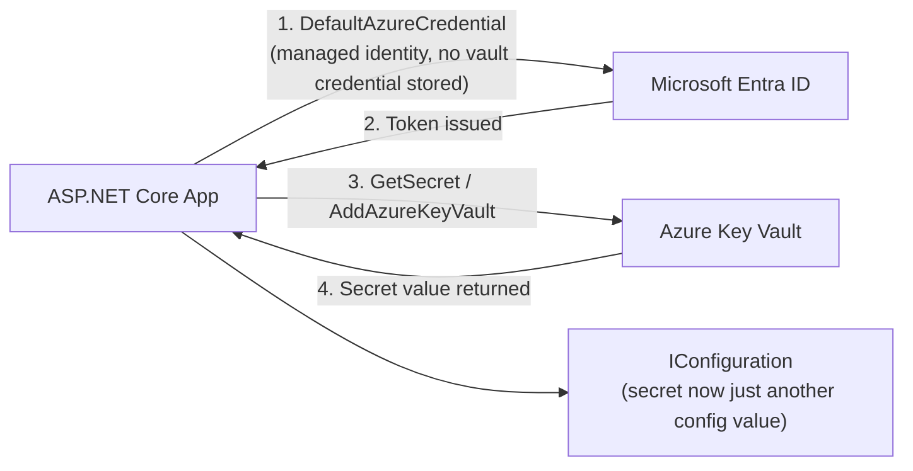
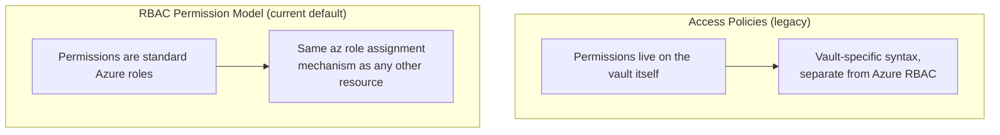

# Azure Key Vault in Depth

## Introduction

Before reading this lesson, you should already be comfortable with **[Managed Identities](../16-azure-for-dotnet-developers/16-32-managed-identities.md)**, including the fact that a managed identity removes secrets for *machine-to-machine* Azure calls, but does not eliminate secrets entirely — a third-party payment processor's API key, a signing certificate, or a partner's shared key still has to live *somewhere*. Module 10's Options pattern lesson already warned that a real API key has no business sitting in a checked-in `appsettings.json` file. This lesson covers where it actually belongs: **Azure Key Vault**, a managed, centralized store for secrets, keys, and certificates that a managed identity — the previous lesson's subject — can read without ever storing a credential of its own.

By the end of this lesson, you will be able to:

- Explain what Azure Key Vault stores, and why plaintext secrets in `appsettings.json` or environment variables are the exact problem it solves
- Read a secret from Key Vault in C# using `Azure.Security.KeyVault.Secrets`
- Wire Key Vault into `IConfiguration` so secrets appear as ordinary configuration values, exactly like the layered providers from Module 10, Lesson 19
- Distinguish access policies from the newer RBAC-based permission model for Key Vault
- Combine a managed identity with Key Vault so a production app needs zero secrets in its own configuration

## Azure Key Vault — A Layman's Perspective

Recall Module 10's dress-code handbook analogy for `appsettings.json`: a document every new hire reads, not remotely confidential. Now picture something a company genuinely cannot treat the same way: the combination to the company safe, the master key to the server room, or the signature stamp used to authorize six-figure wire transfers. No company prints those in the employee handbook, pins them to a shared bulletin board, or emails them around in a memo — they go in an actual vault, built for exactly that purpose, with its own reinforced door, its own access log recording precisely who opened it and when, and a strict, named list of exactly which people or systems are allowed to request what's inside, down to the individual item.

Azure Key Vault is that vault, made available to an application the same way any other managed Azure service is. It doesn't store ordinary settings — timeouts, feature flags, display text all still belong in `appsettings.json`, unchanged from Module 10. Key Vault exists specifically for the small, high-stakes subset of configuration that would be genuinely dangerous if it leaked: database passwords, third-party API keys, signing certificates, encryption keys. And just like a real vault, every access is logged, every item can be individually permissioned, and — this is the detail that makes it more than just "a safer settings file" — every secret can be automatically rotated on a schedule, versioned, and instantly revoked without redeploying a single line of application code.

Here's where the previous lesson's managed identity earns its keep in this story. A company vault is useless if opening it still requires carrying around a separate physical key that could itself be lost or copied — that would just move the leak risk from the handbook to the key. A well-run vault instead recognizes specific, vetted employees *by who they already are*, using the building's own security desk from two lessons ago, with no separate vault key ever changing hands at all. That's exactly how Key Vault is meant to be used: an application's managed identity is granted permission to read specific secrets, and the application authenticates to the vault using that same built-in, automatically-rotated identity — never a stored vault credential of its own. The one secret that would otherwise be needed just to *open* the secrets store is eliminated by the very mechanism the previous lesson introduced.

The bridge back to code: reading a secret from Key Vault, once permission is granted, looks almost exactly like reading any other configuration value — the app asks for a name, like `PaymentGateway:ApiKey`, and gets back a value, exactly as Module 10 described the Options pattern doing with `appsettings.json`. The difference is entirely in *where* that value physically lives and how tightly its access is controlled, not in how the application code consumes it.

## Azure Key Vault — A Programming Language Perspective

**Azure Key Vault** is a managed service for storing three distinct object types: **secrets** (arbitrary string values such as connection strings and API keys), **keys** (cryptographic keys usable for signing and encryption operations without the key material ever leaving the vault), and **certificates** (X.509 certificates, including automatic renewal). The `Azure.Security.KeyVault.Secrets` SDK's `SecretClient` reads and writes secrets directly; more commonly, the `Azure.Extensions.AspNetCore.Configuration.Secrets` package registers Key Vault as an additional `IConfiguration` provider via `builder.Configuration.AddAzureKeyVault(...)`, layering it into the exact same provider chain — `appsettings.json`, environment-specific overrides, environment variables — that Module 10, Lesson 19 introduced, so a secret is read with the identical `IConfiguration["Section:Key"]` or Options-pattern binding syntax as any other setting. Access is governed by one of two permission models: legacy **access policies**, or the current-generation **RBAC permission model**, covered in the comparison section below.

## How to Read and Configure Key Vault Secrets

Provisioning a vault and a secret is a short CLI sequence; consuming that secret from C# takes two forms, a direct SDK call and the `IConfiguration` integration that makes Key Vault disappear into the same configuration surface every other setting already uses.


*Figure 1: A managed identity authenticates the app to Entra ID, which Key Vault trusts, so the vault credential itself never has to exist.*

```bash
# Azure CLI — create a vault and a secret inside it
az keyvault create --name kv-banking-prod --resource-group rg-banking-prod --location eastus

az keyvault secret set --vault-name kv-banking-prod \
  --name "CoreBankingDbConnectionString" \
  --value "Server=sql-banking-prod.database.windows.net;Database=CoreBanking;..."
```

**Azure CLI Output:**

```text
{
  "name": "kv-banking-prod",
  "properties": { "vaultUri": "https://kv-banking-prod.vault.azure.net/" }
}
{
  "id": "https://kv-banking-prod.vault.azure.net/secrets/CoreBankingDbConnectionString/8f2a1c...",
  "name": "CoreBankingDbConnectionString"
}
```

```csharp
// Program.cs — .NET 10 / C# 14
using Azure.Identity;
using Azure.Security.KeyVault.Secrets;

var builder = WebApplication.CreateBuilder(args);

// Wires Key Vault directly into IConfiguration alongside appsettings.json and environment variables
builder.Configuration.AddAzureKeyVault(
    new Uri("https://kv-banking-prod.vault.azure.net/"),
    new DefaultAzureCredential());

var app = builder.Build();

app.MapGet("/config-check", (IConfiguration config) =>
{
    // Reads exactly like any other configuration value — no SecretClient call visible here at all
    string? connectionString = config["CoreBankingDbConnectionString"];
    bool found = !string.IsNullOrWhiteSpace(connectionString);
    return Results.Text(found ? "Connection string resolved from Key Vault." : "Not found.");
});

app.Run();
```

**Console Output (App Service log for a request to `/config-check`):**

```text
info: Program[0]
      Authenticated to kv-banking-prod.vault.azure.net via ManagedIdentityCredential
info: Program[0]
      Connection string resolved from Key Vault.
```

Nowhere in `Program.cs` does a `SecretClient.GetSecretAsync` call appear directly — `AddAzureKeyVault` did that work once, at startup, and folded the result into the same `IConfiguration` object every other setting flows through. This is precisely the outcome Module 10's Options pattern lesson was building toward: the rest of the application binds `CoreBankingDbConnectionString` to a strongly-typed settings class exactly as it would bind any `appsettings.json` value, with no idea — and no need to know — that the real value came from a vault instead of a file.

## Real-Time Example: Securing the Banking Statement Service's Secrets

We continue directly from the previous lesson's `TransactionStatementService`, whose system-assigned managed identity was already granted `Key Vault Secrets User` on `kv-banking-prod`. That grant now gets put to work: the service's database connection string and its statement-signing certificate password both move out of configuration files entirely and into that vault.

```csharp
// StatementServiceSecrets.cs — .NET 10 / C# 14 — Real-Time Example (Banking/ATM)
public sealed record VaultSecret(string Name, string ConsumedBy, bool StoredInAppSettings);

VaultSecret[] secrets =
[
    new("CoreBankingDbConnectionString", "TransactionStatementService", StoredInAppSettings: false),
    new("StatementSigningCertPassword", "TransactionStatementService", StoredInAppSettings: false),
    new("PartnerBankApiKey", "TransactionStatementService", StoredInAppSettings: false)
];

Console.WriteLine("kv-banking-prod — secrets used by TransactionStatementService:");
foreach (VaultSecret s in secrets)
{
    string location = s.StoredInAppSettings ? "appsettings.json (INSECURE)" : "Azure Key Vault";
    Console.WriteLine($"  {s.Name,-32} -> stored in: {location}");
}

int insecureCount = secrets.Count(s => s.StoredInAppSettings);
Console.WriteLine();
Console.WriteLine($"Secrets stored in plaintext configuration files: {insecureCount}");
```

**Console Output:**

```text
kv-banking-prod — secrets used by TransactionStatementService:
  CoreBankingDbConnectionString   -> stored in: Azure Key Vault
  StatementSigningCertPassword    -> stored in: Azure Key Vault
  PartnerBankApiKey               -> stored in: Azure Key Vault

Secrets stored in plaintext configuration files: 0
```

For a banking system, that zero on the last line is frequently a literal audit requirement, not just good practice — regulators and internal security reviews routinely ask, by name, whether database credentials and signing material are stored in a dedicated secrets vault with access logging, rather than in application configuration. Because `TransactionStatementService` authenticates to `kv-banking-prod` using the managed identity from the previous lesson, satisfying that requirement adds no credential of its own to manage or eventually leak.

## Access Policies vs the RBAC Permission Model

Key Vault has supported two entirely separate ways of deciding who can do what since well before this module's target .NET version, and new vaults today default to the newer one. The legacy **access policy** model attaches permissions directly to the vault resource itself, as a list of principals paired with specific operations — "this identity may Get and List secrets" — configured independently of every other Azure permission in the subscription, using Key Vault's own dedicated policy syntax. The current **RBAC permission model** instead folds Key Vault access into Azure's standard role-based access control system — the same `az role assignment create` mechanism used in the previous lesson to grant `Storage Blob Data Contributor` — using built-in roles like `Key Vault Secrets User` (read-only) or `Key Vault Secrets Officer` (read-write), assignable at the subscription, resource group, or individual vault scope, and fully covered by the next lesson.


*Figure 2: Access policies configure permissions on the vault in isolation; the RBAC model folds Key Vault into Azure's standard, subscription-wide role system.*

| Aspect | Access Policies | RBAC Permission Model |
|---|---|---|
| Where permissions are defined | On the vault resource itself | Azure's standard role assignment system |
| Granularity | Per-vault only (all-or-nothing per object type) | Per-vault, per-resource-group, or per-subscription |
| Consistency with other Azure resources | Separate mechanism, vault-specific | Same mechanism as Storage, SQL, and every other RBAC-enabled resource |
| Auditability | Vault-local policy list | Centralized in Azure's role assignment history |
| Recommended for new vaults | No — legacy | Yes — Microsoft's current default and recommendation |

## Types of Key Vault Objects and Related Concepts

Key Vault's secret store is the most common entry point, but it manages three related object types and connects to several other lessons:

1. **Secrets** — arbitrary string values, the focus of this lesson, read via `SecretClient` or `AddAzureKeyVault`.
2. **Keys** — cryptographic key material used for signing or encryption operations performed inside the vault, relevant to the certificate topics from [Cryptography — Encryption and Certificates](../14-grpc-signalr-security/14-13-cryptography-encryption-certificates.md).
3. **Certificates** — X.509 certificates with automatic renewal, an alternative to the client secret credential from [App Registrations and OAuth Flows](../16-azure-for-dotnet-developers/16-31-app-registrations-and-oauth-flows.md).
4. **[Managed Identities](../16-azure-for-dotnet-developers/16-32-managed-identities.md)** — the mechanism this lesson relies on so the app itself needs no vault credential.
5. **[RBAC and Azure Policy](../16-azure-for-dotnet-developers/16-34-rbac-and-azure-policy.md)** — the permission model this lesson recommends, covered next in full depth.
6. **[Configuration and the Options Pattern](../10-aspnetcore/10-19-configuration-and-options-pattern.md)** — the `IConfiguration` provider chain Key Vault slots directly into.

## What You've Learned & What's Next

Azure Key Vault is the dedicated, access-controlled store for the genuinely sensitive slice of an application's configuration — secrets, keys, and certificates — read either directly through `Azure.Security.KeyVault.Secrets` or, more idiomatically, folded straight into `IConfiguration` so the rest of the application never has to know a value came from a vault rather than a file. Paired with a managed identity, an application can reach that vault with zero stored credentials of its own, and the RBAC permission model keeps that access consistent with every other Azure resource's permissions.

Continue your learning journey with **[RBAC and Azure Policy](../16-azure-for-dotnet-developers/16-34-rbac-and-azure-policy.md)**, where the role assignments used throughout this lesson and the last — `Storage Blob Data Contributor`, `Key Vault Secrets User` — are covered as the general-purpose permission system they actually are.

---
*Applies to: .NET 10 / C# 14. Last reviewed 2026-08-16.*
