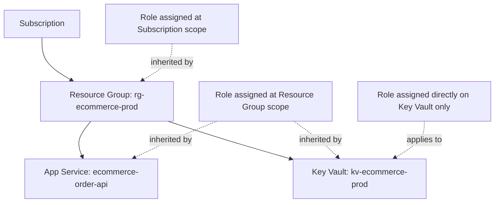
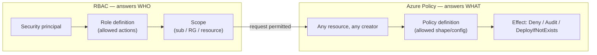

# RBAC and Azure Policy

## Introduction

Before reading this lesson, you should already be comfortable with **[Azure Key Vault in Depth](../16-azure-for-dotnet-developers/16-33-azure-key-vault-in-depth.md)**, and specifically with the sentence that closed it out: role assignments like `Key Vault Secrets User` and `Storage Blob Data Contributor` are "the general-purpose permission system" of Azure, not a Key-Vault-specific quirk. This lesson makes good on that promise. **Role-Based Access Control (RBAC)** is the mechanism behind every role assignment used so far in this module — it answers *who can do what*. This lesson also introduces a second, easily confused system that answers a completely different question: **Azure Policy**, which governs *what resources are allowed to look like*, regardless of who created them.

By the end of this lesson, you will be able to:

- Explain what Azure RBAC controls, and name its three components: a security principal, a role definition, and a scope
- Distinguish common built-in roles — `Owner`, `Contributor`, `Reader`, and resource-specific roles like `Key Vault Secrets User` — and know when a custom role is warranted
- Assign a role at the subscription, resource-group, or individual-resource scope, and explain how scope inheritance works
- Explain what Azure Policy enforces, and write a policy assignment example such as "no public IP addresses" or "must use approved regions"
- State precisely why RBAC and Azure Policy are not competing systems, but two independent, complementary layers

## RBAC and Azure Policy — A Layman's Perspective

Picture a city's municipal government running two entirely separate systems, both of which affect what gets built and who's allowed to do the building, and picture how easily an outsider might assume they're the same thing when they are not. The first system is the licensing office. It hands out contractor's licenses and building permits: this specific contractor, with this specific license, is permitted to pour concrete, run electrical wiring, or open a road for excavation, on this specific job site, for this specific project. A general contractor's license might cover an entire district; a narrower electrician's permit might cover exactly one address. Either way, the licensing office's entire job is deciding *who* gets to do *what*, at *which* location, and nothing more.

The second system is the building code office, and it does not care in the slightest who's holding the hammer. Its job is deciding what any structure, built by anyone, licensed or not, senior contractor or brand-new apprentice, is allowed to look like once it's standing: every building in a flood zone must sit above a minimum elevation, no structure in a historic district may exceed four stories, every commercial kitchen must have a fire suppression system installed before its first day of business. A perfectly licensed, highly trusted master contractor gets rejected by an inspector exactly as fast as an unlicensed one if the finished structure itself violates code — the inspector isn't checking credentials at that point, only the structure. Licensing answers "is this person allowed to build here." Code enforcement answers "is this building allowed to exist in this shape," and it asks that question of every structure equally, no matter whose name is on the permit.

Azure runs precisely this same pair of independent systems side by side, and the previous three lessons have already been using the first one without naming it directly. **RBAC** is the licensing office: it decides which security principal — a person, a group, or a managed identity like the ones from two lessons ago — is permitted to perform which actions, on which specific resource, resource group, or subscription. It is entirely about *who*. **Azure Policy** is the building code office: it evaluates every resource that exists or gets created against a set of organizational rules — no public IP addresses on this subnet, only these three approved regions, every storage account must enforce HTTPS — and it enforces those rules identically whether the resource was created by the subscription's most trusted administrator or by the newest engineer on the team. It is entirely about *what*.

The bridge back to Azure specifically: a subscription owner with full RBAC permissions to create anything, anywhere, can still be blocked outright by an Azure Policy assignment the moment they try to stand up a resource that violates an organizational rule — the same way a licensed master contractor still gets turned away at final inspection for skipping a required fire exit. Neither system substitutes for the other, and a secure Azure environment, as the next few lessons will keep reinforcing, genuinely needs both running at once.

## RBAC and Azure Policy — A Programming Language Perspective

**Azure Role-Based Access Control (RBAC)** is expressed as a **role assignment**: a triple binding a **security principal** (a user, group, service principal, or managed identity), a **role definition** (a named collection of allowed operations, such as the built-in `Owner`, `Contributor`, `Reader`, or a resource-specific role like `Key Vault Secrets User`), and a **scope** — a management group, subscription, resource group, or individual resource, in that order of decreasing breadth. Role assignments made at a broader scope are inherited by everything nested beneath it; `az role assignment create` is the CLI surface used throughout this module already. A **custom role** is a role definition an organization authors itself, listing precise allowed and denied `actions`/`dataActions`, for the cases where no built-in role matches exactly. **Azure Policy**, by contrast, is expressed as a **policy definition** — a declarative rule evaluated against a resource's properties, independent of any principal — attached via a **policy assignment** at a scope of its own, with an effect such as `Deny` (block the operation outright), `Audit` (allow it but flag noncompliance), or `DeployIfNotExists` (auto-remediate). Multiple related policy definitions are frequently bundled into an **initiative** (`policySetDefinition`) and assigned as one unit.

## How to Assign an RBAC Role and an Azure Policy

Both systems follow the identical two-step shape — define the rule, then assign it at a scope — but they operate on entirely different resources underneath, as the diagram below makes explicit.


*Figure 1: RBAC scope is hierarchical — a role granted higher up is inherited by everything nested beneath it, while a role granted directly on one resource applies only there.*

```bash
# Azure CLI — illustrative output; values vary by tenant/subscription

# RBAC: grant a role at resource-group scope (inherited by every resource inside it)
az role assignment create \
  --assignee "sp-ecommerce-order-api" \
  --role "Reader" \
  --scope "/subscriptions/<sub-id>/resourceGroups/rg-ecommerce-prod"

# RBAC: grant a narrower role directly on one resource only
az role assignment create \
  --assignee "sp-ecommerce-order-api" \
  --role "Key Vault Secrets User" \
  --scope "/subscriptions/<sub-id>/resourceGroups/rg-ecommerce-prod/providers/Microsoft.KeyVault/vaults/kv-ecommerce-prod"

# Azure Policy: assign a built-in policy denying public IP addresses across the resource group
az policy assignment create \
  --name "deny-public-ip-ecommerce" \
  --display-name "Deny public IP addresses" \
  --policy "83a86a26-fd1f-447c-b59d-e51f44264114" \
  --scope "/subscriptions/<sub-id>/resourceGroups/rg-ecommerce-prod"
```

**Azure CLI Output:**

```text
{
  "principalName": "sp-ecommerce-order-api",
  "roleDefinitionName": "Reader",
  "scope": "/subscriptions/.../resourceGroups/rg-ecommerce-prod"
}
{
  "principalName": "sp-ecommerce-order-api",
  "roleDefinitionName": "Key Vault Secrets User",
  "scope": "/subscriptions/.../vaults/kv-ecommerce-prod"
}
{
  "name": "deny-public-ip-ecommerce",
  "policyDefinitionId": "/providers/Microsoft.Authorization/policyDefinitions/83a86a26-fd1f-447c-b59d-e51f44264114",
  "enforcementMode": "Default"
}
```

A C# console program can model that same shape without calling Azure, which is useful for reasoning about scope inheritance before touching a real subscription.

```csharp
// Program.cs — .NET 10 / C# 14
public enum Scope { Subscription, ResourceGroup, Resource }
public sealed record RoleAssignment(string Principal, string Role, Scope Scope, string Target);

RoleAssignment[] assignments =
[
    new("sp-ecommerce-order-api", "Reader", Scope.ResourceGroup, "rg-ecommerce-prod"),
    new("sp-ecommerce-order-api", "Key Vault Secrets User", Scope.Resource, "kv-ecommerce-prod")
];

// A resource-group-scoped role is inherited by every resource inside it; a resource-scoped
// role applies only to that one named target.
bool CanAccess(RoleAssignment a, string resourceName, string resourceGroup) =>
    a.Scope switch
    {
        Scope.ResourceGroup => a.Target == resourceGroup,
        Scope.Resource => a.Target == resourceName,
        _ => true
    };

Console.WriteLine("sp-ecommerce-order-api access check on 'kv-ecommerce-prod' (in rg-ecommerce-prod):");
foreach (RoleAssignment a in assignments)
{
    bool applies = CanAccess(a, "kv-ecommerce-prod", "rg-ecommerce-prod");
    Console.WriteLine($"  [{a.Scope,-13}] {a.Role,-24} -> applies: {applies}");
}
```

**Console Output:**

```text
sp-ecommerce-order-api access check on 'kv-ecommerce-prod' (in rg-ecommerce-prod):
  [ResourceGroup] Reader                   -> applies: True
  [Resource     ] Key Vault Secrets User   -> applies: True
```

Both assignments apply here because the Key Vault lives inside the resource group the first role was granted on, and the second role targets that exact vault directly — precisely the inheritance behavior Figure 1 illustrated. Notice that neither role assignment says anything about *what the vault itself is allowed to look like*; that question belongs entirely to Azure Policy, covered next in the same CLI session above.

## Real-Time Example: Locking Down the E-Commerce Order API's Resource Group

We extend the E-Commerce Order Processing domain by hardening the resource group hosting `ecommerce-order-api`, the App Service that will become this sub-area's capstone in a few lessons. Two separate rules get applied here, deliberately through two separate systems: RBAC decides which principals can touch this resource group at all, and Azure Policy decides what any resource inside it — created by any of those principals — is permitted to look like.

```csharp
// EcommerceGovernance.cs — .NET 10 / C# 14 — Real-Time Example (E-Commerce Order Processing)
public sealed record RbacRule(string Principal, string Role, string Scope);
public sealed record PolicyRule(string DisplayName, string Effect, string Rule);

RbacRule[] rbac =
[
    new("platform-team (group)", "Contributor", "rg-ecommerce-prod"),
    new("sp-ecommerce-order-api", "Reader", "rg-ecommerce-prod"),
    new("sp-ecommerce-order-api", "Key Vault Secrets User", "kv-ecommerce-prod")
];

PolicyRule[] policies =
[
    new("Deny public IP addresses", "Deny", "No resource in this group may expose a public IP"),
    new("Allowed locations", "Deny", "Resources restricted to eastus, westus2"),
    new("Require HTTPS on storage accounts", "Deny", "Storage accounts must set supportsHttpsTrafficOnly")
];

Console.WriteLine("rg-ecommerce-prod — RBAC role assignments:");
foreach (RbacRule r in rbac)
{
    Console.WriteLine($"  {r.Principal,-28} -> {r.Role,-24} @ {r.Scope}");
}

Console.WriteLine();
Console.WriteLine("rg-ecommerce-prod — Azure Policy assignments:");
foreach (PolicyRule p in policies)
{
    Console.WriteLine($"  [{p.Effect}] {p.DisplayName,-32} - {p.Rule}");
}
```

**Console Output:**

```text
rg-ecommerce-prod - RBAC role assignments:
  platform-team (group)       -> Contributor              @ rg-ecommerce-prod
  sp-ecommerce-order-api      -> Reader                   @ rg-ecommerce-prod
  sp-ecommerce-order-api      -> Key Vault Secrets User    @ kv-ecommerce-prod

rg-ecommerce-prod - Azure Policy assignments:
  [Deny] Deny public IP addresses           - No resource in this group may expose a public IP
  [Deny] Allowed locations                  - Resources restricted to eastus, westus2
  [Deny] Require HTTPS on storage accounts  - Storage accounts must set supportsHttpsTrafficOnly
```

The two output blocks answer two entirely different audit questions. "Who can deploy into this resource group, and what can `ecommerce-order-api`'s own identity reach?" is answered by the RBAC table — and it is answered narrowly, on purpose: the API's own identity gets `Reader` on the group and a single, scoped write permission on one vault, nothing broader. "Regardless of who deploys next, what is any new resource in this group forbidden from doing?" is answered by the policy table, and it applies even to `platform-team`'s own `Contributor` members — a platform engineer with full write access still cannot stand up a publicly-exposed VM in this group, because Policy evaluates the resource's shape, not the deployer's role.

## RBAC vs Azure Policy

Both systems attach rules to a scope and both can be inspected with nearly identical CLI verbs, which is exactly why they get confused. The distinction is what each one is actually evaluating: RBAC evaluates a request against a principal's granted permissions before an action is allowed to proceed at all; Azure Policy evaluates a resource's resulting configuration against organizational rules, independent of who issued the request. A request can pass RBAC and still be denied by Policy — an `Owner` with unrestricted permissions is still blocked from creating a resource in a disallowed region — but a request can never pass Policy while failing RBAC, because Policy is only ever reached for requests RBAC has already permitted to attempt.


*Figure 2: A request must clear RBAC's "who" check before Azure Policy's independent "what" check is even evaluated against it.*

| Aspect | RBAC | Azure Policy |
|---|---|---|
| Core question | Who can perform this action? | What is this resource allowed to look like? |
| Evaluated against | A security principal's role assignments | A resource's configuration/properties |
| Applies regardless of identity? | No — permissions are principal-specific | Yes — enforced identically for every principal |
| Typical effects | Allow / deny the specific action | `Deny`, `Audit`, `DeployIfNotExists` |
| Example rule | "The order API's identity may read secrets from this vault" | "No storage account in this subscription may skip HTTPS" |

## Types of RBAC and Policy Constructs in Azure

RBAC and Policy each have their own set of building blocks, several of which get dedicated attention elsewhere in this sub-area:

1. **Built-in roles** — `Owner`, `Contributor`, `Reader`, and dozens of resource-specific roles like `Key Vault Secrets User`, covering the overwhelming majority of real assignments.
2. **Custom roles** — organization-authored role definitions for the narrow cases no built-in role matches, defined as JSON listing precise `actions`/`notActions`.
3. **Scope levels** — management group, subscription, resource group, and individual resource, with permissions inherited from broader to narrower.
4. **Policy initiatives** — a bundle of related policy definitions (for example, an entire regulatory baseline) assigned and tracked as a single unit rather than one definition at a time.
5. **[Conditional Access Basics](../16-azure-for-dotnet-developers/16-35-conditional-access-basics.md)** — a third, complementary layer covered next: rules evaluated at *sign-in* time, on top of both RBAC and Policy.
6. **[Managed Identities](../16-azure-for-dotnet-developers/16-32-managed-identities.md)** — the most common kind of security principal an RBAC role assignment names in a production Azure environment.

## What You've Learned & What's Next

RBAC and Azure Policy are two independent systems that happen to share a scope-based shape: RBAC decides which principal can perform which action, while Azure Policy decides what any resource is allowed to look like, regardless of who created it — and a subscription needs both to be genuinely governed. `ecommerce-order-api`'s narrowly-scoped role assignments from this lesson carry forward unchanged into this sub-area's capstone.

Continue your learning journey with **[Conditional Access Basics](../16-azure-for-dotnet-developers/16-35-conditional-access-basics.md)**, where a third layer of rules gets added — this time evaluated the moment a user signs in, before RBAC or Policy ever come into play.

---
*Applies to: .NET 10 / C# 14. Last reviewed 2026-08-16.*
