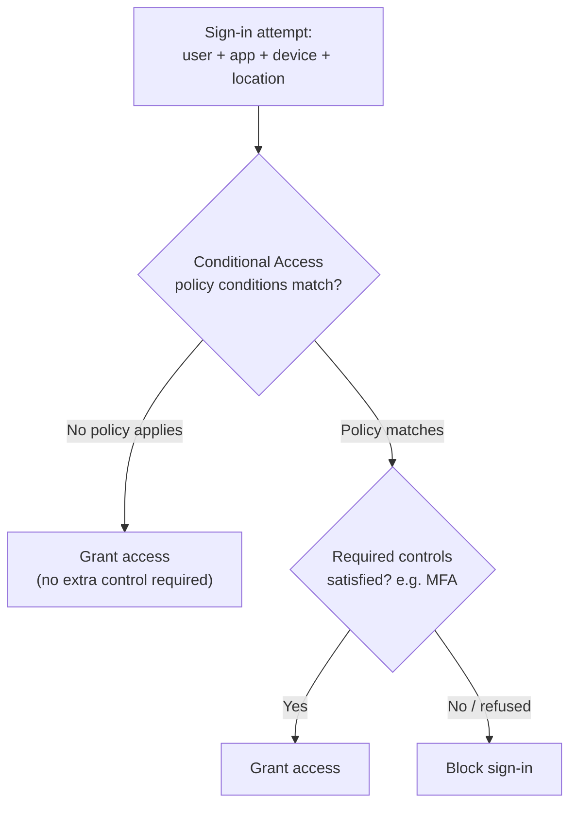
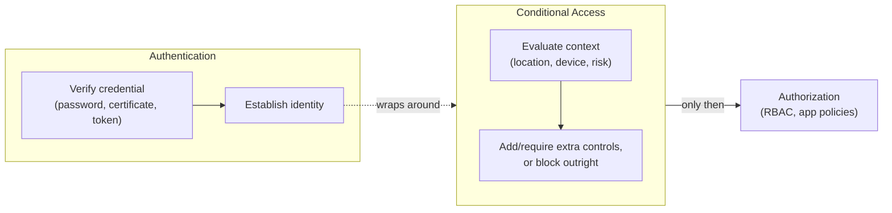

# Conditional Access Basics

## Introduction

Before reading this lesson, you should already be comfortable with **[RBAC and Azure Policy](../16-azure-for-dotnet-developers/16-34-rbac-and-azure-policy.md)**, and specifically with the idea that Azure runs multiple independent rule layers at once rather than one master gate. This lesson adds a third layer, and it sits in an unusual place: not after a user is authenticated, the way RBAC does, but *during* authentication itself, deciding whether a sign-in should even be allowed to succeed as attempted. That layer is **Conditional Access**, and it directly extends Module 14's authentication-vs-authorization distinction — Conditional Access is neither. It's a policy engine that sits *on top of* authentication and can demand more proof, block a sign-in outright, or let it through unchanged, all before authorization is ever evaluated.

By the end of this lesson, you will be able to:

- Explain what a Conditional Access policy is, in terms of its **signals**, **decisions**, and **enforcement**
- State precisely how Conditional Access differs from authentication itself and from RBAC/Policy, using Module 14's authentication-vs-authorization framing
- Describe common banking-grade policy examples, such as requiring MFA from an unfamiliar location or device, or blocking legacy authentication protocols entirely
- Trace a single sign-in attempt through Conditional Access evaluation and predict the resulting decision
- Explain why Conditional Access policies are additive with, not a replacement for, RBAC and Azure Policy

## Conditional Access — A Layman's Perspective

Picture a bank employee badge that has worked flawlessly, every single morning, at the same branch, for three years straight. The badge itself has never changed, never expired, never been reissued — it's exactly as genuine today as it was the day it was printed. Now picture that same, entirely genuine badge being swiped at 3 a.m., at a branch on the opposite side of the country the employee has never once visited, from a laptop the bank's systems have never seen before. Nothing about the badge itself failed. The badge-verification step — is this really the badge we issued, unaltered and unexpired — passed completely. And yet a well-run bank's security desk would be negligent to treat that particular swipe exactly the same way it treats the employee's routine 9 a.m. badge-in at their usual branch, on their usual laptop.

That's precisely the gap Conditional Access exists to close. A security desk that only ever asks "is this badge genuine" is asking a fixed, context-free question — the exact same question, answered the exact same way, regardless of the hour, the branch, or the device presenting it. A more careful security desk keeps a running set of *situational* rules layered on top of that first question, evaluated fresh every single time, no matter how many times the same badge has passed before: if this exact badge is presented from a branch it's never used before, or at an hour nobody on this shift normally works, or from a device that isn't the one issued to this employee, then don't just wave it through — demand one additional, specific proof before the door opens. Maybe that's a callback to a registered phone number. Maybe it's a second physical token the employee has to produce. The badge's genuineness was never in question; the *context* around this particular swipe is what earned the extra step.

Notice what that security desk is explicitly not doing: it isn't re-deciding which doors this employee's badge is allowed to open once they're inside — that's a separate system, handled elsewhere, corresponding to RBAC from the previous lesson. It also isn't inspecting whether the vault room itself meets code — that's Azure Policy's job, evaluated even later, on the resources themselves. This desk's entire job happens at one single moment: the swipe itself, before the door has opened at all, deciding whether *this specific attempt*, right now, under these specific conditions, gets to proceed as-is, gets asked for one more piece of proof, or gets refused outright.

Microsoft Entra ID's **Conditional Access** is exactly that situational security desk, evaluated on every sign-in attempt to every application it protects. It looks at signals — user, location, device, application, detected sign-in risk — and produces a decision: grant access as normal, grant access but require an additional control such as MFA, or block the sign-in outright. Crucially, it runs *during* the authentication moment itself, deciding how much proof this particular attempt needs before an identity is even considered established — a genuinely different moment in the request's lifecycle than either of the two policy layers covered so far.

## Conditional Access — A Programming Language Perspective

A **Conditional Access policy** is a rule evaluated by Entra ID at sign-in time, composed of **assignments** (the *if*: which users or groups, which target applications, and conditions such as network location, device platform, client app type, or a Microsoft-computed sign-in risk level) and **access controls** (the *then*: `Grant` access, optionally requiring one or more controls such as multi-factor authentication or a compliant/hybrid-joined device, or `Block` access outright). Policies are evaluated for every applicable sign-in, and when multiple policies apply simultaneously, all of their required controls must be satisfied — there is no single "most specific policy wins" override the way CSS specificity or route matching works. Conditional Access is licensed and configured entirely within Entra ID (via `Microsoft.Graph` / `az rest` against the Graph API, or the Entra admin portal), and it evaluates strictly *before* an ASP.NET Core application's own `[Authorize]` attributes or authorization policies from Module 14 ever run — by the time a request reaches application code, Conditional Access has already decided whether this sign-in was even allowed to complete.

## How Conditional Access Evaluates a Sign-In

A policy's conditions are evaluated together, and every control the matching policy or policies require has to be satisfied before the sign-in completes — there's no partial credit for satisfying most of them.


*Figure 1: Conditional Access evaluates every applicable policy's conditions, then enforces whichever controls those matching policies require, before the sign-in is allowed to complete at all.*

```bash
# Azure CLI / Microsoft Graph — illustrative output; requires Entra ID P1/P2 and Graph permissions

az rest --method GET \
  --uri "https://graph.microsoft.com/v1.0/identity/conditionalAccess/policies" \
  --query "value[].{Name:displayName, State:state}"
```

**Azure CLI Output (illustrative):**

```text
Name                                                State
---------------------------------------------------  ---------
Require MFA for Core Banking Admin Portal            enabled
Block legacy authentication protocols                enabled
Require compliant device for high-risk sign-ins      enabled
```

A small C# console program can model the same evaluation shape locally, which is useful for reasoning about how multiple matching policies stack before ever touching the Graph API.

```csharp
// Program.cs — .NET 10 / C# 14
public sealed record SignInAttempt(string User, string App, string Location, bool KnownDevice, string RiskLevel);
public sealed record ConditionalAccessPolicy(string Name, Func<SignInAttempt, bool> Applies, string RequiredControl);

ConditionalAccessPolicy[] policies =
[
    new("Require MFA for Core Banking Admin Portal",
        a => a.App == "CoreBankingAdminPortal",
        "MFA"),
    new("Require compliant device for high-risk sign-ins",
        a => a.RiskLevel == "High",
        "CompliantDevice"),
    new("Block sign-in from unfamiliar location without MFA",
        a => !a.KnownDevice,
        "MFA")
];

SignInAttempt attempt = new("marcus.webb", "CoreBankingAdminPortal", "Unrecognized-City", KnownDevice: false, RiskLevel: "Medium");

List<string> requiredControls = policies
    .Where(p => p.Applies(attempt))
    .Select(p => p.RequiredControl)
    .Distinct()
    .ToList();

Console.WriteLine($"Sign-in: {attempt.User} -> {attempt.App} from {attempt.Location} (known device: {attempt.KnownDevice})");
Console.WriteLine(requiredControls.Count == 0
    ? "Decision: Grant access, no extra control required."
    : $"Decision: Grant access ONLY IF satisfied: {string.Join(", ", requiredControls)}");
```

**Console Output:**

```text
Sign-in: marcus.webb -> CoreBankingAdminPortal from Unrecognized-City (known device: False)
Decision: Grant access ONLY IF satisfied: MFA, CompliantDevice
```

Two separate policies matched this single attempt — one because of the target application, one because of the unfamiliar device — and both of their required controls stack, rather than either policy alone deciding the outcome. This is the detail most worth remembering: Conditional Access policies are evaluated as a *set*, and a sign-in only succeeds once every matching policy's requirements are satisfied.

## Real-Time Example: Protecting the Core Banking Admin Portal

We continue the Banking/ATM domain, this time at the identity layer rather than the transaction layer: `CoreBankingAdminPortal`, the internal application bank staff use to review flagged transactions and manage account holds, sits behind three Conditional Access policies that together reflect what a regulator would expect from a financial institution's internal tooling.

```csharp
// CoreBankingAccessPolicies.cs — .NET 10 / C# 14 — Real-Time Example (Banking/ATM)
public sealed record CaPolicy(string Name, string Condition, string RequiredControl);

CaPolicy[] policies =
[
    new("Require MFA for all admin portal sign-ins", "Application = CoreBankingAdminPortal", "MFA"),
    new("Block legacy authentication protocols", "ClientAppType = LegacyAuth (IMAP/POP/older Office)", "Block"),
    new("Require compliant device for elevated roles", "Role = BranchManager OR SystemAdministrator", "CompliantDevice"),
    new("Require MFA from unfamiliar location", "SignInRiskLevel = Medium or High", "MFA")
];

Console.WriteLine("CoreBankingAdminPortal — Conditional Access policies in effect:");
foreach (CaPolicy p in policies)
{
    Console.WriteLine($"  [{p.RequiredControl,-15}] {p.Name}");
    Console.WriteLine($"                    when: {p.Condition}");
}

// Evaluate one concrete attempt against every policy that applies
bool RequiresMfa(string role, bool legacyClient, string riskLevel) =>
    !legacyClient && (role is "BranchManager" or "SystemAdministrator" || riskLevel != "Low");

Console.WriteLine();
Console.WriteLine("Sign-in check — priya.nathan (SystemAdministrator), modern client, risk: Medium");
Console.WriteLine($"MFA required: {RequiresMfa("SystemAdministrator", legacyClient: false, riskLevel: "Medium")}");
```

**Console Output:**

```text
CoreBankingAdminPortal - Conditional Access policies in effect:
  [MFA            ] Require MFA for all admin portal sign-ins
                    when: Application = CoreBankingAdminPortal
  [Block          ] Block legacy authentication protocols
                    when: ClientAppType = LegacyAuth (IMAP/POP/older Office)
  [CompliantDevice] Require compliant device for elevated roles
                    when: Role = BranchManager OR SystemAdministrator
  [MFA            ] Require MFA from unfamiliar location
                    when: SignInRiskLevel = Medium or High

Sign-in check - priya.nathan (SystemAdministrator), modern client, risk: Medium
MFA required: True
```

None of these four policies touch what `priya.nathan` is authorized to *do* once signed in — that remains RBAC's job entirely, decided by role assignments exactly like the previous lesson's. These policies only decide how hard the sign-in itself has to work to succeed, and for a system administrator on a banking admin portal, "hard" is precisely the point: a stolen password alone, without a second factor and a compliant device, gets nowhere near this portal.

## Conditional Access vs Authentication

It's worth being exact about where Conditional Access sits relative to authentication itself, since the two are easy to conflate. Authentication, as Module 14 defined it, is the process of establishing *who* someone is — verifying a password, a certificate, or a token. Conditional Access does not perform that verification itself; it wraps around it, deciding *how much* verification a given sign-in attempt is required to produce before authentication is considered complete. A policy requiring MFA doesn't replace the password check — it adds a second requirement on top of it, conditionally, based on context that has nothing to do with whether the password itself was correct.


*Figure 2: Conditional Access wraps around authentication itself, adding context-based requirements before authorization is ever reached.*

| Aspect | Authentication | Conditional Access |
|---|---|---|
| Core question | Is this credential genuine? | Given this context, how much proof is required? |
| Evaluated by | The identity provider's core sign-in logic | A separate policy engine layered on top of sign-in |
| Fixed or contextual? | The same check every time | Contextual — location, device, risk level, application |
| Typical outcome | Identity established or rejected | Grant as-is, grant with extra control, or block |
| Runs relative to authorization | Before | Also before — authorization only sees a completed sign-in |

## Types of Conditional Access Signals and Controls

Conditional Access policies are built from a small, reusable set of signal and control types, several of which connect directly to other parts of this curriculum:

1. **User/group assignment** — which identities a policy applies to, using the same Entra ID users and groups from [Microsoft Entra ID Fundamentals](../16-azure-for-dotnet-developers/16-30-entra-id-fundamentals.md).
2. **Application assignment** — which target applications, such as `CoreBankingAdminPortal`, the registered app from [App Registrations and OAuth Flows](../16-azure-for-dotnet-developers/16-31-app-registrations-and-oauth-flows.md).
3. **Location and device conditions** — network location, device platform, and compliant/hybrid-joined device state.
4. **Sign-in risk level** — a Microsoft-computed risk signal (Low/Medium/High) fed from Entra ID Protection's threat intelligence.
5. **Access controls** — `Grant` (optionally requiring MFA or a compliant device) or `Block`, the two terminal outcomes every policy resolves to.
6. **[RBAC and Azure Policy](../16-azure-for-dotnet-developers/16-34-rbac-and-azure-policy.md)** — the two layers Conditional Access sits in front of, never replaces.

## What You've Learned & What's Next

Conditional Access is a policy engine evaluated at the moment of sign-in, deciding — based on context like location, device, and risk — whether a sign-in should proceed unchanged, require additional proof such as MFA, or be blocked outright. It wraps around authentication rather than replacing it, and it runs entirely independently of the RBAC and Azure Policy layers covered previously.

Continue your learning journey with **[Azure Security Baseline](../16-azure-for-dotnet-developers/16-36-azure-security-baseline.md)**, where Entra ID, Managed Identities, Key Vault, RBAC, Azure Policy, and Conditional Access get pulled together into one coherent picture of what a secure Azure environment actually looks like end to end.

---
*Applies to: .NET 10 / C# 14. Last reviewed 2026-08-16.*
