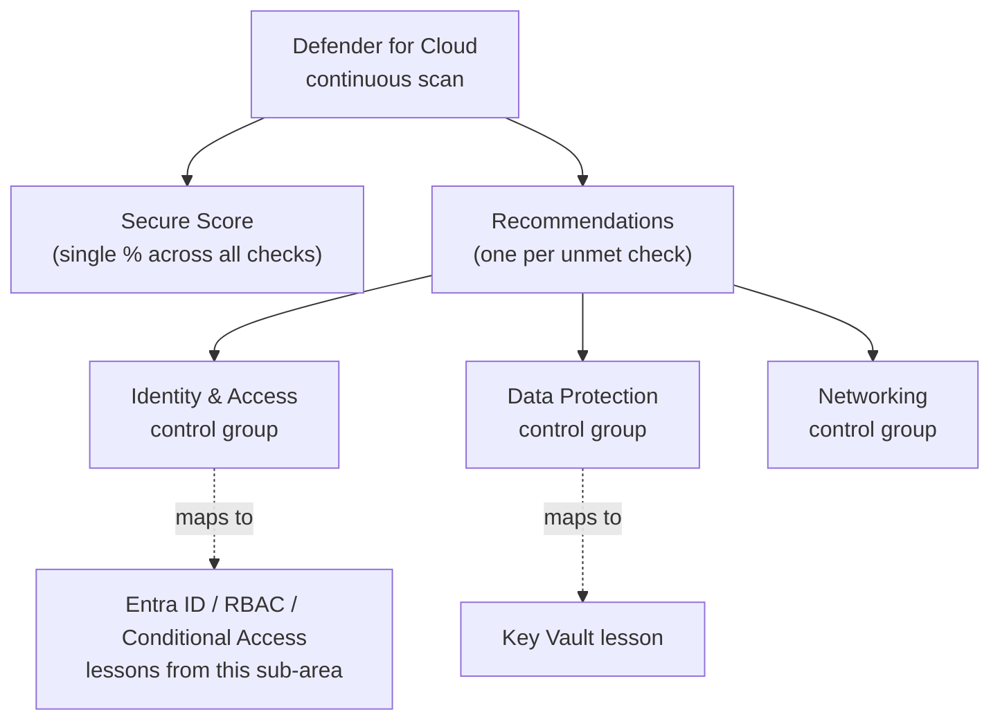
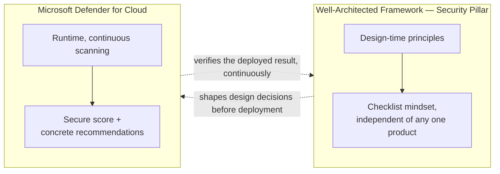

# Azure Security Baseline

## Introduction

Before reading this lesson, you should already be comfortable with **[Conditional Access Basics](../16-azure-for-dotnet-developers/16-35-conditional-access-basics.md)**, the sixth of seven distinct identity and security mechanisms this sub-area has introduced one at a time: Entra ID, app registrations, managed identities, Key Vault, RBAC and Policy, and Conditional Access. Each of those lessons deliberately stayed narrow, covering exactly one mechanism in isolation. This lesson does the opposite on purpose: it asks what happens when a real Azure environment is evaluated *as a whole*, using **Microsoft Defender for Cloud** to measure how well all of these mechanisms are actually applied together, and the **Well-Architected Framework's Security pillar** as the checklist mindset behind that measurement.

By the end of this lesson, you will be able to:

- Explain what Microsoft Defender for Cloud measures, and what a **secure score** represents
- Read a Defender for Cloud recommendation and map it back to a specific mechanism from earlier in this sub-area
- Describe the Well-Architected Framework's Security pillar as a checklist mindset rather than a single feature or product
- Explain why "baseline" means a continuously measured posture, not a one-time setup checklist
- Map every mechanism from this sub-area's seven prior lessons onto the single question "what does a secure Azure environment actually look like"

## Azure Security Baseline — A Layman's Perspective

Picture a building inspector who doesn't show up once, at construction, and then disappear forever — picture instead an inspector who walks the exact same building on a recurring schedule, checking the same list of concerns every single visit, because buildings don't stay compliant just because they were compliant on opening day. A new tenant moves in and props a fire door open for convenience. A contractor reroutes a hallway and accidentally blocks a sprinkler head. A badge reader gets swapped out during a renovation and nobody reconfigures which badges it recognizes. None of these happened through malice — they happened through the completely ordinary, continuous churn of a building that's actually being used. An inspector who only ever checked once, at the ribbon-cutting, would never catch any of it.

This sub-area has spent seven lessons touring exactly one such building, floor by floor, mechanism by mechanism: the security desk issuing badges to people, groups, and equipment (Entra ID); the registration desk vouching for applications themselves (app registrations); infrastructure that recognizes its own equipment without a PIN (managed identities); an actual reinforced vault for the truly sensitive items (Key Vault); a licensing office deciding who's permitted to do what, and a building-code office deciding what any structure is allowed to look like regardless of who built it (RBAC and Policy); and a situational security desk that demands extra proof under suspicious circumstances (Conditional Access). Every one of those seven lessons, on its own, described one specific control, installed once and (mostly) left running.

What none of those lessons did, individually, was answer the building owner's actual question: "taken together, right now, today, how secure is this whole building, and what specifically should I fix first?" That is exactly the job of a continuous inspection service — walking every floor, checking every door, every badge reader, every vault, every posted building code, on a recurring basis, and handing the owner back not a vague feeling but a concrete, prioritized list: this specific loading-dock door has no badge reader installed at all; this specific vault still allows the old-style access-policy list instead of the newer permission system; this specific tenant's staff accounts have no situational sign-in rules protecting them whatsoever. Each finding points at one specific control from one specific earlier lesson, and each is something a building manager can actually go fix, in order of how much risk it's currently creating.

Microsoft Defender for Cloud is precisely that recurring inspection service for an Azure subscription, and its **secure score** is the single number summarizing how many of its checks currently pass. The bridge back to code and infrastructure: nothing in this lesson introduces a brand-new control the previous seven lessons hadn't already covered. This lesson is entirely about the inspector that continuously checks whether those seven controls are actually configured well, everywhere they should be, right now — not whether they were configured well once, on the day someone first read about them.

## Azure Security Baseline — A Programming Language Perspective

**Microsoft Defender for Cloud** is Azure's cloud security posture management (CSPM) and workload protection service: it continuously scans a subscription's resources against a library of security recommendations, aggregates the results into a single **secure score** (a percentage reflecting how many applicable recommendations are currently satisfied), and surfaces specific, actionable **recommendations** — each one tied to a concrete resource and, usually, a one-click or scripted remediation. Recommendations are grouped into **security controls** (for example, "Enable MFA," "Manage access and permissions," "Protect your data") that map closely onto this sub-area's own lesson boundaries. The **Well-Architected Framework's Security pillar** is a separate, complementary artifact: a structured set of design principles and checklist questions — segment identities, apply least privilege, protect data at rest and in transit, enable threat detection — that architects use to *design* toward, independent of any specific product; Defender for Cloud is, in practice, one of the primary tools that measures whether a subscription is actually living up to that design intent.

## How to Read a Secure Score and Its Recommendations

Checking a subscription's posture is a short CLI query in practice, but interpreting the result means mapping each finding back to a specific control this sub-area already covered.


*Figure 1: Defender for Cloud's recommendations are grouped into control categories that map directly onto the individual mechanisms this sub-area already introduced one at a time.*

```bash
# Azure CLI — illustrative output; values vary by subscription and enabled Defender plans

az security secure-scores show --name "ascScore" --query "{Score:score.current, Max:score.max}"

az security assessment list \
  --query "[?properties.status.code=='Unhealthy'].{Name:properties.displayName, Severity:properties.metadata.severity}" \
  --output table
```

**Azure CLI Output (illustrative):**

```text
Score    Max
-------  -----
78.4     100.0

Name                                                     Severity
--------------------------------------------------------  --------
MFA should be enabled on accounts with owner permissions  High
Key Vault should have purge protection enabled            Medium
Storage accounts should restrict network access           High
```

A small C# program can model the same "score plus prioritized findings" shape locally, which reinforces that a secure score is just a weighted pass/fail tally over a known checklist, not a mysterious black box.

```csharp
// Program.cs — .NET 10 / C# 14
public sealed record SecurityCheck(string Name, string ControlGroup, bool Passing, int Weight);

SecurityCheck[] checks =
[
    new("MFA enabled for privileged accounts", "Identity & Access", Passing: false, Weight: 10),
    new("System-assigned managed identity used instead of stored keys", "Identity & Access", Passing: true, Weight: 8),
    new("Key Vault uses RBAC permission model", "Data Protection", Passing: true, Weight: 6),
    new("Public IP addresses restricted by policy", "Networking", Passing: true, Weight: 6),
    new("Conditional Access policy covers admin portal", "Identity & Access", Passing: false, Weight: 8)
];

int earned = checks.Where(c => c.Passing).Sum(c => c.Weight);
int possible = checks.Sum(c => c.Weight);
double score = 100.0 * earned / possible;

Console.WriteLine($"Secure score: {score:F1}%");
Console.WriteLine();
Console.WriteLine("Unhealthy recommendations, highest weight first:");
foreach (SecurityCheck c in checks.Where(c => !c.Passing).OrderByDescending(c => c.Weight))
{
    Console.WriteLine($"  [{c.ControlGroup,-16}] {c.Name} (weight {c.Weight})");
}
```

**Console Output:**

```text
Secure score: 73.7%

Unhealthy recommendations, highest weight first:
  [Identity & Access] Conditional Access policy covers admin portal (weight 8)
  [Identity & Access] MFA enabled for privileged accounts (weight 10)
```

The score itself is a summary number, useful for tracking trend over time, but the actionable part is the ordered list underneath it: two unmet checks, both in the same control group, both mapping directly to the previous lesson's Conditional Access mechanism. Fixing them isn't a new skill — it's applying Lesson 35's policy to an account it hasn't been applied to yet.

## Real-Time Example: A Security Posture Review for the Library System

We return to the Library/Inventory Management domain from [Microsoft Entra ID Fundamentals](../16-azure-for-dotnet-developers/16-30-entra-id-fundamentals.md), where the Contoso Library's tenant, staff groups, and catalog application were first introduced. Six lessons later, that library's Azure footprint has grown to include an App Service, a Key Vault, and role assignments for its staff — exactly the point at which a posture review becomes worth running, rather than trusting that everything configured along the way is still configured correctly today.

```csharp
// LibrarySecurityBaseline.cs — .NET 10 / C# 14 — Real-Time Example (Library/Inventory Management)
public sealed record BaselineItem(string Mechanism, string SourceLesson, bool InPlace, string Note);

BaselineItem[] baseline =
[
    new("Entra ID tenant with Librarians/BranchManagers groups", "Lesson 30", true, "Staff sorted into groups, not individual grants"),
    new("Catalog app registered, OIDC sign-in wired up", "Lesson 31", true, "No hardcoded credentials in the catalog app"),
    new("Managed identity for the catalog App Service", "Lesson 32", true, "Zero stored secrets for DB access"),
    new("Key Vault storing the catalog DB connection string", "Lesson 33", true, "RBAC permission model, not legacy access policies"),
    new("RBAC role assignments scoped per resource", "Lesson 34", true, "BranchManagers limited to inventory-transfer resources only"),
    new("Conditional Access requiring MFA for BranchManagers", "Lesson 35", false, "Not yet applied to the Branch Manager group")
];

int total = baseline.Length;
int inPlace = baseline.Count(b => b.InPlace);

Console.WriteLine($"Contoso Library — security baseline review: {inPlace}/{total} mechanisms in place");
foreach (BaselineItem b in baseline)
{
    Console.WriteLine($"  [{(b.InPlace ? "OK  " : "GAP ")}] {b.Mechanism} ({b.SourceLesson})");
    if (!b.InPlace)
    {
        Console.WriteLine($"         -> {b.Note}");
    }
}
```

**Console Output:**

```text
Contoso Library - security baseline review: 5/6 mechanisms in place
  [OK  ] Entra ID tenant with Librarians/BranchManagers groups (Lesson 30)
  [OK  ] Catalog app registered, OIDC sign-in wired up (Lesson 31)
  [OK  ] Managed identity for the catalog App Service (Lesson 32)
  [OK  ] Key Vault storing the catalog DB connection string (Lesson 33)
  [OK  ] RBAC role assignments scoped per resource (Lesson 34)
  [GAP ] Conditional Access requiring MFA for BranchManagers (Lesson 35)
```

That single gap is exactly the kind of finding Defender for Cloud would surface as a real recommendation: `BranchManagers` can transfer inventory between branches and adjust catalog records, which makes their accounts a meaningfully higher-value target than a front-desk account — and yet nothing currently demands extra proof at sign-in for that specific group. A one-time setup review months ago would have missed this the moment a new branch manager was hired after that review happened; a continuously re-evaluated baseline catches it the next time the scan runs.

## Secure Score vs the Well-Architected Framework's Security Pillar

These two are complementary rather than competing, and conflating them is a common mistake. Defender for Cloud's secure score is a **measurement**: a live, continuously recalculated number and a concrete list of unmet, individually remediable checks against specific deployed resources. The Well-Architected Framework's Security pillar is a **design discipline**: a set of principles and guiding checklist questions — segment access by identity, assume breach, protect data both at rest and in transit, plan for detection and response — meant to shape decisions *before* resources are even deployed, independent of whether Defender for Cloud happens to be enabled at all. A team can use the Security pillar's checklist mindset while designing a new system, and then use Defender for Cloud afterward to continuously verify that the resulting deployment still matches that design's intent.


*Figure 2: The Security pillar shapes design before deployment; Defender for Cloud continuously verifies the deployed result matches that design, and feeds findings back into future design decisions.*

| Aspect | Secure Score (Defender for Cloud) | Well-Architected Security Pillar |
|---|---|---|
| Nature | A measured, live number plus recommendations | A design-time checklist and set of principles |
| When applied | Continuously, against already-deployed resources | Primarily during design and architecture review |
| Tied to a specific product? | Yes — Microsoft Defender for Cloud | No — framework-level guidance, product-agnostic |
| Typical output | "This Key Vault lacks purge protection" | "Have you planned for detection and response?" |
| Relationship | Verifies whether the design intent was actually achieved | Informs what "achieved" should even mean |

## Types of Security Baseline Building Blocks

A security baseline isn't one feature — it's the combination of several distinct pieces, most of which this sub-area has already covered in depth:

1. **[Microsoft Entra ID Fundamentals](../16-azure-for-dotnet-developers/16-30-entra-id-fundamentals.md)** — the identity foundation every other control assumes exists.
2. **[Managed Identities](../16-azure-for-dotnet-developers/16-32-managed-identities.md)** and **[Azure Key Vault in Depth](../16-azure-for-dotnet-developers/16-33-azure-key-vault-in-depth.md)** — the data-protection controls Defender for Cloud checks for directly.
3. **[RBAC and Azure Policy](../16-azure-for-dotnet-developers/16-34-rbac-and-azure-policy.md)** — the access-and-shape controls behind most "Identity & Access" recommendations.
4. **[Conditional Access Basics](../16-azure-for-dotnet-developers/16-35-conditional-access-basics.md)** — the contextual sign-in controls behind MFA-related recommendations.
5. **Defender plans** — workload-specific protection (Defender for Servers, for Storage, for Key Vault, and more) layered on top of the baseline CSPM scanning shown above.
6. **Regulatory compliance dashboards** — Defender for Cloud's mapping of the same recommendations onto named standards (PCI DSS, ISO 27001), directly relevant to the banking-grade examples from the previous two lessons.

## What You've Learned & What's Next

A security baseline isn't a one-time setup task — it's a continuously measured posture, and Microsoft Defender for Cloud's secure score and recommendations are how that measurement happens in practice, while the Well-Architected Framework's Security pillar supplies the design-time checklist mindset behind what "secure" should mean in the first place. Every recommendation Defender for Cloud surfaces maps back to one of the seven specific mechanisms this sub-area has spent its lessons building: Entra ID, app registrations, managed identities, Key Vault, RBAC, Policy, and Conditional Access.

Continue your learning journey with **[Securing Secrets with Managed Identity + Key Vault — Real-Time Example](../16-azure-for-dotnet-developers/16-37-securing-secrets-managed-identity-keyvault.md)**, the Identity & Security sub-area's capstone, where every one of those mechanisms comes together in a single, complete, zero-secrets-in-code walkthrough.

---
*Applies to: .NET 10 / C# 14. Last reviewed 2026-08-16.*
