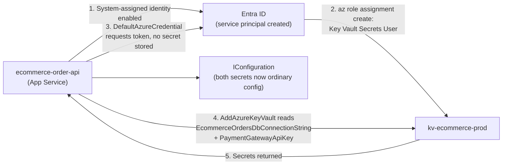
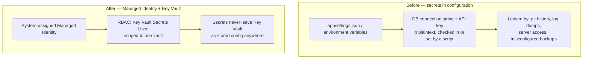

# Securing Secrets with Managed Identity + Key Vault — Real-Time Example

## Introduction

Before reading this lesson, you should already be comfortable with **[Azure Security Baseline](../16-azure-for-dotnet-developers/16-36-azure-security-baseline.md)**, and with every mechanism it tied together: Entra ID, managed identities, Key Vault, RBAC and Policy, and Conditional Access. This lesson is the Identity & Security sub-area's capstone — its 8th and final lesson — and it exists to do one thing the previous seven, by design, never did all at once: build a single, complete, production-shaped scenario, end to end, using several of those mechanisms together rather than in isolation. The scenario is deliberately unglamorous, because it's also one of the single most common real-world Azure architectures in production today: an App Service hosting an API, authenticating to Key Vault with nothing but its own system-assigned managed identity, to retrieve secrets it needs but must never store itself.

By the end of this lesson, you will be able to:

- Wire a System-assigned Managed Identity, Key Vault, and a scoped RBAC role assignment together into one working, zero-secrets configuration
- Retrieve both a database connection string and a third-party API key from Key Vault through `IConfiguration`, with no vault credential anywhere in the app
- Explain exactly which RBAC role to grant — and which *not* to grant — to keep the granted permission as narrow as the workload actually needs
- Trace a full request from App Service startup through Key Vault authentication to a completed order-processing call
- Recount, at a high level, how this lesson's architecture is simply Lessons 30 through 36 assembled into one running system rather than a new concept

## Securing Secrets — A Layman's Perspective

This sub-area has spent seven lessons touring one building floor by floor: the security desk issuing badges (Entra ID), the registration desk vouching for applications (app registrations), infrastructure that recognizes its own equipment without a PIN (managed identities), an actual reinforced vault (Key Vault), a licensing office and a building-code office deciding who can do what and what anything is allowed to look like (RBAC and Policy), a situational security desk demanding extra proof under suspicious circumstances (Conditional Access), and a recurring inspector checking that all of it is still configured correctly (the security baseline). Every one of those tours, individually, described exactly one control and then moved on.

This lesson finally walks the whole route in one trip, on one specific errand, the way an actual employee would experience it in a single morning rather than as seven separate case studies. Picture the mailroom clerk who needs to open the company vault to retrieve the current wire-transfer authorization code and the shipping partner's account credentials, both needed to process today's outgoing orders. The clerk doesn't carry a vault key of their own — that would just be one more thing to lose. Instead, the clerk walks up to the vault door as *themselves*, already recognized by the building's own security infrastructure the moment they badged into work that morning, with no separate vault credential ever issued to them at all. The vault checks that recognition, confirms this specific clerk is on the specific, narrow list of people allowed to retrieve *these two particular items* — and only these two, nothing else stored in the vault — and hands them over. The clerk was never handed a master key to the whole vault; they were granted read access to exactly the two items their job requires, nothing broader, following the oldest rule in physical security: give people the least access that lets them do their actual job.

That one short walk is the entire architecture this lesson builds in code. The "clerk" is an App Service — `ecommerce-order-api`, the same application whose resource group got its RBAC and Policy rules locked down two lessons ago. The "recognition without a separate key" is its system-assigned managed identity, created the instant the App Service itself was created, requiring no credential a developer ever generates or stores. The "two particular items" are a database connection string and a payment gateway's API key — genuinely sensitive values that, before this architecture existed, would have had no home except a configuration file a security review would eventually flag. And the "narrow list of exactly two items, nothing broader" is the RBAC role assignment from Lesson 34, granting `Key Vault Secrets User` — read-only, and only on this one vault — rather than anything broader like `Contributor` on the whole resource group. Nothing in this lesson introduces a new kind of trust. It simply lets one already-recognized identity walk into one already-secured vault and retrieve exactly the two things its job actually requires, with an audit log recording that it did.

## Securing Secrets — A Programming Language Perspective

This lesson's architecture composes three mechanisms already covered individually: a **System-assigned Managed Identity** on the `ecommerce-order-api` App Service, requiring zero application-managed credentials (Lesson 32); an Azure **Key Vault** (`kv-ecommerce-prod`) storing the `EcommerceOrdersDbConnectionString` and `PaymentGatewayApiKey` secrets (Lesson 33); and an **RBAC role assignment** granting that identity the `Key Vault Secrets User` role, scoped narrowly to the vault itself rather than the surrounding resource group (Lesson 34). In C#, `builder.Configuration.AddAzureKeyVault(vaultUri, new DefaultAzureCredential())` folds both secrets directly into `IConfiguration`, from which they're bound through the Options pattern (Module 10) into strongly-typed settings classes — `PaymentGatewayOptions.ApiKey` and a connection string consumed by the EF Core `DbContext` (Module 11) — with `DefaultAzureCredential` transparently resolving to `ManagedIdentityCredential` once the app is actually running inside Azure, and to the developer's own signed-in credential locally, with no code branch required to distinguish the two environments.

## How to Wire the Order API to Key Vault via Managed Identity

Provisioning happens in a fixed order — identity first, secrets second, role assignment third — because each step depends on an identifier the previous step produced.


*Figure 1: Identity is established first, permission is granted second, and only then does the running app ever request a secret — with no credential of its own at any step.*

```bash
# Azure CLI — illustrative output; values vary by tenant/subscription

# Step 1 — enable the App Service's own recognized identity
az webapp identity assign --name ecommerce-order-api --resource-group rg-ecommerce-prod

# Step 2 — store the two secrets this service needs
az keyvault secret set --vault-name kv-ecommerce-prod \
  --name "EcommerceOrdersDbConnectionString" \
  --value "Server=sql-ecommerce-prod.database.windows.net;Database=Orders;..."

az keyvault secret set --vault-name kv-ecommerce-prod \
  --name "PaymentGatewayApiKey" \
  --value "pg_live_9f3a1c7d2b6e4f5a8c1d3e2f4a5b6c7d"

# Step 3 — grant read-only access to secrets, scoped to this one vault only
az role assignment create \
  --assignee-object-id <principalId-from-step-1> \
  --assignee-principal-type ServicePrincipal \
  --role "Key Vault Secrets User" \
  --scope "/subscriptions/<sub-id>/resourceGroups/rg-ecommerce-prod/providers/Microsoft.KeyVault/vaults/kv-ecommerce-prod"
```

**Azure CLI Output:**

```text
{
  "principalId": "3c8f1a2d-6b4e-4a9f-8d1c-2e3f4a5b6c7d",
  "type": "SystemAssigned"
}
{
  "id": ".../secrets/EcommerceOrdersDbConnectionString/9c2b1a...",
  "name": "EcommerceOrdersDbConnectionString"
}
{
  "id": ".../secrets/PaymentGatewayApiKey/7f4d2e...",
  "name": "PaymentGatewayApiKey"
}
{
  "roleDefinitionName": "Key Vault Secrets User",
  "principalId": "3c8f1a2d-6b4e-4a9f-8d1c-2e3f4a5b6c7d",
  "scope": "/subscriptions/.../vaults/kv-ecommerce-prod"
}
```

```csharp
// Program.cs — .NET 10 / C# 14
using Azure.Identity;

var builder = WebApplication.CreateBuilder(args);

// Folds Key Vault directly into IConfiguration — same DefaultAzureCredential pattern as Lesson 33
builder.Configuration.AddAzureKeyVault(
    new Uri("https://kv-ecommerce-prod.vault.azure.net/"),
    new DefaultAzureCredential());

builder.Services.Configure<PaymentGatewayOptions>(
    builder.Configuration.GetSection("PaymentGateway"));

builder.Services.AddDbContext<OrderDbContext>(options =>
    options.UseSqlServer(builder.Configuration["EcommerceOrdersDbConnectionString"]));

var app = builder.Build();

app.MapGet("/health/config-check", (IConfiguration config) =>
{
    bool dbReady = !string.IsNullOrWhiteSpace(config["EcommerceOrdersDbConnectionString"]);
    bool gatewayReady = !string.IsNullOrWhiteSpace(config["PaymentGateway:ApiKey"]);
    return Results.Text($"DB connection resolved: {dbReady} | Payment gateway key resolved: {gatewayReady}");
});

app.Run();

public sealed class PaymentGatewayOptions
{
    public string ApiKey { get; set; } = string.Empty;
}
```

**Console Output (App Service log for a request to `/health/config-check`):**

```text
info: Program[0]
      Authenticated to kv-ecommerce-prod.vault.azure.net via ManagedIdentityCredential
info: Program[0]
      DB connection resolved: True | Payment gateway key resolved: True
```

Note the `PaymentGateway:ApiKey` lookup on the last line: the Key Vault secret is literally named `PaymentGatewayApiKey`, but `AddAzureKeyVault` also exposes it under the colon-delimited hierarchical key `PaymentGateway--ApiKey` when a secret name uses that double-dash convention, so it binds straight into `PaymentGatewayOptions.ApiKey` exactly as if it had come from a nested `appsettings.json` section — the vault is invisible to the binding code.

## Real-Time Example: Processing an E-Commerce Order with Zero Stored Secrets

This is the full picture the rest of this lesson has been building toward: `ecommerce-order-api`, the App Service first introduced in Lesson 34's RBAC walkthrough, processing a real checkout for the `Order`, `OrderItem`, and `Customer` domain model this curriculum has carried since Module 2, using both of the secrets wired up above — and storing neither of them anywhere the application itself controls.

The request starts the moment a customer confirms checkout. `OrderProcessingService.PlaceOrderAsync` needs exactly two pieces of sensitive information to complete the call: a connection string to persist the new `Order` row into Azure SQL, and an API key to authorize a charge against the payment gateway. Neither value is passed in from the caller, hardcoded, or read from an environment variable set by a deployment script — both arrive already resolved, through the same `IConfiguration` object every other setting in the app uses, because `AddAzureKeyVault` did that resolution once, at startup, using the App Service's own managed identity.

```csharp
// OrderProcessingService.cs — .NET 10 / C# 14 — Real-Time Example (E-Commerce Order Processing)
public sealed record Order(string OrderId, string CustomerId, DateTimeOffset PlacedAt, List<OrderItem> Items);
public sealed record OrderItem(string Sku, int Quantity, decimal UnitPrice);
public sealed record PaymentResult(bool Approved, string AuthorizationCode);

public sealed class OrderProcessingService(
    OrderDbContext db,
    IOptions<PaymentGatewayOptions> paymentOptions,
    HttpClient paymentGatewayClient)
{
    public async Task<PaymentResult> PlaceOrderAsync(Order order)
    {
        decimal total = order.Items.Sum(i => i.Quantity * i.UnitPrice);

        // The payment gateway API key came from Key Vault via IConfiguration/IOptions —
        // this class never read a secret directly, and never will.
        paymentGatewayClient.DefaultRequestHeaders.Remove("Authorization");
        paymentGatewayClient.DefaultRequestHeaders.Add(
            "Authorization", $"Bearer {paymentOptions.Value.ApiKey}");

        // Simulated gateway call — in production this posts { order.OrderId, total } and awaits a real response
        PaymentResult result = new(Approved: true, AuthorizationCode: $"AUTH-{order.OrderId}");

        if (result.Approved)
        {
            db.Orders.Add(order); // OrderDbContext's connection string also came from Key Vault
            await db.SaveChangesAsync();
        }

        return result;
    }
}

Order order = new(
    "ORD-88213",
    "CUST-4471",
    DateTimeOffset.UtcNow,
    [ new OrderItem("SKU-BLUE-MUG", 2, 12.50m), new OrderItem("SKU-DESK-LAMP", 1, 34.00m) ]);

Console.WriteLine($"Order {order.OrderId} for {order.CustomerId}: {order.Items.Count} item(s), " +
                   $"total ${order.Items.Sum(i => i.Quantity * i.UnitPrice):F2}");
Console.WriteLine("Secrets referenced directly in OrderProcessingService.cs: 0");
Console.WriteLine("Secrets resolved through Key Vault at startup: 2 (DB connection string, payment gateway API key)");
```

**Console Output:**

```text
Order ORD-88213 for CUST-4471: 2 item(s), total $59.00
Secrets referenced directly in OrderProcessingService.cs: 0
Secrets resolved through Key Vault at startup: 2 (DB connection string, payment gateway API key)
```

Walk that architecture through a compromise scenario to see why the specific RBAC scope from Lesson 34 matters as much as the Key Vault integration itself. Suppose an attacker fully compromises `ecommerce-order-api`'s runtime — a dependency vulnerability, a misconfigured endpoint, anything. That attacker inherits whatever the App Service's managed identity can do, and nothing more. Because the role granted was `Key Vault Secrets User`, scoped to exactly `kv-ecommerce-prod`, the attacker can read the two secrets this service already legitimately uses — a real but *bounded* blast radius — and nothing else: not `Key Vault Secrets Officer` write access, not a broader `Contributor` role on the resource group, not access to any other vault in the subscription. That containment is the entire payoff of combining least-privilege RBAC with a managed identity rather than either mechanism alone: identity without scoped permission would still let a compromised app read every secret in every vault it happened to find; permission without a managed identity would just mean going back to a stored credential the attacker could steal directly. Together, they bound the damage to precisely the two secrets this one service was always allowed to touch — which is exactly the audit answer a compliance review for an e-commerce payment flow needs to hear.

## Before/After: Configuration Files vs Managed Identity + Key Vault

Contrasting the architecture this lesson builds against the configuration-file approach most tutorials still default to makes the actual security delta concrete, rather than abstract.


*Figure 2: The "before" secrets exist as data an attacker can find at rest; the "after" secrets exist only as a scoped, audited, revocable permission.*

| Aspect | Configuration File Secrets | Managed Identity + Key Vault |
|---|---|---|
| Where the secret physically lives | `appsettings.json`, environment variables, deployment scripts | Only inside Key Vault |
| Credential needed to *reach* the secret store | None needed for config files — they're just read from disk | A managed identity, with no stored credential of its own |
| Blast radius if the app is compromised | Every secret the app's config file contains, fully exposed | Only what the identity's RBAC role permits — bounded, auditable |
| Rotation | Manual — edit config, redeploy | Rotate in Key Vault; app reads the new value automatically |
| Audit trail | Usually none | Every read logged against the requesting identity |

## Types of Zero-Secret Architectures

This exact combination is the most common shape, but it isn't the only variant worth knowing:

1. **System-assigned identity + Key Vault RBAC (this lesson)** — one App Service, one identity, scoped read access to exactly the secrets it needs.
2. **[User-assigned identity](../16-azure-for-dotnet-developers/16-32-managed-identities.md) shared across a fleet** — the same pattern applied to several App Service instances or Azure Functions sharing one identity and one set of role assignments.
3. **Key Vault references in App Service settings** — an alternative wiring where an App Service application setting itself points at a Key Vault secret URI, resolved by the platform before the app even starts, without touching `IConfiguration` code at all.
4. **Azure App Configuration + Key Vault references** — layering Azure App Configuration on top for non-secret settings, with Key Vault references handled for the sensitive subset, useful once an app's configuration surface grows past a handful of values.
5. **Legacy access policies** — the pre-RBAC permission model from [Azure Key Vault in Depth](../16-azure-for-dotnet-developers/16-33-azure-key-vault-in-depth.md), still encountered in older environments but not recommended for new vaults.
6. **[RBAC and Azure Policy](../16-azure-for-dotnet-developers/16-34-rbac-and-azure-policy.md)** — the least-privilege discipline that made this lesson's blast-radius argument possible in the first place.

## What You've Learned & What's Next

This lesson closes the Identity & Security sub-area by assembling its individual pieces into one running system: `ecommerce-order-api`'s system-assigned managed identity, granted exactly `Key Vault Secrets User` on exactly `kv-ecommerce-prod`, resolves a database connection string and a payment gateway API key through ordinary `IConfiguration`, with no credential the application itself ever generates, stores, or can leak.

Zooming out across all eight lessons: **[Microsoft Entra ID Fundamentals](../16-azure-for-dotnet-developers/16-30-entra-id-fundamentals.md)** established the tenant-scoped directory of users, groups, and service principals behind every identity decision that followed. **[App Registrations and OAuth Flows](../16-azure-for-dotnet-developers/16-31-app-registrations-and-oauth-flows.md)** turned an application itself into a recognized identity and wired up real user sign-in. **[Managed Identities](../16-azure-for-dotnet-developers/16-32-managed-identities.md)** removed stored credentials from machine-to-machine calls entirely. **[Azure Key Vault in Depth](../16-azure-for-dotnet-developers/16-33-azure-key-vault-in-depth.md)** gave the remaining genuinely sensitive values — the ones identity alone can't replace — a dedicated, access-controlled home. **[RBAC and Azure Policy](../16-azure-for-dotnet-developers/16-34-rbac-and-azure-policy.md)** supplied the permission and organizational-rule layers deciding who can do what and what any resource is allowed to look like. **[Conditional Access Basics](../16-azure-for-dotnet-developers/16-35-conditional-access-basics.md)** added a contextual, sign-in-time layer on top of authentication itself. **[Azure Security Baseline](../16-azure-for-dotnet-developers/16-36-azure-security-baseline.md)** showed how to continuously measure whether all of the above is actually configured correctly, everywhere, right now. And this lesson put every one of those pieces to work at once, on one real request, for one real order.

Continue your learning journey with **[Azure Service Bus: Queues](../16-azure-for-dotnet-developers/16-38-azure-service-bus-queues.md)**, which opens this module's Messaging & Integration sub-area — a different concern entirely, but one `ecommerce-order-api` will lean on immediately once an order needs to be handed off asynchronously to fulfillment.

---
*Applies to: .NET 10 / C# 14. Last reviewed 2026-08-16.*
