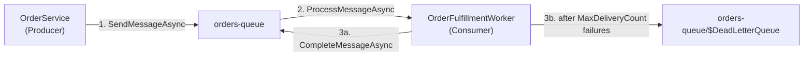
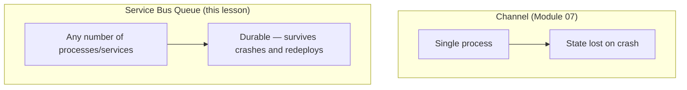

# Azure Service Bus: Queues

## Introduction

Before reading this lesson, you should already be comfortable with **[Securing Secrets with Managed Identity + Key Vault](../16-azure-for-dotnet-developers/16-37-securing-secrets-managed-identity-keyvault.md)** — specifically the pattern of a service reaching another Azure resource through its managed identity rather than a stored credential. This lesson opens the "Messaging & Integration" part of the module by applying that exact authentication pattern to a new kind of resource: **Azure Service Bus**, a managed broker that lets one part of a system hand off work to another without either side calling the other directly, staying online at the same moment, or even being deployed together. Module 07 already built this guarantee in-process with `Channel<T>` and `BlockingCollection<T>`; a Service Bus queue is that same producer-consumer idea, made durable and stretched across machines, processes, and deployments.

By the end of this lesson, you will be able to:

- Explain what a Service Bus queue guarantees that an in-memory queue cannot: durability across restarts, decoupling across process boundaries, and at-least-once delivery
- Provision a namespace and a queue with the Azure CLI
- Send and receive messages in C# using `Azure.Messaging.ServiceBus`
- Describe how sessions provide strict FIFO ordering, and why ordering is only best-effort without them
- Explain the dead-letter queue and how `MaxDeliveryCount` protects a queue from poison messages
- Connect Service Bus queues to Module 07's producer-consumer patterns as the same contract, implemented durably and at cloud scale

## Azure Service Bus Queues — A Layman's Perspective

Picture a company's internal mail room, the kind that handles registered, tracked parcels rather than casual interoffice envelopes. A sender in the shipping department drops off a parcel addressed to "Accounts Payable" and walks away — they don't wait around to see who eventually picks it up, and they don't need Accounts Payable to be at their desk at that exact moment. The parcel sits safely on a shelf, tracked and untouched, until someone from Accounts Payable comes to collect it. That's the entire point of a mail room: it exists so the sender and the receiver never have to be available at the same instant, and so a parcel is never simply lost the moment it leaves the sender's hands.

Now add the detail that makes a *registered* mail room different from a plain drop-box: when the courier from Accounts Payable takes a parcel off the shelf, the mail room doesn't erase its own record of that parcel immediately. It marks it "checked out" and starts a clock. If the courier successfully signs for delivery within a reasonable window, the record is cleared for good. But if the courier disappears mid-delivery — trips, gets reassigned, the elevator breaks — the mail room notices the clock ran out, assumes something went wrong, and puts the parcel right back on the shelf for another courier to try. This is exactly why a Service Bus queue can promise **at-least-once delivery**: a message is only removed for good once a consumer explicitly confirms it finished handling it, not the moment a consumer merely picks it up.

Two more details complete the analogy. First, most parcels can be handled in whatever order they happen to be collected, but a small number are marked "handle strictly in the order they arrived" — those go into a dedicated, labeled tray so nobody accidentally processes parcel three before parcel two. That labeled tray is what a Service Bus **session** provides: a subset of messages tagged with the same session ID travel together and are always handed to a consumer in arrival order, while messages outside any session are delivered on a best-effort basis, generally in order but without a hard guarantee under concurrent pickup.

Second, imagine a parcel that's fundamentally broken — its label is smudged, its contents don't match its manifest, and every courier who tries to process it fails and puts it back. A well-run mail room doesn't let that one parcel loop forever, blocking the shelf for every parcel behind it. After a set number of failed attempts, it gets physically moved to a separate "problem parcels" shelf, out of everyone else's way, for a human to investigate later. That shelf is the **dead-letter queue**, and the failure counter that triggers the move is `MaxDeliveryCount`.

The bridge back to code: a Service Bus queue is that registered mail room, made available as an Azure resource. A producer sends a message and moves on; a consumer receives it, does its work, and explicitly completes it; and anything that keeps failing gets quarantined automatically instead of jamming the whole line.

## Azure Service Bus Queues — A Programming Language Perspective

An **Azure Service Bus queue** is a durable, ordered, first-in-first-out message store that implements the **point-to-point** messaging pattern: one logical producer sends a message, and exactly one logical consumer (potentially a pool of competing worker instances) processes it exactly once, in the at-least-once delivery sense. Each queue lives inside a Service Bus **namespace**, provisioned as an Azure resource. The `Azure.Messaging.ServiceBus` SDK exposes `ServiceBusClient` as the entry point, `ServiceBusSender` for sending `ServiceBusMessage` instances, and either `ServiceBusReceiver` (pull-based, manual) or `ServiceBusProcessor` (push-based, event-driven via `ProcessMessageAsync`/`ProcessErrorAsync` handlers) for receiving `ServiceBusReceivedMessage` instances. The default receive mode, **PeekLock**, locks a message for a configurable duration and requires the consumer to call `CompleteMessageAsync`, `AbandonMessageAsync`, or `DeadLetterMessageAsync`; a queue's `MaxDeliveryCount` property (default 10) governs how many delivery attempts occur before Service Bus auto-moves a message to its dead-letter sub-queue.

## How to Send and Receive Messages with Service Bus Queues

Provisioning is a short CLI sequence; sending and receiving are two small, focused SDK calls layered on top of the same `ServiceBusClient`, authenticated with the managed identity from the prerequisite lesson rather than a stored connection string.


*Figure 1: A producer sends once; a consumer completes or abandons; repeated failures divert a message to the dead-letter sub-queue instead of blocking the queue.*

```bash
# Azure CLI — create a namespace and a queue with a 5-attempt poison-message limit
az servicebus namespace create --name sbns-ecommerce-prod \
  --resource-group rg-ecommerce-prod --sku Standard

az servicebus queue create --namespace-name sbns-ecommerce-prod \
  --resource-group rg-ecommerce-prod --name orders-queue \
  --max-delivery-count 5 --default-message-time-to-live P14D
```

**Azure CLI Output:**

```text
{
  "name": "sbns-ecommerce-prod",
  "serviceBusEndpoint": "https://sbns-ecommerce-prod.servicebus.windows.net:443/"
}
{
  "name": "orders-queue",
  "maxDeliveryCount": 5,
  "defaultMessageTimeToLive": "14.00:00:00"
}
```

```csharp
// Program.cs — .NET 10 / C# 14
using Azure.Identity;
using Azure.Messaging.ServiceBus;

const string fqns = "sbns-ecommerce-prod.servicebus.windows.net";
const string queueName = "orders-queue";

// DefaultAzureCredential resolves the app's managed identity — no connection string stored
await using var client = new ServiceBusClient(fqns, new DefaultAzureCredential());

// Producer: send a single order message
ServiceBusSender sender = client.CreateSender(queueName);
await sender.SendMessageAsync(new ServiceBusMessage("""{"orderId":"ORD-9001","total":249.50}""")
{
    ContentType = "application/json",
    Subject = "OrderPlaced"
});
Console.WriteLine("Sent ORD-9001 to orders-queue.");

// Consumer: receive, process, and explicitly complete
ServiceBusReceiver receiver = client.CreateReceiver(queueName);
ServiceBusReceivedMessage received = await receiver.ReceiveMessageAsync();
Console.WriteLine($"Received: {received.Body} (delivery attempt #{received.DeliveryCount})");
await receiver.CompleteMessageAsync(received);
Console.WriteLine("Completed — message permanently removed from the queue.");
```

**Console Output:**

```text
Sent ORD-9001 to orders-queue.
Received: {"orderId":"ORD-9001","total":249.50} (delivery attempt #1)
Completed — message permanently removed from the queue.
```

Notice that `ReceiveMessageAsync` alone does *not* delete the message — that is exactly the PeekLock behavior from the mail-room analogy. Only `CompleteMessageAsync` clears it for good. If the process had crashed between receiving and completing, the message's lock would expire and Service Bus would redeliver it, incrementing `DeliveryCount`, until either it succeeds or `MaxDeliveryCount` is reached and it is dead-lettered automatically.

## Real-Time Example: Decoupling Order Placement from Fulfillment

We extend the `Order` record from Module 07's producer-consumer lesson (`Order(OrderId, CustomerId, PlacedAt, List<OrderItem> Items)`, first defined in Module 4). Previously, a single process handed orders from an in-memory `Channel<Order>` to a fulfillment worker. Now `OrderApi` and `OrderFulfillmentWorker` are two entirely separate deployments, connected only by `orders-queue` — one can be redeployed, scaled, or briefly offline without the other losing a single order.

```csharp
// OrderFulfillmentWorker.cs — .NET 10 / C# 14 — Real-Time Example (E-Commerce Order Processing)
using Azure.Identity;
using Azure.Messaging.ServiceBus;
using System.Text.Json;

public sealed record OrderItem(string Sku, int Quantity, decimal UnitPrice);
public sealed record Order(string OrderId, string CustomerId, DateTime PlacedAt, List<OrderItem> Items);

await using var client = new ServiceBusClient("sbns-ecommerce-prod.servicebus.windows.net", new DefaultAzureCredential());
ServiceBusProcessor processor = client.CreateProcessor("orders-queue", new ServiceBusProcessorOptions
{
    MaxConcurrentCalls = 4,          // multiple competing workers, same guarantee as SPMC in Module 07
    AutoCompleteMessages = false      // this handler completes/dead-letters explicitly
});

processor.ProcessMessageAsync += async args =>
{
    try
    {
        var order = JsonSerializer.Deserialize<Order>(args.Message.Body.ToArray())!;
        if (order.Items.Count == 0)
            throw new InvalidOperationException("Order has no line items — cannot fulfill.");

        Console.WriteLine($"Fulfilling {order.OrderId} for {order.CustomerId} ({order.Items.Count} item(s))");
        await args.CompleteMessageAsync(args.Message);
    }
    catch (Exception ex) when (args.Message.DeliveryCount >= 5)
    {
        // Poison message: stop retrying, quarantine it instead of blocking the queue
        await args.DeadLetterMessageAsync(args.Message, reason: "MalformedOrder", errorDescription: ex.Message);
        Console.WriteLine($"Dead-lettered message after {args.Message.DeliveryCount} attempts: {ex.Message}");
    }
};
processor.ProcessErrorAsync += args => { Console.WriteLine($"Processor error: {args.Exception.Message}"); return Task.CompletedTask; };

await processor.StartProcessingAsync();
```

**Console Output:**

```text
Fulfilling ORD-9001 for CUST-4471 (2 item(s))
Dead-lettered message after 5 attempts: Order has no line items — cannot fulfill.
```

In production, `orders-queue`'s dead-letter sub-queue is monitored separately — an operations dashboard or alert rule watches its message count, since anything landing there represents an order that silently failed validation and needs a human, not another retry. This is the direct cloud-scale answer to a question Module 07's producer-consumer lesson could only address within one process: what happens to a poison item when the producer and consumer no longer share a memory space, or even a deployment lifecycle.

## Service Bus Queues vs In-Process Producer-Consumer (`Channel<T>`)

Module 07's `Channel<T>` and `BlockingCollection<T>` satisfy the same four core guarantees a Service Bus queue does — safe handoff, backpressure, ordering, completion signaling — but only within a single running process. The moment a producer and consumer need to live in different processes, different deployments, or need the handoff to survive a crash, an in-memory channel simply cannot help: its entire state disappears the instant the process exits. Service Bus trades a small amount of latency and an external dependency for durability, cross-process/cross-service decoupling, and built-in poison-message handling that would otherwise have to be hand-rolled.


*Figure 2: The in-process channel and the Service Bus queue solve the same problem at two very different scopes.*

| Aspect | `Channel<T>` (Module 07) | Service Bus Queue |
|---|---|---|
| Scope | Single process | Any number of processes/services |
| Durability | Lost on process crash | Persisted by the broker |
| Ordering | Guaranteed (single channel, in order) | Best-effort, or strict FIFO with sessions |
| Poison message handling | Manual (custom retry/give-up logic) | Automatic via `MaxDeliveryCount` + dead-letter queue |
| Typical use case | Producer/consumer within one app | Producer/consumer across separate deployments |

## Types and Related Concepts

Service Bus queues are the point-to-point half of the service; the next lessons in this module build outward from here:

1. **[Azure Service Bus: Topics and Subscriptions](../16-azure-for-dotnet-developers/16-39-azure-service-bus-topics.md)** — the publish-subscribe counterpart, covered next, where multiple independent subscribers each get their own copy of a message.
2. **[Producer-Consumer Patterns](../07-concurrency-parallel-async/07-29-producer-consumer-patterns.md)** — the in-process version of the same handoff guarantee this lesson makes durable.
3. **[System.Threading.Channels](../07-concurrency-parallel-async/07-28-system-threading-channels.md)** — the async, in-memory building block `ServiceBusProcessor`'s concurrent handler model closely resembles.
4. **[Azure Event Grid](../16-azure-for-dotnet-developers/16-40-azure-event-grid.md)** — lightweight event notifications, contrasted with Service Bus's reliable business messages two lessons from now.
5. **[Managed Identities](../16-azure-for-dotnet-developers/16-32-managed-identities.md)** — the mechanism `DefaultAzureCredential` used in this lesson to avoid a stored connection string.
6. **Sessions and Message Deferral** — the FIFO-ordering and out-of-order-processing features layered on top of the base queue, worth exploring directly in the `Azure.Messaging.ServiceBus` reference docs.

## What You've Learned & What's Next

A Service Bus queue gives one producer and one logical consumer a durable, at-least-once handoff that survives process crashes and deployment boundaries — the same contract Module 07's `Channel<T>` provided in-process, now stretched across an entire distributed system, with automatic poison-message quarantine via the dead-letter queue built in rather than hand-rolled.

Continue your learning journey with **[Azure Service Bus: Topics and Subscriptions](../16-azure-for-dotnet-developers/16-39-azure-service-bus-topics.md)**, where the same broker fans a single message out to multiple independent subscribers instead of a single consumer group.

---
*Applies to: .NET 10 / C# 14. Last reviewed 2026-08-16.*
